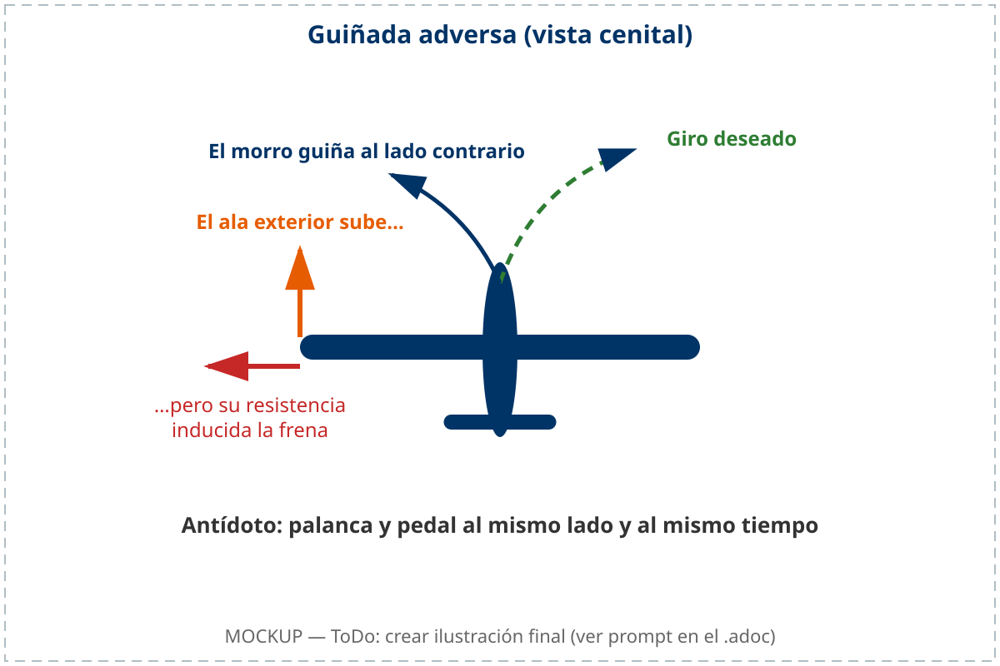
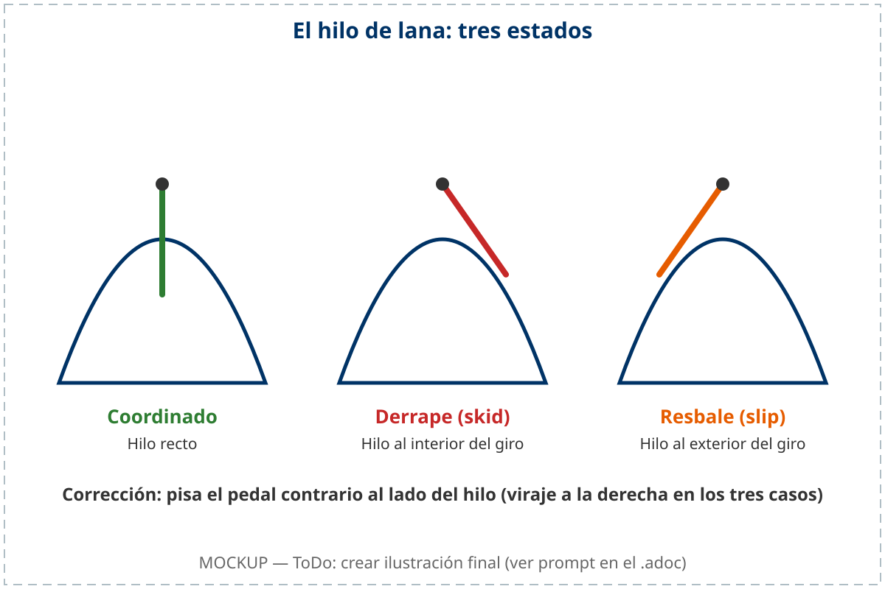

# Control

Los mandos de un planeador son mucho más que palancas y pedales: son el canal de
comunicación entre el piloto y la aeronave. En este capítulo aprenderás a entender
la guiñada adversa y cómo combatirla con coordinación pie-mano, por qué el compensador
es una herramienta fundamental de pilotaje y no un descanso para el brazo, y qué
información te transmiten los mandos a través de su dureza o blandura.

## Guiñada adversa: el precio del alabeo

En los planeadores, la guiñada adversa es un efecto secundario aerodinámico muy pronunciado al intentar virar usando los alerones, debido a su gran envergadura.

Al accionar la palanca lateralmente para iniciar un giro, el alerón del ala exterior baja para aumentar la sustentación y levantar ese lado. El problema es que, al crear más sustentación, también genera una gran cantidad de **resistencia inducida**. Esta resistencia frena el ala que sube y tira de ella hacia atrás, haciendo guiñar el morro del planeador en dirección opuesta al giro deseado ().

{#fig-05-cap04-guinada-adversa}

::: {.callout-tip}
✦ **REGLA DE ORO**

La solución a la guiñada adversa es la **Coordinación Pie-Mano**. Se debe aplicar palanca y pedal hacia el mismo lado y al mismo tiempo. El timón de dirección contrarresta el freno abrupto del ala exterior, forzando al morro a seguir la curva suavemente sin derrapar.
:::

## Mando diferencial de alerones

Para mitigar la guiñada adversa de manera mecánica, los planeadores utilizan el **mando diferencial de alerones**.

Este sistema ajusta el varillaje de modo que el alerón que sube (en el ala interior del giro) recorra un ángulo mayor que el alerón que baja (en el ala exterior). Al subir más el alerón interior, se genera intencionadamente una mayor resistencia parásita en ese lado que ayuda a compensar la resistencia inducida del ala exterior. Aunque este diseño reduce notablemente la tendencia del morro a salirse del giro, no la elimina por completo; el piloto debe seguir aplicando siempre el timón de dirección (pedal) para mantener un viraje coordinado.

## El hilo de lana: tu indicador de coordinación

En el parabrisas de casi todos los planeadores hay, pegado en el centro, un trocito de hilo de lana o cinta fina: el **hilo de coordinación** (**yaw string**). Es el indicador más directo que existe, más fiable incluso que la bola del inclinómetro.

Hilo recto: vuelo coordinado. Cuando se desvía, el hilo se va hacia el mismo lado al que apunta el morro respecto a la trayectoria: hilo a la izquierda, morro a la izquierda del viento relativo. Lo que eso significa depende del sentido del viraje. Hilo caído hacia el interior del giro: derrape (**skid**), llevas demasiado pedal interior. Hilo hacia el exterior: resbale (**slip**), te falta pedal. La corrección es siempre la misma: pisa el pedal contrario al lado del hilo, nunca la palanca.

El derrape es el que hay que evitar: el ala interior va más lenta y puede alcanzar el ángulo de ataque crítico sin previo aviso, iniciando una pérdida asimétrica. El resbale es más aparatoso —el fuselaje ofrece más resistencia y el viraje es ineficiente—, pero rara vez es peligroso por sí solo. La  resume los tres estados del hilo y su lectura.

{#fig-05-cap04-hilo-lana-estados}

::: {.callout-tip}
✦ **REGLA DE ORO**

Vuela con el hilo recto. Si se mueve, corrígelo con el pedal. Y si el hilo está torcido y los mandos están blandos al mismo tiempo, actúa: estás a punto de entrar en pérdida.
:::

## El compensador (trim)

El compensador (trim) no es solo un alivio para el brazo. Es, de hecho, un mando aerodinámico: equilibra las fuerzas en la cola y permite que el planeador mantenga por sí solo una actitud de morro y velocidad constantes sin que tengas que empujar ni tirar.

::: {.callout-note}
⚓ **AIRMANSHIP / BUENAS PRÁCTICAS**

Acostúmbrate a usar el compensador constantemente. Después de cambiar el régimen de vuelo (por ejemplo, de termicar a velocidad lenta a volar recto a mayor velocidad), primero establece la nueva actitud con la palanca y luego ajusta el trim hasta que no sientas fuerza en la mano.
:::

## La eficacia de mando

Los mandos te proporcionan información vital sobre la velocidad del planeador a través de su resistencia física.

Cuando vuelas rápido, el flujo de aire golpea con fuerza las superficies de control. Los mandos se sentirán **duros** y muy reactivos.

Sin embargo, a medida que reduces la velocidad acercándote a la entrada en pérdida, el flujo de aire disminuye. Los mandos pierden eficacia y se vuelven blandos o **"chiclosos"**. Esta falta de respuesta es una advertencia física directa de que estás volando demasiado lento y cerca del límite de sustentación.

**Resumen del Capítulo: Control**

* **Guiñada adversa**: el efecto secundario más molesto en los veleros de gran envergadura. Al alabear para girar, el ala que sube tiene más resistencia y frena ese lado, metiendo el morro **al revés** del giro. **Antídoto**: pie y mano juntos (coordinación).
* **Hilo de lana (**yaw string**)**: indicador de coordinación en el parabrisas. Recto = vuelo coordinado. Hilo hacia el interior del viraje = derrape (**skid**); hacia el exterior = resbale (**slip**). El derrape es el peligroso: el ala interior puede entrar en pérdida asimétrica. Corrígelo pisando el pedal contrario al lado del hilo.
* **Compensador (trim)**: no es solo para descansar el brazo. Es fundamental para mantener una velocidad constante sin esfuerzo. Compensa siempre que cambies de régimen de vuelo (de termicar a planear rápido).
* **Eficacia de mando**: los mandos "hablan". Si están duros, vas rápido. Si están blandos y "chiclosos", estás cerca de la pérdida. Escucha lo que te dicen a través de la mano.
* **Mando diferencial**: diseño de los alerones para reducir la guiñada adversa (el alerón que sube lo hace más que el que baja), pero aun así necesitarás pie.
