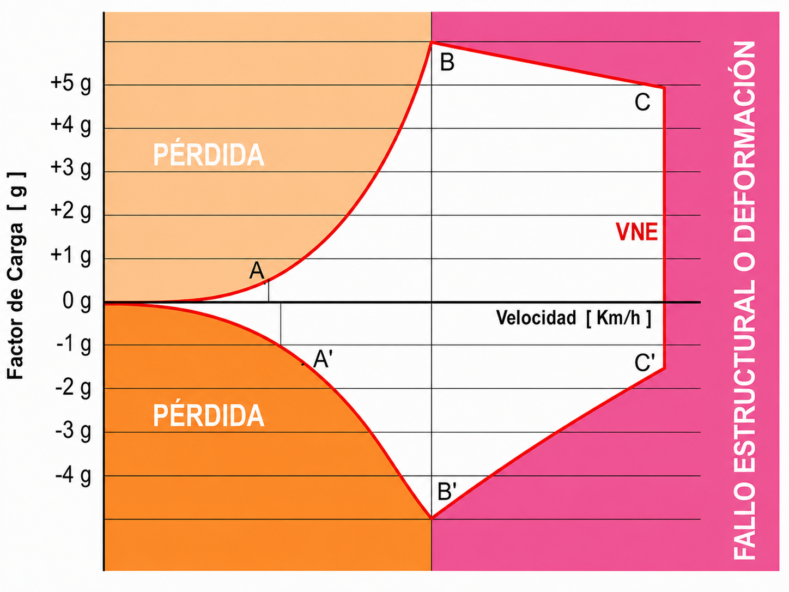

# Limitaciones (factor de carga y maniobras)

Todo planeador tiene límites estructurales que no deben franquearse: hacerlo puede
destruir la aeronave en segundos. En este capítulo aprenderás a interpretar el diagrama
V-n, a entender por qué la Velocidad de Maniobra protege la estructura en turbulencia,
qué significa la línea roja del anemómetro y por qué el factor de carga eleva la
velocidad de pérdida en los virajes.

## El diagrama V-n: el mapa de tu supervivencia

El diagrama V-n, también conocido como envolvente de vuelo, es la representación gráfica de los límites estructurales de tu planeador. Relaciona la velocidad a la que vuelas (V) con el factor de carga en Gs (n) que la estructura está soportando (@fig-05-cap05-diagrama-vn).

Este diagrama delimita el espacio de operaciones seguras. Mientras te mantengas dentro de sus límites, la estructura aguantará. Si lo superas —por exceso de G o de velocidad— el planeador sufrirá deformaciones permanentes o rotura estructural.

Bajo la normativa CS-22, los planeadores de categoría Utility (U) están diseñados para soportar de +5,3g a −2,65g a la velocidad de maniobra (V~A~); ambos límites se estrechan a medida que aumenta la velocidad, hasta +4,0g y −1,5g a la velocidad de picado (V~D~). Los de categoría Acrobática (A) soportan de +7,0g a −5,0g. Estos factores de carga solo son válidos si se respetan las limitaciones de velocidad.

{#fig-05-cap05-diagrama-vn}

## Velocidad de maniobra (V~A~)

La velocidad de maniobra (V es la velocidad máxima a la que puedes aplicar deflexiones totales en los mandos sin causar daños estructurales.

Si vuelas a la V~A~ o por debajo de ella y aplicas una deflexión brusca a los mandos, el planeador simplemente **entrará en pérdida** antes de generar suficientes Gs para superar su límite de carga estructural. El ala dejará de volar y descargará la fuerza, protegiendo al planeador.
Sin embargo, si vuelas más rápido que la V~A~ y haces un movimiento brusco, el planeador no entrará en pérdida a tiempo; generará una fuerza G extrema que sobrepasará los límites de la estructura y la romperá.

La V~A~ es un límite estructural, no una marca del anemómetro. La marca que ves en la esfera es la **V~RA~**, la velocidad máxima en aire turbulento (**rough air speed**): en ella termina el arco verde y empieza el amarillo, según CS 22.1545. En muchos veleros la V~A~ y la V~RA~ casi coinciden, pero la certificación las distingue, y conviene que tú también: la V~A~ te protege frente a la deflexión completa de un mando; la V~RA~, frente a las ráfagas del aire turbulento; y la VNE es el límite absoluto donde acaba el arco amarillo con su línea roja.

::: {.callout-tip}
✦ **REGLA DE ORO**

En turbulencia fuerte, reduce enseguida la velocidad por debajo de la V~A~ para proteger la estructura. Tu referencia visual está en el anemómetro: quédate en el arco verde, que termina en la V~RA~ (velocidad máxima en aire turbulento). El arco amarillo, de la V~RA~ a la VNE, es solo para aire en calma.
:::

::: {.callout-warning}
⚠ **SEGURIDAD**

La V~A~ **no te protege de entradas combinadas simultáneas en más de un eje**. Los requisitos de certificación cubren deflexiones completas en un único mando a la vez. Si aplicas timón de profundidad a fondo y pedal a fondo **al mismo tiempo** —aunque estés por debajo de V~A~— puedes generar una carga estructural que supere el límite de diseño. En turbulencia, mantén los mandos suaves y evita movimientos bruscos coordinados en múltiples ejes simultáneamente.
:::

## La línea roja: velocidad de nunca exceder (VNE)

La línea roja en el anemómetro indica la VNE (velocidad de nunca exceder). Es un límite absoluto que no se cruza nunca, principalmente por el riesgo de **flutter** (flameo).

El flutter es una vibración aeroelástica en las alas o superficies de control que, si ocurre, puede desintegrar el planeador en cuestión de segundos.

::: {.callout-warning}
⚠ **SEGURIDAD**

La VNE disminuye con la altitud: en aire menos denso, la velocidad aerodinámica verdadera (TAS) —de la que depende el flutter— aumenta respecto a la indicada (IAS) que lees en el anemómetro. Presta atención a la tabla de correcciones de VNE por altitud en la cabina. Este efecto es crítico en el vuelo de onda, donde se alcanzan grandes altitudes; su relación con la meteorología de onda se trata en el **Libro 3 — Meteorología**.
:::

::: {.callout-note}
⚓ **AIRMANSHIP / BUENAS PRÁCTICAS**

Cerca de la VNE, mantén las deflexiones de mando limitadas a aproximadamente **un tercio** de su recorrido total. A esa velocidad, la presión dinámica es tan elevada que una deflexión completa genera cargas que pueden superar la envolvente estructural incluso sin turbulencia. No uses la VNE como velocidad de crucero: es un límite absoluto de emergencia, no un régimen habitual.
:::

## La trampa del factor de carga y la pérdida

En vuelo recto y nivelado, el factor de carga es 1 G. Al inclinarte en un viraje, la fuerza centrífuga se suma a la gravedad y el factor de carga sube. En un viraje cerrado de 60°, el planeador experimenta 2 G: la estructura soporta el doble del peso normal.

::: {.callout-warning}
⚠ **SEGURIDAD**

La velocidad de pérdida aumenta con el factor de carga. En un viraje de 60º (2 Gs), la velocidad de pérdida **sube un 41%**. Un planeador que entra en pérdida a 70 km/h en vuelo nivelado lo hará a casi 100 km/h en ese viraje cerrado. Un uso brusco de los mandos en esta situación puede llevar a una pérdida crítica.
:::

**Resumen del Capítulo: Limitaciones y Maniobras**

* **Diagrama V-n**: el mapa de seguridad de tu estructura. Muestra los Gs que aguantas a cada velocidad. Salirte de la "caja" significa romper el planeador. Límites CS-22: cat. U +5,3g / −2,65g en V~A~, que se estrechan a +4,0g / −1,5g en V~D~; cat. A +7,0g / −5,0g.
* **Velocidad de maniobra (V~A~)**: la velocidad "segura" para turbulencia o mandazos individuales. Si vas más lento de V~A~, el planeador entrará en pérdida antes de romperse. Si vas más rápido, una deflexión brusca puede dañar la estructura. Pero cuidado: la V~A~ no protege de entradas combinadas simultáneas en más de un eje. En turbulencia fuerte, quédate en el arco verde del anemómetro.
* **Marcas del anemómetro (CS 22.1545)**: el arco verde termina en la **V~RA~** (velocidad máxima en aire turbulento), donde empieza el arco amarillo, que acaba en la línea roja de la VNE. La V~A~ es un límite estructural y **no** es una marca del anemómetro, aunque en muchos veleros su valor sea parecido al de la V~RA~.
* **VNE (velocidad de nunca exceder)**: la **línea roja** del anemómetro (CS 22.1505). No es una recomendación, es un límite físico. Pasarla invita al **flutter** (vibración aeroelástica), que puede desintegrar el planeador en segundos. Cerca de la VNE, limita las deflexiones de mando a un tercio de su recorrido.
* **Factor de carga y pérdida**: las Gs "engordan" al planeador. En un viraje de 60° (2 Gs), la velocidad de pérdida sube un 41%.
