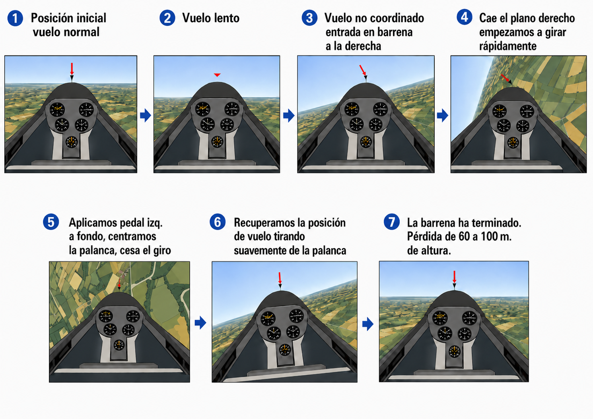

# Pérdida de sustentación y autorrotación

La pérdida de sustentación y la barrena son las situaciones más temidas por el piloto novel y las más practicadas en formación. En este capítulo aprenderás a reconocer los síntomas que avisan antes de que llegue la pérdida, a ejecutar la recuperación de forma correcta —aunque vaya contra el instinto— y a distinguir una pérdida limpia de una autorrotación para aplicar la técnica adecuada en cada caso.

## La pérdida de sustentación (stall)

La pérdida de sustentación ocurre cuando el ala del planeador supera su **Ángulo de Ataque Crítico** (aproximadamente entre 15º y 18º). Al alcanzar este punto crítico de inclinación respecto al viento relativo, el flujo de aire es incapaz de seguir la curvatura superior del ala (extradós) y se desprende de forma turbulenta, provocando una caída masiva de sustentación y un gran aumento de resistencia.

Aprende a leer estos síntomas: el planeador avisa antes de que llegue la pérdida.

* Posición inusualmente alta del morro respecto al horizonte.
* Velocidad muy baja en el anemómetro.
* Mandos de vuelo excesivamente blandos, esponjosos y poco eficaces.
* Ausencia del ruido normal del aire fluyendo por la cabina.
* Vibraciones estructurales conocidas como "bataneo", causadas por el aire turbulento golpeando el fuselaje y la cola.

La pérdida no llega de golpe en toda la envergadura: empieza en el **encastre** —la raíz donde el ala se une al fuselaje— y avanza hacia las puntas. Es un diseño deliberado: el perfil tiene más ángulo de incidencia en la raíz que en las puntas, así que la raíz entra en pérdida primero. Los alerones, que están en las puntas, conservan algo de autoridad durante los primeros instantes: es un margen de diseño que te permite mantener las alas niveladas mientras la pérdida avisa. Pero si un ala llega a caer, no intentes levantarla con el alerón — se sostiene con el pedal, como verás más abajo.

## Recuperación de la pérdida

El instinto ante la caída es tirar de la palanca. En aviación, eso agrava la situación. La única salida es reducir el ángulo de ataque.

Empuja la palanca hacia **adelante** hasta centrarla: el morro baja, el ángulo de ataque disminuye y el aire vuelve a adherirse al extradós. El planeador gana velocidad arrastrado por la gravedad. Cuando recuperes una velocidad segura —el proceso consume típicamente entre 30 y 50 metros de altura— tira suavemente de la palanca para nivelar.

::: {.callout-note}
⚓ **AIRMANSHIP / BUENAS PRÁCTICAS**

Durante la recuperación de una pérdida, la palanca debe mantenerse siempre rigurosamente centrada en el eje lateral (cero alerones). Intentar levantar instintivamente un ala caída usando los alerones empeorará el escenario: el alerón que baja aumentará el ángulo de ataque local de esa ala caída, profundizando aún más su pérdida e iniciando violentamente la temida autorrotación o barrena. Usa siempre y exclusivamente el pedal contrario (timón de dirección) para evitar la guiñada y sostener las alas.
:::

## La pérdida acelerada: el peligro del viraje

La velocidad de pérdida que indica el Manual de Vuelo es para vuelo recto y nivelado a 1g. Cada vez que el factor de carga sube, esa velocidad sube con él —en proporción a su raíz cuadrada. En un viraje de 60° (2g), la velocidad de pérdida crece un 41%. Un planeador que en línea recta pierde sustentación a 70 km/h lo hará a casi 100 km/h en ese viraje. A 100 km/h nadie espera entrar en pérdida.

Esta **pérdida acelerada** es traicionera porque el morro no tiene que estar especialmente alto. Con una actitud de morro aparentemente normal, tirar de palanca en un viraje cerrado puede superar el ángulo de ataque crítico sin que el piloto lo note hasta que el ala cede.

::: {.callout-warning}
⚠ **SEGURIDAD**

El escenario estadísticamente más letal: el viraje del tramo **base a final** en el circuito de tráfico, a menos de 150 metros de altura. El piloto mete pedal para cuadrar la final, el morro se desvía hacia un lado, compensa tirando de palanca… y el planeador entra en pérdida asimétrica sin margen de recuperación. Volar el circuito coordinado y con margen de velocidad no es una exigencia técnica: es lo que separa un aterrizaje normal de un accidente.
:::

## Barrena: la pérdida agravada y asimétrica

La barrena (también llamada autorrotación) es una condición de vuelo extrema que resulta de una **pérdida de sustentación asimétrica**: un ala entra en pérdida más profundamente que la otra.

Generalmente se desencadena en vuelo turbulento o cuando el piloto vuela descoordinado (con exceso de pedal o cruzando mandos) cerca de la velocidad de mínima sustentación. El ala interior al giro, que ya viaja más lenta, entra en pérdida del todo y cae bruscamente. Al caer, su ángulo de ataque aumenta aún más y la ancla en la pérdida, mientras el ala exterior sigue volando parcialmente. Ese desequilibrio acopla guiñada y alabeo en una rotación muy rápida y un descenso vertiginoso: hasta 100 metros perdidos por cada vuelta de unos 4 segundos.

### Las tres fases de la barrena

Hay que conocer las tres fases porque actuar en la primera cuesta mucho menos altura que hacerlo en la tercera:

* **Fase incipiente:** la barrena está arrancando. Las fuerzas aún no se han estabilizado y el giro todavía no es constante. Recuperar aquí —antes del primer giro completo— cuesta mucha menos altura.
* **Fase desarrollada:** el giro se asienta: velocidad angular, velocidad aerodinámica y tasa de descenso se estabilizan. El movimiento se vuelve regular. A partir de aquí, salir puede costar uno o más giros adicionales.
* **Fase de recuperación:** desde que pisas el pedal hasta que el giro para. Puede durar desde un cuarto de vuelta hasta varios giros, según el planeador. Cada vuelta son entre 50 y 100 metros menos.

## Recuperación de la barrena

La salida de una barrena exige una técnica metódica, contraintuitiva y aprendida de memoria. Consulta siempre el Manual de Vuelo (AFM) de tu planeador concreto; la secuencia clásica universal es:

1. **Pedal contrario a fondo:** identifica la dirección de la rotación y pisa con decisión el pedal opuesto hasta el tope (si giras hacia la derecha, pedal izquierdo a fondo). Esto frena la guiñada que alimenta el giro.
2. **Palanca al centro y adelante:** centra los alerones (neutro lateral) y empuja la palanca hacia adelante para reducir el ángulo de ataque y romper la pérdida profunda en ambas alas por igual.
3. **Recuperación del picado:** en cuanto cese la rotación, **neutraliza el pedal** antes de tirar de la palanca. Si mantienes el pedal contrario aplicado mientras recuperas del picado, la guiñada resultante puede iniciar una rotación en sentido opuesto. Una vez centrados los pedales, tira **gradualmente** de la palanca para salir del picado con suavidad progresiva: una recuperación brusca puede sobrecargar la estructura o provocar una segunda pérdida.

{#fig-05-cap06-recuperacion-barrena}

**Resumen del Capítulo: Pérdida y Autorrotación**

* **Pérdida (**stall**)**: el ala se "rinde" al superar el ángulo de ataque crítico (≈ 15-18°). La pérdida comienza en el encastre y progresa hacia las puntas: por eso los alerones conservan algo de autoridad al inicio. Avisos: morro alto, mandos blandos y bataneo; al ceder el ala, cae el morro.
* **Pérdida acelerada**: en un viraje cerrado (60° → 2g), la velocidad de pérdida sube un 41%. El ala puede entrar en pérdida con el morro en actitud aparentemente normal. El viraje **base-final** en el circuito es el escenario más letal.
* **Recuperación de la pérdida**: palanca adelante (bajar el morro) es la única cura. No uses los alerones para levantar un ala caída: profundizan la pérdida e inician la barrena.
* **Barrena (autorrotación)**: pérdida agravada y asimétrica con tres fases: **incipiente** (recuperable antes de un giro), **desarrollada** (movimiento constante) y **recuperación** (cesa la rotación). Cada vuelta cuesta 50-100 m de altura.
* **Salida de barrena**: consulta siempre el AFM de tu planeador. La secuencia estándar: 1. pie contrario a la rotación (a fondo); 2. palanca al centro y adelante; 3. cuando pare el giro, **neutraliza el pedal** y entonces recupera suavemente del picado.
