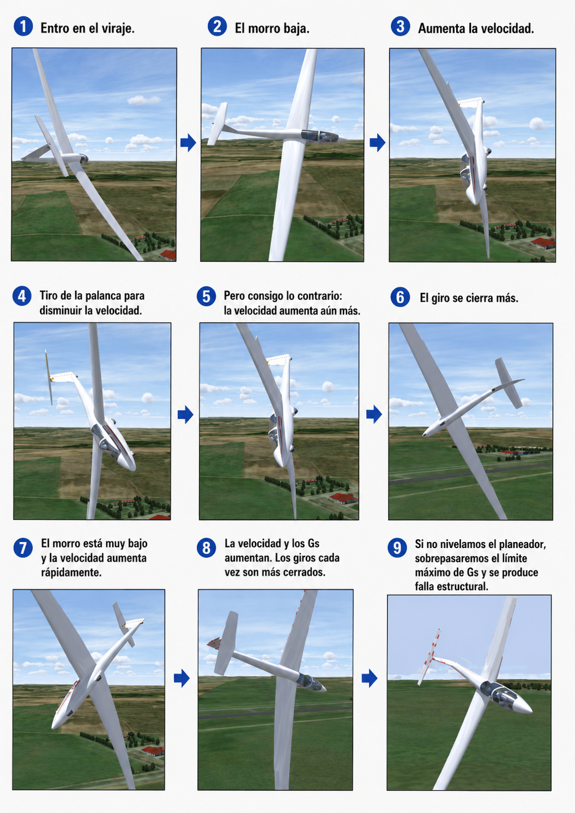

# Picado en espiral

> El picado en espiral engaña al instinto del piloto: parece que hay que tirar de la palanca, pero esa reacción puede ser mortal. En este capítulo aprenderás a distinguirlo de una barrena, a entender por qué intentar subir el morro sin nivelar primero las alas agrava la situación, y a ejecutar la secuencia de recuperación correcta —nivelar las alas, recuperar suave del picado y controlar la velocidad— de forma procedimental y sin margen de error.

## Diferencias críticas: no es una barrena

Es vital no confundir un picado en espiral (o espiral descendente) con una barrena.

En una barrena, el planeador está en pérdida asimétrica, cae verticalmente guiñando y su velocidad aerodinámica es baja y constante. Por el contrario, en un picado en espiral **el planeador está volando**; ninguna de sus alas está en pérdida. El planeador describe una trayectoria curva descendente cada vez más pronunciada en la que tanto la velocidad como el factor de carga (fuerzas G) aumentan de forma constante y rápida.

Aplicar la técnica de recuperación de la barrena (pisar el pedal contrario a fondo) en un picado en espiral es un error gravísimo que puede sobrecargar la cola y el timón a esas altas velocidades.

La herramienta de diagnóstico más rápida y fiable es el **anemómetro** (@fig-05-cap07-espiral-vs-barrena):

* **Velocidad alta o creciendo** → espiral descendente. El planeador vuela y acelera.
* **Velocidad baja y constante, en torno a la de pérdida o incluso menos** → barrena. El ala está en pérdida y la velocidad no puede aumentar.

{#fig-05-cap07-espiral-vs-barrena}

## El peligro mortal del instinto

La espiral descendente ha recibido el apodo de "espiral del cementerio" en la aviación general por una buena razón: engaña al instinto de supervivencia del piloto desorientado.

Cuando el piloto percibe el morro apuntando hacia abajo y la velocidad disparándose, el instinto inmediato es tirar de la palanca para subir. Sin embargo, en un picado en espiral el planeador está fuertemente ladeado. Si tiras de la palanca **sin haber nivelado antes las alas**, el efecto es catastrófico: al estar de lado, el timón de profundidad empuja el planeador hacia el centro del giro, cerrando aún más el radio. La espiral se aprieta, la velocidad crece y las fuerzas G aumentan hasta superar el límite de diseño y romper la estructura.

::: {.callout-warning title="Seguridad"}
Nunca tires de la palanca de mando para intentar frenar un picado si las alas del planeador se encuentran inclinadas.
:::

## La causa típica: pérdida de referencia visual

La situación clásica que desencadena una espiral descendente es la pérdida accidental de referencias visuales exteriores (VMC), como introducirse inadvertidamente en la base de una nube mientras se vira en una térmica fuerte.

Al perder el horizonte visual, el oído interno se desorienta rápidamente. El planeador, que habitualmente no es estable en espiral (tiende a aumentar gradualmente su ángulo de alabeo si se dejan sueltos los mandos en un viraje), comenzará a inclinarse y a bajar el morro de forma progresiva. El piloto desorientado no lo percibe hasta que el fuerte ruido aerodinámico y el aumento de la velocidad en el anemómetro revelan que el planeador está cayendo aceleradamente.

## Procedimiento de salida (recuperación)

La salida de un picado en espiral debe ejecutarse de forma procedimental, luchando activamente contra el instinto de tirar de la palanca en un primer momento:

1. **Nivelar las alas:** es lo primero, porque el alabeo es lo que sostiene y aprieta la espiral. Aplica palanca lateral y pedal hacia el lado contrario del viraje, con decisión, hasta poner las alas completamente horizontales respecto a tu referencia o a los instrumentos.
2. **Recuperar el picado:** solo cuando las alas estén a 0º de inclinación lateral, tira de la palanca con firmeza pero con suavidad para elevar el morro. Hazlo de forma progresiva, vigilando no superar factores de carga excesivos al salir de la trayectoria de picado.
3. **Controlar la velocidad:** si la velocidad se aproxima a la V~NE~ (Velocidad Nunca Exceder), extiende los aerofrenos para frenar la aceleración; pero hazlo con suavidad, porque a alta velocidad y con factor de carga elevado una extensión brusca añade carga a la estructura.

**Resumen del Capítulo: Picado en Espiral**

* **Diagnóstico rápido — mira el anemómetro**: velocidad alta o creciendo = espiral (el planeador vuela y acelera). Velocidad baja y constante = barrena (el ala está en pérdida, no puede acelerar). No las confundas: la técnica es opuesta.
* **El peligro del instinto**: si tiras de la palanca para subir el morro sin nivelar antes las alas, solo cierras más la espiral y aumentas las Gs hasta el fallo estructural.
* **Cómo salir**: 1. nivela las alas (alerones y pie coordinados al lado contrario del viraje) —es lo primero, el alabeo sostiene la espiral—; 2. recupera suave del picado; 3. si la velocidad se acerca a la VNE, frena con aerofrenos (suavemente).
* **Causa típica**: pérdida de referencia visual (nubes, noche) y distracción. El planeador tiene tendencia espiral; si lo dejas solo con un pequeño alabeo, la espiral crece sola.
