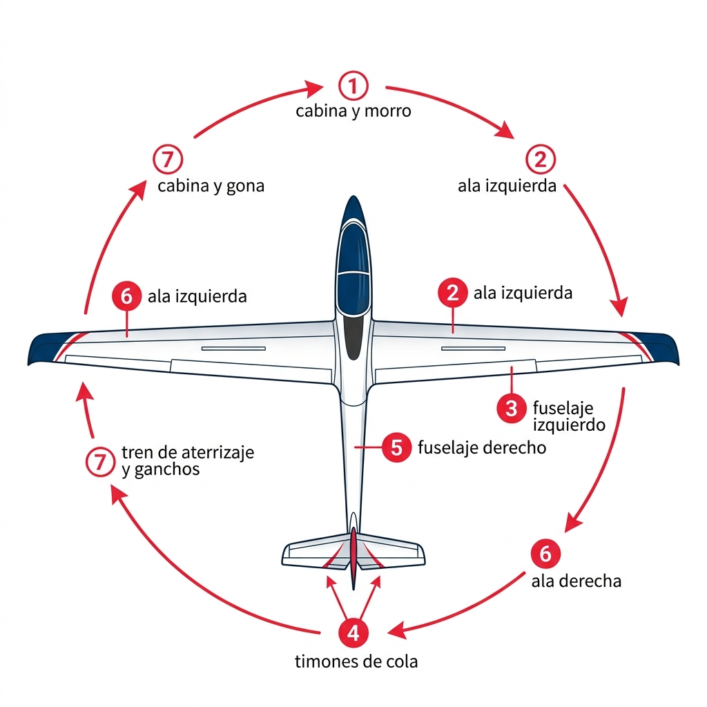

# Requisitos generales

Antes de despegar, el piloto de planeador debe cumplir con un conjunto de requisitos legales y de seguridad que no son mera burocracia: son la primera línea de defensa frente al accidente. Conocer exactamente qué documentos deben ir a bordo, cuáles son las responsabilidades del Piloto al Mando y cuándo tienes derecho a llevar pasajeros te protege a ti, a los demás y a tu licencia.

En este capítulo aprenderás:

* **La documentación obligatoria**: qué debe ir en la cabina y qué puede quedarse en el aeródromo.
* **Los documentos de la aeronave (SAO.GEN.155)**: qué debe estar en regla antes de cada vuelo.
* **Las responsabilidades del PIC**: desde la inspección prevuelo hasta la decisión final de no volar.
* **El chequeo IMSAFE**: la herramienta de autoevaluación que puede salvarte la vida.
* **Los requisitos para llevar pasajeros**: experiencia, recencia y verificación.

## Documentación obligatoria

Para operar un planeador de forma legal y segura, es imprescindible que tanto la aeronave como el piloto estén en regla antes de salir a pista. Dos reglamentos se reparten la tarea: **Part-SFCL** (SFCL.045) fija los documentos del piloto, y **Part-SAO** (SAO.GEN.155) los de la aeronave. Ambos permiten dejar los documentos en el aeródromo cuando el vuelo se mantiene a la vista del campo o dentro de una zona determinada por la autoridad competente.

No confundas «que no pase nada» con «que esté bien». Volar sin la documentación correcta convierte cualquier incidente menor en un problema legal de primera magnitud.

### Documentos que deben ir a bordo

Salvo que vueles a la vista del aeródromo o en una zona autorizada por la autoridad, los siguientes documentos deben acompañarte en la cabina:

* **Licencia del piloto (SPL (Sailplane Pilot Licence)):** original y en vigor. Una fotocopia no tiene validez legal.
* **Certificado médico:** clase 1, 2 o LAPL según corresponda, siempre en vigor.
* **Documento de identificación:** DNI, pasaporte o documento oficial con fotografía.
* **Manual de vuelo (AFM):** el manual específico del modelo de planeador que operas.
* **Cartas aeronáuticas:** actualizadas y adecuadas para la ruta prevista.
* **Libro de vuelo (**logbook**):** datos suficientes —o el propio libro— para demostrar que cumples los requisitos de la normativa, la experiencia reciente incluida.
* **Señales de interceptación:** una copia de los procedimientos y señales visuales internacionales de interceptación (SERA.11015; las señales y la respuesta correcta se estudian en el Libro 4, *Comunicaciones*, capítulo 8).

El resto de los papeles de la aeronave —certificado de matrícula, certificado de aeronavegabilidad con sus anexos, ARC, licencia de radio si lleva equipo, certificado del seguro y diario de a bordo— no necesitan volar contigo: SAO.GEN.155 exige que estén disponibles en el aeródromo o lugar de operación.

::: {.callout-tip}
✦ **REGLA DE ORO**

Antes de cada vuelo, verifica los cuatro pilares documentales de la aeronave según **SAO.GEN.155**: **aeronavegabilidad** (certificado de aeronavegabilidad + ARC en vigor), **matrícula** (certificado de matrícula visible), **manual de vuelo** (AFM a bordo) y **pesada y centrado** (dentro de los límites del manual). Si alguno falla, el planeador no vuela.
:::

## Responsabilidad del Piloto al Mando (PIC)

El **Piloto al Mando** (PIC) es la máxima autoridad a bordo y el responsable final de la seguridad de la operación, desde el momento en que firma la autorización de vuelo hasta que el planeador queda correctamente asegurado en tierra. Esta responsabilidad no se comparte, no se delega y no tiene excepciones.

Eso significa que, aunque el mecánico del club haya revisado el planeador, aunque el instructor te haya autorizado el vuelo y aunque el pronóstico del tiempo sea favorable, **la decisión final es siempre tuya**. Si algo no te cuadra, la única respuesta correcta es no volar.

Sus funciones principales incluyen:

1. **Inspección prevuelo:** verificar que el planeador ha sido inspeccionado según el AFM y es apto para el vuelo. No firmes la inspección si no la has hecho tú mismo o si hay algo que no entiendes.
2. **Carga y centrado:** asegurarse de que la masa total y la posición del centro de gravedad (CG) están dentro de los límites permitidos. Un CG fuera de rango puede hacer el planeador irrecuperable en pérdida.
3. **Briefing de seguridad:** informar a los pasajeros sobre el uso de cinturones, paracaídas (si procede), salidas de emergencia y comportamiento en cabina.
4. **Aptitud psicofísica:** no volar si se sospecha cualquier incapacidad física o mental, por mínima que sea.

### El chequeo IMSAFE

Antes de subir al cockpit, realiza este auto-examen de honestidad. No es una formalidad: es la primera —y más importante— verificación del día.

* **I** (**Illness / Enfermedad**): ¿Sufro alguna enfermedad o síntoma, por leve que sea? Un resfriado puede impedir que se igualen las presiones en el oído medio al ascender.
* **M** (**Medication / Medicación**): ¿He tomado medicamentos que puedan afectar mis reflejos, la visión o el nivel de alerta?
* **S** (**Stress / Estrés**): ¿Estoy bajo una presión personal o profesional excesiva que ocupe parte de mi atención?
* **A** (**Alcohol**): ¿He consumido alcohol en las últimas 8-24 horas? Incluso una copa la noche anterior puede afectar al rendimiento cognitivo.
* **F** (**Fatigue / Fatiga**): ¿He descansado lo suficiente? La fatiga es uno de los factores más frecuentes y más infravalorados en los accidentes.
* **E** (**Emotion / Eating**): ¿Estoy emocionalmente estable? ¿He comido y estoy correctamente hidratado?

Una sola respuesta negativa en cualquiera de estos puntos es razón suficiente para no volar ese día. No existen los vuelos «de desconexión» cuando el piloto no está al cien por cien.

::: {.callout-note}
⚓ **AIRMANSHIP / BUENAS PRÁCTICAS**

Haz el chequeo **IMSAFE** en voz alta o por escrito antes de salir de casa. La dinámica del aeródromo —el entusiasmo del grupo, el buen tiempo, la presión social— puede llevar a minimizar síntomas que en casa te parecerían evidentes. Decidir en frío, antes de llegar al campo, es siempre más fácil que decir «no» delante de tus compañeros cuando el remolcador ya está preparado.
:::

## Transporte de pasajeros

Llevar a una persona en tu planeador es una responsabilidad añadida de considerable peso. No es solo cuestión de técnica: es la seguridad de alguien que ha depositado su confianza en ti y que, probablemente, no sabría qué hacer si tú quedases incapacitado.

Para poder ejercer esta atribución, la normativa **Part-SFCL** exige que el piloto cumpla con requisitos estrictos de experiencia reciente:

* **Licencia:** debes ser titular de la SPL (Sailplane Pilot Licence) —no alumno piloto en instrucción— y con todos los privilegios en vigor.
* **Experiencia:** haber realizado al menos **10 horas de vuelo o 30 lanzamientos** como PIC después de la emisión de la licencia.
* **Recencia:** haber realizado al menos **3 lanzamientos como PIC en los últimos 90 días** para poder llevar pasajeros.
* **Verificación:** haber realizado un vuelo de entrenamiento en el que demuestres a un instructor FI(S) la competencia necesaria para el transporte de pasajeros (salvo que seas titular de un certificado FI(S)).

::: {.callout-warning}
⚠ **SEGURIDAD**

Como PIC tienes el derecho y el deber de denegar el transporte a cualquier pasajero o equipaje que consideres que puede representar un peligro para la seguridad del vuelo. Esta decisión no admite presiones externas: si el peso del pasajero más el equipo supera los límites de la aeronave, o si el pasajero muestra un comportamiento que puede comprometer tu concentración, la respuesta es un «no» firme y sin negociación.
:::

::: {.callout-important}
⚖ **NORMATIVA**

Según el Reglamento (UE) 2018/1976, el titular de una SPL (Sailplane Pilot Licence) solo transportará pasajeros si cumple dos condiciones: haber completado, tras la emisión de la licencia, al menos 10 horas de vuelo o 30 lanzamientos o despegues y aterrizajes como PIC en planeadores, además de un vuelo de entrenamiento demostrando la competencia a un FI(S) (SFCL.115(a)(2)); y haber realizado, en los 90 días anteriores, al menos 3 lanzamientos como PIC en planeador —en TMG, 3 despegues y aterrizajes— (SFCL.160(e)).
:::

## Operaciones en tierra y preparación

La seguridad y la preservación del material de vuelo comienzan mucho antes del despegue, con una meticulosa preparación y manipulación en tierra. Los planeadores, debido a sus grandes envergaduras, estructuras ligeras y superficies de control desmontables, son especialmente vulnerables al viento, las colisiones terrestres y los descuidos en el ensamblaje.

### Montaje y almacenamiento (*assembly* & *storage*)

El montaje (*rigging*) y desmontaje (*de-rigging*) del planeador son operaciones habituales en el aeródromo que exigen método y concentración:

* **Evita distracciones:** las interrupciones en el proceso de montaje son la causa número uno de pasadores no asegurados o mandos no conectados. Si te interrumpen, detente y vuelve a empezar la lista de comprobación de montaje desde el primer paso.
* **Inventario de herramientas:** utiliza cunas o paneles específicos para colocar los pernos, pasadores y herramientas de montaje. Al terminar, realiza un inventario estricto: un destornillador o pasador olvidado dentro de la estructura de las alas o el fuselaje puede bloquear el movimiento de los mandos en vuelo.
* **Cuidado al encintar uniones:** el uso de cinta adhesiva plástica para sellar las juntas de unión (como las raíces alares o el *turtle deck*) reduce la resistencia y evita turbulencias. Asegúrate de que los extremos de la cinta queden bien pegados y no interfieran con el recorrido libre de alerones o aerofrenos.

### Comprobación de mandos positiva (**positive control check - PCC**)

Tras cada montaje de la aeronave, es obligatorio y vital realizar una **comprobación de mandos positiva** (**positive control check**):

1. El piloto se sienta en cabina y sujeta firmemente los mandos de vuelo.
2. Un ayudante en tierra sujeta físicamente cada superficie de control (un alerón, el elevador, el timón de dirección y los aerofrenos) y aplica resistencia.
3. El piloto intenta mover la palanca y los pedales. Si el mando se mueve en cabina mientras la superficie exterior está bloqueada por el ayudante, significa que la conexión de las transmisiones no es firme y el planeador **no es aeronavegable**.

### Remolque por carretera (*trailering*)

El transporte del planeador en su remolque exige que las piezas encajen de forma precisa y firme:

* **Evita rozaduras (**chafing**):** los planos y el fuselaje deben apoyarse en cunas acolchadas y específicas para el modelo, bloqueados firmemente para que las vibraciones en carretera no desgasten la fibra ni las superficies de control.
* **Cierre del carro:** asegura los cierres del carro y comprueba que las luces de señalización y los frenos del remolque funcionan correctamente antes de salir a la carretera.

### Anclaje y aseguramiento (*tiedown & securing*)

Cuando el planeador se deja estacionado y desatendido en el aeródromo, debe protegerse contra ráfagas de viento y el rebufo de aviones motorizados (**propeller blast**):

* **Cúpula cerrada:** mantén siempre la cúpula cerrada y bloqueada. Un golpe de viento o la turbulencia de otra aeronave puede arrancarla de cuajo.
* **Posición de cara al viento:** estaciona el planeador con el morro apuntando directamente al viento dominante siempre que sea posible.
* **Puntos de amarre:** utiliza cuerdas, cadenas o cinchas tensadas desde los extremos alares y el fuselaje hasta anclajes de tierra estables. Si se prevén vientos fuertes, coloca un soporte acolchado bajo la cola para reducir el ángulo de ataque de las alas y evitar que estas generen sustentación.
* **Bloqueadores y fundas:** instala bloqueadores de mandos (**gust locks**) externos para evitar que el viento golpee las superficies de control contra sus topes. Coloca fundas protectoras en la cúpula contra los rayos UV y en los puertos de pitot y energía total para evitar la entrada de insectos y suciedad.

### Traslado en tierra (*ground handling*)

El movimiento del planeador sobre el terreno requiere de un protocolo de equipo claro:

* **Briefing y señales:** todo el personal que ayude a mover la aeronave debe conocer las órdenes y señales.
* **Remolque con vehículo:** al remolcar el planeador con un coche en el aeródromo, **la longitud de la cuerda de remolque debe superar la mitad de la envergadura del velero**. Si una punta de ala se detiene por un obstáculo o si el **wing walker** suelta el ala, esta longitud evita que el planeador pivote bruscamente y golpee el vehículo tractor con el ala opuesta.
* **Velocidad de traslado:** nunca superes la velocidad de una caminata rápida. Utiliza siempre al menos un **wing walker** para guiar el ala y vigilar los obstáculos.

### Inspección prevuelo detallada (**preflight walk-around check**)

Antes del primer despegue del día, el piloto al mando debe realizar una inspección de 360 grados alrededor de la aeronave siguiendo un orden lógico y utilizando la lista de comprobación oficial de su AFM ():

{#fig-06-cap01-inspeccion-prevuelo}

1. **Cabina y morro:** cúpula limpia y sin grietas. Mandos libres, cinturones en buen estado, batería cargada y fijada. Tomas de pitot y estática libres de obstrucciones.
2. **Ala izquierda:** borde de ataque limpio. Holguras y conexiones de los alerones y flaps. Estado y blocaje de los aerofrenos. Patín o rueda de punta de ala.
3. **Fuselaje izquierdo:** ausencia de grietas en la estructura de fibra. Estado de las antenas.
4. **Cola (**empennage**):** fijación del estabilizador horizontal y vertical. Libre movimiento y holguras del timón de dirección y profundidad. Estado de las tomas de estática de cola y la sonda de energía total (TE).
5. **Fuselaje derecho:** inspección simétrica al lado izquierdo.
6. **Ala derecha:** inspección simétrica al ala izquierda.
7. **Tren de aterrizaje y ganchos:** presión y estado del neumático principal y de cola. Funcionamiento del freno de rueda. Comprobación de que el gancho de morro y el gancho de CG están limpios y operan libremente.

### Lista de comprobación antes del despegue (CB-SIFT-CBE)

Inmediatamente antes del enganche del cable y del despegue, el piloto debe realizar y verbalizar la lista de comprobación de cabina según su AFM, adaptada al español **CB-SIFT-CBE**:

* **C** (**Controls**): mandos libres y con movimientos correctos (recorrido completo confirmado visualmente).
* **B** (**Ballast**): masa total y posición del centro de gravedad dentro de límites.
* **S** (**Straps**): cinturones y arneses de hombros ajustados y trabados.
* **I** (**Instruments**): altímetro calado en QFE o QNH, variómetro ajustado, radio en frecuencia activa, FLARM encendido y sin alarmas de fallo.
* **F** (**Flaps**): posición de flaps ajustada para despegue si corresponde.
* **T** (**Trim**): compensador de cabeceo ajustado en la posición de despegue.
* **C** (**Canopy**): cúpula cerrada y con cerrojos blocados (comprobación visual y física empujándola ligeramente).
* **B** (**Brakes**): aerofrenos cerrados y firmemente blocados.
* **E** (**Eventualities / Eventualidades**): repaso del viento actual y del briefing de emergencias en el despegue (acciones ante fallo de lanzamiento).

::: {.callout-note}
⚓ **AIRMANSHIP / BUENAS PRÁCTICAS: LA REGLA TRADICIONAL CRISE**

En la mayoría de los aeroclubs de habla hispana, especialmente en centros históricos como Ocaña o Fuentemilanos, los instructores han utilizado tradicionalmente la regla mnemotécnica **CRISE** (o **CRIS**):

* **C** (**Mandos / Controles**): palanca libre, pedales ajustados y aerofrenos cerrados y asegurados.
* **R** (**Reglajes / Arneses**): cinturones ajustados, paracaídas colocado y comodidad del piloto en cabina.
* **I** (**Instrumentos**): altímetro a cero (QFE) o calado en QNH, variómetro y vario eléctrico encendidos, y FLARM configurado.
* **S** (**Seguridad exterior**): cúpula cerrada y pestillada, ventanilla cerrada, pista despejada y viento evaluado.
* **E** (**Emergencias**): briefing mental de rotura de cable y planificación inmediata ante un fallo en el despegue.

Ambas mnemotécnicas (la europea CB-SIFT-CBE y la tradicional CRISE) persiguen el mismo fin de seguridad: no conectar el cable del planeador a pista hasta que no se haya realizado una verificación física e instrumental completa en cabina.
:::

**Resumen del Capítulo: Requisitos generales**

* **Los papeles del planeador (SAO.GEN.155)**: antes de cada vuelo verifica los cuatro pilares documentales de la aeronave: aeronavegabilidad (certificado + ARC), matrícula, manual de vuelo (AFM) y pesada y centrado. Si falta alguno, el planeador no vuela.
* **Tus papeles**: licencia (SPL (Sailplane Pilot Licence)) en vigor, certificado médico vigente, DNI y datos del libro de vuelo (SFCL.045). Si eres alumno, en las travesías en solitario lleva el médico, el DNI y la prueba de la autorización de tu instructor (SFCL.125).
* **Responsabilidad del PIC**: tú eres la última autoridad. Si el velero no está en condiciones, la meteo es marginal o tú no estás al 100 % (IMSAFE), la decisión de no volar es tuya.
* **IMSAFE**: **Illness, Medication, Stress, Alcohol, Fatigue, Emotion/Eating**. Un solo «sí» es suficiente para quedarte en tierra.
* **Pasajeros**: licencia SPL (Sailplane Pilot Licence) (no alumno), 3 lanzamientos en los últimos 90 días, 10 horas o 30 lanzamientos tras la licencia, y un vuelo de verificación con instructor.
* **Operaciones en tierra**: comprobación de mandos positiva (PCC) tras cada montaje. Anclaje de cara al viento con cúpulas cerradas. Regla de la cuerda larga (más de media envergadura) para remolcar con coche.
* **Prevuelo y CB-SIFT-CBE**: inspección prevuelo sistemática de 360 grados. Checklist de cabina estricto CB-SIFT-CBE antes de conectar el cable de lanzamiento.
