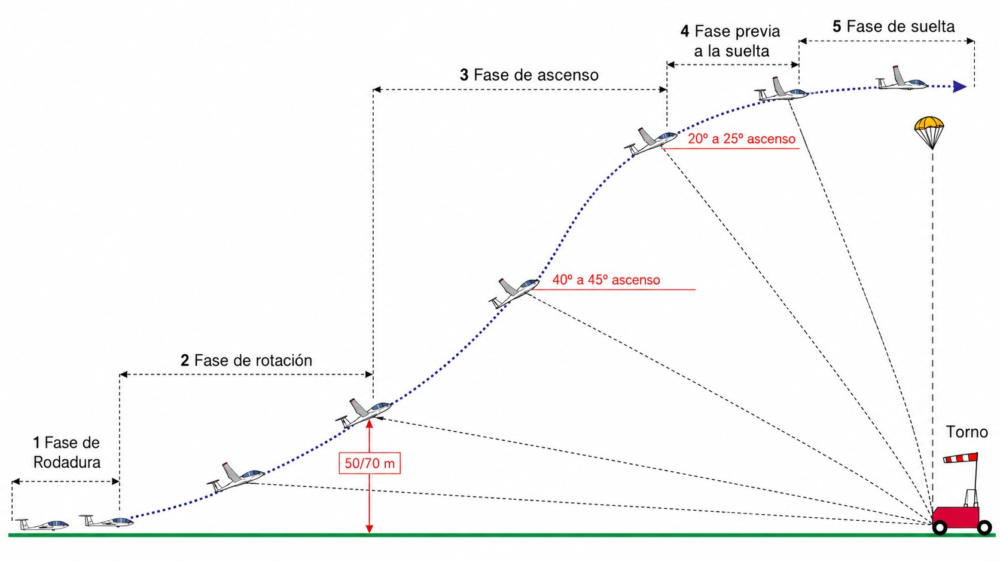
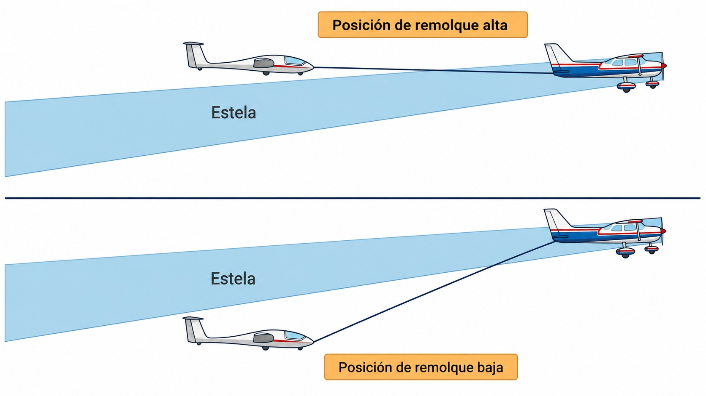
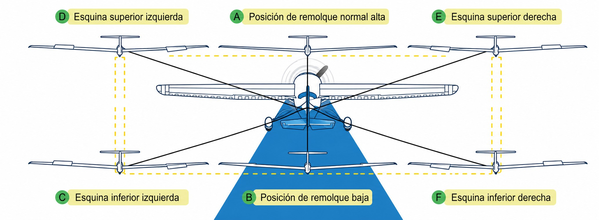

# Métodos de lanzamiento

El lanzamiento es la fase de mayor energía del vuelo de planeador y, junto con el aterrizaje, la de mayor riesgo estadístico. En cuestión de segundos, el piloto pasa de estar parado en tierra a volar a velocidades considerables, dependiendo de un cable o de un avión remolcador. No hay margen para la improvisación: los procedimientos son exactos, la comunicación es precisa y las reacciones de emergencia deben ser instintivas.

En este capítulo aprenderás:

* **El lanzamiento por torno**: dinámica, fraseología y procedimiento de emergencia ante rotura de cable.
* **El remolque por avión (**aerotow**)**: posiciones en remolque, señales visuales y cómo actuar si no puedes soltar.
* **Las reglas generales de seguridad**: ganchos, velocidades y comprobaciones previas al enganche.

## El lanzamiento por torno (*winch*)

El **lanzamiento por torno** es el método más rápido y económico para poner un planeador en el aire. Un motor potente situado en el extremo opuesto de la pista enrolla un cable a gran velocidad, arrastrando al planeador desde el reposo hasta velocidades de despegue en apenas tres o cuatro segundos. La sensación es la de una catapulta: la aceleración es tan brusca que los pilotos noveles suelen sorprenderse ante su intensidad.

Durante el ascenso, el ángulo de cabeceo aumenta rápidamente hasta superar los 40-45°. Esta actitud, que en cualquier otra situación sería alarmante, es completamente normal en el torno: el cable tirando desde adelante y abajo impone esa geometría. El planeador sube a razón de 10-15 metros por segundo y alcanza entre 300 y 500 metros en menos de un minuto (@fig-06-cap02-torno-fases). Durante la trepada, la tracción del cable carga el ala y eleva su velocidad de pérdida, así que se vuela más deprisa que en vuelo libre: como referencia, entre 1,3 y 1,6 veces la velocidad mínima de vuelo recto, sin superar nunca la velocidad máxima de torno que fija el AFM.

### Procedimiento y fraseología

La comunicación entre el piloto y el operador del torno (tornero) es vital. Una orden malentendida puede resultar en una tracción inesperada. La secuencia estándar es:

1. **«Listo para tensar el cable»**: el piloto indica que está preparado. El tornero comienza a recoger cable lentamente, sin tensión brusca.
2. **«Cable en tensión»**: el piloto confirma que el cable está tirando de forma suave y uniforme.
3. **«Remolque, remolque, remolque»**: el piloto autoriza la máxima potencia. El planeador acelera rápidamente: controla el alabeo con los alerones y mantén el eje con los pedales.
4. **«Velero libre»**: tras la suelta del cable —al final de la trepada, típicamente a 300-400 metros, o de inmediato ante cualquier duda—, el piloto confirma que el cable se ha desenganchado y que vuela libre.

{#fig-06-cap02-torno-fases}

### Emergencia por rotura de cable

La rotura de cable durante el ascenso es una de las emergencias más exigentes del vuelo de planeador. La reacción debe ser **instintiva e inmediata, sin dudar**. En el momento en que la tensión desaparece, el morro del planeador tiende a subir peligrosamente —el efecto del cable queda anulado de golpe— y la velocidad cae con rapidez. Si no se actúa en los dos primeros segundos, la pérdida aerodinámica (**stall**) a baja altura puede ser fatal.

::: {.callout-warning}
⚠ **SEGURIDAD**

Si el cable se rompe durante el ascenso, la prioridad **absoluta e inmediata** es **bajar el morro** a actitud de planeo para recuperar velocidad y evitar la pérdida. Solo una vez que la velocidad es segura, activa la suelta de emergencia del cable remanente y decide: aterrizar recto en la pista restante (baja altura), realizar un giro de 180° (altura media) o completar un circuito abreviado (altura suficiente). **En lanzamiento por torno, nunca intentes retornar a pista si estás por debajo de 150 metros**: es la maniobra más letal del vuelo sin motor.
:::

## Remolque por avión (*aerotow*)

En el **remolque por avión**, una aeronave motorizada tira del planeador mediante un cable de entre 30 y 60 metros. Este método ofrece una ventaja decisiva sobre el torno: permite elegir con precisión la altura de suelta y el lugar geográfico exacto —sobre la ladera idónea, la primera térmica del día o el punto de inicio de la tarea prevista—. La penalización es el coste y el consumo de tiempo.

La posición correcta de remolque es fundamental tanto para la seguridad como para la comodidad del piloto del remolcador (@fig-06-cap02-aerotow-posicion):

* **Posición alta**: el planeador vuela justo por encima de la estela del remolcador, usando como referencia visual las ruedas del remolcador apoyadas en el horizonte. Desde esta posición, el planeador queda fuera del rebufo de la hélice y no ejerce fuerza de cabeceo sobre la cola del remolcador.
* **Zona a evitar**: la zona inmediatamente detrás del remolcador y debajo de su estabilizador es extremadamente turbulenta por la estela de hélice. Atravesarla durante un vuelo normal es incómodo; durante una emergencia del remolcador, puede ser peligroso.

### Señales visuales en vuelo

Aunque se use la radio, las señales visuales son el estándar internacional de seguridad aeronáutica ante el fallo de las comunicaciones:

* **Balanceo de alas del remolcador:** ¡Suelta el cable inmediatamente! Es una orden de seguridad de obligado cumplimiento: el remolcador tiene una emergencia.
* **Movimiento de timón del remolcador («fishtail»):** algo va mal en tu planeador — revísalo. Lo más habitual: los aerofrenos se han desplegado sin que te des cuenta.
* **El planeador se sitúa bajo y al lado izquierdo del remolcador y alabea:** el piloto del planeador no puede soltar el cable y solicita que el remolcador le lleve de vuelta al aeródromo.

{#fig-06-cap02-aerotow-posicion}

::: {.callout-tip}
✦ **REGLA DE ORO**

Durante el remolque, mantén siempre el avión remolcador **en tu campo de visión**, preferiblemente en «posición alta» (las ruedas del remolcador apoyadas en el horizonte). Si el remolcador desaparece de tu campo de visión, has entrado en posición demasiado alta: el planeador estará levantando la cola del remolcador y puedes empujar su morro hacia el suelo. Ante cualquier duda, suelta el cable: siempre es la decisión más segura.
:::

### La maniobra «Boxing the Wake» (hacer la caja a la estela)

«Boxing the wake» (rodear la estela) es un ejercicio de entrenamiento avanzado de remolque que demuestra la coordinación y la capacidad del piloto para maniobrar de forma controlada alrededor de la turbulencia del remolcador (**wake turbulence**).

La estela del remolcador consta de dos componentes: el rebufo de la hélice (**propwash**), que genera una turbulencia ligera en el centro, y los vórtices de punta de ala (**wingtip vortices**), que inducen fuertes momentos de alabeo en los bordes.

La maniobra consiste en volar un patrón rectangular —un cuadro— alrededor de la estela del remolcador: partiendo de la posición alta estándar, se cruza la estela hacia la posición baja y desde ahí se recorren las cuatro esquinas del rectángulo (baja izquierda, alta izquierda, alta derecha, baja derecha) con mandos coordinados, manteniendo constante la distancia a la estela, para cerrar cruzando de nuevo hacia la posición alta (@fig-06-cap02-boxing-wake). Cada tramo es un ejercicio de control fino: desplazamientos limpios sin recortar las esquinas ni penetrar en los vórtices de punta de ala.

No es materia de examen ni algo que se aprenda de un libro: es un ejercicio de vuelo que se practica **con instructor**, que te enseñará el ritmo y los límites en tu tipo de planeador. Empieza siempre fuera del circuito y por encima de una altura de seguridad de referencia de **300 m AGL**.

{#fig-06-cap02-boxing-wake}

::: {.callout-warning}
⚠ **SEGURIDAD**

Evita realizar un cuadro demasiado estrecho o recortar las esquinas, ya que el planeador penetrará en los vórtices de punta de ala de forma descontrolada. Esto puede provocar un alabeo violento e imprevisto. Si pierdes el control o el remolcador desaparece de tu vista, suelta el cable inmediatamente.
:::

### Corrección de cable flojo (**slack line**)

El aflojamiento del cable de remolque (**cable flojo** o **slack line** o seno en el cable) es un fenómeno común durante el remolque por avión, provocado por ráfagas de viento, térmicas, virajes cerrados por el interior del radio del remolcador o reducciones bruscas de potencia del avión tractor.

El peligro reside en que, cuando el planeador desacelera y el cable se afloja, la cuerda puede enredarse en las alas o en el tren del planeador. Además, al acelerar de nuevo, el cable se tensará de golpe, provocando un tirón violento (**snap**) que puede romper el fusible de seguridad o causar daños estructurales en el planeador o en el remolcador.

Para corregir un cable flojo, aplica la siguiente técnica según su severidad:

* **Seno leve:** si la comba en el cable es pequeña, mantén una trayectoria de vuelo estabilizada directamente detrás del remolcador. El propio planeo del velero reabsorberá el exceso de velocidad de forma natural y suave.
* **Seno moderado:** si el cable está visiblemente combado, **realiza un resbale lateral (**sideslip**) suave** apuntando el morro ligeramente hacia afuera de la trayectoria para aumentar la resistencia aerodinámica, o bien **abre los aerofrenos de forma muy gradual e intermitente**. Esto ralentizará el planeador y estirará el cable con suavidad.
* **Seno crítico:** si el cable forma un bucle grande y pierdes de vista el cable o el avión remolcador, **suelta el cable de inmediato**. Es muy peligroso esperar a que se tense de golpe a gran velocidad.

## El autolanzamiento (*self-launch*)

El **autolanzamiento** es el método empleado por los planeadores motorizados (**motorgliders**) o planeadores autónomos equipados con motores retráctiles o hélices frontales plegables. Este método proporciona al piloto una independencia absoluta, permitiéndole despegar y ascender sin necesidad de torno ni de avión remolcador.

Sin embargo, la operación con motor introduce una serie de riesgos específicos que deben gestionarse con rigor:

* **La tendencia al encabritado (**pitch-up tendency**):** en la mayoría de los planeadores con motor retráctil, el motor se despliega en un mástil vertical sobre el fuselaje. La fuerza de tracción actúa muy por encima del eje longitudinal de la aeronave: al aplicar potencia genera un potente par de picado, y al reducirla o cortarla en el aire, un encabritado brusco. El piloto debe contrarrestar esta tendencia de forma activa y decidida con el timón de profundidad.
* **Resistencia aerodinámica del motor:** si el motor falla en vuelo o se apaga y queda desplegado sin retraerse, la polar de planeo se degrada de forma drástica (la tasa de descenso puede llegar a duplicarse). Volar con el motor fuera equivale a volar con los aerofrenos parcialmente abiertos.
* **El dilema del arranque a baja altura:** la causa principal de accidentes en planeadores motorizados es el intento del piloto de arrancar el motor en vuelo cuando se encuentra a muy baja altura para evitar un aterrizaje fuera de campo. Si el motor no arranca (debido al enfriamiento por viento, fallos eléctricos o falta de combustible), el piloto se queda sin motor y sin la altitud necesaria para planificar un aterrizaje fuera de campo seguro.

::: {.callout-warning}
⚠ **SEGURIDAD**

Establece siempre una altura mínima de seguridad para el arranque del motor en vuelo (típicamente **300 metros AGL**). Si desciendes por debajo de esa altura y el motor no arranca al primer intento, desiste inmediatamente, olvídate del motor y concéntrate exclusivamente en realizar un aterrizaje fuera de campo controlado. Muchos accidentes graves ocurren por intentar solucionar fallos del motor a escasos metros del suelo.
:::

### Métodos de lanzamiento secundarios

Además del torno, el remolque por avión y el autolanzamiento, existen otros dos métodos contemplados en el syllabus, de uso poco común en la actualidad pero con gran relevancia en la historia del vuelo sin motor o en ubicaciones de montaña específicas:

* **Remolque por vehículo (**car launch**):** similar al torno, pero en lugar de un motor fijo enrollando un cable, es un coche o camión el que corre por una pista larga tirando del cable enganchado al planeador. Requiere una coordinación precisa de velocidad entre el conductor del vehículo y el planeador, y pistas extremadamente largas (más de 1.500 metros).
* **Lanzamiento por goma (**bungee launch**):** es el método fundacional del vuelo sin motor. Se utiliza en laderas empinadas y con vientos fuertes de cara. El planeador se sujeta por la cola, mientras un equipo de personas estira una goma elástica gruesa unida al gancho de morro del planeador. Cuando la goma está tensa, se libera el planeador y este sale catapultado directamente hacia la ascendencia dinámica de la ladera.

## Reglas generales de seguridad

Independientemente del método de lanzamiento, existen reglas de seguridad comunes que deben verificarse antes de cada vuelo:

1. **Ganchos de remolque adecuados:** si el planeador dispone de gancho de morro (para aerotow) y gancho de centro de gravedad (para torno), asegúrate de usar el correcto para cada método. Usar el gancho equivocado puede generar geometrías de tracción peligrosas o impedir la suelta.
2. **Velocidades de remolque (V~T~):** nunca excedas la velocidad máxima de remolque especificada en el AFM. Un remolque demasiado rápido genera oscilaciones que pueden superar los límites estructurales del planeador. Uno demasiado lento pone al remolcador al borde de la pérdida.
3. **Comprobaciones previas al enganche:** antes de enganchar el cable, verifica:
  
  * Aerofrenos cerrados y blocados.
  * Compensador en posición de despegue.
  * Cabina libre de objetos sueltos y bien cerrada.
  * Mandos libres y correctamente conectados (movimiento cruzado confirmado).
  * Cinturones ajustados y trabados.

::: {.callout-note}
⚓ **AIRMANSHIP / BUENAS PRÁCTICAS**

Realiza siempre una comprobación de mandos cruzada (**cross-check**) con otro piloto o el jefe de fila antes del lanzamiento. Un mando de alerones o timón no conectado correctamente puede ser imposible de detectar durante la inspección individual. Esta sencilla verificación elimina una de las causas más frecuentes de accidentes en el despegue.
:::

### Inspección del equipo de lanzamiento

Antes de cada jornada de vuelo y en cada inspección prevuelo individual, el piloto y el personal de pista deben verificar el estado de los equipos de remolque y torno:

* **Ganchos de remolque:** comprueba visualmente que las mandíbulas del gancho de morro (para remolque por avión) y de CG (para torno) estén limpias de tierra, óxido o grasa vieja. Acciona la anilla de suelta desde la cabina y verifica que el gancho se abre de forma instantánea y completa, y que el muelle lo retorna a su posición cerrada.
* **Anillas de remolque:** inspecciona las anillas metálicas en los extremos del cable. En Europa, el sistema estándar es el **doble anillo Tost**. Comprueba que las anillas no presenten grietas, abolladuras, soldaduras desgastadas o deformaciones elípticas.
* **Cables y cuerdas de remolque:** revisa la cuerda de nailon o el cable de acero en toda su longitud. Debe estar libre de nudos. **Un solo nudo en la cuerda de remolque reduce su resistencia estructural hasta en un 50 %** y crea un punto de alta fricción propenso a la rotura. Comprueba que no haya filamentos deshilachados y que la cuerda no presente decoloración por exposición prolongada a la radiación UV.

::: {.callout-warning}
⚠ **SEGURIDAD: INCOMPATIBILIDAD DE ANILLAS**

El sistema de doble anilla Tost es el único homologado para ganchos Tost. El uso accidental de una anilla simple de tipo americano (Schweizer) en un gancho Tost grasping-style puede provocar que el gancho no se libere al accionar el tirador en vuelo, resultando en un arrastre incontrolable. Verifica siempre la compatibilidad del cable antes de enganchar.
:::

### Fusibles de seguridad (**weak links**)

El **fusible de seguridad** (**weak link** o eslabón débil) es un dispositivo metálico calibrado que se intercala en el cable de remolque, diseñado para romperse antes de que una tensión excesiva e imprevista en el cable provoque daños estructurales en el planeador o en el avión remolcador.

La obligación operativa del piloto es montar **exactamente el fusible de seguridad especificado en el AFM** de su planeador: ni más resistente, ni más débil. Como referencia de diseño, la norma de certificación **EASA CS 22.581(b)** asume que la resistencia nominal última del cable o fusible no es inferior a 1,3 veces el peso máximo del planeador ni a 500 daN, valores con los que se dimensiona estructuralmente el gancho de remolque.

En los clubes europeos se utiliza el sistema estandarizado de la firma Tost. Es fundamental entender que **la selección del fusible correcto depende obligatoriamente tanto del peso del planeador como del método de lanzamiento**:

* **En remolque por avión (**aerotow**):** las aceleraciones son progresivas y las tensiones del cable son de menor magnitud. Para proteger el gancho de morro de sobretensiones peligrosas para la estabilidad, se emplean fusibles de menor resistencia:
* **Verde (300 daN):** para monoplazas estándar y ligeros.
* **Blanco (500 daN):** para biplazas de instrucción y veleros pesados.
* **En lanzamiento por torno (**winch**):** la aceleración es muy brusca y las tensiones del cable durante el ascenso empinado son muy elevadas debido a la geometría del tiro. Se requieren fusibles de mayor resistencia para evitar roturas prematuras en plena trepada:
* **Blanco (500 daN):** para torno en monoplazas muy ligeros.
* **Azul (600 daN):** para la mayoría de los monoplazas estándar (ej. LS4, Astir, Discus).
* **Rojo (750 daN):** para monoplazas pesados y biplazas de escuela ligeros (ej. K-21 con un tripulante).
* **Marrón (850 daN):** para biplazas de escuela y veleros de alto rendimiento de gran peso.
* **Negro (1000 daN):** para biplazas de alto rendimiento muy pesados (ej. Duo Discus, DG-1000) o veleros motorizados cargados.

| Color | Resistencia nominal (daN) | Aplicación típica (según AFM) |
| --- | --- | --- |
| **Verde** (No. 7) | 300 daN | Remolque por avión de monoplazas ligeros/estándar. |
| **Amarillo** (No. 6) | 400 daN | Veleros clásicos de madera y tela (ej. Ka-8) en remolque. |
| **Blanco** (No. 5) | 500 daN | Remolque por avión de biplazas; lanzamiento por torno de monoplazas ligeros. |
| **Azul** (No. 4) | 600 daN | Lanzamiento por torno de monoplazas estándar y de competición. |
| **Rojo** (No. 3) | 750 daN | Lanzamiento por torno de biplazas de escuela ligeros / monoplazas pesados. |
| **Marrón** (No. 2) | 850 daN | Lanzamiento por torno de biplazas de escuela y veleros de alto rendimiento. |
| **Negro** (No. 1) | 1000 daN | Lanzamiento por torno de biplazas pesados cargados o motoveleros. |

: Códigos de colores y resistencias de fusibles de seguridad Tost

Los colores, numeración y resistencias nominales corresponden al catálogo de fusibles de seguridad de Tost Flugzeuggerätebau; la aplicación concreta la fija siempre el AFM de cada planeador.

::: {.callout-warning}
⚠ **SEGURIDAD**

Nunca instales un fusible de seguridad de resistencia superior a la especificada en el AFM de tu planeador, ni realices puenteos en el cable utilizando mosquetones o grilletes sin fusible. En caso de una sobretensión brusca (como una ráfaga o un tirón por cable flojo), la rotura de las alas o del morro del planeador ocurrirá antes de que el cable se rompa. Asimismo, utilizar un fusible excesivamente resistente en remolque por avión puede causar daños graves en el gancho de morro y en la estructura del fuselaje antes de romperse.
:::

### El briefing de emergencia en el despegue (*takeoff emergency briefing*)

La preparación mental es el factor de seguridad más eficaz contra las emergencias en el despegue. La metodología internacional exige que, inmediatamente antes de cada despegue (justo antes de enganchar el cable o de solicitar tensión), el piloto al mando realice —y verbalice en voz alta si vuela en biplaza— el **briefing de emergencia en el despegue** (**takeoff emergency briefing**).

Este briefing estructura la toma de decisiones inmediata en caso de una rotura de cable o fallo de motor según tres franjas de altura preestablecidas:

1. **Velocidades de seguridad:** confirmar la velocidad mínima a mantener ante cualquier fallo: la velocidad de aproximación segura que indica el AFM de tu planeador.
2. **Fallo a baja altura:** definir la altura límite por debajo de la cual el aterrizaje se realizará recto y sin virar, identificando zonas libres de obstáculos fuera de la pista si es necesario.
3. **Fallo a altura crítica y retorno:** definir la altura mínima para intentar un viraje de retorno seguro —como referencia, 150 metros AGL en lanzamiento por torno y 70 metros AGL en remolque por avión (ver )— y decidir previamente hacia qué lado se virará, considerando la dirección y fuerza del viento actual para contrarrestar la deriva.

::: {.callout-note}
⚓ **AIRMANSHIP / BUENAS PRÁCTICAS**

No comiences la carrera de despegue sin haber verbalizado o repasado mentalmente tu **emergency briefing**. En caso de rotura de cable a baja altura, no hay tiempo para pensar qué hacer; la acción correcta (bajar el morro, estabilizar la velocidad y la trayectoria) debe estar precargada en la mente y ejecutarse como una respuesta refleja.
:::

**Resumen del Capítulo: Métodos de lanzamiento**

* **Torno (**winch**)**: aceleración brutal de 0 a 100 en 3 segundos. Si se rompe el cable, lo primero es **bajar el morro** para recuperar velocidad. Solo entonces suelta el cable remanente y decide si aterrizar recto, hacer 180° o un circuito corto, según la altura disponible.
* **Remolque (**aerotow**)**: mantén la «posición alta» (rueda del remolcador en el horizonte). Si el remolcador alabea sus alas, es una orden de suelta inmediata: tiene una emergencia. Si no puedes soltar, vuela a un lado y alabea. Si se forma un **cable flojo (**slack line**)**, corrígelo con un resbale suave o con aerofrenos graduales. Entrena la maniobra **«Boxing the Wake»** a partir de 300 m AGL.
* **Autolanzamiento (**self-launch**)**: ofrece total independencia. Cuidado con el par de cabeceo del motor sobre mástil: aplicar potencia pica el morro y reducirla o cortarla lo **encabrita**. Respeta la altura de seguridad de 300 m para arrancar el motor en vuelo; por debajo, concéntrate en el aterrizaje fuera de campo.
* **Emergency briefing**: briefing mental y verbalizado antes de cada despegue. Define velocidades de seguridad y acciones precisas ante fallos a baja, media y alta altura según el viento.
* **Comprobaciones previas**: ganchos correctos, velocidades respetadas, mandos libres y comprobación cruzada. Realiza la inspección de cuerdas (sin nudos), anillas dobles Tost compatibles y fusibles de seguridad (**weak links**) de resistencia por código de colores (ej. azul = 600 daN para monoplazas en torno).
