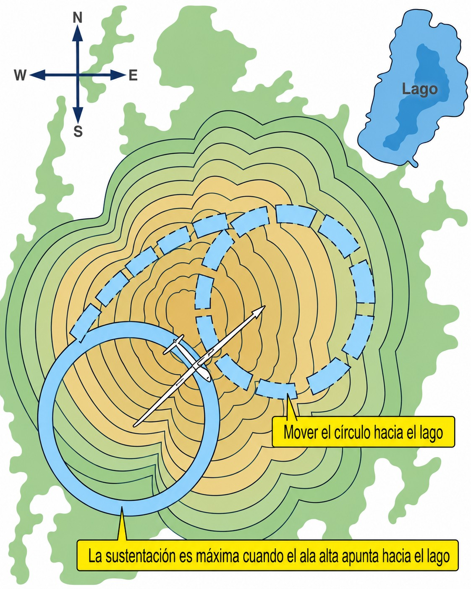
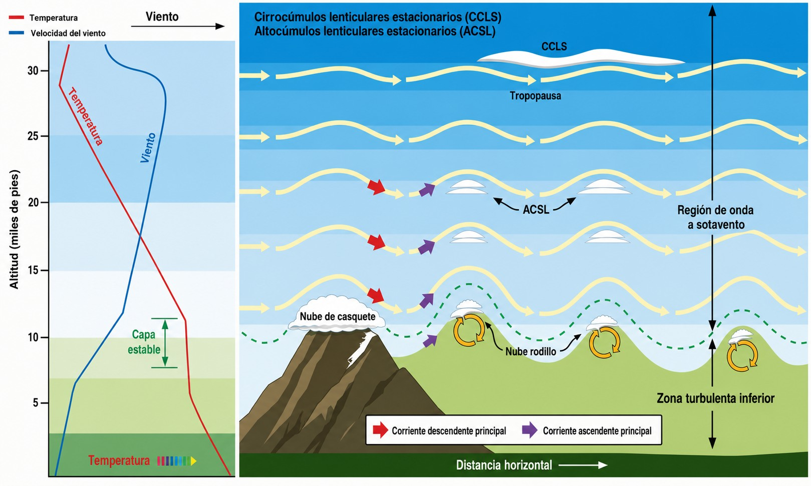

# Técnicas de planeo

> El vuelo de planeador es, en esencia, una conversación permanente con la atmósfera. El piloto que aprende a escuchar el aire —las variaciones del variómetro, el comportamiento del planeador en distintas masas de aire, los indicios sutiles que anuncian una térmica— desarrolla una capacidad que trasciende la técnica y se convierte en instinto. Esta sección recorre las tres grandes familias de sustentación dinámica: térmica, ladera y onda, junto con la gestión del lastre de agua para condiciones específicas.
>
>
> En este capítulo aprenderás:
>
>
> * **Centrado de térmicas**: cómo detectar el núcleo y cómo desplazar el viraje hacia él.
> * **El anillo MacCready**: qué es y cómo te dice exactamente a qué velocidad volar entre térmicas.
> * **Vuelo de ladera (ridge soaring)**: técnica, reglas de tráfico y márgenes de seguridad.
> * **Vuelo de onda (wave soaring)**: identificación, condiciones ideales y riesgos del rotor.
> * **Lastre de agua**: cuándo usarlo, cuándo vaciarlo y qué cambia en la aerodinámica del planeador.

## Vuelo en térmicas

Las **térmicas** son columnas de aire ascendente generadas por el calentamiento diferencial del suelo. Cuando el sol calienta la superficie —especialmente sobre terrenos oscuros como campos arados, asfalto o laderas orientadas al sur—, el aire más cálido y ligero asciende en forma de burbuja o columna. Este ascenso es la fuente de energía principal del vuelo de travesía (**cross-country**).

Piénsalo como una olla de agua hirviendo: el calor sube desde el fondo en corrientes irregulares e intermitentes. La térmica aerológica funciona de manera similar: no es un tubo uniforme de aire ascendente, sino una masa de geometría variable, con un núcleo de ascenso máximo rodeado de aire más tranquilo y, en los bordes externos, frecuentemente descendente.

### El centrado de la térmica

Detectar una térmica es solo el primer paso. Lo realmente difícil —y lo que distingue a un buen piloto de uno extraordinario— es centrarla con eficiencia. La técnica básica es el **desplazamiento del círculo** hacia el núcleo (@fig-06-cap03-centrado-termica):

1. Cuando el vario empiece a subir con fuerza, espera **2-3 segundos** para asegurarte de que estás dentro del núcleo y no en el borde inicial.
2. Inicia un viraje coordinado con un alabeo de entre **30° y 45°**. El planeador tardará entre 15 y 25 segundos en completar cada vuelta.
3. Observa el vario durante el giro: si el ascenso es mayor en un sector del círculo, el núcleo está desplazado hacia ese lado. Ensancha el viraje durante 2-3 segundos en esa dirección —reduciendo el alabeo momentáneamente— y vuelve a cerrarlo. Estarás «transportando» el centro del giro hacia el núcleo.

¿Y si entraste girando hacia el lado equivocado y el vario se hunde nada más establecer el viraje? Ahí entra la **técnica de los 270 grados**: recuerda en qué punto del giro tuviste el ascenso máximo, completa 270° de viraje, vuela recto durante 2-4 segundos hacia ese punto y vuelve a virar en el mismo sentido. Es más eficaz que invertir el giro, que consume tiempo, cubre más distancia y suele alejarte del núcleo.

{#fig-06-cap03-centrado-termica}

::: {.callout-tip title="Regla de oro"}
Si al atravesar una térmica un ala sube, el núcleo está de ese lado: **vira hacia el ala que sube**. Una vez establecido el giro, no inviertas nunca el sentido: ajusta. Cierra el viraje cuando el vario sube, ábrelo cuando baja. Con el tiempo, este ajuste se vuelve automático y no necesitas calcularlo conscientemente.
:::

### La velocidad entre térmicas: el anillo MacCready

El anillo MacCready es el selector de velocidades óptimas entre térmicas. Responde a la pregunta: «¿A qué velocidad debo volar para llegar lo más lejos posible antes de la próxima térmica?»

La lógica es la siguiente: si esperas encontrar térmicas de 2 m/s en el tramo siguiente, no tiene sentido volar a la velocidad de planeo óptimo (V~G~ (Velocidad de Planeo Óptimo)). Es más eficiente aumentar la velocidad —sacrificando algo de planeo— para llegar antes al núcleo de la próxima térmica. El anillo traduce esa lógica en una instrucción directa de velocidad.

* **Ajusta el anillo** al valor de ascenso que esperas en la próxima térmica (p. ej., 2 m/s).
* **Vuela a la velocidad que marque el anillo** en el vario. En masas de aire descendente, volarás más rápido; en ascendente, más despacio.
* El resultado es el **menor tiempo posible** para completar la travesía —no el mayor planeo instantáneo.

### El hilo de lana lateral como medidor del ángulo de ataque (técnica complementaria)

El **hilo de lana central** pegado en el centro de la cúpula es el instrumento rey y de obligada consulta para el control de la guiñada (vuelo coordinado). Sin embargo, en algunos entornos y escuelas se enseña de manera complementaria y no estándar el uso de un **hilo de lana lateral** (**side string**) como un indicador analógico e indirecto del ángulo de ataque (α, **alfa**) de las alas.

A diferencia del anemómetro, cuya velocidad de pérdida indicada varía según el peso total de la aeronave (como por el uso de lastre de agua) o por la carga aerodinámica en viraje (factor de carga G), **el ala entra en pérdida siempre al mismo ángulo de ataque físico**. El hilo de lana lateral busca medir la dirección del flujo de aire local sobre el lateral de la cabina, el cual varía de forma proporcional a la actitud del perfil de la aeronave respecto al viento relativo.

Esta técnica tiene limitaciones operativas que conviene conocer:

* **Errores por guiñada:** si el planeador no vuela en perfecta coordinación (bola y lanita central centradas), el flujo de aire lateral se deforma drásticamente y la lectura del hilo lateral queda inservible.
* **Calibración específica:** requiere que un instructor o piloto experimentado marque de forma empírica en el cristal las marcas físicas del **ángulo de planeo óptimo** (V~G~ (Velocidad de Planeo Óptimo)) y del **ángulo de pérdida (stall)** para cada modelo concreto de cabina.

Su utilidad se restringe exclusivamente al vuelo térmico lento para ayudar al alumno a visualizar la cercanía del planeador al coeficiente de sustentación máximo y prevenir pérdidas secundarias en virajes cerrados.

::: {.callout-warning title="Seguridad"}
En el vuelo rápido (**high-speed flight**), el hilo de lana lateral pierde toda precisión debido a que los ángulos de ataque son extremadamente pequeños. En este rango, el anemómetro y la observación del horizonte son los únicos métodos de referencia válidos para evitar exceder la V~NE~ (Velocidad Nunca Exceder). El hilo de lana lateral es una herramienta didáctica complementaria para el vuelo térmico lento, nunca un sustituto de los instrumentos primarios de vuelo ni del hilo de lana central de coordinación.
:::

## Vuelo de ladera y de onda

### Vuelo de ladera (*ridge soaring*)

El **vuelo de ladera** (**ridge soaring**) aprovecha la deflexión ascendente que el viento genera al chocar contra una montaña o colina. Mientras el viento sopla de frente a la ladera con suficiente velocidad, el aire es forzado a ascender y genera una banda de ascenso que el planeador puede explotar de forma continua.

* **Técnica:** vuela paralelo a la cresta, siempre por el lado de barlovento (el lado de donde viene el viento), a una distancia de seguridad que permita virar hacia el valle en cualquier momento.
* **Tráfico:** si dos planeadores se cruzan en la misma ladera, el que tiene la montaña a su **derecha** tiene preferencia. El otro debe separarse hacia el valle. Los giros se hacen siempre **hacia fuera de la montaña** (hacia el valle).

::: {.callout-warning title="Seguridad"}
Nunca vires hacia la ladera si no tienes espacio garantizado para completar el viraje con margen. A sotavento de la montaña —detrás de la cresta— el aire puede descender con violencia incluso en condiciones de vuelo aparentemente buenas en barlovento. Una entrada accidental en la zona de rotor a baja altura sobre el terreno puede ser irrecuperable.
:::

### Vuelo de onda (*wave soaring*)

El **vuelo de onda** (**wave soaring**) ocurre cuando, con viento fuerte y condiciones atmosféricas estables, el flujo de aire desviado hacia arriba por una cordillera genera un sistema de ondas de presión a sotavento, similar a las ondas que forma una piedra en el agua. Estas ondas pueden extenderse decenas o cientos de kilómetros y alcanzar altitudes estratosféricas (@fig-06-cap03-onda-esquema).

* **Identificación:** la señal visual más característica son las **nubes lenticulares** (**lenticular clouds**): nubes con forma de lenteja o sombrero que permanecen estáticas sobre el terreno mientras el viento las atraviesa continuamente.
* **Características:** el ascenso en la cresta de la onda es suave, constante y de gran amplitud. Es la vía hacia altitudes que ninguna térmica puede alcanzar.
* **Zona de rotor:** inmediatamente debajo de las nubes de rotor —las nubes fragmentadas y agitadas visibles bajo el nivel de la onda— el aire es violentamente turbulento. Esta zona puede dañar estructuralmente el planeador y es obligatorio evitarla.

{#fig-06-cap03-onda-esquema}

::: {.callout-note title="Airmanship"}
El vuelo de onda a gran altitud requiere equipamiento específico: oxígeno a partir de los 3.000-4.000 metros según la autonomía y condición del piloto, ropa de abrigo adecuada y un altímetro calibrado. Antes de un vuelo de onda planificado, consulta el espacio aéreo: es frecuente que las altitudes de onda coincidan con zonas restringidas o reservadas para el tráfico controlado, que requieren autorización previa.
:::

## Gestión del lastre de agua (*water ballast*)

El **lastre de agua** consiste en depósitos situados en las alas del planeador que pueden llenarse de agua antes del vuelo. Al aumentar la masa del planeador, su curva polar se desplaza hacia velocidades más altas: el planeador vuela más rápido entre térmicas con el mismo ángulo de planeo.

La analogía más útil es la del ciclista: en un descenso largo, ir cargado permite llegar más rápido al fondo sin pedalear. Con lastre, el planeador «cae» más rápido pero a igual planeo, lo que es ventajoso cuando las térmicas son fuertes y los planeos entre térmicas son largos.

* **Cuándo usarlo:** solo en días de térmicas fuertes (por encima de 2-3 m/s) y vuelos largos donde los planeos entre térmicas son significativos. En días débiles, el lastre penaliza más que ayuda.
* **Vaciado:** si la meteorología empeora o antes del aterrizaje, el lastre debe vaciarse completamente. Abre las válvulas con tiempo suficiente: el vaciado completo suele tardar entre 3 y 8 minutos según el planeador.
* **Hielo:** si vuelas a gran altitud con lastre, añade anticongelante al agua para evitar que se congele y dañe los depósitos o los sistemas de vaciado.

::: {.callout-warning title="Seguridad"}
Un planeador con lastre de agua tiene una **velocidad de pérdida significativamente mayor** —hasta 15-20 km/h más que sin lastre—. Ajusta todas tus velocidades de referencia (despegue, aproximación, circuito) en consecuencia. **Nunca aterrices con lastre completo**, salvo que una avería del vaciado te obligue — y entonces, extrema la suavidad de la toma: la inercia adicional puede superar la resistencia estructural de las alas y provocar un fallo catastrófico.
:::

::: {.postit}
**Resumen del capítulo: técnicas de planeo**

* **Centrado de térmica**: siente el empujón en el asiento. Si el ala derecha sube, el núcleo está a la derecha: vira a la derecha. Cierra el viraje cuando el vario sube, ábrelo cuando baja. Con práctica, este ciclo se vuelve automático.
* **Hilo de lana lateral (side string)**: técnica complementaria opcional para visualizar de forma didáctica el ángulo de ataque en vuelo lento; no sustituye al hilo central ni al anemómetro.
* **Anillo MacCready**: tu selector de velocidad óptima. Pon el anillo en el valor de ascenso que esperas encontrar (p. ej., 2 m/s) y vuela a la velocidad que te marque. Acelera en corrientes descendentes, aminora en corrientes ascendentes.
* **Ladera**: mantente pegado a barlovento con vía de escape hacia el valle siempre disponible. Si tienes la ladera a tu derecha, tienes preferencia. Nunca vires hacia el monte.
* **Onda**: la autopista al cielo. Sube en la zona laminar, delante de la nube de rotor. Requiere oxígeno y ropa de abrigo. Cuidado al bajar: el rotor puede romperte el planeador en segundos.
* **Lastre de agua**: más masa = más velocidad sin perder planeo. Útil en días fuertes y travesías largas. Vacíalo antes de aterrizar y ajusta siempre las velocidades de referencia: con lastre, la pérdida llega mucho antes.
:::
