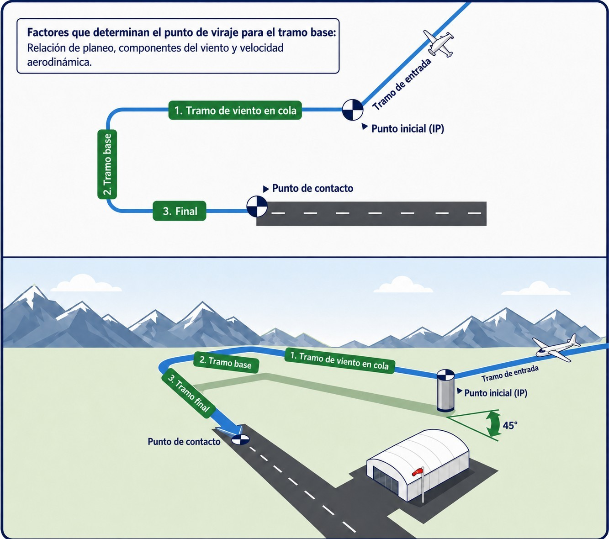
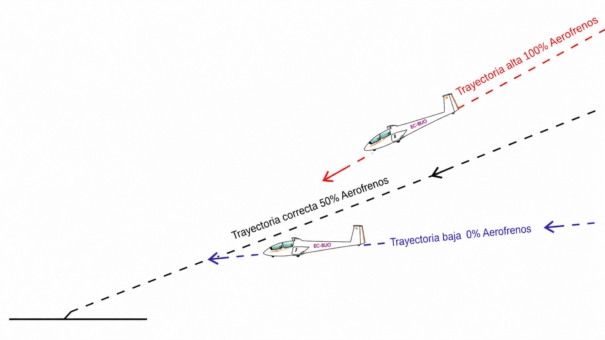
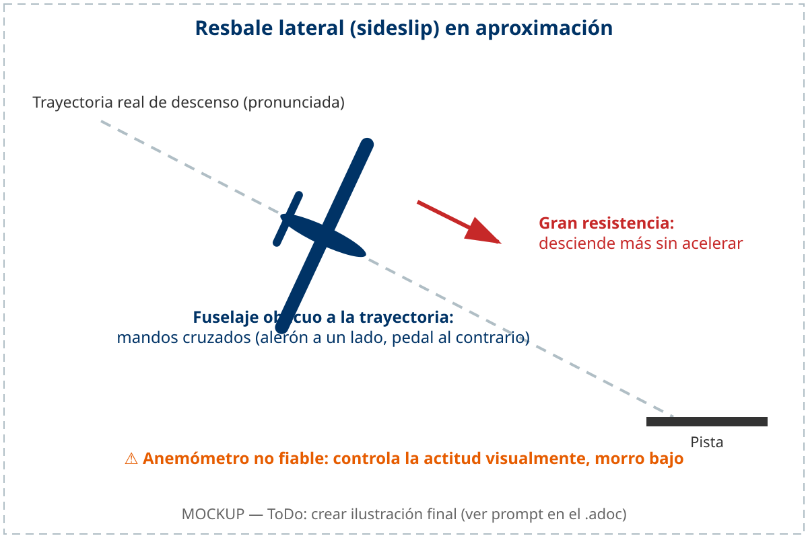
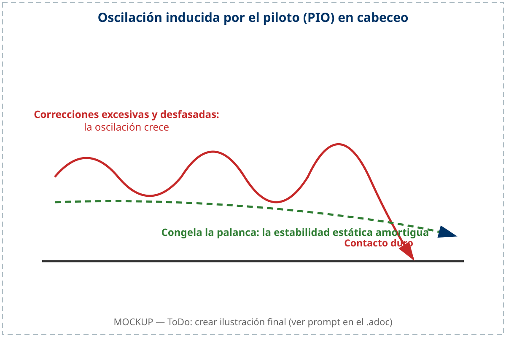

# Circuitos y aterrizaje

El circuito de tráfico es el corazón del vuelo de planeador: el momento en que toda la energía acumulada durante la travesía se convierte en un aterrizaje preciso y seguro. A diferencia de un avión con motor, el planeador no tiene segunda oportunidad si la primera aproximación sale mal —no hay potencia para rectificar. El circuito exige planificación anticipada, visión tridimensional del espacio y la capacidad de tomar decisiones mientras el suelo se acerca.

En este capítulo aprenderás:

* **La estructura del circuito estándar**: los cuatro tramos y las alturas de referencia en cada uno.
* **La lista de comprobación FUSTALL**: qué verificar antes de aterrizar y en qué orden.
* **Gestión de la velocidad con viento**: cómo calcular la velocidad de aproximación correcta.
* **El uso eficaz de los aerofrenos**: cómo utilizarlos para clavar el punto de toma.
* **Las correcciones en circuito**: cómo adaptarse cuando la energía no coincide con el plan.

## Estructura del circuito de tráfico

El **circuito de tráfico** es un procedimiento estandarizado que organiza la llegada al aeródromo de forma predecible y segura para todos los participantes. Su geometría rectangular permite que el piloto tenga siempre visibilidad de la pista y pueda ajustar la energía disponible en cada tramo.

Los cuatro tramos estándar son (@fig-06-cap04-circuito-estandar):

1. **Viento cruzado (**crosswind**):** Tramo perpendicular a la pista, realizado justo tras el despegue o al entrar en el circuito desde la travesía. La altura recomendada al completar el giro a viento cruzado es de 250-300 metros (QFE).
2. **Viento en cola** (**downwind**): Tramo paralelo a la pista en dirección contraria al aterrizaje. Se vuela a una distancia lateral de 200-400 metros de la pista, a una altura de 200-300 metros. Es el tramo donde se realizan las comprobaciones de la lista FUSTALL (ver sección siguiente).
3. **Tramo de base** (**base leg**): Tramo perpendicular a la pista, iniciado cuando el punto de toma queda a unos 45° detrás del ala del piloto. La altura recomendada al inicio de la base es de 150 metros.
4. **Final** (**final leg**): Tramo alineado con la pista, desde el que se realiza el descenso y la toma. Los aerofrenos se gestionan de forma continua durante este tramo para clavar el punto de toma.

{#fig-06-cap04-circuito-estandar}

### La lista de comprobación FUSTALL

Antes de entrar en el tramo de viento en cola, abre los grifos del lastre de agua —aunque no lo lleves, para consolidar el hábito: el vaciado completo lleva varios minutos—. Ya en el viento en cola, ejecuta la lista **FUSTALL** antes de continuar hacia la base y el final:

* **F** (**Flaps**): flaps en la posición de aterrizaje, si el planeador dispone de ellos.
* **U** (**Undercarriage / Tren de aterrizaje**): tren fuera y blocado. Comprueba visualmente la posición del indicador y, si el planeador lo tiene, el aviso sonoro.
* **S** (**Speed / Velocidad**): establece la velocidad de aproximación recomendada por el AFM (ver sección siguiente para la corrección por viento).
* **T** (**Trim / Compensador**): compensa el planeador a la velocidad de aproximación elegida.
* **A** (**Airbrakes / Aerofrenos**): verifica que los aerofrenos se mueven libremente y vuélvelos a cerrar para el tramo de base.
* **L** (**Landing area / Zona de aterrizaje**): escanea la zona de toma y el circuito completo: viento, otras aeronaves y personal en pista. ¿Hay otro planeador en final?
* **L** (**Land / Aterriza**): con todo verificado, dedica el resto del circuito exclusivamente a volar y aterrizar el planeador.

::: {.callout-tip}
✦ **REGLA DE ORO**

Haz el FUSTALL siempre en el mismo punto del viento en cola —por ejemplo, cuando la cabecera de la pista quede a la altura del ala—. La repetición convierte la lista en un hábito y hace prácticamente imposible omitirla. Un piloto que improvisa el momento del chequeo acaba por no hacerlo.
:::

::: {.callout-note}
⚓ **AIRMANSHIP / BUENAS PRÁCTICAS: LA REGLA TRADICIONAL WULF**

En muchos clubes europeos se enseña la mnemotecnia abreviada **WULF** para el mismo chequeo de viento en cola: **W** (**Water ballast**): lastre de agua vaciado; **U** (**Undercarriage**): tren fuera y blocado; **L** (**Loose articles / Look-out**): objetos sueltos asegurados y vigilancia exterior; **F** (**Flaps**): flaps en posición de aterrizaje. Ambas listas persiguen lo mismo: llegar al tramo de base con la configuración completa y la atención puesta fuera de la cabina.
:::

## Gestión de la velocidad y el viento

La velocidad durante el circuito debe ser constante y segura. Como referencia general, se utiliza la **Velocidad de Aproximación Recomendada** del AFM, o en su defecto, **1,5 veces la velocidad de pérdida** (1,5 V~S~): el margen es mayor que en un avión con motor porque el planeador afronta el gradiente de viento y la recogida sin potencia para corregir.

El viento modifica esta ecuación de forma importante:

* **Viento de cara en final:** añade a tu velocidad base la **mitad de la velocidad del viento** (y la mitad de la racha máxima prevista). Un viento de 20 km/h justifica añadir 10 km/h a tu velocidad normal.
* **Gradiente de viento:** cerca del suelo, el viento pierde velocidad de forma brusca. Si entras en final demasiado lento, puedes sufrir una pérdida repentina de sustentación justo cuando menos lo esperas —a escasos metros del suelo—. Entra siempre con un pequeño exceso de velocidad y deja que se consuma durante el planeo final.

::: {.callout-warning}
⚠ **SEGURIDAD**

Entrar en final lento con viento en cara es una de las combinaciones más peligrosas en el vuelo de planeador. El gradiente de viento próximo al suelo puede robarte los últimos 15-20 km/h de velocidad en décimas de segundo, llevándote directamente a la pérdida a una altura donde la recuperación es imposible. La velocidad adicional en final no es un lujo: es un seguro de vida.
:::

## Uso de los aerofrenos

Los **aerofrenos** son el control de planeo del planeador: permiten aumentar la tasa de descenso sin cambiar la actitud ni la velocidad. Son el instrumento que transforma la energía potencial sobrante en frenado aerodinámico y permiten clavar el punto de toma con precisión (@fig-06-cap04-aerofrenos-angulo).

La estrategia más fiable para usar los aerofrenos es la siguiente:

* **Aproximación estándar:** entra en final con los aerofrenos al **50 %**. Esta posición central te da margen en ambas direcciones: si estás alto, abres más; si estás bajo, cierras.
* **Ajuste continuo:** los aerofrenos se usan durante todo el final para mantener el punto de referencia estático en el parabrisas. Si el punto sube hacia ti, estás bajo: cierra aerofrenos. Si el punto baja, estás alto: abre más.
* **Viraje de base a final:** evita usar los aerofrenos completamente abiertos durante el viraje. Una tasa de descenso elevada combinada con un alabeo pronunciado aumenta la carga alar efectiva y puede acercar peligrosamente el planeador a la velocidad de pérdida.
* **Toma de tierra:** una vez que el planeador ha tocado, mantén los aerofrenos abiertos para evitar que vuelva a saltar (**balonazo**) y para mejorar la eficacia del freno de rueda.

{#fig-06-cap04-aerofrenos-angulo}

::: {.callout-note}
⚓ **AIRMANSHIP / BUENAS PRÁCTICAS**

Si en el viraje de base a final observas que vas a pasar de largo el punto de toma con los aerofrenos completamente abiertos, no cierres los frenos bruscamente cerca del suelo: el planeador sufrirá un balonazo repentino. En su lugar, si el campo lo permite, prolonga el giro de base o realiza una S suave en final para aumentar la distancia recorrida. Si nada funciona, estás en una situación de campo largo: aterriza y rueda hasta el final de la pista.
:::

## El resbale lateral (*sideslip*)

El **resbale lateral** (conocido como **sideslip** en la terminología internacional) es una maniobra operativa avanzada que permite aumentar drásticamente la tasa de descenso del planeador sin incrementar su velocidad de avance. Consiste en provocar un resbale de forma deliberada exponiendo el lateral del fuselaje a la corriente de aire, lo que genera una gran resistencia aerodinámica.

Es el recurso definitivo de control de senda en las siguientes situaciones:

* Fallo o atasco de los aerofrenos en la aproximación.
* Aproximaciones excesivamente altas a campos desconocidos durante un aterrizaje fuera de campo.
* Ajustes rápidos de altura en días de turbulencias severas o cizalladura.

Para realizar un resbale de forma segura, aplica la siguiente técnica:

1. **Entrada:** inicia un viraje suave hacia un lado y, de inmediato, aplica timón de dirección en sentido opuesto (cruza los mandos: alerón a un lado, pedal al contrario). El fuselaje se orientará oblicuo respecto a la trayectoria real de vuelo.
2. **Dirección del viento:** orienta siempre la dirección del resbale de modo que **el ala baja apunte hacia el viento** (si el viento viene de la izquierda, realiza un resbale con alabeo a la izquierda y pedal derecho). Esto ayuda a contrarrestar la deriva lateral y mejora el control.
3. **Control de velocidad:** como el aire incide de lado sobre el fuselaje, la presión estática y dinámica en las tomas del planeador se altera y **el anemómetro muestra indicaciones erróneas o nulas**. Controla la velocidad de aproximación de forma exclusivamente visual, manteniendo el morro en una actitud ligeramente picada respecto al horizonte.
4. **Salida:** para finalizar la maniobra, relaja primero la presión en la palanca de profundidad (morro abajo) y luego neutraliza suavemente los alerones y el pedal de dirección. El planeador volverá de inmediato al vuelo coordinado en la senda deseada.

{#fig-06-cap04-resbale-lateral}

::: {.callout-warning}
⚠ **SEGURIDAD**

Debido a que el flujo de aire está desprendido y el anemómetro no es fiable durante el resbale, existe riesgo de entrada en pérdida si el piloto tira excesivamente de la palanca de profundidad. Mantén siempre una actitud de morro netamente baja. Practica la maniobra a altura de seguridad antes de intentarla en circuito.
:::

### Aterrizaje con viento de cola (**downwind landing**)

Aunque la regla de oro de la aviación exige aterrizar siempre de cara al viento para reducir la carrera en tierra, existen situaciones operativas (como una fuerte pendiente cuesta arriba en un aterrizaje fuera de campo o restricciones de obstáculos en la aproximación) que pueden obligar al piloto a realizar un aterrizaje con viento de cola.

El viento de cola altera radicalmente las referencias sensoriales del piloto y la física de la toma:

* **Aumento de la velocidad sobre el suelo (**groundspeed**):** si tu velocidad de aproximación indicada es de 90 km/h y tienes un viento de cola de 20 km/h, tu velocidad real respecto al suelo será de 110 km/h. La carrera de aterrizaje se alargará mucho más y exigirá más distancia y un uso eficaz del freno de rueda.
* **La ilusión visual de velocidad:** al ver pasar el suelo a gran velocidad durante el final y la toma, tu cerebro interpretará falsamente que vas demasiado rápido. La reacción instintiva y peligrosa es tirar de la palanca de mando para frenar el velero. Esto reducirá la velocidad indicada por debajo de la de seguridad y puede provocar una pérdida (**stall**) y entrada en barrena (**spin**) a escasos metros del suelo.
* **Senda de aproximación plana:** al desplazarte más rápido sobre el terreno, tu ángulo de descenso aparente será mucho más plano. Mantén una senda conservadora utilizando los aerofrenos con precisión.

::: {.callout-warning}
⚠ **SEGURIDAD**

Cuando vueles una aproximación con viento de cola, **fía tu control de velocidad exclusivamente al anemómetro**, ignorando la velocidad aparente con la que pasa el terreno bajo la cabina. Mantén la velocidad de aproximación recomendada y prepárate para una carrera de rodaje muy larga y un frenado enérgico.
:::

### Oscilaciones inducidas por el piloto (*PIO*) en cabeceo

Las oscilaciones inducidas por el piloto (**pilot-induced oscillations - PIO**) son fluctuaciones rápidas e incontroladas en la actitud de cabeceo del planeador cerca del suelo, generadas por la reacción tardía del piloto ante pequeños desvíos de trayectoria.

Durante la fase final de aproximación y la toma de tierra, a bajas velocidades, la efectividad de los mandos de vuelo se reduce y existe un ligero retraso (**control lag**) entre el movimiento de la palanca y la respuesta física de la aeronave. Si el planeador sufre una pequeña ráfaga de viento y se encabrita, un piloto fatigado o de reflejos tardíos puede empujar la palanca hacia adelante con fuerza; cuando el planeador responde y empieza a picar, el piloto tira con fuerza hacia atrás. Este ciclo de correcciones excesivas y desfasadas se amplifica rápidamente:

* **Consecuencias:** las oscilaciones pueden terminar en un contacto extremadamente duro del tren de aterrizaje principal o de la rueda de morro contra la pista, con daños estructurales severos en el fuselaje o lesiones a la tripulación.
* **Corrección en vuelo:** en el momento en que sientas que inicias una oscilación en cabeceo cerca de la pista, **congela la palanca de mando** en una posición estable y neutral. Deja que el planeador se estabilice solo por su estabilidad estática longitudinal y, si es necesario, abre o mantén los aerofrenos al 50 % para asentar la aeronave con suavidad (@fig-06-cap04-pio-cabeceo).

{#fig-06-cap04-pio-cabeceo}

**Resumen del Capítulo: Circuitos y aterrizaje**

* **Circuito estándar**: cuatro tramos —cruzado, viento en cola, base y final— con alturas de referencia: 250-300, 200-300 y 150 metros hasta la toma. El circuito no es un ritual, es un gestor de energía.
* **FUSTALL en el viento en cola**: **Flaps**, **Undercarriage** (tren fuera y blocado), **Speed** (velocidad de aproximación), **Trim**, **Airbrakes** (aerofrenos libres y cerrados), **Landing area** (viento y tráfico), **Land**. Lastre de agua vaciado antes de entrar al circuito. Hazlo siempre en el mismo punto del recorrido.
* **Velocidad de aproximación**: calcula tu velocidad base (1,5 V~S~) y **súmale la mitad del viento y de la racha**. Entrar lento con viento es receta para un accidente por cizalladura.
* **Aerofrenos**: entra en final con el 50 % sacados. Si el punto de toma sube en el parabrisas, cierra; si baja, abre. Nunca cierres bruscamente cerca del suelo: balonazo y golpe de cola.
* **Resbale lateral (**sideslip**)**: método de descenso rápido de emergencia cruzando mandos. Recuerda: **ala baja al viento**, actitud visual de morro bajo (el anemómetro no es fiable por el flujo cruzado) y salida relajando primero la palanca.
* **Viento de cola y PIOs**: en tomas con viento de cola, ignora la velocidad visual del suelo (evita pérdidas de sustentación) y prepárate para un rodaje largo. Si el velero oscila en cabeceo (**PIO**) cerca del suelo, congela la palanca y deja actuar su estabilidad estática.
