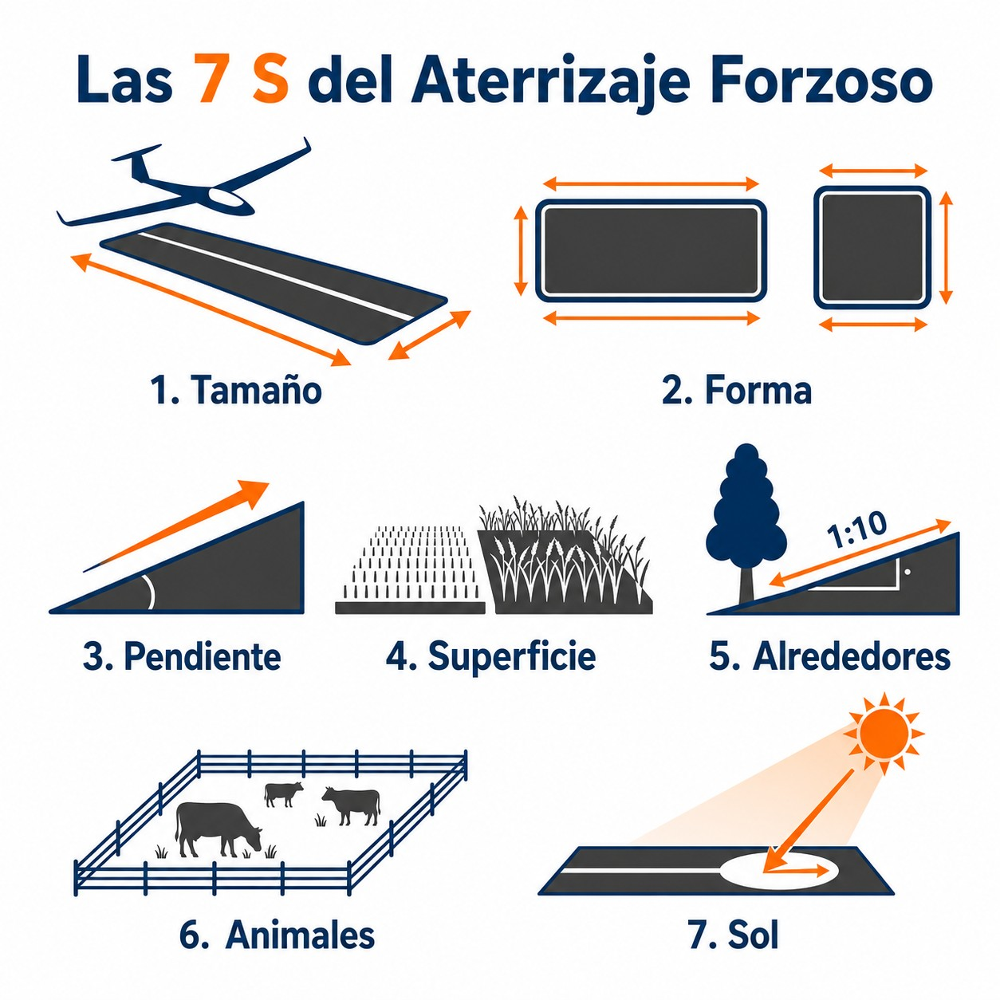

# Aterrizaje fuera de campo (

El **** (**outlanding**) es una realidad estadística del vuelo de travesía. No es un fallo, ni un accidente: es un procedimiento previsto, entrenado y perfectamente ejecutable cuando se hace con la cabeza fría y la altitud adecuada. La diferencia entre un aterrizaje fuera de campo que se cuenta en el hangar y uno que se convierte en accidente reside en un único factor: el momento en que el piloto toma la decisión.

En este capítulo aprenderás:

* **La decisión de aterrizar**: cuándo y por qué la demora es la causa número uno de accidentes en campo.
* **Las 7 S de selección de campo**: los siete criterios que evalúas en segundos para elegir el campo correcto.
* **El análisis de superficies**: qué tipo de terreno es apto y cuáles son los engaños más frecuentes.
* **La técnica de aproximación fuera de campo**: cómo adaptar el circuito estándar a un terreno desconocido.
* **Procedimientos post-aterrizaje**: cómo asegurar el planeador, coordinar el rescate y gestionar la supervivencia y la relación con el propietario del terreno.

## La decisión de aterrizar fuera de campo

El mayor enemigo del piloto en una situación de campo no es el terreno: es la esperanza. La esperanza de que aparecerá una térmica salvadora. De que ese campo que viste hace diez minutos todavía está dentro del alcance. De que bajar un poco más para buscar ascendencia no tiene consecuencias.

La estadística es contundente: la causa número uno de accidentes graves en vuelo de travesía no es la falta de campos disponibles, sino la **demora en tomar la decisión de aterrizar**. El piloto que espera demasiado llega al campo elegido sin altura suficiente para inspeccionarlo correctamente, sin margen para rectificar una aproximación mal planificada y sin energía para evitar un obstáculo no visto.

La herramienta más útil para combatir este sesgo cognitivo es fijar de antemano una ****. O mejor: una escalera de tres peldaños que convierte el descenso en un plan por fases, en lugar de un ultimátum:

* **600 metros sobre el terreno:** selecciona la zona general donde vas a aterrizar. Puedes seguir buscando térmicas, pero solo las que te dejen siempre esa zona al alcance.
* **450 metros:** elige el campo definitivo y evalúa sus 7 S (siguiente sección). Si pruebas una térmica, que sea sobre el propio campo.
* **300 metros:** comprométete con el circuito. El juego térmico ha terminado; a partir de aquí, toda tu atención es para el aterrizaje.

::: {.callout-warning}
⚠ **SEGURIDAD**

Retrasar la decisión de aterrizar buscando una «térmica de rescate» a baja altura es el patrón más documentado en los accidentes graves de vuelo sin motor. Una vez fijada la altura de decisión, respétala sin excepciones. El planeador se puede reparar. El piloto, no siempre.
:::

## Criterios de selección: las 7 S

Para evaluar si un campo es apto en los pocos segundos que tienes disponibles, utiliza la regla de las ****. Este método te obliga a evaluar los factores correctos en el orden correcto, evitando que la urgencia te lleve a pasar por alto un riesgo crítico ():

1. **S** (**Size / Tamaño**): busca el campo más grande posible. Un campo de 400 metros es ideal para la mayoría de los planeadores modernos; menos de 200 metros es crítico y requiere una técnica impecable.
2. **S** (**Shape / Forma**): un campo largo y estrecho es mejor que uno corto y ancho. La forma debe permitir una aproximación limpia desde la dirección del viento sin obstáculos.
3. **S** (**Slope / Pendiente**): aterriza siempre cuesta arriba si hay pendiente, aunque eso signifique aterrizar con viento de cola ligero. Una pendiente descendente puede impedir que el planeador se detenga en la distancia disponible.
4. **S** (**Surface / Superficie**): analiza la textura y el color del terreno. El rastrojo o el barbecho son superficies ideales. Los cultivos altos, los viñedos y los arrozales son trampas que no perdonan.
5. **S** (**Surroundings / Alrededores**): evalúa los obstáculos en la senda de aproximación. La **regla 1:10** es tu referencia: un obstáculo de 10 metros de altura consume 100 metros de pista efectiva. Cables de alta tensión, árboles altos y edificios pueden eliminar de golpe la mitad del campo disponible.
6. **S** (**Stock / Animales**): evita campos con ganado. Las vacas, ovejas o caballos son impredecibles y pueden cruzarse en la trayectoria de rodaje con consecuencias graves para el planeador y el piloto.
7. **S** (**Sun / Sol**): ten en cuenta la posición del sol. Aterrizar de cara al sol bajo puede cegarte por completo y ocultar obstáculos críticos —especialmente los cables de alta tensión, que son invisibles en contraluz.

{#fig-06-cap05-7s-seleccion-campo}

## Análisis de superficies comunes

| Tipo de campo | Idoneidad | Consideraciones clave |
| --- | --- | --- |
| **Barbecho** | Excelente | Terreno nivelado y compacto. Poco riesgo de irregularidades. Primera opción. |
| **Rastrojo** | Muy bueno | Restos de cereal ya segado. Superficie dura y segura. Rodaje corto. |
| **Cereal verde bajo (< 20 cm)** | Bueno | Acepta tomas normales. Si el cereal supera los 20 cm, puede enganchar un ala y provocar una guiñada brusca. |
| **Cereal alto o maduro** | Evitar | Alto riesgo de «caballito» al enganchar el ala. Oculta irregularidades del terreno. |
| **Arado reciente** | Aceptable con precaución | Aterriza siempre paralelo a los surcos. La carrera será muy corta. Riesgo de volcar si los surcos son profundos. |
| **Pasto / Pradera** | Engañoso | Puede ocultar piedras, zanjas, cercas de alambre ocultas o ganado no visible desde el aire. |
| **Viñedo** | Inaceptable | Los postes y alambres de las hileras destruirán el planeador con certeza. |
| **Arrozal** | Inaceptable | El terreno está inundado. El contacto con el agua a velocidad de aterrizaje provocará el vuelco. |

: Idoneidad de superficies para aterrizaje fuera de campo

## Técnica de aproximación y toma en campo desconocido

La aproximación a un campo no conocido debe ser más conservadora que la habitual. Los márgenes de error son menores: no conoces el nivel exacto del terreno, la textura real de la superficie ni si hay obstáculos ocultos.

1. **Inspección previa:** si la altura lo permite, realiza una pasada sobre el campo a distancia de seguridad para verificar obstáculos no visibles desde lejos: cables finos, zanjas, desniveles o ganado. Nunca desciendas por debajo de la altura de los árboles para inspeccionar: el margen de recuperación es nulo.
2. **Circuito estándar:** realiza un circuito lo más estándar posible. No inventes aproximaciones directas o curvas. El circuito estándar te da tiempo para inspeccionar el terreno en el viento en cola y ajustar la energía en la base.
3. **Configuración:** tren de aterrizaje fuera y blocado, arneses ajustados al máximo. En caso de impacto, el arnés bien apretado es la diferencia entre una contusión y una lesión grave.
4. **Velocidad:** mantén una velocidad ligeramente superior a la habitual —añade 10-15 km/h sobre tu velocidad normal— para tener mejor control ante las turbulencias mecánicas de los árboles y edificios cercanos.
5. **La toma:** toca tierra con la mínima velocidad posible y mantén el planeador recto. Una vez en tierra, frena con decisión: es preferible romper el tren de aterrizaje contra un surco que intentar flotar sobre un obstáculo y entrar en pérdida.

::: {.callout-warning}
⚠ **SEGURIDAD: EL «CABALLITO» (**

Si durante el rodaje ves que vas a chocar contra un obstáculo insalvable a alta velocidad, puedes provocar un «caballito» deliberado bajando un ala al suelo. El planeador pivotará sobre esa ala y se detendrá bruscamente, sacrificando la estructura del ala para salvar al piloto. Esta maniobra solo se usa como último recurso, cuando la alternativa es el impacto frontal a velocidad.
:::

## Procedimientos post-aterrizaje fuera de campo

Una vez que el planeador se ha detenido de forma segura y el flujo de adrenalina comienza a estabilizarse, el vuelo no ha terminado. Un aterrizaje fuera de campo (**outlanding**) exitoso requiere una serie de acciones coordinadas para asegurar la integridad de la aeronave, gestionar las comunicaciones de rescate, garantizar tu supervivencia si estás en una zona aislada y mantener una relación respetuosa con los propietarios del terreno.

### Aseguramiento del planeador

Inmediatamente después de salir de la cabina y verificar que te encuentras ileso, tu primera prioridad es asegurar el planeador para evitar daños causados por el viento o por curiosos:

* **Orientación respecto al viento:** si hay viento fuerte y es posible pivotar el planeador físicamente sin dañar la estructura, oriéntalo con el ala que tiene el viento de cara en el suelo, o bien perpendicular al viento.
* **Lastre improvisado:** coloca un peso seguro (como un saco de tierra o de arena, o una bolsa de transporte pesada) sobre el extremo del plano apoyado en el suelo para evitar que el viento levante el ala y vuelque la aeronave. Nunca uses piedras angulosas o ramas que puedan arañar o perforar la fibra de vidrio.
* **Bloqueadores de mandos (** asegura la palanca de mandos con el cinturón de seguridad y coloca bloqueadores externos en las superficies de control (timón, profundidad y alerones) si dispones de ellos, para evitar que el viento golpee las superficies contra sus topes físicos.
* **Protección de la cabina y cúpula:** cierra y bloquea la cúpula inmediatamente. Si el sol es intenso, coloca la funda protectora de la cúpula para evitar el efecto invernadero en el interior de la cabina (que puede deformar instrumentos o resinas de la estructura o, incluso, provocar un incendio por efecto lupa) y el envejecimiento acelerado por la radiación UV.
* **Fundas de protección:** coloca las fundas en las tomas de Pitot y de presión estática/total (TE) para evitar la entrada de insectos o suciedad del campo, que inutilizarían los instrumentos en el próximo vuelo.

### Comunicaciones y localización

La tripulación de carretera (**retrieve crew**) o tu club de vuelo necesitan saber exactamente dónde estás. No confíes en referencias visuales vagas como «cerca de un granero rojo». Sigue este protocolo de comunicación:

* **Obtención de coordenadas:** lee las coordenadas geográficas exactas en tu sistema de navegación o en el teléfono móvil utilizando el GPS. Anota las coordenadas en formato estándar (grados decimales o grados, minutos y segundos) y la altitud.
* **Llamada de estado:** contacta por teléfono o, si no hay cobertura móvil, utiliza la radio de aviación en la frecuencia de tu club o del aeródromo local para informar de que la toma ha sido segura y sin daños personales.
* **Uso de rastreadores satelitales:** si vuelas en zonas montañosas o remotas sin cobertura telefónica, activa el mensaje de «llegada segura» (**OK**) en tu dispositivo de seguimiento por satélite (tipo SPOT o Garmin inReach) para que tus contactos reciban tu ubicación exacta en tiempo real.
* **Balizas de emergencia (ELT/PLB):** en caso de aterrizaje de emergencia con lesiones o daños graves que impidan otras comunicaciones, asegúrate de que la baliza transmisora de localización de emergencia (**Emergency Locator Transmitter - ELT**) de 406 MHz se ha activado (o activa manualmente tu radiobaliza personal PLB). No la actives para un aterrizaje preventivo normal sin daños.

### Supervivencia en zonas remotas

Si has tomado tierra en una región montañosa, desértica o boscosa de difícil acceso, el rescate puede demorarse varias horas o incluso pasar la noche. Aplica la siguiente regla de oro de la supervivencia aeronáutica:

::: {.callout-warning}
⚠ **SEGURIDAD**

**Permanece siempre junto al planeador**. Una aeronave de color blanco o brillante de 15 metros de envergadura es infinitamente más fácil de avistar desde el aire por los equipos de rescate que un piloto caminando solo por el bosque o la montaña. Abandonar el velero para buscar ayuda a pie multiplica el riesgo de desorientación, hipotermia y retraso en la localización.
:::

* **Uso del cockpit como refugio:** el habitáculo del planeador proporciona una excelente protección contra el viento, la lluvia y el frío. Utiliza los cojines y el espacio interior para aislarte del suelo húmedo o del frío de la estructura.
* **El paracaídas de emergencia:** la tela de nailon de tu paracaídas de emergencia es una herramienta de supervivencia valiosísima. Puedes extraerla del arnés y usar su gran superficie para montar un refugio tipo tienda contra el velero, envolverte en ella para conservar el calor corporal (actúa como un cortavientos eficaz) o extenderla en el suelo como señal visual de alto contraste para las búsquedas aéreas.

### Relación con el propietario del terreno

El aterrizaje fuera de campo se realiza amparado por el estado de necesidad de la seguridad aeronáutica, pero no debes olvidar que te encuentras en una propiedad privada:

* **Minimización de daños:** al desmontar el planeador para introducirlo en el remolque, procura no pisar cultivos altos ni dañar vallas o cercados. Si es necesario, traslada las piezas a pie por los bordes de la parcela.
* **Trato diplomático:** cuando el agricultor o el dueño de la finca se presente, muéstrate educado y agradecido. Explica con calma que se ha tratado de un aterrizaje preventivo por falta de sustentación (una situación normal y segura) y que no tenías motor para regresar. La inmensa mayoría de las personas son comprensivas si se les trata con cortesía y respeto por su propiedad.

**Resumen del Capítulo: Aterrizaje fuera de campo**

* **La decisión (600/450/300 m)**: a 600 m sobre el terreno, elige la zona; a 450 m, el campo; a 300 m, comprométete con el circuito y olvida las térmicas. Retrasar esta decisión buscando un «milagro rasante» es la causa número 1 de accidentes graves.
* **Selección del campo (7 S)**: tamaño, forma, pendiente, superficie, alrededores, animales y sol. Un campo grande, llano, con viento en cara y sin obstáculos en la aproximación es tu seguro de vida.
* **El circuito**: hazlo **estándar**. No inventes aproximaciones directas raras. El viento en cola sirve para inspeccionar el terreno; la base, para ajustar la altura; el final, para clavar la toma.
* **En tierra**: frena a fondo. Es mejor romper el tren en un surco que intentar flotar sobre un obstáculo y entrar en pérdida a tres metros del suelo.
* **Procedimientos post-toma**: asegura el planeador contra el viento (pesos en planos, cúpula cerrada, fundas de pitot), transmite tus coordenadas GPS exactas, permanece junto a la aeronave si estás en zona aislada (usa la tela del paracaídas como refugio) y mantén un trato respetuoso y educado con el agricultor.
