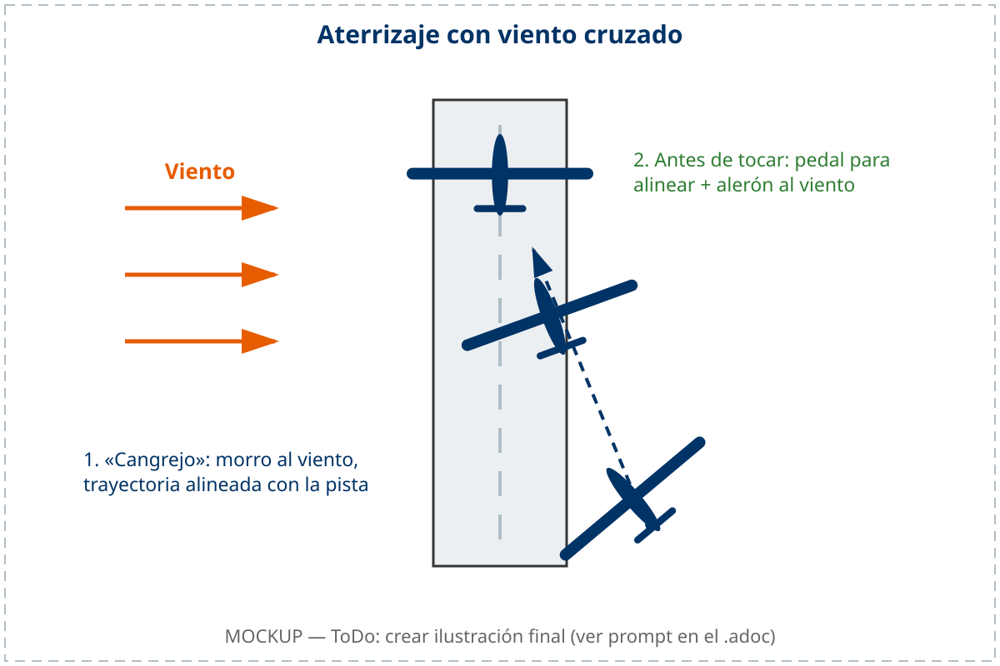

# Procedimientos operativos especiales y peligros

> El vuelo de planeador se desarrolla en un entorno compartido con otras aeronaves, con fauna aérea, con fenómenos meteorológicos que pueden aparecer en minutos y con una orografía que puede ser tan aliada como adversaria. Conocer los procedimientos específicos para cada uno de estos escenarios —y entender por qué están diseñados así— es lo que separa al piloto reactivo del piloto preventivo.
>
>
> En este capítulo aprenderás:
>
>
> * **Vigilancia exterior y colisiones**: la regla de los 3 segundos y las técnicas de escaneo visual.
> * **FLARM**: cómo funciona, qué detecta y, sobre todo, qué no detecta.
> * **Peligros de la fauna**: cómo coexistir con las aves sin asumir riesgos innecesarios.
> * **Estelas turbulentas y engelamiento**: dos amenazas silenciosas en vuelo.
> * **Viento cruzado**: técnica de despegue y aterrizaje en condiciones exigentes.
> * **Riesgos en montaña**: horizonte falso, reglas de preferencia y la prohibición absoluta de virar hacia la ladera.
> * **Amerizaje (ditching)**: qué hacer si el agua es inevitable.

## Vigilancia exterior y colisiones

La colisión en el aire (**mid-air collision**) es uno de los peligros más graves para el planeador, especialmente en zonas de alta concentración de aeronaves como térmicas fuertes, laderas populares o las proximidades del aeródromo en las horas punta del día.

El problema físico es implacable: a 150 km/h, dos planeadores que se acercan de frente tienen una velocidad relativa de cierre de 300 km/h —83 metros por segundo—. Esto significa que si se detectan mutuamente a 300 metros de distancia, tienen algo menos de **cuatro segundos** para reaccionar. En realidad, la mitad de ese tiempo —unos dos segundos— se consume en el proceso perceptivo y de decisión, antes de que el planeador haya cambiado ni un metro su trayectoria.

### La regla de los 3 segundos

Para evitar una colisión, un piloto necesita aproximadamente **3 segundos** desde que detecta visualmente la aeronave conflictiva hasta que su planeador ha respondido físicamente a la maniobra de evasión:

* **1,5 segundos** para detectar la otra aeronave, reconocer el peligro, decidir la maniobra y ejecutarla.
* **1,5 segundos** para que el planeador responda físicamente y comience a cambiar su trayectoria.

Esta regla tiene una consecuencia directa: las aeronaves deben detectarse a **mucho más de 250 metros** para que la evasión sea posible con margen. Y eso solo ocurre si el piloto mira activamente hacia fuera.

### Técnicas de escaneo visual

* **Vigilancia activa:** dedica el 95 % del tiempo a mirar fuera de la cabina. Los instrumentos solo necesitan miradas breves y periódicas.
* **Barrido sectorial:** divide el horizonte en sectores de 15-20° (@fig-06-cap06-escaneo-visual). Mueve los ojos de sector en sector, deteniéndote brevemente en cada uno. La visión periférica detecta el movimiento, pero para resolver si es una aeronave necesitas mirar directamente.
* **Antes de virar:** mira siempre hacia el lado del viraje y al sector contrario antes de inclinar el planeador.
* **Puntos ciegos:** las alas, el fuselaje y el capó ocultan parte del cielo. Mueve ligeramente el morro o alabea suavemente para «limpiar» las zonas ciegas de forma periódica.

{#fig-06-cap06-escaneo-visual}

## Ayudas electrónicas: FLARM

El **FLARM** es un sistema de alerta de colisión diseñado específicamente para el vuelo sin motor y la aviación general ligera. Opera enviando la posición GPS del planeador y su vector de movimiento predicho mediante una señal de radio corta a todos los equipos FLARM cercanos. Cada equipo recibe estas posiciones, calcula si las trayectorias convergen y, si detecta riesgo de colisión, emite una alerta sonora y visual con la dirección e intensidad del peligro.

* **¿Qué detecta?** Aeronaves equipadas con FLARM o dispositivos compatibles (PowerFLARM, SoftRF, FANET), algunos aviones con ADS-B Out, y obstáculos fijos programados en su base de datos (cables de teleférico, antenas, tendidos eléctricos en zonas de vuelo de competición).
* **¿Qué NO detecta?** Aeronaves sin FLARM ni ADS-B (muchos aviones ultraligeros, helicópteros militares, parapentes, globos sin equipar), objetos no incluidos en su base de datos, y tráfico fuera de su alcance de radio (habitualmente 3-5 km horizontal).

### Procedimiento operativo ante alertas FLARM

Para que el FLARM cumpla con su función de seguridad sin generar distracciones fatales en cabina, el piloto debe seguir el siguiente protocolo de comportamiento estandarizado ante una alerta:

1. **Lectura rápida y anuncio:** capta la advertencia visual con una mirada rápida y precisa al instrumento y verbalízala en voz alta (p. ej., «Tráfico a la una en punto, más alto»). Esto asegura que la tripulación (si vuela en biplaza) comparte la conciencia situacional.
2. **Búsqueda visual exterior proactiva:** dirige de inmediato la atención hacia el exterior de la cabina, enfocando la mirada en el sector indicado por la alerta. **Nunca te quedes mirando fijamente la pantalla del FLARM** intentando interpretar símbolos o trayectorias; el instrumento te dice dónde buscar, pero la colisión solo se evita mirando afuera.
3. **Confirmación visual:** mantén el rumbo y la actitud hasta confirmar el contacto visual con la aeronave conflictiva.
4. **Nada de maniobras evasivas bruscas «a ciegas»:** si no logras establecer contacto visual con el tráfico, **evita los virajes o cambios de altitud violentos** basados únicamente en la indicación de la pantalla del FLARM. Un viraje brusco sin ver al otro planeador puede llevarte a interceptar su trayectoria de evasión o a colisionar con un tercer planeador no equipado que se encuentre fuera del radar. Ante la duda, realiza cambios suaves y predecibles de actitud para aumentar tu visibilidad.

::: {.callout-note title="Airmanship"}
El FLARM es una herramienta de seguridad extraordinariamente útil, (obligatoria para competición oficial desde un regional hasta los mundiales) pero **nunca sustituye a la vigilancia visual**. Considéralo como un complemento que te avisa de los peligros que ya conoce, no como un sistema que elimina todos los riesgos. Ante una alerta FLARM, reacciona buscando visualmente la aeronave conflictiva: el sistema te indica la dirección, pero la maniobra final es responsabilidad tuya.
:::

## Peligros de la fauna: aves

Las aves —especialmente los buitres, alimoches y cigüeñas negras— son compañeros frecuentes en las térmicas y en el vuelo de ladera y travesía. Son maestros del vuelo térmico y excelentes indicadores de la calidad del ascenso. Sin embargo, una colisión con un buitre leonado (6-10 kg de masa y una envergadura de casi 2,5 metros) puede destruir el borde de ataque, penetrar en la cabina o dañar de forma catastrófica los mandos de vuelo.

1. **Trátalos como tráfico:** no intentes «perseguirlos», asustarlos ni acorralarlos con el planeador. Un ave asustada puede maniobrar de forma brusca e impredecible.
2. **Evita cambios bruscos:** el ave suele esquivarte si mantienes una trayectoria predecible. Los cambios repentinos de dirección pueden llevarla directamente hacia ti.
3. **Síguelas, no te juntes:** las aves indican el mejor núcleo de la térmica, pero mantén siempre una distancia de seguridad. Compartir el viraje con una bandada de buitres a corta distancia crea un entorno de visibilidad reducida y maniobra imprevisible.

::: {.callout-note title="Airmanship: EL COMPORTAMIENTO DE LOS BUITRES"}
En la península ibérica, el encuentro con buitres leonados en térmica es diario durante la temporada de vuelo. Los instructores de la escuela española enseñan una regla de oro de seguridad ante una trayectoria de colisión inminente con un buitre: **esquiva siempre al ave volando por encima de ella:**

El instinto de escape natural de un buitre asustado ante una amenaza de gran tamaño es **plegar sus alas y arrojarse en picado hacia abajo** para ganar velocidad de escape rápida. Si el piloto intenta esquivar al buitre picando el planeador (por debajo), existe una altísima probabilidad de interceptar la trayectoria de caída del ave y chocar frontalmente. Ante la duda, mantén tu trayectoria coordinada o tira suavemente de la palanca para pasar por encima de su cota.
:::

::: {.callout-warning title="Seguridad"}
Los tendidos eléctricos y los cables de telecomunicaciones son invisibles desde el aire en muchas condiciones de luz. Son el mayor riesgo no detectado en el vuelo de travesía y campo. El FLARM puede incluir su posición en zonas de competición, pero en vuelo libre la responsabilidad de detectarlos es exclusivamente visual: identifica los postes de hormigón o madera y traza mentalmente la línea entre ellos antes de sobrevolarla.
:::

## Estelas turbulentas y engelamiento

### Estelas turbulentas (*wake turbulence*)

Las **estelas turbulentas** —los vórtices de punta de ala generados por aeronaves pesadas— son invisibles, persistentes y extraordinariamente peligrosas para un planeador. Se forman en el momento del despegue y durante toda la fase de vuelo, descendiendo lentamente y desplazándose lateralmente con el viento.

* Evita volar por debajo y detrás de aeronaves pesadas o del propio avión remolcador.
* En el despegue por aerotow, mantén la posición alta para no cruzar la estela del remolcador.
* En zonas de tránsito aéreo intenso, mantén una conciencia situacional activa sobre el tráfico de aerolíneas a niveles superiores.
* **Peligro especial de helicópteros:** Los helicópteros generan estelas turbulentas extremadamente potentes debido a la carga de sus palas de rotor. En vuelo estacionario o en rodaje lento (**hover**), el flujo de aire descendente (**downwash**) se expande radialmente en superficie y puede volcar un planeador a ras de suelo; mantén siempre una separación mínima de **tres diámetros de rotor**. En vuelo de avance, generan vórtices de estela muy intensos debido a sus bajas velocidades operativas; evita volar por debajo o detrás de ellos y extrema la precaución en circuitos mixtos, ya que el ATC no siempre emite avisos de estela para helicópteros de tonelaje ligero o medio.

::: {.callout-warning title="Seguridad"}
La turbulencia de estela generada por helicópteros es desproporcionada en comparación con su peso. Dado que los planeadores tienen gran envergadura y poca carga alar, son extremadamente vulnerables. Nunca intentes aterrizar o despegar inmediatamente detrás de un helicóptero en movimiento y evita cruzar zonas donde se haya realizado vuelo estacionario reciente.
:::

### Engelamiento (*icing*)

El **engelamiento** es la acumulación de hielo en el borde de ataque, que altera drásticamente el perfil aerodinámico del ala: aumenta la resistencia, reduce la sustentación y eleva la velocidad de pérdida de forma significativa. Una capa de hielo de apenas 2 milímetros puede incrementar la velocidad de pérdida en un 20-30 % y hacer el planeador prácticamente inmanejable.

* Si vuelas en onda, cerca de nubes o a grandes altitudes con temperatura bajo cero, vigila el borde de ataque periódicamente.
* Ante los primeros indicios de acumulación (cambio de maniobrabilidad, aumento del ruido aerodinámico), desciende de inmediato a aire más cálido.
* Vuela con un margen de velocidad extra durante todo el tiempo que dure la posible contaminación.

::: {.callout-warning title="Seguridad"}
El agua en las alas —por humedad, rocío o lluvia suave— tiene un efecto similar al engelamiento leve: aumenta la resistencia y la velocidad de pérdida entre un 5-10 %. Aumenta tu velocidad de aproximación y de circuito si las alas están mojadas o si has volado en condiciones de humedad elevada. Este efecto es especialmente traicionero en el aterrizaje.
:::

## Despegue y aterrizaje con viento cruzado

Operar con viento cruzado exige una coordinación técnica activa de mandos para evitar que el planeador se desvíe de la pista o sufra daños estructurales en el ala de barlovento:

### Despegue con viento cruzado

Mantén el **alerón completamente hacia el lado del viento** al inicio de la carrera para evitar que el ala de barlovento se levante prematuramente. Usa el pedal contrario para mantener el eje longitudinal sobre la pista. A medida que ganas velocidad y los mandos se hacen más eficaces, reduce gradual y proporcionalmente la deflexión de alerones. Eleva el planeador sin viento lateral buscando la velocidad correcta y gira con proa al viento una vez en vuelo.

### Aterrizaje con viento cruzado

En final, utiliza la técnica del **«cangrejo»**: apunta el morro hacia el viento para compensar la deriva y mantener la trayectoria sobre tierra alineada con la pista. Justo antes de tocar tierra, usa el pedal para alinear el morro con la pista y el alerón para bajar el ala que recibe el viento, asegurando que la rueda principal toca sin deriva lateral (@fig-06-cap06-viento-cruzado). Una toma con deriva lateral significativa puede romper el tren de aterrizaje o provocar un derrape que lleve el planeador fuera de la pista.

{#fig-06-cap06-viento-cruzado}

## Riesgos en vuelo de montaña y ladera

### Horizonte falso

En valles estrechos y en vuelo de ladera, las cumbres circundantes pueden confundir al sistema visual del piloto y sustituir al horizonte real. Si el piloto usa las laderas como referencia de horizonte en lugar del horizonte astronómico verdadero, puede terminar volando con un ángulo de ataque peligrosamente alto —creyendo que está en actitud normal— y aproximarse a la pérdida sin percibirlo.

La corrección es siempre mirar el horizonte real: la línea que separa el cielo del terreno más distante, generalmente en el valle o en la llanura al fondo.

### Reglas de preferencia en ladera

Si dos planeadores se cruzan en la misma ladera, el que tiene la montaña a su **derecha** tiene preferencia de paso. El otro debe separarse hacia el valle para crear espacio. Esta regla es idéntica al derecho de paso marítimo en aguas costeras: el que no tiene maniobra (está entre el otro y la roca) tiene preferencia; el que puede maniobrar, se aparta.

### Prohibición absoluta de virar hacia la montaña

Nunca vires hacia la ladera si no tienes garantizado el espacio para completar el viraje con margen de seguridad. Un planeador que entra en pérdida o barrena virando hacia la roca, a baja altura, no tiene ninguna posibilidad de recuperación. La montaña no da segundas oportunidades.

## Amerizaje (*ditching*)

Aunque el planeador opera principalmente sobre tierra, el vuelo de travesía puede llevar al piloto sobre grandes masas de agua —lagos, pantanos, ríos— en caso de agotamiento de sustentación. Si el **amerizaje** es inevitable:

1. **Tren de aterrizaje fuera:** consulta el AFM de tu aeronave por si contempla el caso, pero la doctrina moderna de planeador —confirmada por los ensayos de amerizaje y las notas de seguridad de DG Flugzeugbau— es amerizar con el **tren extendido**. La rueda frena el planeador al contacto con el agua y limita la profundidad de inmersión, sin riesgo apreciable de capotaje. Con el tren retraído ocurre lo contrario de lo que dicta la intuición: el morro bucea y la cabina puede quedar empujada bajo el agua. La vieja regla del «tren arriba» viene de los aviones con motor, no del planeador.
2. **Configuración:** ameriza paralelo a las olas o al oleaje si es posible, con los aerofrenos desplegados para reducir la velocidad al máximo.
3. **Abandono inmediato:** sal de la cabina en cuanto te detengas. El planeador se hundirá en cuestión de segundos: la cabina de compuesto y la estructura rígida pierden flotabilidad con rapidez.

**Resumen del Capítulo: Procedimientos especiales y peligros**

* **Vigilancia visual**: el FLARM ayuda, pero no lo ve todo. El 95 % del tiempo, mira fuera. Barre el horizonte en sectores. Antes de virar, mira siempre hacia el lado del viraje.
* **Viento cruzado**: alerón al viento en el despegue para que no levante el plano, pie contrario para no irte de la pista. En el aterrizaje, «cangrejo» hasta el final y alinear con el pie antes de tocar.
* **Vuelo en montaña**: horizonte falso. Las cumbres te engañan; si las usas como referencia, volarás con el morro muy alto y entrarás en pérdida. Tu horizonte real es la base de la montaña o el valle.
* **Engelamiento y lluvia**: cualquier contaminación del borde de ataque sube la velocidad de pérdida. Añade velocidad al circuito y a la aproximación. Si se acumula hielo, desciende de inmediato.
* **Amerizaje**: si no queda otra opción, **tren fuera** —la rueda frena el planeador al contacto y evita que la cabina bucee—, paralelo a las olas y a velocidad mínima. En cuanto el planeador se pare, sal: se hunde en segundos.
