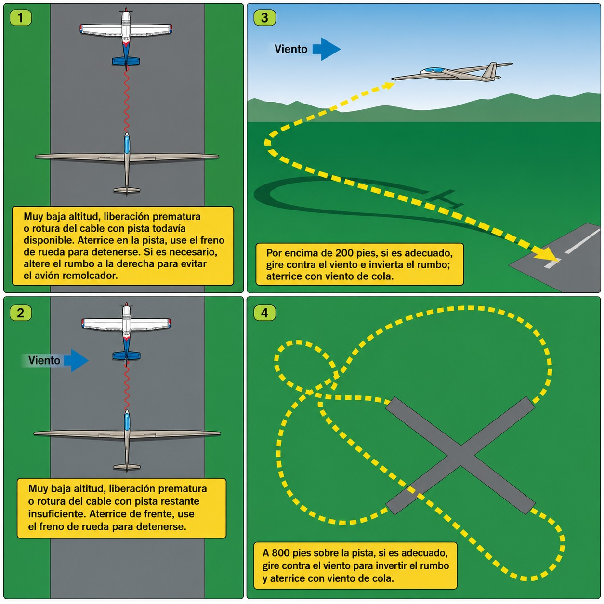
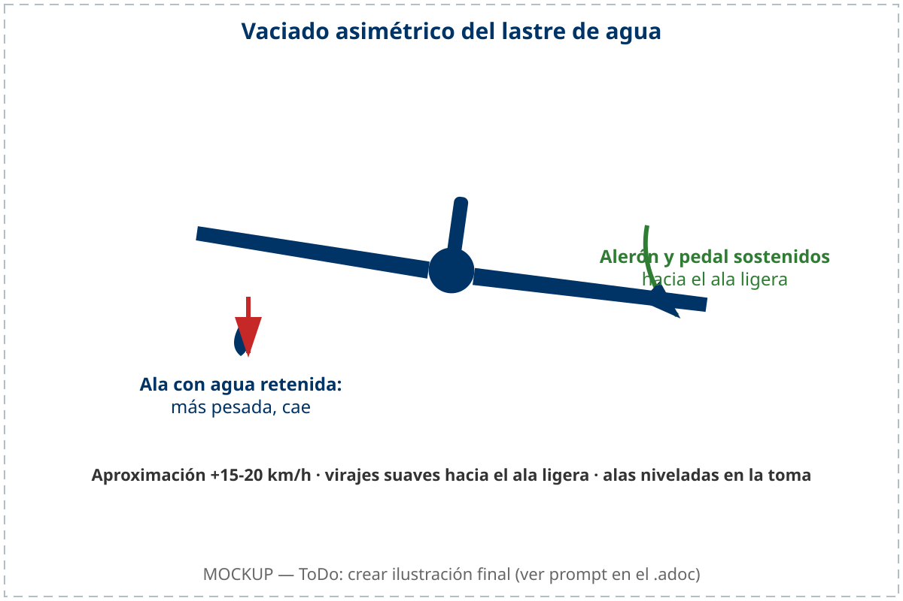

# Procedimientos de emergencia

Las emergencias en vuelo no se gestionan con improvisación: se gestionan con entrenamiento. La diferencia entre una emergencia que termina con el planeador en tierra y los tripulantes ilesos, y una que termina en accidente, suele medirse en uno o dos segundos de reacción y en si el procedimiento correcto estaba automatizado o no. Este capítulo describe las emergencias más frecuentes en el vuelo sin motor y el procedimiento exacto para cada una.

En este capítulo aprenderás:

* **Emergencias en el lanzamiento**: cómo actuar ante una rotura de cable, un fallo de remolque o una suelta atascada (**towhook jam**).
* **Fuego a bordo**: procedimiento en planeadores motorizados y gestión de la evacuación de humos.
* **Fallos estructurales y de mandos**: qué hacer cuando un mando no responde, ante vibraciones anormales o desequilibrios de lastre.
* **Fallo de instrumentos y sistemas**: cómo responder a la obstrucción de tomas de presión y a la apertura accidental de la cúpula en vuelo.

## Emergencias en el lanzamiento

La fase de lanzamiento concentra el mayor riesgo del vuelo de planeador. La combinación de baja altura, alta velocidad de aceleración y dependencia de un sistema externo —el cable de torno o el avión remolcador— crea una ventana de vulnerabilidad en la que cualquier fallo exige una respuesta **instintiva, inmediata y sin vacilación**.

La regla de oro universal ante cualquier emergencia en el lanzamiento es:

* **Primero:** bajar el morro a actitud de planeo para recuperar velocidad y evitar la pérdida.
* **Segundo:** soltar el cable (si no se ha soltado automáticamente).
* **Tercero:** evaluar la altura disponible y decidir la opción de aterrizaje.

Este orden de prioridades es invariable. No importa cuál sea la emergencia específica: la velocidad siempre es el primer recurso que hay que asegurar.

### Rotura de cable o fallo de remolque

Ante un **** —rotura del cable de torno o fallo del motor del remolcador—, la reacción del piloto debe ser inmediata y automatizada. La metodología internacional estructura la respuesta de emergencia en torno a la mnemotecnia de **las 3 P**:

1. **Palanca:** empuja la palanca de mando adelante de inmediato (morro abajo) para estabilizar el planeador en actitud de planeo normal. En la actitud empinada de ascenso, la velocidad cae drásticamente y un retraso de más de dos segundos en bajar el morro causará una pérdida inminente.
2. **Pulsador:** tira de la anilla de suelta del cable con fuerza dos o tres veces. Así te aseguras de que el cable roto se desengancha por completo del planeador y no arrastras restos que puedan engancharse en obstáculos del terreno (vallas, cultivos) durante la aproximación.
3. **Pensar:** evalúa la altura disponible, la pista restante y el viento para ejecutar la decisión correspondiente en décimas de segundo.

La toma de decisiones táctica depende directamente de la altura AGL alcanzada en el momento del fallo y del método de lanzamiento utilizado, ya que la velocidad de ascenso y la distancia horizontal a la pista difieren drásticamente entre el torno y el avión tractor ():

* **En lanzamiento por torno (** la trayectoria de trepada es muy empinada y el planeador gana altura muy cerca del inicio de la pista. Las franjas de decisión de seguridad son:
* **Baja altura (menos de 150 m AGL):** mantén el planeador recto por derecho, estabiliza la velocidad de planeo de seguridad y aterriza en la pista restante o en los campos de parada libre al frente. **Está terminantemente prohibido intentar virar de vuelta a pista por debajo de esta cota** debido a la alta actitud de morro y el peligro inminente de barrena.
* **Altura crítica (entre 150 m y 200 m AGL):** si no queda suficiente pista por delante, vuela a velocidad segura y realiza un circuito abreviado y muy recortado. Vira inicialmente con un alabeo coordinado medio (máximo 30°), adaptándolo al viento reinante para asegurar el tramo final de cara al viento.
* **Altura de seguridad (más de 200 m AGL):** estabiliza la velocidad de planeo y realiza un circuito de tráfico abreviado estándar.
* **En remolque por avión (** el despegue es más tendido y el planeador se desplaza horizontalmente lejos de la pista de salida. Las franjas de decisión son:
* **Baja altura (menos de 70 m, ≈230 ft AGL):** aterriza recto por delante en la pista restante o en campos libres al frente, esquivando obstáculos con pequeños cambios de rumbo (máximo 30°).
* **Altura crítica (entre 70 m ≈230 ft y 150 m ≈490 ft AGL):** evalúa la longitud de pista y el viento. Si es necesario retornar, inicia el viraje **hacia la componente de viento cruzado**, coordinado y con un alabeo franco de unos 45°: el viento te devuelve hacia la prolongación de la pista durante el giro, mientras que virar a favor del viento alarga el recorrido y la altura perdida. Si el retorno no sale a cuenta, realiza una aproximación recortada al campo alternativo más seguro.
* **Altura de seguridad (más de 150 m ≈ 500 ft AGL):** realiza un circuito recortado o normal de aproximación.

{#fig-06-cap07-emergencia-altura}

::: {.callout-note}
⚓ **AIRMANSHIP / BUENAS PRÁCTICAS: LA DECISIÓN DE ATERRIZAR FUERA**

Ante un fallo de lanzamiento a altura crítica, **un aterrizaje fuera de los límites del aeródromo (aterrizaje forzoso recto por delante) es siempre preferible a intentar un viraje de retorno forzado a baja altura**. Forzar el viraje para "salvar" el planeador y volver a la pista es la causa principal de pérdidas y barrenas fatales.
:::

 

::: {.callout-warning}
⚠ **SEGURIDAD: «LA MANIOBRA IMPOSIBLE»**

Intentar regresar al aeródromo virando 180° a baja altura —lo que en aviación se conoce como «la maniobra imposible»— es la causa documentada de la mayoría de los accidentes graves en el despegue. La geometría del planeo no lo permite: el viraje a baja altura consume una energía y altura que no existen. **Si estás por debajo de la altura crítica establecida (150 m en torno y 70 m en avión) y no hay espacio de pista por delante, aterriza recto en campo abierto. ¡Siempre!**
:::

### Fallo de suelta / gancho atascado (*towhook jam*)

Si durante un remolque por avión intentas soltarte y la anilla de suelta no responde (el cable permanece enganchado), te encuentras ante un ****. Es una emergencia coordinada de alta prioridad que requiere una señalización visual estandarizada para comunicarte con el piloto del remolcador.

Aplica de inmediato el siguiente procedimiento:

1. **Señala la emergencia:** avisa al remolcador por radio o, si no responde, desplázate a una posición **baja y al lado izquierdo** del remolcador y balancea las alas de forma repetida y pronunciada. Nunca te eleves por encima de la posición normal de remolque para llamar la atención: subir tira de la cola del remolcador hacia arriba (**kiting**) y puede clavar su morro contra el suelo. Es la emergencia más letal que existe para el piloto remolcador.
2. **Respuesta del remolcador:** el piloto del avión remolcador, al ver tu señal, intentará activar su propia suelta para liberar el cable desde su lado.
3. **Liberación del cable:** si el remolcador logra soltar el cable, regresarás al aeródromo con el cable de remolque colgando del gancho de tu planeador.
4. **Aproximación y aterrizaje con cable:** cuando vueles de regreso con el cable colgando (que suele tener entre 50 y 60 metros de longitud), planifica una aproximación final significativamente más alta de lo habitual. Es crítico para garantizar que el cable colgante libre con seguridad cualquier obstáculo previo a la pista (vallas del aeródromo, setos, carreteras, cables telefónicos o de alta tensión).
5. **Si el remolcador tampoco puede soltar:** en el caso extremo de que ambos ganchos estén atascados, deberás realizar un descenso y aterrizaje coordinado y simultáneo en formación con el avión remolcador, siguiendo las instrucciones de radio.

::: {.callout-warning}
⚠ **SEGURIDAD**

Cuando vueles una aproximación con el cable colgando, **bajo ninguna circunstancia realices una aproximación baja**. El cable podría engancharse en una valla o línea eléctrica antes del umbral de la pista, lo que provocaría una deceleración violenta y un impacto del planeador contra el suelo sin control (**pitch-up** o pérdida instantánea). Mantén un margen de altura generoso hasta superar el umbral.
:::

## Fuego a bordo

En planeadores motorizados (**Motorsegler**) o autolanzables, el incendio es una amenaza de gravedad extrema. Los materiales compuestos de la estructura —carbono, fibra de vidrio, resinas— generan humos altamente tóxicos que pueden incapacitar al piloto en menos de treinta segundos.

La prioridad es triple y simultánea: **eliminar el combustible**, **limpiar la cabina de humo** y **aterrizar de inmediato**.

1. **Motor:** corta el encendido, cierra las válvulas de combustible y desconecta el sistema eléctrico para eliminar posibles arcos que realimenten el fuego.
2. **Ventilación:** si el humo no es denso, abre las tomas de aire de cabina para dirigir el flujo de humo hacia fuera. Si el humo es denso e irrespirable, considera desmontar la cúpula en vuelo para crear ventilación forzada.
3. **Aterrizaje:** aterriza de inmediato en el campo más cercano. No intentes llegar al aeródromo si eso retrasa la toma en varios minutos. Un planeador con fuego activo no es un planeador seguro.

::: {.callout-note}
⚓ **AIRMANSHIP / BUENAS PRÁCTICAS**

Familiarízate con la posición de las válvulas de combustible y el extintor de tu planeador motorizado antes del primer vuelo. Una emergencia de fuego no deja tiempo para buscar manuales ni para recordar dónde están los controles de emergencia. La memoria muscular se entrena en tierra, no en vuelo.
:::

## Fallos estructurales y de mandos

### Bloqueo o fallo de mandos

Un bloqueo parcial de mandos en vuelo —por un objeto suelto en la cabina, una rotura interna o un fallo mecánico— no implica necesariamente la pérdida de control total. Los planeadores modernos tienen superficies redundantes que pueden sustituirse parcialmente:

* **Bloqueo de alerones:** el timón de dirección (pedal) provoca un alabeo secundario por **efecto diedro** (*dihedral effect*): al guiñar, el ala adelantada gana incidencia y genera más sustentación, lo que induce un alabeo que puede permitirte nivelar las alas y realizar un aterrizaje controlado. La respuesta es menor que con alerones, pero existe.
* **Bloqueo de timón de profundidad:** el compensador de profundidad —si el planeador lo tiene— puede controlar el cabeceo. Ajusta la velocidad abriendo o cerrando aerofrenos.
* **Bloqueo total de mandos:** si ninguna superficie responde y el vuelo no es controlable, el procedimiento es el abandono de la aeronave (ver Capítulo 8: Paracaídas de emergencia).

### Flutter (vibración estructural)

El **** es una vibración aeroelástica autosustentada que se produce a altas velocidades, cuando la respuesta aerodinámica y la inercia estructural del ala o del timón entran en resonancia. No es un traqueteo suave: es una vibración explosiva que puede destruir la superficie afectada en cuestión de segundos.

Las causas más frecuentes son el exceso de velocidad —superar la V~NE~ (Velocidad Nunca Exceder) o aproximarse a ella en vuelo descendente—, el daño estructural previo o el mal equilibrado de una superficie de control tras una reparación.

::: {.callout-warning}
⚠ **SEGURIDAD: **

Si experimentas una vibración fuerte y descontrolada, **reduce la velocidad de inmediato**: sube el morro suavemente y abre los aerofrenos para frenar aerodinámicamente. El *flutter* solo ocurre a altas velocidades y puede destruir el planeador en segundos. Nunca intentes aumentar la velocidad para «salir» de una vibración: es la acción exactamente contraria a lo que necesitas. Tras cualquier episodio de vibración anormal, el planeador debe ser inspeccionado por un técnico antes de volar de nuevo.
:::

### Fallo de instrumentos de vuelo (Pitot o Estática)

El bloqueo de las tomas de presión de tu planeador (normalmente debido a agua de lluvia condensada, insectos o por haber olvidado retirar las fundas prevuelo) altera por completo las indicaciones del panel de instrumentos. Debes saber identificar qué toma está obstruida y cómo volar de forma segura sin referencias instrumentales fiables.

* **Fallo del tubo de Pitot (presión total):**
* **Síntoma:** el anemómetro cae a cero en vuelo nivelado, o bien se comporta de forma invertida, actuando como un altímetro (la velocidad indicada aumenta al subir y disminuye al descender).
* **Técnica de vuelo:** vuela de forma puramente visual controlando la **actitud de cabeceo** respecto al horizonte. Sintoniza el **sonido del viento** alrededor de la cabina (abre ligeramente la ventanilla lateral de tormenta o las ventilaciones para familiarizarte con el tono correspondiente a la velocidad de planeo óptimo). Presta atención al **tacto y resistencia de los mandos** (a menor velocidad, la palanca se siente más blanda y con menos respuesta).
* **Fallo de las tomas de presión estática:**
* **Síntoma:** el altímetro se congela en un valor fijo y el variómetro se queda a cero, sin responder a los ascensos o descensos. El anemómetro también dará indicaciones erróneas debido a la presión estática atrapada en las tuberías instrumentales.
* **Técnica de vuelo:** si tu planeador dispone de una toma de **presión estática alterna** en cabina, conéctala mediante la válvula correspondiente.

::: {.callout-note}
⚓ **AIRMANSHIP / BUENAS PRÁCTICAS**

En caso de fallo instrumental completo en circuito de tráfico, confía plenamente en tu estimación visual del ángulo de planeo respecto al punto de toma. Mantén una actitud de morro conservadora, previene el pérdida asegurando una buena corriente de aire (sonido del viento consistente en cabina) y no intentes corregir visualmente basándote en un anemómetro que sabes bloqueado.
:::

### Apertura involuntaria de la cúpula en vuelo

Si la cúpula de tu planeador no quedó correctamente pestillada en los chequeos prevuelo (lista `CB-SIFT-CBE`), puede abrirse repentinamente en vuelo debido a las fuerzas aerodinámicas o a las turbulencias. Esto suele ocurrir durante la fase de remolque o poco después de la suelta. El ruido del viento y el torbellino de aire repentino dentro de la cabina pueden provocar pánico e inducir al piloto a cometer errores graves.

El procedimiento de seguridad exige las siguientes acciones inmediatas:

1. **Vuela el planeador primero (** tu prioridad absoluta es mantener el control de la aeronave. Ignora la cúpula por completo en los primeros segundos. **No intentes cerrarla ni sujetarla** si estás a baja altura o en pleno viraje: perderías la atención al pilotaje y podrías inducir una actitud inusual o una pérdida. Tu planeador puede seguir volando perfectamente con la cúpula abierta.
2. **Resiste el ruido y el torbellino:** el ruido será ensordecedor y habrá objetos sueltos volando en cabina, pero el planeador seguirá volando perfectamente. Si llevas gafas de sol y cinturones de seguridad bien ajustados, estarás seguro.
3. **Establece una senda de planeo más pronunciada:** una cúpula abierta o parcialmente desprendida genera un **incremento masivo de la resistencia aerodinámica** (**drag**). Tu ángulo de planeo se deteriorará considerablemente. Para mantener la velocidad de seguridad, deberás adoptar una actitud de morro más baja (senda de aproximación más pronunciada y mayor tasa de descenso).
4. **Planifica el aterrizaje:** si estás en el despegue, continúa el remolque estabilizado hasta una altura segura si es posible, o suelta y haz un circuito normal. Vuela un circuito de tráfico adaptado a una mayor tasa de descenso y aterriza en el aeródromo lo antes posible. Solo intenta cerrar la cúpula si estás a gran altura de seguridad, en vuelo coordinado y con una sola mano, sin dejar de pilotar.

::: {.callout-warning}
⚠ **SEGURIDAD**

Nunca dejes de pilotar para intentar sujetar o cerrar una cúpula que se abre en circuito o a baja altura. Muchos accidentes mortales se han producido porque el piloto soltó la palanca de mandos para agarrar la cúpula con ambas manos, entrando el planeador en pérdida y barrena incontrolada o levantando la cola del remolcador y estrellándolo contra el suelo. Deja que la cúpula flote o se desprenda si es necesario; ¡concéntrate únicamente en volar!
:::

### Vaciado asimétrico del lastre de agua (*asymmetrical water ballast*)

El uso de lastre de agua (**water ballast**) en las alas mejora el rendimiento a altas velocidades en vuelo de travesía. Sin embargo, si al iniciar el vaciado (**dumping**) una de las válvulas de las alas se bloquea o tiene fugas, el planeador sufrirá un vaciado asimétrico. Esto genera un desequilibrio de peso lateral considerable, con un ala mucho más pesada que la otra.

El piloto debe gestionar esta asimetría aplicando la siguiente técnica:

* **Efecto en el control:** el planeador tenderá a alabear con fuerza hacia el lado del ala que conserva el agua. Necesitarás aplicar una presión constante y significativa de alerón y timón de dirección (mando cruzado continuo) para mantener las alas niveladas, lo que reduce la efectividad del control lateral restante.
* **Velocidad de aproximación más alta:** incrementa tu velocidad de aproximación estándar en al menos **15-20 km/h** por encima de la velocidad calculada para el circuito. La velocidad adicional es indispensable para que los alerones conserven la autoridad necesaria para contrarrestar la tendencia al alabeo del plano pesado, y para prevenir una pérdida de ala (**tip stall**) en el ala cargada durante los virajes.
* **Planificación del circuito:** evita virajes pronunciados (alabeo máximo de 15° a 20°). Realiza giros suaves y coordinados hacia el circuito de tráfico. Siempre que sea posible, planifica los virajes hacia el lado del ala ligera: virar hacia el lado del ala pesada dificulta la recuperación del alabeo.
* **Aterrizaje con alas niveladas:** durante la recogida y la toma de tierra, tu objetivo prioritario es mantener las alas perfectamente niveladas en el momento del contacto. Toca primero con el tren principal y, una vez en el suelo, haz todo lo posible para evitar que el ala cargada de agua caiga y toque el terreno mientras el velero aún se desplaza a gran velocidad: provocaría un caballito (**ground loop**) violento ().

{#fig-06-cap07-lastre-asimetrico}

::: {.callout-warning}
⚠ **SEGURIDAD**

Un ala cargada con decenas de litros de agua tiene una velocidad de pérdida muy superior al ala vacía. En caso de vaciado asimétrico, si permites que la velocidad caiga demasiado en el tramo final o en el viraje de base, el ala pesada entrará en pérdida de forma asimétrica y repentina, provocando una barrena (**spin**) instantánea e irrecuperable a baja altura. Mantener la velocidad recomendada en circuito es tu defensa absoluta.
:::

 

::: {.callout-important}
⚖ **NORMATIVA**

Las alturas de decisión que aparecen en este capítulo (150 y 200 m en torno; 70 y 150 m en remolque) y la escalera de decisión del aterrizaje fuera de campo son **valores formativos de referencia**, no cifras normativas: la cota crítica real de cada planeador la fijan su AFM y las instrucciones locales del campo (longitud de pista, obstáculos, viento habitual). Apréndelas como orden de magnitud y ajústalas a tu aeronave y a tu aeródromo con tu instructor.
:::

 

Como ficha de repaso rápido, esta tabla resume la respuesta inmediata a cada emergencia del capítulo (el detalle está en cada apartado):

| Situación | Acción inmediata |
| --- | --- |
| Rotura de cable (cualquier método) | Baja el morro para recuperar velocidad; luego suelta y decide según la altura. |
| Fallo de suelta / gancho atascado | Sitúate bajo y a la izquierda del remolcador y alabea; nunca por encima (**kiting**). |
| Fuego a bordo | Corta el circuito eléctrico o el combustible según el origen; aterriza cuanto antes. |
| Bloqueo de mandos | Sustituye el mando perdido (diedro con alabeo, cabeceo con trim + aerofrenos). |
| Flutter | Sube el morro y abre aerofrenos para frenar de inmediato; nunca aceleres. |
| Fallo de pitot / estática | Vuela por actitud visual y sonido del aire; ignora el instrumento afectado. |
| Apertura de cúpula en vuelo | Vuela primero el planeador; baja el morro; no intentes cerrarla si estás bajo. |
| Vaciado asimétrico del lastre | +15-20 km/h en circuito, virajes suaves hacia el ala ligera, alas niveladas al tocar. |

: Síntoma → acción inmediata en las emergencias del capítulo

**Resumen del Capítulo: Procedimientos de emergencia**

* **Regla universal**: ante cualquier emergencia en el lanzamiento, lo primero siempre es **bajar el morro** para recuperar velocidad y evitar la pérdida. Después, suelta el cable y decide.
* **Rotura de cable según el método de lanzamiento**:
  
  * **Torno (**:
  * **< 150 m**: aterriza recto por derecho. No intentes virar.
  * **150 - 200 m**: circuito abreviado recortado adaptado al viento.
  * **> 200 m**: circuito de tráfico normal.
  * **Avión (**:
  * **< 70 m**: aterriza recto por delante.
  * **70 - 150 m**: retorno o circuito recortado (el viraje de retorno se inicia hacia el viento cruzado, con alabeo franco de unos 45°).
  * **> 150 m**: circuito abreviado o normal.
* **«La maniobra imposible»**: intentar volver a pista a baja altura es letal. Si estás por debajo de la cota crítica (150 m en torno / 70 m en avión) y no hay pista, aterriza de frente.
* **Fallo de gancho (aerotow)**: si no puedes soltar, sitúate **bajo y a la izquierda** del remolcador y alabea para avisarle; nunca por encima, que le levantarías la cola (**kiting**). Él soltará. Aterriza con el cable colgando planeando una final alta para librar vallas y obstáculos.
* ****: ante una vibración destructiva, **sube el morro y abre los aerofrenos** para reducir la velocidad de inmediato. Nunca aceleres. Inspección obligatoria en tierra.
* **Fallos de instrumentos**: con el pitot bloqueado, vuela por actitud visual de cabeceo y por el sonido del viento en cabina.
* **Apertura de cúpula**: vuela el planeador primero (**Aviate**). No intentes cerrarla si estás bajo. Baja el morro para contrarrestar el aumento de resistencia.
* **Lastre asimétrico**: vuela 15-20 km/h más rápido en circuito para mantener la efectividad de los alerones y mantén las alas niveladas al tocar el suelo.
