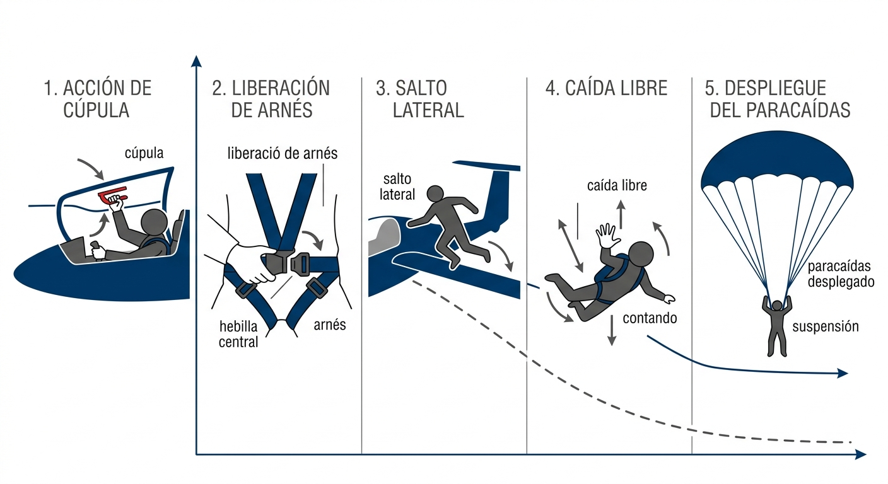

# Uso y aterrizaje con paracaídas de emergencia

El **paracaídas de emergencia** es el último recurso del piloto cuando el planeador ha dejado de ser un medio de transporte seguro. No es un equipo que se usa «por si acaso»: se usa cuando la alternativa es morir dentro de la aeronave. Entender cuándo la situación justifica el salto, cómo ejecutar la secuencia de abandono y cómo gestionar el descenso y la toma marcan la diferencia entre sobrevivir y no hacerlo. Además, este capítulo cubre el mantenimiento correcto del paracaídas: un equipo descuidado es un equipo que puede no abrirse.

En este capítulo aprenderás:

* **La decisión de saltar**: en qué situaciones el abandono del planeador es la única opción correcta.
* **La altura mínima de abandono**: por qué 150 metros es el umbral que no puede reducirse.
* **El procedimiento de salto**: la secuencia exacta de cinco pasos para abandonar la cabina.
* **El descenso y la toma de tierra**: cómo aterrizar con paracaídas, con viento y ante obstáculos.
* **El mantenimiento del paracaídas**: cuidados, almacenamiento y caducidad de la inspección.

## La decisión de abandono (*bail-out*)

El **abandono del planeador** (**bail-out**) es una decisión que se toma cuando el planeador ha dejado de ser controlable y ya no existe alternativa de aterrizaje seguro. Las situaciones que justifican el bail-out son:

* **Fallo estructural:** rotura de un elemento portante —ala, fuselaje, timón— que hace al planeador ingobernable.
* **Colisión en vuelo:** daños que impiden el vuelo controlado.
* **Incendio irrefrenable:** fuego que no se extingue y hace la cabina inhabitable.
* **Pérdida de control irrecuperable:** barrena (**spin**) o espiral descontrolada de la que no es posible salir con los medios disponibles.

La clave psicológica del bail-out es entender que **si el planeador aún vuela de forma controlada, el piloto debe quedarse dentro**. Un planeador con mandos parciales, un fallo de motor en un autolanzable o un vuelo degradado por engelamiento no justifican el salto: esas situaciones se gestionan buscando el aterrizaje más próximo. El paracaídas solo es la solución cuando el planeador ya no es una solución.

### Altura mínima de abandono

Se recomienda iniciar el abandono con un mínimo de **150 metros** sobre el terreno. Esta cifra no es arbitraria:

* Un paracaídas de emergencia necesita entre 50 y 90 metros para abrirse completamente desde el momento en que se acciona la anilla.
* El proceso de abandono —desmontar la cúpula, soltar cinturones, saltar y alejarse del planeador— consume entre 5 y 10 segundos adicionales.
* Con 150 metros de altura disponibles y un proceso de abandono que consume los primeros 100 metros, quedan apenas 50 metros de margen de seguridad antes de tocar tierra.

Por debajo de 150 metros, el paracaídas puede no tener tiempo suficiente para abrirse completamente. Por encima de 500 metros, el salto ofrece un margen de seguridad mucho mayor.

::: {.callout-warning}
⚠ **SEGURIDAD**

En una barrena o espiral descontrolada, las fuerzas G pueden ser muy elevadas —hasta 3-4 G centrífugos— y dificultar enormemente la salida de la cabina. Actúa con decisión y rapidez: cada segundo de demora es altura que se pierde. Si las fuerzas G te impiden moverte, aprovecha el instante de menor G al inicio de cada rotación para empujar la cúpula y saltar.
:::

## Procedimiento de salto

La secuencia estándar para abandonar la cabina debe practicarse en tierra hasta convertirla en un acto reflejo. Los cinco pasos son (@fig-06-cap08-secuencia-salto):

1. **Desmontar la cúpula:** acciona la palanca de emergencia de la cúpula (normalmente roja o amarilla) y empújala hacia fuera con fuerza. La cúpula puede resistir por la presión dinámica del aire: empuja desde el borde de salida hacia adelante, no directamente hacia arriba.
2. **Soltar los arneses:** abre la hebilla central de los cinturones de seguridad. En la mayoría de los planeadores modernos, una sola palanca libera todos los arneses simultáneamente.
3. **Saltar:** salta hacia el **lado interior de la rotación** si el planeador gira (donde la velocidad relativa es menor), o por el lateral más despejado de obstáculos. Empuja con fuerza para alejarte del fuselaje y, especialmente, de la cola del planeador: el estabilizador horizontal puede golpearte al saltar.
4. **Separación del planeador:** cuenta «**mil uno, mil dos, mil tres**» para asegurarte de estar completamente separado del planeador antes de abrir el paracaídas. Si el paracaídas se abre mientras todavía estás junto al planeador, la campana puede engancharse en la estructura.
5. **Apertura del paracaídas:**
  
  * **Manual:** tira con fuerza de la anilla de apertura, la D metálica situada normalmente a la altura del pecho en el **lado izquierdo** del arnés: se tira con la mano derecha, cruzando el brazo. Localízala en tu propio equipo antes de cada vuelo. No sueltes la anilla: guárdala en la mano para que no sea un proyectil si hay otra persona cerca.
  * **Automático (cinta estática):** el paracaídas se abre automáticamente cuando el cable de apertura unido al planeador alcanza su extensión máxima. No es necesario tirar de nada.

{#fig-06-cap08-secuencia-salto}

::: {.callout-warning}
⚠ **SEGURIDAD**

Asegúrate de estar completamente separado del planeador antes de tirar de la anilla. Si la campana se abre junto al planeador, puede engancharse en el estabilizador, el fuselaje o las superficies de control, impidiendo una apertura completa.
:::

## Descenso y toma de tierra

Una vez abierto el paracaídas, el piloto desciende a una velocidad vertical de aproximadamente 5-7 m/s —equivalente a saltar al suelo desde una altura de 1,5 metros—. Es una toma de tierra que exige una preparación física y mental precisa para evitar lesiones.

### Direccionamiento de la campana en el aire

Muchos pilotos creen erróneamente que un paracaídas de emergencia redondo o cuadrado no ofrece ningún tipo de control. Aunque no permite un planeo controlado como una campana de salto deportivo, **sí es posible girar la campana en el aire para orientarse cara al viento**:

* **Técnica:** agarra con fuerza las líneas de suspensión traseras o las bandas de las hombreras (del arnés). Si tiras hacia abajo de la banda de la hombrera derecha, la campana girará hacia la derecha; si tiras de la izquierda, rotará a la izquierda.
* **Aterrizar cara al viento:** utiliza esta capacidad de giro para orientarte de cara al viento dominante durante el descenso final. Al tomar tierra de cara al viento minimizas la velocidad horizontal sobre el suelo (deriva lateral), lo que reduce drásticamente la inercia del impacto y la probabilidad de sufrir fracturas o esguinces.

### Posición de aterrizaje estándar

* Junta las piernas y mantén las rodillas ligeramente flexionadas.
* Mantén los pies paralelos y juntos, apuntando ligeramente hacia abajo.
* Al tocar el suelo, rueda inmediatamente hacia un lado para disipar la energía del impacto en cinco puntos sucesivos (pie, pantorrilla, muslo, cadera y hombro) en lo que en paracaidismo se conoce como el **PLF** (**Parachute Landing Fall**): la técnica de rodamiento de aterrizaje.

### Viento fuerte y arrastre

Con viento fuerte, el paracaídas continuará inflado y tirando tras la toma, pudiendo arrastrar al piloto por el suelo. Para colapsar la campana y detener el arrastre:

* **Tira de los cordones inferiores:** agarra y tira con fuerza de las líneas de suspensión que están en contacto con el suelo (el borde trasero de la campana) para deshinchar el paracaídas e impedir que el aire vuelva a hincharlo.
* **Sistema de suelta rápida:** si tu arnés dispone de hebillas de liberación rápida de la campana (**canopy quick-release**), actívalas inmediatamente después del contacto con el suelo.

### Aterrizaje con obstáculos

* **Árboles:** cruza las piernas con fuerza para proteger la ingle, y protege tu cara y cabeza con los brazos cruzados. Los árboles amortiguan el impacto, pero crean riesgo de heridas penetrantes por ramas.
* **Agua:** prepara la suelta durante el descenso (localiza las hebillas y afloja lo que puedas sin comprometer la sujeción) y **libera el arnés en el momento del contacto con el agua**, no antes: la estimación visual de la altura sobre una superficie de agua es muy engañosa y soltar prematuramente puede significar una caída libre desde mucho más alto de lo que crees. Una vez en el agua, aléjate nadando de la campana empapada para no quedar atrapado bajo ella.
* **Líneas eléctricas:** si vas a caer sobre una línea eléctrica, junta los pies y mantén brazos y piernas recogidos para minimizar el área de contacto, y sobre todo **no puentees dos conductores a la vez** con el cuerpo, la campana o las cuerdas. No te confíes por tocar un solo cable: el contacto con un único conductor también es letal si existe un camino a tierra —y con una campana y unas cuerdas húmedas rozando otro cable, la estructura o el suelo, ese camino casi siempre existe. La única defensa es minimizar el contacto y no crear un puente entre conductores.

## Inspección y mantenimiento del paracaídas

El paracaídas es un equipo de supervivencia que requiere cuidados específicos y revisiones periódicas obligatorias. Un paracaídas mal mantenido puede simplemente no abrirse —o abrirse de forma parcial— en el momento crítico.

* **Plegado y revisión periódica:** un técnico certificado debe plegarlo (**packed**) y revisarlo con la periodicidad marcada en la tarjeta de inspección, normalmente cada **6 o 12 meses según el fabricante**, y siempre tras cada uso.
* **Almacenamiento:** guárdalo siempre en un lugar seco y fresco, dentro de su bolsa de transporte. La humedad hace que los cordones y la tela se peguen entre sí, impidiendo una apertura limpia.
* **Radiación UV:** evita la exposición directa al sol. La radiación UV degrada el nailon de la campana y los cordones, y reduce la resistencia a la tracción de forma progresiva e invisible.
* **Sudor y contaminantes:** usa siempre una funda o cobertor de paracaídas durante el vuelo para protegerlo del sudor, el calor de la espalda y posibles derrames de combustible o aceite.

::: {.callout-warning}
⚠ **SEGURIDAD**

Nunca vueles con un paracaídas cuya tarjeta de inspección esté caducada, aunque sea por un solo día. Del mismo modo, si el paracaídas ha estado expuesto a humedad intensa, a productos químicos (gasolina, aceites, disolventes) o a cualquier impacto mecánico, debe ser inspeccionado por un técnico antes de volver a usarlo. La tarjeta de inspección en vigor no es una formalidad burocrática: es la única garantía objetiva de que el equipo funciona.
:::

**Resumen del Capítulo: Paracaídas de emergencia**

* **Cuándo saltar**: solo cuando el planeador es irrecuperable: fallo estructural, colisión en vuelo, fuego incontrolable o barrena irrecuperable. Si el planeador vuela de forma controlable, quédate dentro.
* **Altura mínima**: 150 m AGL. Por debajo de esta cota, el paracaídas puede no tener tiempo suficiente para abrirse del todo.
* **Secuencia de salto**: (1) desprender la cúpula, (2) soltar los arneses, (3) saltar alejándote de la cola por el interior del giro, (4) contar «mil uno, mil dos, mil tres», (5) tirar de la anilla (en paracaídas manuales).
* **Descenso y toma de tierra**: gira la campana en el aire tirando de las bandas de las hombreras para **aterrizar cara al viento** y reducir el impacto horizontal. Adopta la posición PLF (pies y rodillas juntos y flexionados) y rueda al tocar el suelo. Con viento, tira de los cordones inferiores para colapsar la campana.
* **Mantenimiento**: plegado e inspección obligatorios cada 6-12 meses según el fabricante, por un técnico certificado. Protégelo de la radiación UV, la humedad y los contaminantes químicos. Es tu último recurso: cuídalo.
