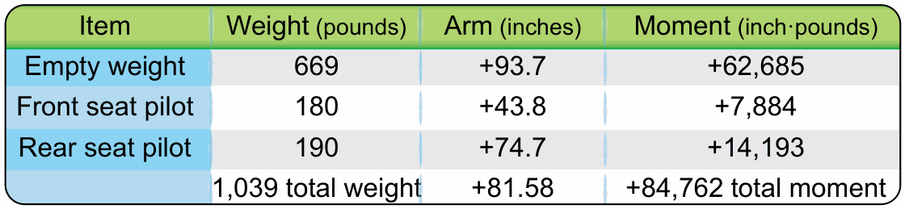
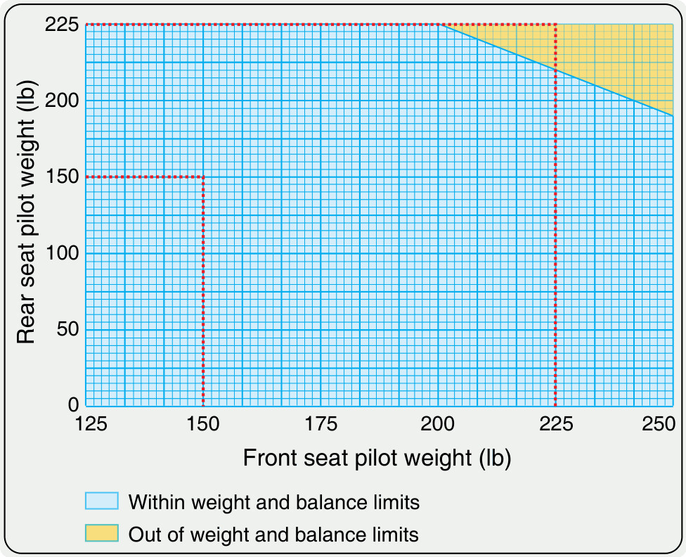

# Masa y centro de gravedad

> La masa y el centrado son los cimientos de la seguridad de cada vuelo. Los números que apuntas en el hangar tienen consecuencias físicas muy concretas: de ellos depende que el planeador responda como un guante o que se convierta en una máquina imprevisible.
>
>
> En este capítulo aprenderás:
>
>
> * **El centro de gravedad y la estabilidad**: por qué un CG atrasado puede hacer una barrena irrecuperable y qué precio pagas por un CG adelantado.
> * **El cálculo de masa y centrado**: la línea de referencia (**datum**), el brazo de palanca y el momento, con un ejemplo numérico como el del examen.
> * **La gestión del MTOW**: qué le ocurre al planeador cuando lo sobrecargas.
> * **El lastre de agua y el lastre de cola**: cuándo te ayudan y cómo gestionarlos con seguridad.

## Centro de gravedad (CG) y estabilidad

El centro de gravedad es el punto donde se concentra todo el peso del planeador. De su posición respecto al centro de presiones depende la estabilidad longitudinal: dónde esté el CG decide cómo responde el avión a la palanca.

### El peligro del CG atrasado

Tener el CG cerca del límite posterior es la condición más crítica en un planeador. El avión se vuelve muy sensible al mando de profundidad y tiende a subir el morro por sí solo, obligándote a volar con el compensador adelantado. El verdadero problema, sin embargo, aparece en la pérdida: con un CG excesivamente atrasado, el planeador puede entrar en barrena plana, o el timón de profundidad puede quedarse sin autoridad para bajar el morro y recuperar velocidad. En el peor de los casos, la barrena no se recupera.

¿Cómo se llega a esa situación? Casi siempre por una de estas tres vías: volar por debajo del peso mínimo del asiento delantero (pilotos ligeros), olvidar puesto el soporte de cola (*dolly*) o instalar equipos pesados en la cola sin compensarlos.

::: {.callout-tip}
✦ **REGLA DE ORO**

Si pesas poco, usa lastre de plomo o pesas fijas. Nunca despegues sin comprobar que tu peso entra en el margen permitido para el asiento que ocupas.
:::

::: {.callout-note}
⚓ **AIRMANSHIP / BUENAS PRÁCTICAS**

El lastre de cabina debe ir siempre fijado mecánicamente en los soportes que el fabricante instala en el morro (planchas de plomo o pesas homologadas con su anclaje). Nunca improvises con sacos de arena, mochilas u objetos sueltos: en una turbulencia o en la rotación del despegue pueden desplazarse, bloquear los pedales o cambiar el centrado en el peor momento posible.
:::

### CG adelantado: estabilidad a cambio de rendimiento

Volar con el morro pesado es más seguro que volar con la cola pesada, pero tiene su precio. El planeador se vuelve tan estable que insiste en mantener el morro bajo, y tendrás que sujetar la palanca atrás para conservar la actitud de vuelo. Para que el morro no caiga, el timón de profundidad vuela deflectado hacia arriba, y esa deflexión añade una resistencia (*trim drag*) que empeora tu coeficiente de planeo. Hay un tercer efecto menos intuitivo: como la cola empuja hacia abajo, el ala necesita generar más sustentación para el mismo peso, así que la velocidad de pérdida efectiva aumenta. La @fig-07-cap01-limites-cg resume estos efectos de la posición del CG sobre la estabilidad longitudinal.

## Cálculo de masa y centrado

Saber que el CG atrasado es peligroso no basta. El examen y el vuelo real exigen saber dónde está el CG antes de despegar, y el cálculo se reduce a tres conceptos y una fórmula.

* **Línea de referencia (**: un plano vertical imaginario que el fabricante define en el manual de vuelo, habitualmente el borde de ataque del ala en el encastre. Todas las distancias se miden desde aquí.
* **Brazo de palanca (**: la distancia horizontal desde el *datum* hasta el punto donde actúa cada peso. Por convenio, positiva hacia atrás y negativa hacia delante.
* **Momento (**: el producto de cada peso por su brazo. Es la "fuerza de giro" que ese peso ejerce sobre el conjunto.

La posición del CG es la media ponderada de todos los momentos (@fig-07-cap01-datum-momento):

**CG = Σ Momentos / Σ Pesos**

{#fig-07-cap01-datum-momento}

### Ejemplo práctico de hoja de centrado

Imagina un monoplaza cuyo manual de vuelo da un rango de CG permitido de +0,25 m a +0,38 m detrás del *datum*:

| Elemento | Peso (kg) | Brazo (m) | Momento (kg·m) |
| --- | --- | --- | --- |
| Planeador en vacío (según ficha de pesaje) | 265 | +0,55 | +145,75 |
| Piloto + paracaídas | 85 | −0,45 | −38,25 |
| **Total** | **350** | — | **+107,50** |

: Ejemplo de hoja de centrado de un monoplaza

CG = 107,50 / 350 = **+0,31 m**, dentro del rango permitido.

Repite ahora el cálculo con un piloto de 60 kg. Su momento baja a −27,00 kg·m, el total queda en 325 kg y +118,75 kg·m, y el CG se va a +0,37 m, rozando el límite posterior: ese piloto necesita lastre en el morro antes de despegar. Fíjate en la lección del ejemplo: cuanto menos pesa el piloto, más atrás se va el CG, porque el asiento está por delante del *datum*.

Los pesos y brazos de partida salen de la **ficha de pesaje** oficial del planeador, que se actualiza tras cada pesada o reparación mayor. El procedimiento de pesado y la documentación asociada se estudian en el **Libro 8 — Conocimientos generales de la aeronave**, capítulo 4.

## Gestión de la masa: MTOW y sobrecarga

El peso máximo al despegue (MTOW, *Maximum Take-Off Weight*) no es una sugerencia: es un límite estructural. Un planeador pesado necesita más carrera de despegue y una velocidad de remolque mayor, típicamente 10-20 km/h extra. Volará más deprisa en crucero, sí, pero su régimen de ascenso en térmica se resiente. Y por encima del MTOW los márgenes desaparecen: el planeador sufre más con la turbulencia fuerte y los límites de factor de carga se alcanzan mucho antes, con el consiguiente riesgo de fatiga o de fallo estructural.

{#fig-07-cap01-limites-cg}

## Lastre de agua: rendimiento a cambio de disciplina

El agua permite "engañar" a la polar, pero exige una gestión impecable. Al aumentar la carga alar, el planeador alcanza velocidades de crucero mucho mayores con el mismo ángulo de planeo, y eso lo convierte en el arma ideal para días de térmicas potentes. La contrapartida es que el régimen de ascenso empeora: si las térmicas bajan de 1,5 m/s, el peso extra te hunde antes de que puedas subir.

Y una obligación que no admite descuidos: tira el agua antes de aterrizar. El peso adicional en la toma puede dañar seriamente el tren de aterrizaje y el fuselaje. El vaciado tarda entre 3 y 8 minutos según el planeador, así que planifícalo antes de entrar en el circuito de tráfico.

### El lastre de cola: el contrapeso inteligente

Muchos planeadores modernos llevan un pequeño depósito de agua en la deriva: el lastre de cola (*fin ballast* o *tail tank*). Su función no es añadir peso, sino recolocar el CG. Los tanques principales de las alas suelen quedar algo por delante del centro de gravedad, de modo que al llenarlos el CG se adelanta y aparece resistencia de compensación (*trim drag*). Unos pocos litros en la cola devuelven el CG a su posición óptima, cerca del límite posterior, donde la resistencia es mínima.

Dos reglas innegociables al usarlo:

* Calcula la proporción según el manual de vuelo: cada modelo especifica cuántos litros de cola corresponden a cada llenado de alas y a cada peso de piloto.
* Vacíalo siempre junto con las alas, o antes. Aterrizar con agua solo en la cola es volar con un CG atrasado extremo, exactamente la condición de barrena irrecuperable que viste al principio del capítulo. Verifica en la lista de chequeo que la cola drena correctamente.

::: {.callout-warning}
⚠ **SEGURIDAD**

Nunca aterrices con los tanques de agua llenos a menos que sea una emergencia absoluta. La energía del impacto aumenta drásticamente con el peso, y podrías romper el planeador de forma irreparable.
:::

## Ejercicios resueltos

Los dos cálculos que más caen en el examen de esta asignatura son el centrado y el planeo final. Aquí tienes uno de cada, resueltos paso a paso. Intenta hacerlos tú antes de leer la solución.

**Ejercicio 1 — Centrado con lastre de cola.**

Un monoplaza tiene un rango de CG permitido de +0,25 m a +0,38 m. Con las alas cargadas de agua, la hoja de centrado queda así: planeador + agua de alas = 380 kg con brazo +0,50 m; piloto + paracaídas = 80 kg con brazo −0,45 m. El manual permite añadir hasta 6 litros (6 kg) de lastre de cola con un brazo de +3,90 m. ¿Dónde queda el CG sin lastre de cola? ¿Y cuánto lo recoloca añadir los 6 litros?

**Solución.** Momento del planeador con agua: 380 × (+0,50) = +190,0 kg·m. Momento del piloto: 80 × (−0,45) = −36,0 kg·m. Sin lastre de cola: masa 460 kg, momento +154,0 kg·m, CG = 154,0 / 460 = **+0,335 m** (dentro de rango, pero adelantado respecto al óptimo, cerca del posterior).

Con 6 kg en la cola: momento adicional 6 × (+3,90) = +23,4 kg·m. Masa 466 kg, momento +177,4 kg·m, CG = 177,4 / 466 = **+0,381 m**. El lastre de cola ha llevado el CG de +0,335 a +0,381 m, justo en el límite posterior, donde la resistencia de compensación es mínima. Lección: unos pocos litros muy alejados del *datum* mueven el CG mucho (su brazo es enorme), y por eso hay que vaciarlos con las alas: solos, dejarían el CG fuera de rango por detrás.

**Ejercicio 2 — Planeo final con viento.**

Estás a 1.200 m sobre el terreno, a 18 km del aeródromo. Tu planeador tiene una fineza de 30 en aire en calma, pero soplan 20 km/h de viento de cara y vuelas el planeo a 100 km/h. ¿Llegas con la altura de seguridad de 300 m?

**Solución.** Con viento de cara, la fineza sobre el suelo cae en proporción a tu velocidad real de avance. A 100 km/h en el aire con 20 km/h de cara, avanzas sobre el suelo a 100 − 20 = 80 km/h, así que la fineza efectiva es 30 × (80 / 100) = **24**. Los 18 km de distancia exigen entonces 18 / 24 = 0,75 km = **750 m** de planeo puro. Partiendo de 1.200 m, al llegar sobre el campo te quedan 1.200 − 750 = **450 m**, por encima de los 300 m de seguridad: **llegas, con 150 m de margen.** Si el viento arreciara a 40 km/h, la fineza efectiva bajaría a 30 × (60 / 100) = 18, necesitarías 18 / 18 = 1.000 m y llegarías justo con 200 m: momento de subir una térmica más antes de comprometerte con el planeo final.

**Resumen del Capítulo: Masa y Centro de Gravedad**

* **CG atrasado**: es la condición más peligrosa. El avión se vuelve inestable (quiere subir el morro solo) y la recuperación de una pérdida o barrena puede ser imposible. Si eres ligero, usa lastre fijado mecánicamente, nunca improvisado.
* **CG adelantado**: el avión es muy estable (pesado de morro), pero menos eficiente por la resistencia del timón de profundidad deflectado, y con una velocidad de pérdida más alta.
* **Cálculo del CG**: CG = Σ Momentos / Σ Pesos. Cada peso se multiplica por su brazo (distancia al *datum*) y la suma de momentos se divide entre la masa total. Los datos de partida salen de la ficha de pesaje oficial.
* **Peso máximo (MTOW)**: un planeador sobrecargado necesita más pista para despegar, tiene una velocidad de pérdida mayor y sufre más fatiga estructural con menos Gs.
* **Lastre de agua**: permite volar más rápido con el mismo ángulo de planeo (ideal para días fuertes), pero empeora el régimen de ascenso en térmica. Y recuerda: el agua se tira antes de aterrizar.
* **Lastre de cola**: no añade rendimiento por sí mismo; recoloca el CG cuando llenas las alas. Vacíalo siempre junto con los tanques principales: agua solo en la cola equivale a un CG atrasado extremo.
