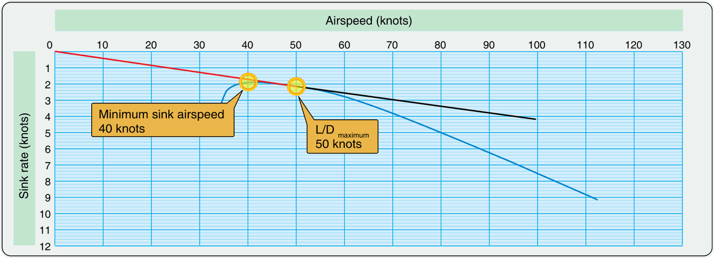
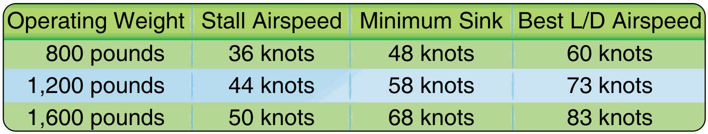
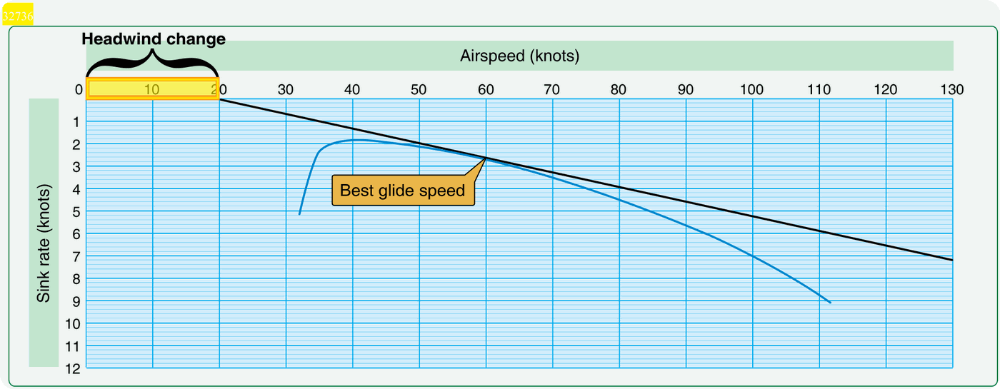

# Polar de velocidades de planeadores o velocidad de crucero

> Entender la polar de tu planeador es como conocer de memoria el mapa de potencia de un motor. En el vuelo sin motor, la gravedad es nuestro combustible y la aerodinámica nuestro acelerador. La polar te dice exactamente cuánto pagas en altura por cada kilómetro por hora de velocidad que ganas.
>
>
> En este capítulo aprenderás:
>
>
> * **La curva polar**: las dos velocidades que debes saber de memoria (mínimo descenso y máximo planeo).
> * **La teoría MacCready**: cómo ajustar tu velocidad de crucero a la fuerza del día.
> * **El efecto del peso**: cómo el lastre de agua desplaza la polar sin cambiar el planeo máximo.
> * **El efecto del viento y el aire descendente**: cuándo acelerar y cuándo conservar.
> * **IAS y TAS en altura**: por qué el anemómetro te "miente" en aeródromos altos y en vuelo de onda.
> * **El planeo final**: gestión de energía con margen de seguridad.

## La polar: tu curva de rendimiento

La curva polar representa la tasa de descenso frente a la velocidad aire. Es el ADN de tu planeador: cada modelo tiene la suya, y de ella salen las dos velocidades que importan (@fig-07-cap02-polar-anotada).

* **Velocidad de mínimo descenso**: el punto más alto de la curva. A esa velocidad pierdes los mínimos metros por segundo; es la ideal para aguantar en el aire mientras esperas una térmica.
* **Velocidad de máximo planeo (L/D)**: el punto donde la tangente desde el origen toca la curva. A esa velocidad recorres la mayor distancia posible por cada metro de altura perdido; es tu velocidad de planeo en aire en calma.

{#fig-07-cap02-polar-anotada}

::: {.callout-note title="Airmanship"}
Aprende de memoria estos dos valores para tu modelo de planeador. En aire en calma no hay motivo para volar a velocidades intermedias si lo que buscas es llegar lejos o aguantar en el aire.
:::

## El efecto del peso: la polar se desplaza

¿Recuerdas el lastre de agua del capítulo anterior? Aquí está la explicación gráfica de por qué funciona. Al aumentar el peso (carga alar), la curva polar completa se desplaza hacia la derecha y hacia abajo, deslizándose a lo largo de la tangente desde el origen (@fig-07-cap02-polar-peso). Las consecuencias son tres, y las tres caen en el examen:

* **El planeo máximo (L/D) no cambia**: la tangente desde el origen toca la nueva curva con la misma pendiente. Un planeador de fineza 40 sigue teniendo fineza 40 cargado de agua.
* **Ese planeo se alcanza a más velocidad**: si en vacío tu máximo planeo era a 95 km/h, con lastre puede ser a 110 km/h. Recorres los mismos kilómetros por metro de altura, pero más deprisa. Por eso el agua gana carreras en días fuertes.
* **El mínimo descenso empeora**: la parte alta de la curva baja. En térmicas débiles, el planeador cargado sube peor o no sube. Es la otra cara de la moneda: el lastre es un préstamo que pagas en cada térmica floja.

{#fig-07-cap02-polar-peso}

## Teoría MacCready: ajustar la velocidad al día

Paul MacCready revolucionó el vuelo a vela con una idea simple: la velocidad entre térmicas debe depender de lo fuerte que esperes que sea la siguiente.

* **Día fuerte, vuela rápido**: si esperas subir a 3 m/s, no te importa perder altura deprisa para llegar antes a la siguiente nube. El tiempo ganado compensa la altura perdida.
* **Día flojo, vuela despacio**: si la siguiente térmica es débil, conserva tu altura. Si subes poco, corre poco.
* **El anillo MacCready**: es el dial que rodea al variómetro. Ajusta el triángulo a la trepada esperada y el anillo te marca la velocidad que optimiza tu media de crucero.

## El efecto del viento y del aire descendente

La polar del manual de vuelo está trazada para aire en calma. En el mundo real, la masa de aire se mueve, y la velocidad óptima se mueve con ella (@fig-07-cap02-polar-viento).

* **Viento de cara**: tu cono de alcance se encoge y necesitas penetrar. Vuela más rápido que la velocidad de máximo planeo; una regla práctica es sumarle la mitad de la velocidad del viento.
* **Viento de cola**: un regalo de la naturaleza. Vuela a la velocidad de máximo planeo, o un poco menos, y deja que el viento te empuje.
* **Aire descendente (hundimiento)**: acelera. Cuanto antes salgas de la zona que te hunde, menos altura total pierdes.

{#fig-07-cap02-polar-viento}

## IAS y TAS: cuando el anemómetro te "miente"

La polar del manual de vuelo está trazada en velocidad indicada (**IAS**, *Indicated Airspeed*), que es lo que marca tu anemómetro. Pero el anemómetro mide presión dinámica, no velocidad real: a medida que subes y el aire se hace menos denso, tu velocidad verdadera (**TAS**, *True Airspeed*) es cada vez mayor que la indicada. La regla aproximada: la TAS supera a la IAS en un 2 % por cada 300 m de altitud.

¿Por qué te importa esto en España? Porque buena parte de los aeródromos de vuelo a vela de la meseta están en torno a los 1.000 m de elevación, y en vuelo de térmica o de onda operarás habitualmente entre 2.000 y 4.000 m:

* **Las velocidades de la polar se vuelan en IAS**: el máximo planeo y el mínimo descenso ocurren a la misma IAS de siempre; no tienes que corregir nada en el anemómetro para planear bien.
* **Pero recorres más terreno del que crees**: a 3.000 m, una IAS de 100 km/h son unos 120 km/h de TAS. Tu planeo final cubre más kilómetros por minuto y tu deriva con viento también es mayor de lo que sugiere el instrumento.
* **En la aproximación a un aeródromo alto, la sensación engaña**: con la IAS de aproximación correcta, el suelo pasa más deprisa de lo habitual y la carrera de aterrizaje será más larga. No "frenes" el avión por debajo de la velocidad indicada del manual: la pérdida ocurre a la misma IAS de siempre.

::: {.callout-important title="Normativa"}
Las limitaciones de velocidad de tu planeador (V~NE~ (Velocidad Nunca Exceder), V~A~ (Velocidad de Maniobra) en aire turbulento) figuran en el **manual de vuelo aprobado (AFM)** y derivan de la certificación europea **CS-22** para planeadores. Atención al volar alto: el **flutter** depende de la TAS, por lo que la V~NE~ **indicada** disminuye con la altitud. Esta reducción está prescrita por la norma **CS 22.1505**, que obliga a que dicha tabla figure como placa visible en la cabina. El AFM incluye una tabla de V~NE~ por altitudes —por ejemplo, un planeador con V~NE~ de 250 km/h a nivel del mar puede quedar limitado a unos 200 km/h indicados a 6.000 m—. Consúltala antes de cualquier vuelo de onda.
:::

## Planeo final y seguridad

El planeo final es el tramo desde la última térmica hasta el aeródromo: un ejercicio de gestión de energía donde el margen de error tiende a cero.

* **Calculador de planeo**: mecánico o digital, ajústalo siempre con un margen de seguridad.
* **Altura de seguridad (*safety height*)**: nunca planifiques llegar al aeródromo con cero metros. Fija una altura de llegada (300 m, por ejemplo) y trátala como sagrada: es para volar el circuito de aterrizaje, no para estirar el planeo.
* **El cono de alcance**: imagina un cono invertido que baja de tu planeador hasta el suelo. Lo que quede fuera de ese círculo es inalcanzable. Con viento de cara, el círculo se convierte en una elipse desplazada; tenlo siempre presente.

::: {.callout-warning title="Seguridad"}
Si tu calculador de planeo dice que llegas "justo", en realidad **no llegas**. El calculador no sabe si encontrarás un hundimiento inesperado ni si el viento en cara será más fuerte a baja altura. Busca una alternativa antes de que el cono de alcance se cierre.
:::

::: {.postit}
**Resumen del Capítulo: Polar de Velocidades y MacCready**

* **La polar**: es tu curva de rendimiento. Conócela: te da la velocidad para aguantar más tiempo en el aire (mínimo descenso) y la velocidad para llegar más lejos (máximo planeo).
* **Efecto del peso**: el lastre desplaza la polar a la derecha y abajo. El planeo máximo no cambia, pero se vuela a más velocidad; el mínimo descenso empeora. El agua es para días fuertes.
* **Teoría MacCready**: ajusta la velocidad de crucero a la térmica que esperas. Día fuerte, vuela rápido (cambias altura por tiempo); día flojo, vuela despacio y conserva.
* **Efecto del viento**: con viento de cara, vuela más rápido (suma medio viento a tu velocidad de máximo planeo) para penetrar mejor. Con viento de cola, vuela a máximo planeo y déjate empujar.
* **IAS vs TAS**: la polar se vuela en IAS, pero en altura la TAS es mayor (~2 % por cada 300 m). Recorres más terreno del que crees y la V~NE~ indicada disminuye con la altitud (flutter): consulta la tabla del AFM antes de volar en onda.
* **Planeo final**: calcula la llegada con margen. Es mejor llegar a 200 m sobre el campo y usar los frenos que pasar a ras de los árboles rezando por una burbuja.
:::

