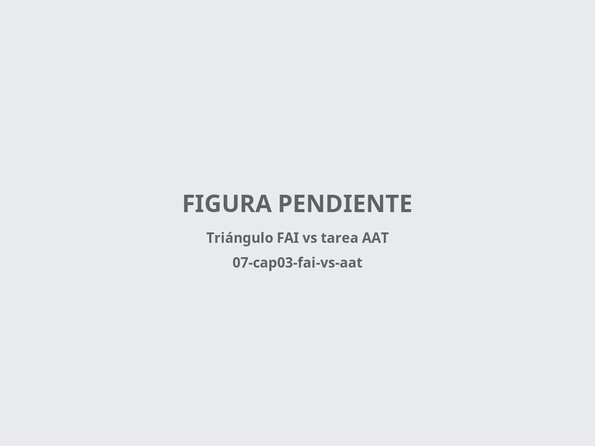
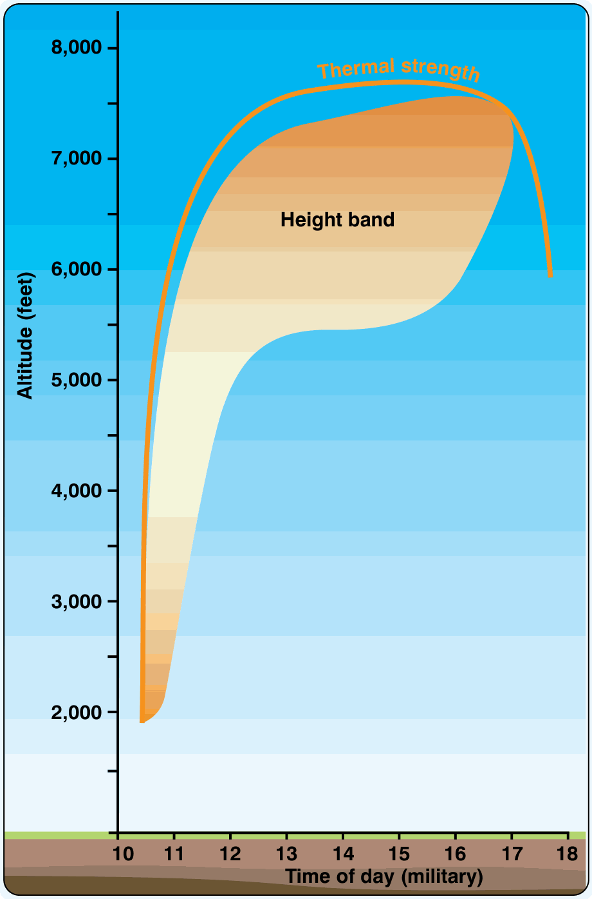

# Planificación de vuelo y definición de tareas

> Volar distancia no es solo una cuestión de habilidad en la palanca; es un juego de estrategia donde la gestión del tiempo y la meteorología son tus principales recursos. Una tarea bien planificada es la mitad del éxito de un vuelo de campo.
>
>
> En este capítulo aprenderás:
>
>
> * **La velocidad media**: el cálculo de la ventana de convección y el radio de acción real del día.
> * **Triángulo FAI y AAT**: dos tipos de tarea, dos estrategias mentales distintas.
> * **La planificación sobre la orografía española**: valles ciegos, puntos de escape y líneas de convergencia.
> * **El equipo de supervivencia**: qué exige la normativa europea cuando la ruta complica un eventual rescate.
> * **Los mínimos personales**: el "interruptor" que te convierte de competidor en superviviente.

## Velocidad media: la clave de la distancia

En el vuelo a vela, la velocidad media determina cuántos kilómetros puedes recorrer antes de que el sol baje y la convección muera. Y la forma de subirla es menos intuitiva de lo que parece.

* **No pares en térmicas flojas**: la velocidad media no sube por volar más deprisa entre nubes, sino por no pararte a virar en ascendencias que están por debajo de la media del día.
* **Consistencia**: mantener un flujo constante y aprovechar las calles de nubes para avanzar sin virar es lo que de verdad dispara la media.
* **La ventana del día**: si el día ofrece 6 horas de convección y tu media es de 50 km/h, tu radio de acción real da para una tarea de unos 300 km. Intentar más es comprar papeletas para un aterrizaje fuera de campo.

::: {.mas-alla}
## Triángulo FAI y AAT: dos formas de competir

[**↗ MÁS ALLÁ DEL EXAMEN.**]{.mas-alla-tag} Los tipos de tarea de competición (triángulo FAI, AAT) y la estrategia de regata no deberían ser materia de examen. Se incluyen porque son el paso natural del vuelo de distancia; léelos como iniciación.

Según el tipo de tarea, tu estrategia mental cambia por completo (@fig-07-cap03-fai-vs-aat).

* **Triángulo FAI**: los puntos de viraje son fijos y precisos. La navegación es rígida: pasas por el vértice o la tarea no vale.
* **Tarea de área asignada (AAT)**: alrededor de cada punto hay un sector circular grande, y tú decides dónde virar dentro de él. Si el día está mejor de lo previsto, vete al fondo del área para sumar distancia; si se está cerrando, toca el borde más cercano y vuelve a casa antes de que se agote la térmica.

{#fig-07-cap03-fai-vs-aat}
:::

## Meteorología: tu motor invisible

Antes de despegar debes conocer el ciclo de vida del cielo de ese día.

* **La ventana de convección** (@fig-07-cap03-ventana-conveccion): identifica la hora de disparo de las primeras térmicas (el **trigger**) y la hora a la que muere la convección. Planifica el paso por las zonas difíciles (sombras, montañas) durante las horas de máxima insolación.
* **Sondeo y base de nube**: la altura de la inversión y la base de nube definen tu espacio de trabajo. Cuanto mayor sea el margen entre la base y el suelo, más segura será tu progresión.

{#fig-07-cap03-ventana-conveccion}

::: {.callout-warning title="Seguridad"}
Recuerda siempre verificar los NOTAM y los espacios aéreos controlados en tu ruta. Una tarea que cruce un TMA sin autorización es una tarea fallida, independientemente de la distancia recorrida.
:::

## Planificar sobre la orografía española

En España, la mayoría de las tareas de distancia se juegan sobre terreno montañoso o en su área de influencia. La orografía no es solo un obstáculo: es a la vez tu fuente de energía y tu principal riesgo de planificación.

* **Valles ciegos**: un valle que se estrecha y asciende sin campos aterrizables ni salida volable es una trampa clásica de montaña. Al trazar la ruta sobre la carta, identifica estos embudos y planifica el cruce de las sierras por collados con escapatoria a ambos lados. Regla práctica: nunca te comprometas con un valle sin tener resuelto cómo salir de él con la altura que tendrás en ese punto, no con la que te gustaría tener.
* **Puntos de escape**: marca en la planificación los aeródromos y zonas de campos aterrizables que flanquean cada tramo de la ruta. Cada segmento de la tarea debe responder a la pregunta: "si la térmica muere aquí, ¿hacia dónde planeo?". Si un tramo no tiene respuesta, replantea la ruta o fija una altura mínima de cruce más exigente.
* **Sistemas organizados de sustentación**: las mesetas generan **líneas de convergencia** y las grandes cadenas (el Sistema Central es el ejemplo clásico) disparan **ondas de montaña** a sotavento. Planificar la tarea a lo largo de estas estructuras —en lugar de cruzarlas perpendicularmente— multiplica la velocidad media. Los fenómenos en sí (convergencias, onda, efecto Föhn) los estudiaste en el **Libro 3 — Meteorología**, capítulos 2 y 8; aquí la lección es estratégica: la ruta más corta sobre el mapa rara vez es la más rápida sobre el terreno.
* **Zonas de sombra**: las caras norte y los valles profundos entran en sombra horas antes que las mesetas. Planifica el paso por las zonas comprometidas durante las horas centrales del día.

## Equipo de supervivencia: cuando la ruta complica el rescate

Una tarea sobre sierras despobladas o grandes masas forestales exige preguntarse: si aterrizo fuera (o salto en paracaídas), ¿cuánto tardarán en encontrarme y qué necesito hasta entonces? La respuesta no es solo de sentido común: es un requisito normativo.

::: {.callout-important title="Normativa"}
El Reglamento (UE) 2018/1976 (**Part-SAO**), que regula las operaciones de planeadores en Europa, establece en **SAO.IDE.125** que los planeadores que operen sobre zonas donde la búsqueda y el salvamento serían especialmente difíciles deben llevar el equipo de salvamento y señalización adecuado al área sobrevolada. Su AMC1 concreta el mínimo: un **ELT**, una **baliza personal de localización (PLB)** o localizador equivalente registrado, equipo para hacer señales de socorro y el equipo de supervivencia apropiado a la ruta. Para vuelos sobre agua aplica además **SAO.IDE.120**: el piloto al mando debe valorar antes del vuelo los riesgos de supervivencia en caso de amerizaje.
:::

En la práctica, para una travesía sobre el monte español: agua, ropa de abrigo (a 2.500 m hace frío incluso en julio), un PLB o ELT registrado, teléfono móvil cargado y un espejo de señales o chaleco reflectante pesan menos de dos kilos y caben detrás del respaldo. Inclúyelos en la lista de equipo de la tarea, no en la categoría de "ya si eso".

## Mínimos personales: el interruptor de seguridad

Un buen piloto sabe cuándo dejar de ser competidor para convertirse en superviviente.

* **Mínima térmica aceptable**: por debajo de cierta altura (500 m sobre el suelo, por ejemplo), cualquier térmica es buena. Por encima, selecciona solo las mejores.
* **Altura de decisión**: fija un punto en el que dejas de buscar la siguiente térmica y te concentras solo en elegir un campo para aterrizar. No esperes a estar a 100 metros para mirar dónde. Los criterios para elegir y evaluar el campo desde el aire —la regla de las **7 S**— los tienes desarrollados en el **Libro 6 — Procedimientos operativos**, capítulo 5; repásalos antes de cada travesía.

::: {.callout-note title="Airmanship"}
Tus mínimos deben ser más conservadores si vuelas en zonas desconocidas o con planeadores de bajo rendimiento. La seguridad nunca es negociable.
:::

::: {.postit}
**Resumen del capítulo: planificación de tareas**

* **Velocidad media**: no gana el que corre más, sino el que para menos. Evita virar térmicas flojas; la clave está en la consistencia y en elegir la ruta bajo las calles de nubes.
* **Meteorología**: estudia el sondeo antes de despegar. ¿A qué hora empieza la convección? ¿Cuándo muere? Planifica la ventana de vuelo para cruzar lo difícil en las horas centrales.
* **Orografía**: la ruta más corta sobre el mapa rara vez es la más rápida sobre el terreno. Evita los valles ciegos, marca puntos de escape en cada tramo y traza la tarea a lo largo de convergencias y ondas, no perpendicular a ellas.
* **Equipo de supervivencia**: sobre zonas donde el rescate sería difícil, el Part-SAO (SAO.IDE.125) exige ELT o PLB, equipo de señales y supervivencia adecuados a la ruta. Agua, abrigo y baliza: menos de dos kilos que pueden salvarte la vida.
* **Mínimos personales**: fíjalos antes de salir. ¿Altura mínima para seguir en ruta? ¿Térmica mínima aceptable? Si bajas de ahí, cambia el chip de competición a supervivencia.
:::
