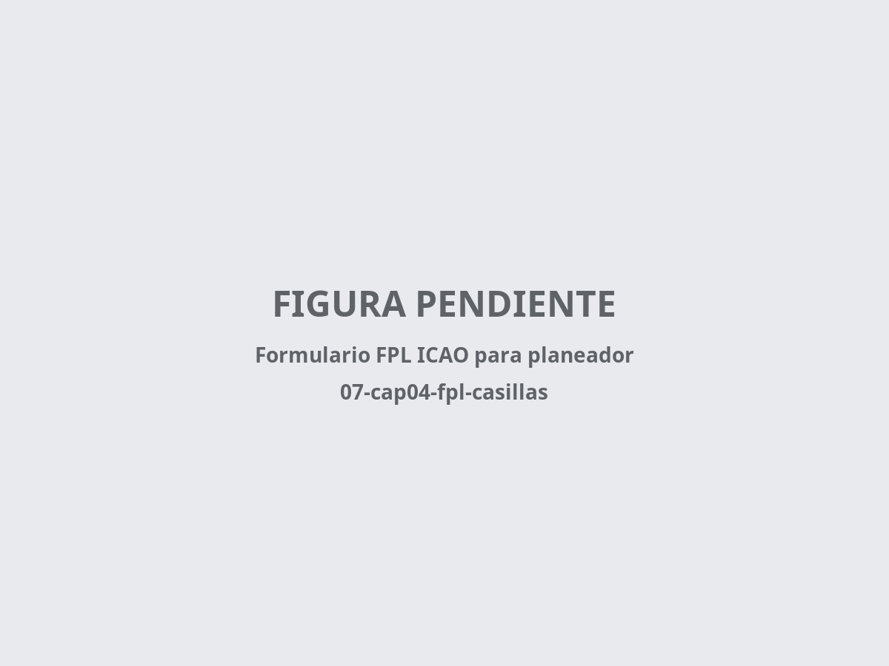

# Plan de vuelo ICAO

> El plan de vuelo (FPL) es mucho más que un trámite administrativo: es tu seguro de vida en los vuelos de distancia. En vuelo local no suele hacer falta, pero en cuanto decides alejarte del cono de seguridad de tu aeródromo se convierte en la única forma de que los servicios de búsqueda y rescate (SAR) sepan dónde buscarte si no regresas.
>
>
> En este capítulo aprenderás:
>
>
> * **Cuándo es obligatorio el FPL** según SERA.4001 y su aplicación en España.
> * **Las casillas clave del formulario ICAO** para un planeador, incluida la información suplementaria (casilla 19).
> * **Cómo abrir un plan de vuelo en el aire (AFIL)** con los centros de información de vuelo españoles.
> * **Las particularidades de los motoveleros (TMG)** y la autonomía de combustible.
> * **El cierre del plan**: el paso que nunca, jamás, puedes olvidar.

## ¿Cuándo es obligatorio?

Según el reglamento **SERA.4001** (SERA (Standardised European Rules of the Air)) y su aplicación en España, un planeador necesita plan de vuelo en estos casos:

* **Vuelos transfronterizos**: siempre que cruces una frontera internacional.
* **Servicio de control**: el plan de vuelo es obligatorio para todo vuelo al que se preste servicio de control de tránsito aéreo —en la práctica, **clases B, C y D**— y cuando el origen o el destino sea un **aeródromo controlado**. Atención al matiz de la clase E: es espacio controlado, pero al VFR no se le presta allí servicio de control, así que no necesita plan de vuelo, ni radio, ni autorización (SERA.4001 b)).
* **Cuando lo requiera la autoridad ATS**: en zonas o rutas designadas, para facilitar los servicios de información, alerta y SAR o la coordinación con unidades militares.
* **Vuelo VFR nocturno**: si el vuelo va a salir de las inmediaciones del aeródromo (caso excepcional en planeador, pero es pregunta de examen).
* **Sobre el mar**: en España, para vuelos que se alejen más de 12 millas náuticas de la costa (supuesto nacional; consulta el valor vigente en el AIP-España, ENR 1.10).
* **Vuelo de distancia**: no es obligatorio en espacio G (no controlado), pero sí muy recomendable: es lo que activa los servicios de alerta si no apareces.

::: {.callout-important}
⚖ **NORMATIVA**

Los plazos de presentación (AIP-España, ENR 1.10) dependen de qué pidas y desde dónde salgas. Si solicitas **servicio de control de tránsito aéreo**, presenta el FPL al menos **60 minutos antes** de la hora estimada de fuera de calzos (EOBT); desde un aeródromo controlado que no opere H24, el mínimo se reduce a **30 minutos**. Si despegas de un **aeródromo no controlado** y solo solicitas servicio de información y alerta, basta con presentarlo **antes de la salida**. En vuelo (**AFIL**), debe transmitirse con antelación suficiente para que la dependencia ATS lo reciba antes de entrar en espacio aéreo controlado.
:::

## Casillas clave para planeadores

Rellenar un formulario ICAO para un avión sin motor tiene sus peculiaridades (@fig-07-cap04-fpl-casillas):

* **Casilla 8 (reglas de vuelo y tipo de vuelo)**: la casilla lleva dos datos. Primero las **reglas de vuelo**: **V** (VFR) —aunque vueles en competición, legalmente eres un vuelo visual—. Después el **tipo de vuelo**: para un planeador deportivo, **G** (aviación general). Así que en la casilla 8 va **V** y **G**.
* **Casilla 9 (tipo de aeronave)**: pon **GLID** (**glider**).
* **Casilla 15 (velocidad y ruta)**: como velocidad, tu media de crucero estimada, con **K** para km/h (ej. K0120) o **N** para nudos (ej. N0065). Como ruta, los puntos de viraje o áreas (ej. DCT VTC-1 DCT VTC-2 DCT).
* **Casilla 16 (destino y alternativos)**: si piensas aterrizar fuera, usa **ZZZZ** y detalla el lugar en la casilla 18.
* **Casilla 18 (otros datos)**: aquí desarrollas los ZZZZ de las casillas anteriores con nombre y coordenadas, por ejemplo `DEP/CAMPO DE SANTOS 4035N00407W` o `DEST/AREA DE LA TAREA`. Si no hay nada que indicar, escribe `0` (cero).
* **Casilla 19 (información suplementaria)**: no se transmite con el mensaje FPL, pero es la información que usará el SAR si no apareces: autonomía (`E/`, en planeador, las horas hasta la puesta de sol), personas a bordo (`P/`), equipo de radio de emergencia (`R/`), equipo de supervivencia (`S/`) y si llevas **ELT** o baliza personal (PLB). Rellénala con el mismo cuidado que el resto: puede acortar tu rescate en horas.

{#fig-07-cap04-fpl-casillas}

## Abrir el plan en el aire: el AFIL

¿Y si despegas de un campo sin cobertura ni acceso a la aplicación ICARO de ENAIRE? El reglamento prevé la presentación del plan de vuelo **en vuelo (AFIL, *Air-Filed Flight Plan*)**, transmitiéndolo por radio a una dependencia ATS:

1. Sintoniza el **Centro de Información de Vuelo (FIC)** de tu región: en España, **Madrid Información**, **Barcelona Información** o **Canarias Información** (consulta la frecuencia del sector en el AIP de ENAIRE o en la carta de navegación; varía según la zona).
2. En el primer contacto, indica: identificación, tipo de aeronave (GLID), posición y altitud, intenciones (ruta y destino) y la petición expresa de **abrir plan de vuelo en el aire**.
3. Ten preparados los datos del formulario antes de transmitir: el operador te pedirá esencialmente las mismas casillas que en tierra (velocidad, ruta, destino, autonomía y personas a bordo).
4. Recuerda el plazo: el AFIL debe transmitirse **con antelación suficiente** para que la dependencia lo reciba antes de que entres en espacio aéreo controlado.

::: {.callout-note}
⚓ **AIRMANSHIP / BUENAS PRÁCTICAS**

El FIC no es solo para abrir planes de vuelo. En travesía por zonas como el Sistema Central, mantener escucha con Madrid Información te da tráfico esencial, NOTAM de última hora y un canal ya abierto si las cosas se tuercen. Apunta las frecuencias de los sectores de tu ruta en la planificación, junto a los puntos de escape.
:::

## Motoveleros (TMG)

Si vuelas un motovelero de turismo (TMG) y haces la navegación a motor, las reglas cambian: a efectos del plan de vuelo eres una aeronave propulsada normal. La autonomía que declares debe ser la de combustible real —capacidad de los tanques y consumo del motor—, no las horas de sol que queden.

## Cierre del plan de vuelo: el paso crítico

Un plan de vuelo abierto y no cerrado dispara una operación SAR: helicópteros y equipos de emergencia movilizados. Si es por un olvido, además del bochorno, las multas son severas.

* **Cómo cerrar**: llama a la oficina ARO (oficina de notificación ATS), avisa a la torre de control por radio antes de aterrizar o usa una aplicación oficial como ICARO de ENAIRE.
* **Plazos**: tienes 30 minutos desde la hora estimada de llegada antes de que empiecen a preocuparse. Si aterrizas en un campo sin cobertura, intenta avisar a alguien del club o busca un teléfono cuanto antes.

::: {.callout-warning}
⚠ **SEGURIDAD**

Nunca te vayas a casa sin confirmar que tu plan de vuelo está cerrado. Si aterrizas fuera de campo, tu prioridad tras asegurar el avión es notificar tu estado y posición para evitar falsas alarmas SAR.
:::

**Resumen del Capítulo: Plan de Vuelo ICAO**

* **¿Cuándo es obligatorio?**: al cruzar fronteras, cuando se te presta servicio de control (clases B, C y D; en la E el VFR vuela sin plan, sin radio y sin autorización), desde o hacia aeródromos controlados, en VFR nocturno fuera de las inmediaciones del aeródromo y cuando lo exija la autoridad ATS. Muy recomendable en vuelos de distancia para activar los servicios de alerta (SAR).
* **Casillas clave**: velocidad (casilla 15): tu media de crucero, con **K** para km/h (K0120) o **N** para nudos (N0065). Destino fuera de aeródromo: ZZZZ en la casilla 16 y el detalle con coordenadas en la 18. Casilla 19: autonomía hasta la puesta de sol, personas a bordo, ELT/PLB y equipo de supervivencia; es lo que usará el SAR.
* **AFIL**: sin cobertura en tierra, puedes abrir el plan por radio con el FIC (Madrid, Barcelona o Canarias Información), con antelación suficiente antes de entrar en espacio controlado.
* **Motoveleros (TMG)**: si vuelas un TMG como avión de turismo, sigues las mismas reglas que una avioneta: declara autonomía de combustible real, no solar.
* **Cierre del plan**: si aterrizas en un campo y te vas a cenar sin cerrar el plan, se activa una operación de búsqueda y rescate. Llama a la oficina de notificación de los servicios de tránsito aéreo (ARO) o a la torre en cuanto tengas cobertura.
