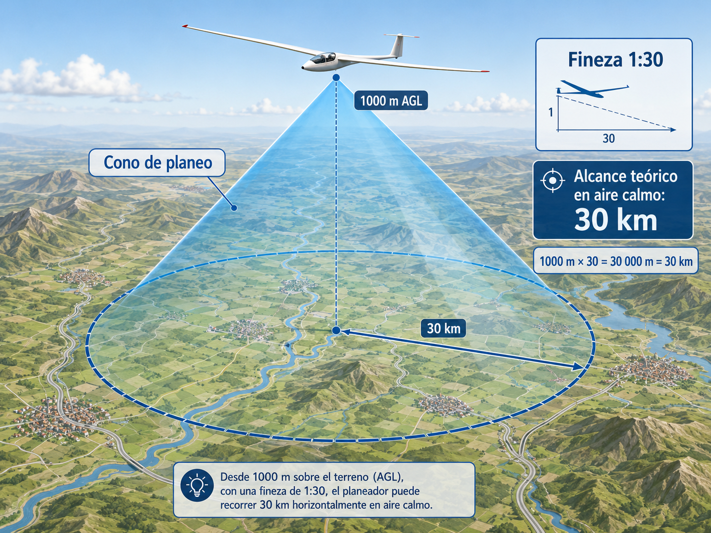
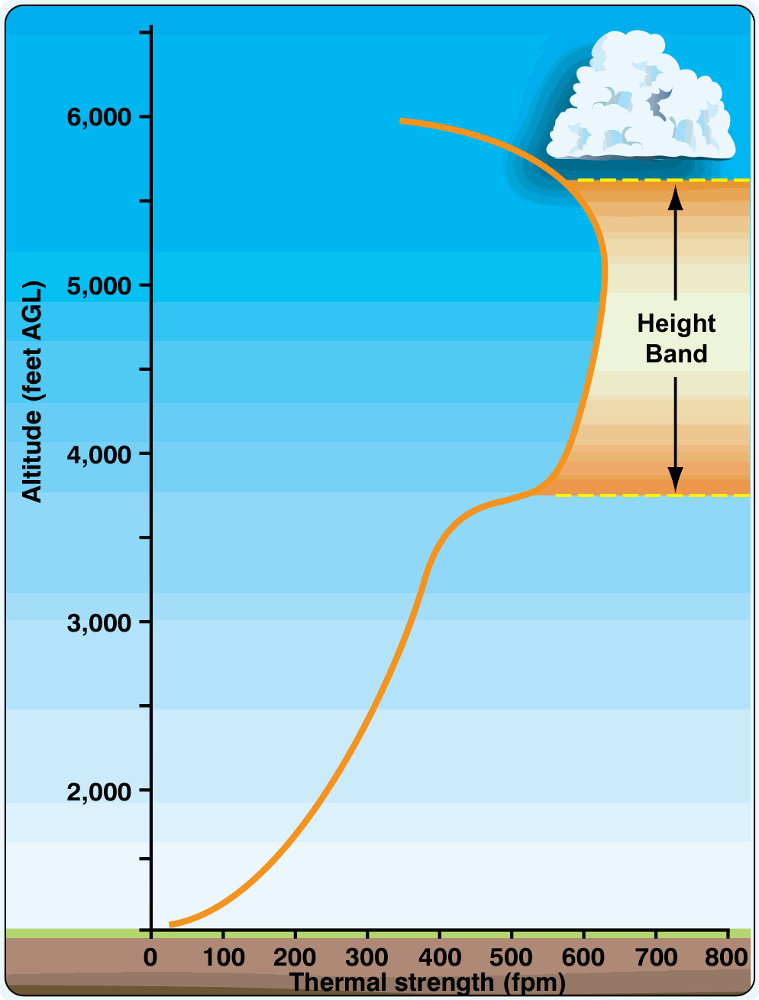

# Monitoreo del vuelo y replanificación en vuelo

> Una vez que has despegado y tu tarea está en marcha, el plan de vuelo deja de ser una hoja estática y se convierte en un proceso vivo de seguimiento. La atmósfera cambia, y el piloto que no adapta su estrategia en vuelo es el que acaba aterrizando en un campo antes de tiempo.
>
>
> En este capítulo aprenderás:
>
>
> * **El cono de alcance**: tu burbuja de seguridad y cómo la deforma el viento.
> * **El cálculo mental en cabina**: reglas rápidas de alcance y de deriva sin depender del GPS.
> * **El monitoreo del planeo final en 3 puntos**: cómo detectar una descendencia continua antes de que sea tarde.
> * **El punto de no retorno (PNR)** y el cambio de mentalidad que implica cruzarlo.
> * **El factor humano**: cómo la hipoxia y la deshidratación degradan justo las capacidades que la replanificación necesita.

## El cono de alcance: tu burbuja de seguridad

Imagina que de tu planeador baja un cono invertido hasta el suelo. Todo lo que quede dentro de ese círculo es terreno alcanzable si no encuentras ni una térmica más (@fig-07-cap05-cono-alcance).

* **La forma del cono**: en aire en calma es un círculo perfecto. Con viento de cara fuerte se deforma en una elipse que se encoge por delante y se estira por detrás.
* **El horizonte de decisión**: no esperes a que tu destino esté en el borde del cono. Si el objetivo queda fuera de tu alcance visual o instrumental, toca replanificar.

{#fig-07-cap05-cono-alcance}

## Cálculo mental: reglas rápidas en cabina

En momentos de estrés no siempre podrás fiarte del ordenador de vuelo. Tienes que saber estimar de cabeza:

* **De km/h a metros por segundo**: divide entre 3,6. A 100 km/h avanzas unos 28 metros por segundo; en un minuto, casi 1,7 km.
* **Alcance desde 1.000 m**: como aproximación conservadora, con finezas de 20 a 30 (las de un planeador de escuela o estándar), a 1.000 m de altura tienes un alcance de 20 a 30 km en aire en calma. Con viento de cara, divide ese alcance por dos para estar seguro.
* **Margen para el circuito**: suma siempre 300 metros a tu cálculo. Si el aeródromo está a 20 km y tu planeador planea 1:30, necesitas unos 670 metros de planeo puro; con los 300 de seguridad, la cuenta sale en 1.000 metros redondos.

::: {.callout-tip title="Regla de oro"}
**La térmica es tu manga de viento.** Mientras espiraleas, tus círculos derivan con el viento: la dirección y la distancia que te desplazas en cada giro te dicen de dónde sopla y con cuánta fuerza, sin mirar ningún instrumento. Para corregir la deriva en planeo recto: a 100 km/h, cada **10 km/h de viento cruzado ≈ 6° de corrección** hacia el viento. Con 20 km/h cruzados, apunta unos 12° al lado del viento y comprueba contra una referencia lejana del terreno que tu rumbo sobre el suelo se mantiene.
:::

## Monitoreo del planeo final: el método de los 3 puntos

Calcular el planeo final una sola vez y volarlo a fe ciega es apostar la tarea —y el planeador— a que la masa de aire no cambie. El método profesional verifica el margen en tres puntos (@fig-07-cap05-planeo-3-puntos):

1. **Al iniciar el planeo final**: anota tu altura de llegada prevista (por ejemplo, llegada calculada con +300 m sobre el campo).
2. **En el punto medio del tramo**: recalcula. Si el margen se mantiene en torno a +300 m, la masa de aire se comporta como esperabas. Si ha bajado a +150 m y sigue cayendo, estás atravesando descendencia o más viento de cara del previsto. Acelera la decisión, no el planeador: busca ya tu alternativa.
3. **A unos 5 km del destino**: última verificación con margen real para incorporarte al circuito. A esta distancia el resultado ya no es una estimación: es una realidad.

La fuerza del método está en la tendencia: una lectura te dice dónde estás; dos lecturas comparadas te dicen hacia dónde vas. Una descendencia continua de 0,5 m/s se pierde entre el ruido del variómetro, pero salta a la vista al comparar el margen del punto inicial con el del punto medio.

{#fig-07-cap05-planeo-3-puntos}

* **Caja de seguridad**: durante todo el planeo final, mantén al menos un aeródromo alternativo o un campo conocido dentro del cono de alcance con una llegada mínima de 300 m AGL. El día que el margen del punto medio se desplome, agradecerás tener la alternativa ya elegida.

## Punto de no retorno (PNR)

El PNR es el momento del vuelo en el que ya no tienes altura para volver al aeródromo de salida ni a la última zona segura que dejaste atrás.

* **Reconocimiento**: sé consciente del instante exacto en que cruzas esa línea invisible. A partir de ahí solo hay un camino: hacia delante, hacia el siguiente punto seguro (aeródromo alternativo o campo seleccionado).
* **Cambio de chip**: cruzado el PNR, tu prioridad número uno deja de ser la tarea y pasa a ser la localización constante de campos aterrizables.

::: {.callout-note title="Airmanship"}
Cantar en voz alta (o para ti mismo) "He cruzado el PNR" te ayuda mentalmente a dejar de mirar el GPS de la tarea y empezar a mirar seriamente el suelo.
:::

## Altura de seguridad y replanificación

La altura de seguridad (*safety height*) no se negocia: es el margen que absorbe un error de cálculo o un hundimiento inesperado al llegar al campo.

* **La regla del circuito**: fija una altura (300 m, por ejemplo) en la que, si no has encontrado térmica, abandonas la búsqueda y te incorporas al circuito de tráfico del aeródromo o campo elegido.
* **Replanifica a tiempo**: si la ruta planificada está bloqueada por sombras, lluvia o espacio aéreo, no esperes a estar bajo para decidir. Desvíate pronto: es mejor hacer 10 km de más con altura que 5 km directos contra el suelo.

## El factor humano: tu calculadora también se degrada

Todo lo anterior —reglas mentales, método de los 3 puntos, decisión del PNR— depende de un único instrumento: tu cerebro. Y ese instrumento pierde precisión justo cuando más lo necesitas:

* **Hipoxia**: en vuelos de onda por encima de 3.000 m sin oxígeno suplementario, la capacidad de cálculo mental y el juicio se degradan de forma traicionera: el primer síntoma es, precisamente, no notar los síntomas. Un planeo final calculado con hipoxia incipiente es un planeo final mal calculado.
* **Deshidratación y fatiga**: tras 4 o 5 horas de tarea bajo la cubierta, la deshidratación enlentece las decisiones y favorece la fijación: seguir hacia el objetivo "porque era el plan" en lugar de replanificar. La demora en aceptar una toma fuera de campo es exactamente el error que este capítulo intenta evitar.

Los mecanismos fisiológicos, el Tiempo de Conciencia Útil y el uso del oxígeno se estudian en el **Libro 2 — Factores humanos**, capítulo 4. Aquí quédate con la regla operativa: bebe de forma programada (no cuando tengas sed), usa oxígeno según el manual en vuelos altos y, si llevas muchas horas de tarea, desconfía de tus propias estimaciones y añade margen a todos los cálculos.

::: {.callout-warning title="Seguridad"}
Si tu ordenador de vuelo indica que llegas con 0 metros, **no llegas**. Ese cálculo es teórico: en el mundo real el aire casi nunca está en calma absoluta. Lleva siempre un colchón de altura y no dejes que se consuma.
:::

::: {.postit}
**Resumen del Capítulo: Monitoreo y Replanificación**

* **Cono de alcance**: visualiza el cono bajo el planeador; lo que queda fuera es inalcanzable. Ten siempre una opción de aterrizaje segura dentro del cono.
* **Cálculo mental**: 1 km de altura da 20-30 km de alcance, según el viento y el avión; con viento de cara fuerte, divide por dos. Para la deriva: a 100 km/h, cada 10 km/h de viento cruzado pide unos 6° de corrección.
* **Planeo final en 3 puntos**: verifica el margen de llegada al inicio, en el punto medio y a 5 km del destino. La tendencia entre lecturas delata a tiempo la descendencia continua o el viento imprevisto.
* **Punto de no retorno**: llega un momento en que ya no vuelves a casa. Tenlo identificado. A partir de ahí, tu objetivo es el siguiente aeródromo o campo seguro.
* **Factor humano**: hipoxia, deshidratación y fatiga degradan el cálculo mental y retrasan la decisión de aterrizar fuera. Bebe de forma programada, usa oxígeno en vuelos altos y añade margen cuando lleves horas de tarea (detalles en el **Libro 2 — Factores humanos**, capítulo 4).
* **Altura de seguridad (*safety height*)**: fija un margen intocable para llegar al campo (300 m, por ejemplo). Esa altura es para el circuito, no para planear. Si el calculador dice que llegas con 0 m, no llegas.
:::

