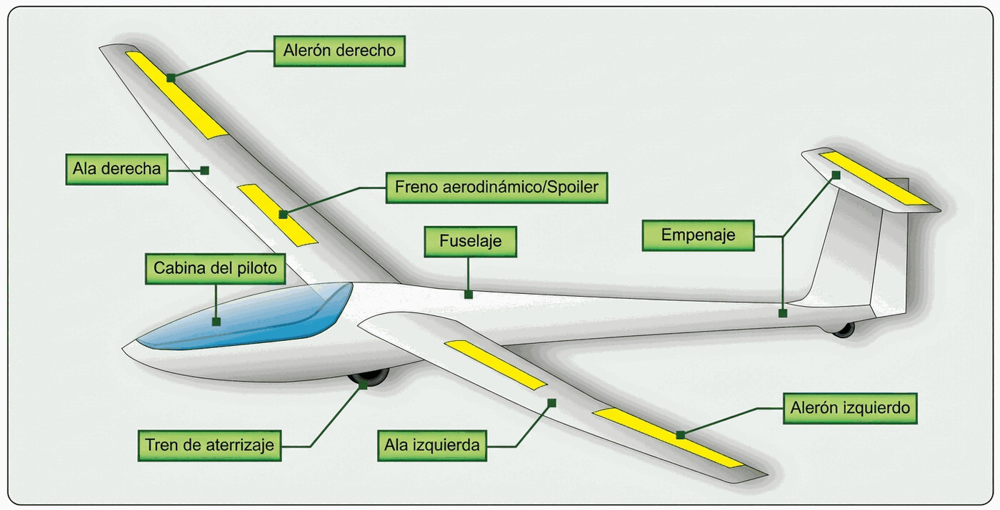

# Estructura (*airframe*)

> La estructura del planeador es lo primero que inspeccionas cada mañana y lo último que debe fallarte en vuelo. Saber de qué está hecho tu velero y cómo se comporta cada material ante el sol, la humedad o un golpe es la base de toda la inspección prevuelo.
>
>
> En este capítulo aprenderás:
>
>
> * **Los materiales de construcción**: composite (fibra de vidrio y carbono), madera y tela, y metal, con los puntos débiles de cada uno.
> * **El gelcoat y el poliuretano**: por qué los planeadores son blancos, cómo cuidar su "piel" y por qué la pintura de PU va sustituyendo al gelcoat.
> * **El larguero y la estructura sándwich**: dónde reside la resistencia del ala y por qué un golpe pequeño puede esconder una delaminación.
> * **La cúpula (canopy)**: cierre, ventilación y suelta de emergencia.
> * **El gancho de remolque**: gancho de morro, gancho de CG y el mecanismo de suelta automática.

La estructura de un planeador busca dos cosas a la vez: la mejor aerodinámica posible y el menor peso posible. En un avión de motor, un exceso de potencia perdona ciertas ineficiencias. En vuelo sin motor no hay ese margen: cada gramo cuenta y cada imperfección en la superficie se paga en planeo.

## Materiales de construcción

Los materiales han ido cambiando con las décadas, desde el fresno y el abeto de los pioneros hasta la fibra de carbono de los veleros de competición de hoy.

### Materiales compuestos (composites)

La gran mayoría de los planeadores modernos se fabrican con materiales compuestos, sobre todo plástico reforzado con fibra de vidrio (*GRP, Glass Reinforced Plastic*) y plástico reforzado con fibra de carbono (*CRP, Carbon Reinforced Plastic*).

* **Fibra de vidrio**: el estándar de la industria desde finales de los años 50. Buena relación resistencia/peso y superficies que se moldean extremadamente lisas.
* **Fibra de carbono**: más moderna y más cara. A igualdad de peso resiste mucho más que el acero y pesa bastante menos que la fibra de vidrio, así que se reserva para las piezas más cargadas y para los veleros de altas prestaciones.

::: {.callout-note title="Airmanship"}
Los planeadores de composite son casi siempre blancos por una razón técnica, no estética: la resina epoxi que une las fibras pierde propiedades mecánicas si se calienta demasiado. El blanco refleja la radiación solar y mantiene la estructura dentro de sus límites térmicos.
:::

### Madera, tela y metal

Menos comunes en los aeródromos de hoy, pero aún se ven joyas de la aviación clásica:

* **Madera y tela**: estructuras de madera (como el Schleicher K8) revestidas de tela aeronáutica. Ligeras y fáciles de reparar, aunque la enteladura pide un mantenimiento más riguroso.
* **Metal (aluminio)**: raro en planeadores puros; el ejemplo más famoso es el Let L-13 Blaník. Su construcción se parece a la de un avión convencional, con largueros, costillas y paños de aluminio remachados.

## El gelcoat: la piel del planeador

El **gelcoat** es una capa de resina de poliéster que cubre la estructura de fibra. Le da ese acabado brillante y liso tan característico, pero no es solo estética: es la barrera que protege la fibra de la humedad.

Tiene dos enemigos. La radiación ultravioleta y los cambios bruscos de temperatura. Con los años, el sol acaba provocando el "craqueado": una red de microfisuras en la superficie.

En los veleros modernos, ese gelcoat de poliéster está cediendo terreno frente a los sistemas de pintura de **poliuretano** (PU) acrílico. La diferencia no es solo de fórmula. El PU se aplica como una capa de pintura fina, mucho más ligera que el grueso gelcoat (que en un planeador puede suponer varios kilos), y es bastante más elástico, así que resiste mucho mejor el craqueado por UV y conserva el brillo durante más años. A cambio, esa capa fina deja menos margen para reparar a base de lijar y pulir: un arañazo profundo o un repintado piden pistola y un acabado a juego, no el simple pulido que admite el gelcoat. Sea de poliéster o de poliuretano, el cuidado es el mismo (protegerlo del sol y limpiarlo con suavidad), pero en superficies de PU conviene evitar los pulimentos abrasivos pensados para gelcoat.

::: {.callout-tip title="Regla de oro"}
Trata el gelcoat como tratarías tu propia piel. Protégelo del sol con fundas siempre que puedas y encéralo al menos una vez al año con ceras sin silicona para conservar su elasticidad y su protección UV.
:::

## El larguero y la estructura sándwich

Si el planeador fuera un cuerpo, el **larguero** sería la columna vertebral. Es la pieza maestra que recorre el ala de punta a punta y soporta todas las cargas de flexión en vuelo. Un daño estructural en el larguero deja el ala fuera de servicio.

Para el resto del ala y del fuselaje se usa la **estructura tipo sándwich**: dos capas finas y rígidas de fibra (las "tapas") con un núcleo ligero de espuma rígida (*foam*) o nido de abeja entre ellas.

Así se consiguen grandes superficies con una rigidez enorme y un peso mínimo. El precio es la fragilidad frente a los golpes puntuales: un topetazo con el borde de un hangar puede delaminar el interior sin dejar apenas marca por fuera.

{#fig-08-cap01-estructura-ala}

## La cúpula

La cúpula de plexiglás es, junto con tus ojos, tu principal defensa anticolisión: a través de ella vigilas el tráfico todo el vuelo. Como componente estructural merece el mismo respeto que el ala.

* **Cierre y bloqueo**: los pestillos laterales (o frontales) deben quedar bloqueados y verificados antes de despegar. Una cúpula que se abre en pleno remolque es una causa clásica de accidente, no tanto por el daño como por el pánico que provoca.
* **Ventilación**: la ventanilla lateral y la toma de aire de cabina sirven para ventilar y desempañar. En invierno, el vaho te deja ciego en segundos justo durante el lanzamiento.
* **Suelta de emergencia**: todas las cúpulas llevan un mecanismo de eyección (normalmente unos tiradores rojos) que libera la cúpula entera para poder saltar en paracaídas. Localízalo en cada planeador que vueles, porque no todos lo colocan en el mismo sitio.
* **Cuidado del plexiglás**: se limpia solo con agua abundante, productos específicos y paños limpios de algodón, siempre a favor del flujo. Un trapo seco o un disolvente lo rayan para siempre.

## El gancho de remolque

El gancho de suelta (*release hook*) es el punto donde el planeador se une al cable del torno o a la cuerda de remolque. Casi todos montan ganchos de la marca Tost, y hay dos ubicaciones con funciones distintas:

* **Gancho de morro** (*nose hook*): en la proa, pensado para el remolque por avión. Como la tracción va alineada con el eje longitudinal, resulta más fácil mantener la posición tras el remolcador.
* **Gancho de CG** (*CG hook*): bajo el fuselaje, cerca del centro de gravedad, es el adecuado para el lanzamiento por torno. Permite rotar a la actitud de subida pronunciada sin que el cable tire del morro hacia abajo.

El gancho de CG incorpora una suelta automática (*back-release*): si el cable tira hacia atrás y abajo, como ocurre al sobrevolar el torno al final del lanzamiento, el gancho libera el cable por sí solo aunque el piloto no accione la suelta.

Muchos planeadores de escuela montan los dos ganchos, y la regla es sencilla: morro para avión, CG para torno. La autoridad sobre qué gancho corresponde a cada método de lanzamiento es siempre el manual de vuelo (AFM). Usar el de CG para remolque por avión está permitido en algunos modelos, pero exige más atención: la tendencia a encabritarse es mayor y una posición alta respecto al remolcador puede acabar provocando una suelta automática involuntaria.

::: {.callout-warning title="Seguridad"}
No te lances nunca en torno con el gancho de morro. Al quedar el enganche por delante del centro de gravedad, el cable tira del morro hacia el suelo en lugar de dejar rotar el planeador a la subida; para contrarrestarlo tendrías que tirar a fondo de profundidad, y eso sobrecarga el estabilizador horizontal y el timón en una fase de cargas ya muy altas. A esto se suma que el gancho de morro no da la suelta automática (**back-release**) del de CG, así que un fallo de suelta es mucho más peligroso. Por estas razones, en los tipos así certificados el AFM prohíbe de forma expresa el lanzamiento por torno con el gancho de morro.
:::

::: {.callout-warning title="Seguridad"}
El gancho de remolque es un mecanismo con desgaste y con revisiones propias: los Tost tienen una vida limitada en años y en número de lanzamientos, y al cumplirla deben revisarse o sustituirse según el manual del fabricante. En la inspección prevuelo, acciona la suelta con el cable de pruebas y comprueba que el gancho abre y cierra con franqueza, sin agarrotamientos.
:::

::: {.postit}
**Resumen del capítulo: estructura (airframe)**

* **Materiales**: la mayoría, de fibra de vidrio y de carbono (composite) por su resistencia y su acabado liso. Los clásicos, de madera y tela. El metal es raro en planeadores puros (salvo el Blaník).
* **Gelcoat**: la "piel" blanca del planeador. Sensible a los rayos UV y a los cambios bruscos de temperatura. Protégelo con fundas y no lo dejes al sol sin necesidad. En los veleros modernos lo sustituye cada vez más la pintura de poliuretano (PU): más ligera y elástica, resiste mejor el craqueado, pero se repara peor con lijado y pulido.
* **Larguero**: la columna vertebral del ala. Soporta las cargas de vuelo. Si se daña, el ala es chatarra.
* **Estructura sándwich**: dos capas duras con un núcleo ligero (espuma o nido de abeja). Muy rígida y ligera, pero delicada ante los golpes puntuales.
* **Cúpula**: pestillos bloqueados antes de despegar, suelta de emergencia localizada y plexiglás limpio solo con agua y paños adecuados.
* **Gancho de remolque**: morro para avión, CG para torno (lo manda el AFM). Nunca torno con el gancho de morro: tira del morro al suelo y sobrecarga la cola. El de CG tiene suelta automática (**back-release**). Comprueba su funcionamiento en la inspección diaria.
:::

