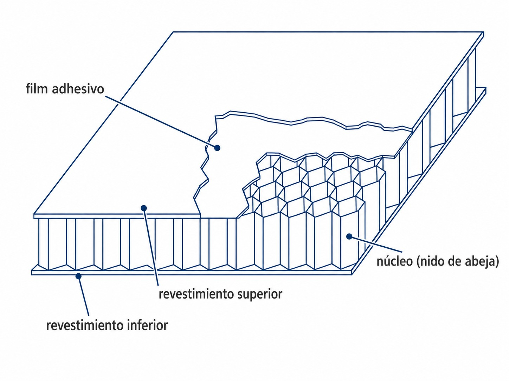
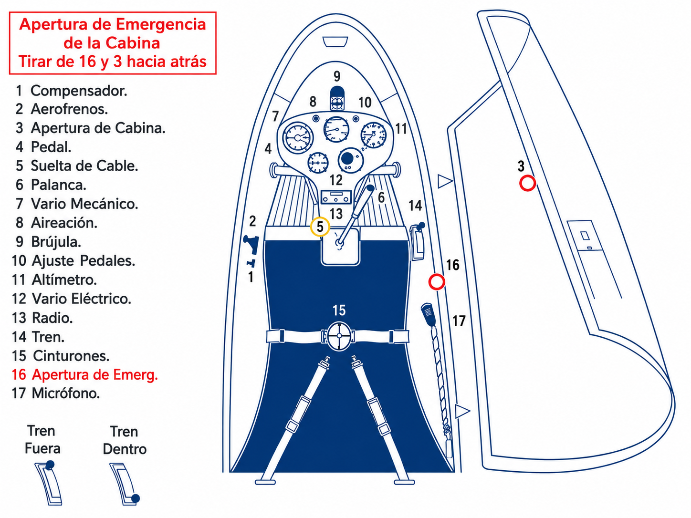
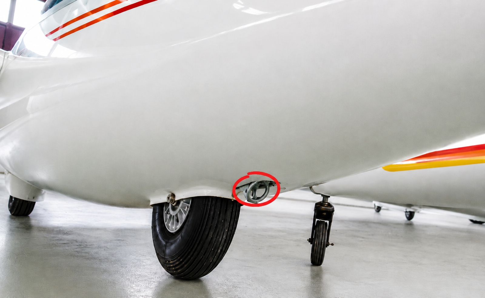

# Estructura (*airframe*)

> La estructura del planeador es lo primero que inspeccionas cada mañana y lo último que debe fallarte en vuelo. Saber de qué está hecho tu velero y cómo se comporta cada material ante el sol, la humedad o un golpe es la base de toda la inspección prevuelo.
>
>
> En este capítulo aprenderás:
>
>
> * **Los materiales de construcción**: composite (fibra de vidrio y carbono), madera y tela, y metal, con los puntos débiles de cada uno.
> * **El gelcoat y el poliuretano**: por qué los planeadores son blancos y por qué cada acabado exige productos y cuidados propios.
> * **El larguero y la estructura sándwich**: dónde reside la resistencia del ala y por qué un golpe pequeño puede esconder una delaminación.
> * **La cúpula (canopy)**: cierre, ventilación y salida de emergencia.
> * **El gancho de remolque**: gancho de morro, gancho de CG y el mecanismo de suelta automática.

El diseño de un planeador busca reducir a la vez la resistencia y la masa en vacío. Como no hay un motor que compense las pérdidas durante el planeo, el acabado de la superficie importa mucho: una reparación mal rematada, suciedad o insectos en el borde de ataque reducen las prestaciones.

## Materiales de construcción

Los materiales han ido cambiando con las décadas, desde el fresno y el abeto de los pioneros hasta la fibra de carbono de los veleros de competición de hoy.

### Materiales compuestos (composites)

La gran mayoría de los planeadores modernos se fabrican con materiales compuestos, sobre todo plástico reforzado con fibra de vidrio (*GRP, Glass Reinforced Plastic*) y plástico reforzado con fibra de carbono (*CRP, Carbon Reinforced Plastic*).

* **Fibra de vidrio**: el estándar de la industria desde finales de los años 50. Buena relación resistencia/peso y superficies que se moldean extremadamente lisas.
* **Fibra de carbono**: más moderna y más cara. Permite fabricar piezas muy rígidas y resistentes con poca masa, aunque el resultado depende de cómo se orienten las fibras y de cómo se construya el laminado. Frente a la fibra de vidrio destaca sobre todo por su mayor rigidez, de ahí que se use en las zonas más cargadas y en los veleros de altas prestaciones.

::: {.callout-note title="Airmanship"}
Los planeadores de composite son casi siempre blancos por una razón técnica, no estética: la resina epoxi que une las fibras pierde propiedades mecánicas si se calienta demasiado. El blanco refleja la radiación solar y mantiene la estructura dentro de sus límites térmicos.
:::

### Madera, tela y metal

Menos comunes en los aeródromos de hoy, pero aún se ven joyas de la aviación clásica:

* **Madera y tela**: estructuras de madera (como el Schleicher K8) revestidas de tela aeronáutica. La humedad puede deteriorar la madera y sus uniones; el sol, la tensión y los roces envejecen la tela. Durante la inspección, busca manchas, deformaciones, costuras abiertas, desgarros o zonas destensadas. Si algo no tiene el aspecto habitual, no lo presiones ni intentes repararlo: pide que lo revise personal competente.
* **Metal (aluminio)**: raro en planeadores puros; el ejemplo más famoso es el Let L-13 Blaník. Su construcción se parece a la de un avión convencional, con largueros, costillas y paños de aluminio remachados. Aquí preocupan la corrosión, las grietas alrededor de uniones y remaches, y las abolladuras o arrugas que delatan una deformación. Una grieta o una deformación nueva deja el planeador en tierra hasta que se evalúe.

## El gelcoat: la piel del planeador

El **gelcoat** es una capa de resina de poliéster que cubre muchas estructuras de fibra. Le da el acabado brillante y liso tan característico y ayuda a proteger el laminado de la humedad y del ambiente.

La radiación ultravioleta y los cambios bruscos de temperatura lo envejecen. Con los años puede aparecer el "craqueado", una red de microfisuras en la superficie.

Algunos veleros modernos usan sistemas de pintura de **poliuretano** (PU) acrílico en lugar de gelcoat de poliéster. Son acabados distintos y no se reparan ni se pulen de la misma forma. No intentes reconocerlos solo por el brillo: consulta el manual de mantenimiento antes de usar un limpiador, una cera o un pulimento.

::: {.callout-tip title="Regla de oro"}
Protege la superficie del sol con fundas y límpiala sin frotar en seco. Para encerar o pulir, usa únicamente productos y métodos admitidos por el fabricante: lo que funciona en un gelcoat puede estropear una pintura de poliuretano.
:::

## El larguero y la estructura sándwich

Si el planeador fuera un cuerpo, el **larguero** sería la columna vertebral del ala. Es su principal elemento resistente y soporta buena parte de las cargas de flexión; el revestimiento y otros elementos también trabajan, según el diseño. Ante un daño real o sospechado en el larguero, el planeador queda fuera de servicio hasta que personal competente lo evalúe y determine si admite una reparación aprobada.

En muchas zonas del ala y del fuselaje se usa la **estructura tipo sándwich**: dos capas finas y rígidas de fibra (las "tapas") con un núcleo ligero de espuma rígida (*foam*) o nido de abeja entre ellas.

Así se consiguen grandes superficies con una rigidez enorme y un peso mínimo. El precio es la fragilidad frente a los golpes puntuales: un topetazo con el borde de un hangar puede delaminar el interior sin dejar apenas marca por fuera.

{#fig-08-cap01-estructura-ala width="50%" fig-alt="Corte de un panel sándwich. Un revestimiento superior y otro inferior quedan separados por un núcleo de nido de abeja y unidos mediante una película adhesiva."}

## La cúpula

La cúpula de plexiglás es, junto con tus ojos, tu principal defensa anticolisión: a través de ella vigilas el tráfico durante todo el vuelo. También forma parte de la salida de emergencia, así que merece una comprobación cuidadosa antes de despegar.

* **Cierre y bloqueo**: los pestillos laterales (o frontales) deben quedar bloqueados y verificados antes de despegar. Si la cúpula se abre durante el lanzamiento, el ruido y la corriente pueden sobresaltar al piloto en una fase con poco margen de reacción.
* **Ventilación**: la ventanilla lateral y la toma de aire de cabina sirven para ventilar y desempañar. En invierno, el vaho puede ocultar el tráfico y la pista justo durante el lanzamiento.
* **Salida de emergencia**: cada modelo tiene su propio procedimiento. Según el diseño, puede exigir abrir la cúpula, desprenderla o accionar dos mandos en un orden concreto. Localiza los mandos en tierra y aprende la secuencia del AFM con tu instructor; el color o la posición no bastan para adivinarla.
* **Cuidado del plexiglás**: usa agua abundante o un producto aprobado y un paño limpio y suave, sin frotar en seco. No apliques disolventes ni limpiadores domésticos salvo que el fabricante los autorice.

La ilustración siguiente representa una configuración concreta. Los números 16 y 3 solo sirven para leer este esquema: **no son una secuencia válida para cualquier planeador**. En la aeronave que vayas a volar, manda el AFM y el marcado de sus propios mandos.

{#fig-08-cap01-8-1-2-1-cabina-de-un-planeador fig-alt="Esquema de una cabina con los mandos numerados. Una advertencia destaca los mandos 16 y 3 como parte de una configuración concreta de apertura de emergencia, no como procedimiento general."}

## El gancho de remolque

El gancho de suelta (*release hook*) es el punto donde el planeador se une al cable del torno o a la cuerda de remolque. Su función depende de la instalación aprobada y del AFM, no solo de dónde esté montado. En la configuración Tost más habitual se encuentran estos dos tipos:

* **Gancho de morro** (*nose hook*): suele ser un Tost E 85 instalado en la proa y destinado al remolque por avión. No incorpora suelta automática.
* **Gancho de CG** (*CG hook*): suele ser un Tost G 88 instalado bajo el fuselaje, cerca del centro de gravedad, y destinado al lanzamiento por torno.

El gancho destinado al torno debe incorporar una suelta automática (*back-release*), como exigen CS 22.711 y CS 22.713: cuando el planeador sobrevuela el torno con carga en el cable, el mecanismo lo libera aunque el piloto no accione el mando.

Muchos planeadores de escuela montan ambos. La disposición típica es morro para avión y CG para torno, pero la regla que importa es otra: **usa el gancho que autoricen el AFM y las placas del planeador para ese método de lanzamiento**. Algunos modelos admiten el remolque por avión desde un gancho próximo al CG; en ellos hay que aplicar el procedimiento específico del manual.

{#fig-08-cap01-planeador width="50%" fig-alt="Vista inferior de un planeador junto a la rueda principal. Un círculo rojo señala el gancho de remolque situado bajo el fuselaje."}

::: {.callout-warning title="Seguridad"}
En un lanzamiento por torno, usa únicamente el gancho que autorice el AFM y que disponga de suelta automática (**back-release**). Un gancho de morro Tost E 85 normal no la tiene y no sirve para torno. No intentes deducir la compatibilidad por la posición o el aspecto del gancho: comprueba el manual y las placas antes de conectar el cable.
:::

::: {.callout-warning title="Seguridad"}
El gancho de remolque se desgasta y tiene revisiones propias. Controla sus plazos por tiempo y número de actuaciones conforme al programa de mantenimiento y a las instrucciones del fabricante. En la inspección prevuelo, prueba la suelta con el útil o cable previsto y comprueba que el mecanismo abre y cierra con franqueza, sin agarrotamientos.
:::

::: {.postit}
**Resumen del capítulo: estructura (airframe)**

* **Materiales**: los composites dominan en los veleros modernos. En madera y tela, busca humedad, deformaciones y daños del revestimiento; en metal, corrosión, grietas y abolladuras nuevas.
* **Gelcoat y pintura**: protegen y alisan la superficie, pero no se cuidan igual. Usa fundas, limpia con suavidad y consulta el manual antes de encerar, pulir o reparar.
* **Larguero**: es el principal elemento resistente del ala, aunque no trabaja solo. Si sospechas que está dañado, el planeador queda fuera de servicio hasta que lo evalúe personal competente.
* **Estructura sándwich**: dos capas duras con un núcleo ligero (espuma o nido de abeja). Muy rígida y ligera, pero delicada ante los golpes puntuales.
* **Cúpula**: pestillos bloqueados antes de despegar, mandos de salida localizados y procedimiento del AFM aprendido en tierra. Limpia el plexiglás con productos admitidos por el fabricante.
* **Gancho de remolque**: usa el autorizado por el AFM y las placas para cada método. El destinado al torno debe tener suelta automática (**back-release**). Comprueba su funcionamiento en la inspección prevuelo.
:::
