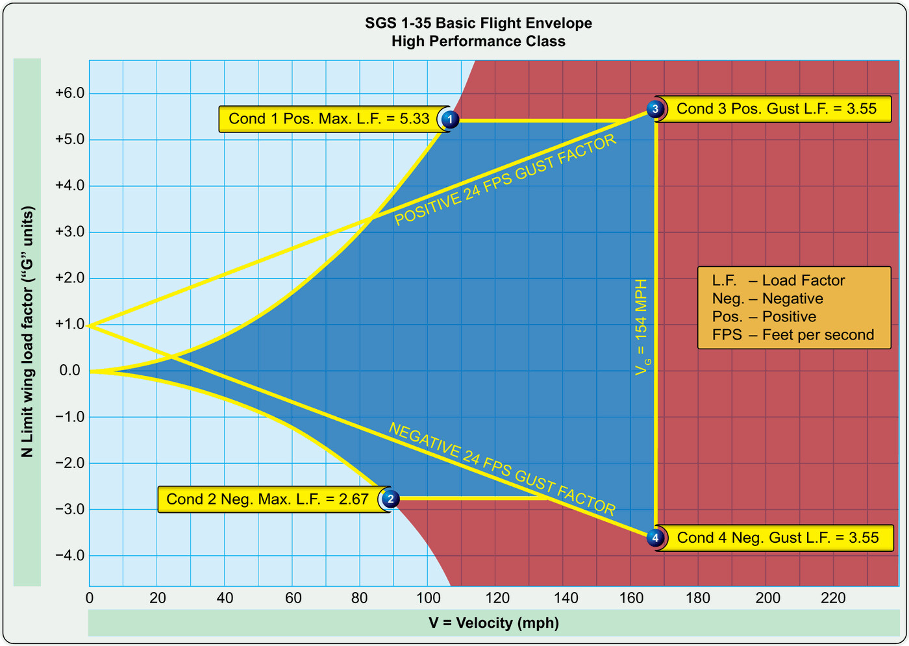

# Diseño de sistemas, cargas y tensiones

> Tu planeador es fuerte, pero no invencible. La certificación define con precisión cuánta carga aguanta la estructura y dónde están los límites que nunca debes explorar.
>
>
> En este capítulo aprenderás:
>
>
> * **El factor de carga (n)**: qué significa "tirar de g" y cómo lo provocan los virajes y las recogidas.
> * **Las categorías de diseño** Utilitaria y Acrobática según CS-22 y sus límites en g.
> * **Carga límite y carga de rotura**: qué protege el factor de seguridad de 1,5 y qué no.
> * **La fatiga estructural** de los composites y sus inspecciones de vida útil.
> * **El flameo (flutter)**: la vibración que puede desintegrar un planeador en segundos.

Un planeador no solo tiene que ser aerodinámicamente eficiente; también tiene que aguantar las fuerzas de la atmósfera y las maniobras del piloto. Ese diseño estructural se rige por normas estrictas (como la CS-22 de EASA (European Union Aviation Safety Agency)), que fijan cuánta carga debe soportar la aeronave antes de sufrir daños.

## El factor de carga (n)

El **factor de carga** (en "g") es la relación entre la sustentación total que generan las alas y el peso del planeador. En vuelo recto y nivelado vale 1g: las alas sostienen exactamente el peso del avión. En un viraje escarpado, o al tirar de la palanca para salir de un picado, ese valor sube y la estructura trabaja mucho más.

En el viraje, el factor de carga crece con la inclinación, porque las alas tienen que generar más sustentación para sostener el peso mientras curvan la trayectoria. La relación no es lineal:

| Inclinación | 0° | 30° | 45° | 60° |
| --- | --- | --- | --- | --- |
| Factor de carga | 1g | 1,15g | 1,41g | 2g |

: Factor de carga en función de la inclinación en viraje

A 60° de alabeo el planeador "pesa" el doble: un velero de 500 kg somete sus alas a 1.000 kg. Por eso un viraje muy escarpado, sobre todo a baja velocidad, acerca peligrosamente a la pérdida.

## Categorías de diseño

No todos los planeadores se diseñan para los mismos esfuerzos. La normativa europea distingue principalmente dos categorías:

* **Categoría Utilitaria (U)**: para el vuelo normal, térmica y navegación. Certificada para soportar +5,3g y -2,65g a la velocidad de maniobra. Esos límites se estrechan al aumentar la velocidad hasta +4,0g y -1,5g a la velocidad de picado (V~D~); la envolvente completa (el diagrama V-n) se detalla en el **Libro 5 — Principios de vuelo**, capítulo 5.
* **Categoría Acrobática (A)**: para maniobras extremas, con límites de +7g y -5g.

::: {.callout-important title="Normativa"}
**CS 22.337 (factores de carga límite de maniobra)**: la categoría Utilitaria debe soportar +5,3 / -2,65 (a la velocidad de maniobra) y la Acrobática, +7,0 / -5,0. **CS 22.303 (factor de seguridad)**: salvo indicación en contra, se aplica un factor de seguridad de 1,5 sobre las cargas límite para obtener las cargas últimas.

Los límites concretos de tu aeronave están en su Manual de Vuelo. Consúltalos antes de volar un modelo nuevo.
:::

## Carga límite y carga de rotura

En la certificación se manejan dos conceptos clave:

1. **Carga límite**: el esfuerzo máximo que el planeador soporta sin deformación permanente. Tras alcanzarla, la estructura debe recuperar su forma original sin daños.
2. **Carga de rotura (ultimate load)**: el valor al que la estructura falla de forma catastrófica. Por norma general se aplica un factor de seguridad de 1,5, así que un planeador con carga límite de 5,3g tendría una carga de rotura teórica de unos 8,0g.

::: {.callout-warning title="Seguridad"}
No uses nunca el factor de seguridad como "margen de maniobra". Ese 1,5 está para cubrir imperfecciones del material o condiciones atmosféricas imprevistas, no para que el piloto vuele fuera de límites.
:::

## Fatiga y vida útil

La fibra de vidrio y la de carbono resisten muy bien, pero no son eternas. Con los años y las horas de vuelo, las tensiones repetidas y los aterrizajes acaban generando microfisuras o delaminación.

Por eso los fabricantes establecen programas de inspección de vida útil. Es habitual que las aeronaves de fibra pasen revisiones estructurales profundas a las 3.000, 6.000 y 9.000 horas de vuelo para confirmar que la estructura sigue siendo segura.

## Flameo (flutter): la vibración mortal

El **flameo** o *flutter* es una vibración autoexcitada que aparece cuando las fuerzas aerodinámicas interactúan de forma descontrolada con la elasticidad del ala o de los timones. Es un fenómeno violentísimo, capaz de desintegrar una aeronave en segundos.

Tiene que ver directamente con la velocidad. La V~NE~ (Velocidad Nunca Exceder) se certifica precisamente con un margen de seguridad respecto a la velocidad a la que aparece el flameo. Pero ese margen no es un cheque en blanco: un planeador con holguras en los mandos, con masas de equilibrado mal ajustadas tras una reparación o con agua acumulada en las superficies de control puede entrar en flameo incluso por debajo de la V~NE~. De ahí que el equilibrado de las superficies de control se verifique después de cualquier reparación o repintado.

{#fig-08-cap02-diagrama-vn}

::: {.postit}
**Resumen del capítulo: cargas y diseño**

* **Factor de carga (n)**: los planeadores son fuertes, no invencibles. Crece con la inclinación del viraje (a 60° de alabeo, 2g). Categoría Utilitaria: +5,3g / -2,65g. Categoría Acrobática: +7g / -5g (CS 22.337).
* **Fatiga**: la fibra de vidrio dura muchísimo, pero se revisa periódicamente (3000h, 6000h…) en busca de microfisuras o delaminación.
* **Carga límite y rotura**: la límite es la máxima sin deformación permanente; la de rotura es la que parte la estructura (1,5 veces la límite, CS 22.303). No te acerques a esos valores.
* **Flameo (flutter)**: vibración autoexcitada mortal. La V~NE~ se fija con margen frente al flutter, pero las holguras o los desequilibrios en los mandos pueden provocarlo incluso por debajo. Respetar la V~NE~ es respetar tu vida.
:::

