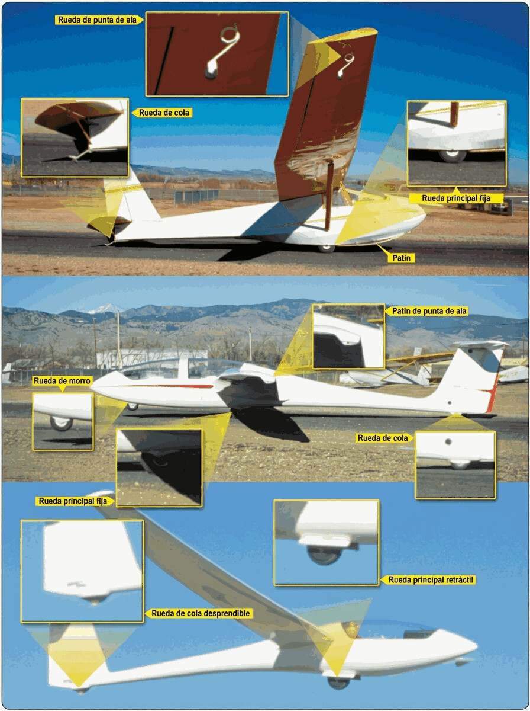

# Tren de aterrizaje, ruedas, neumáticos y frenos

Cada vuelo termina en el suelo, y el tren de aterrizaje es lo único que se interpone entre la estructura (y tu columna vertebral) y la pista.

En este capítulo aprenderás:

* **Las configuraciones del tren**: fijo y retráctil, y la disciplina que exige cada uno.
* **La amortiguación y los "elementos fusible"**: cómo el tren protege al piloto en un aterrizaje duro.
* **El sistema de frenado**: tipos de freno, accionamiento y sus límites.
* **El patín y la rueda de cola**: los puntos de desgaste que hay que vigilar.
* **Qué hacer si el tren no sale**: la emergencia más benigna del catálogo, si la gestionas bien.

El tren de aterrizaje es la interfaz del planeador con el suelo. Pasamos casi todo el tiempo en el aire, pero una toma segura depende de que ese sistema funcione bien y de que el piloto lo gestione con disciplina.

## Configuraciones del tren

Según el uso y las prestaciones del velero, hay dos tipos principales:

* **Tren fijo**: habitual en planeadores de escuela (como el ASK-21). Suele ser una rueda principal robusta, a veces con una rueda de morro y otra de cola (o patín). Su gran ventaja es la simplicidad: no hay nada que olvidar sacar.
* **Tren retráctil**: el estándar en veleros de rendimiento. Esconder la rueda dentro del fuselaje elimina una buena parte de la resistencia aerodinámica. El mecanismo suele ser manual, con una palanca en el lado derecho de la cabina.

::: {.callout-tip}
✦ **REGLA DE ORO**

Trata la gestión del tren retráctil como algo sagrado: se guarda solo tras soltar el remolque y alcanzar una altura segura, y se vuelve a sacar al entrar en el tramo de viento en cola (*downwind*), sin excepción. Que forme parte de tu chequeo mental antes de aterrizar.
:::

## Suspensión y "elementos fusible"

A diferencia de los aviones pesados, la amortiguación de muchos planeadores es básica: bloques de goma, ballestas de acero o, sin más, la elasticidad del propio neumático.

Aun así, el tren cumple una función de seguridad importante: trabaja como **elemento fusible**. En un aterrizaje muy duro, el soporte del tren está pensado para romper antes que la estructura principal del fuselaje, absorbiendo parte de la energía del impacto y protegiendo la columna del piloto.

## Patín y rueda de cola

En la cola, los planeadores montan un patín (en los modelos clásicos) o una pequeña rueda de cola. Sirve para proteger el fuselaje en las tomas con el morro alto y durante el rodaje. Es un punto de desgaste constante: revisa en la inspección diaria la zapata del patín o la goma de la rueda y la firmeza de su anclaje al fuselaje. En las puntas de ala, muchos veleros llevan además ruedecillas o tacos de protección para los giros en tierra.

## El sistema de frenado

El freno de rueda es clave para detener la carrera de aterrizaje, sobre todo en pistas cortas o en tomas fuera de campo.

* **Tipo de freno**: los modelos modernos llevan frenos de disco hidráulicos, muy eficaces; los más antiguos, de tambor.
* **Accionamiento**: en la mayoría de los planeadores el freno entra al llevar la palanca de aerofrenos hasta el final de su recorrido. En otros está en los pedales o en una maneta independiente.

::: {.callout-warning}
⚠ **SEGURIDAD**

No frenes con brusquedad al principio de la carrera de aterrizaje si llevas mucha velocidad: puedes provocar un capotaje (el morro se clava en el suelo) o hacer planos en la rueda por desgaste excesivo del neumático.
:::

## Mantenimiento y emergencias

Un neumático con poca presión no solo aumenta la resistencia al rodaje, sino que puede desllantar en un aterrizaje con viento cruzado. Comprueba siempre el estado de la rueda y la limpieza de los cables de retracción: el barro o la hierba acumulada llegan a bloquear el mecanismo.

¿Y si el tren no sale? Si el mando está agarrotado, a veces un tirón suave (un picado y una recogida) ayuda a que la gravedad fuerce la extensión. Y si al final tienes que aterrizar con el tren dentro, hazlo sobre hierba: los daños suelen quedarse en raspones del gelcoat del fuselaje, sin comprometer la seguridad del piloto.

{#fig-08-cap03-mecanismo-tren}

**Resumen del capítulo: tren de aterrizaje**

* **Configuraciones**: tren fijo (escuela, simple) o retráctil (rendimiento). El retráctil se saca sin falta en viento en cola: tren abajo y bloqueado.
* **Amortiguación**: en muchos planeadores, la única suspensión es el neumático y tu cojín. El tren hace de "elemento fusible": en una toma muy dura rompe él antes que el fuselaje.
* **Frenos**: de disco (eficaces, pero pueden calentarse) o de tambor. Entran al final del recorrido de los aerofrenos o con una maneta aparte. Comprueba que frenan bien antes de despegar.
* **Patín de cola**: protege el fuselaje en tomas con el morro alto. Es un punto de desgaste a vigilar.
* **Tren que no sale**: prueba un tirón suave; si no, toma sobre hierba con el tren dentro. Daños menores, piloto a salvo.
