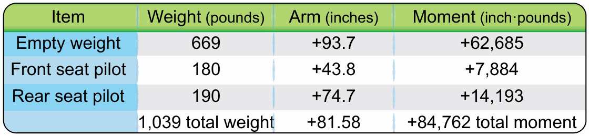

# Masa y centro de gravedad

> El planeador que despega sobrecargado o mal centrado ya lleva el accidente a bordo. Este capítulo trata la masa y el centrado desde el punto de vista de los sistemas del avión: dónde va el lastre, qué dice la placa de limitaciones y cuándo hay que volver a pesar la aeronave.
>
>
> En este capítulo aprenderás:
>
>
> * **La masa máxima al despegue (MTOW)** y la diferencia con la masa máxima sin agua.
> * **Los límites del centro de gravedad**: qué ocurre con un CG demasiado adelantado o, peor, demasiado retrasado.
> * **La gestión del lastre**: plomos de morro, depósito de cola y los límites del maletero.
> * **El pesaje de la aeronave**: cuándo se repite y dónde se documenta.

Volar dentro de los límites de peso y equilibrio no es opcional: es un requisito legal y de seguridad. En un coche, la carga solo afecta al consumo. En un planeador decide si la aeronave es estable y controlable o si se convierte en una trampa el día que entres en pérdida.

## Masa y peso máximo

Cada planeador tiene definida una **masa máxima al despegue** (*MTOW, Maximum Take-Off Weight*). Superarla somete a la estructura a esfuerzos para los que no se diseñó, recorta el margen de seguridad en maniobra y empeora el ascenso.

Conviene distinguir la masa máxima total de la masa máxima sin agua: el agua va en las alas y no castiga la unión de la raíz del ala con el fuselaje igual que lo hace el peso en la cabina. En la documentación de certificación CS-22, este concepto aparece como **masa máxima de las partes que no sustentan** (*Maximum weight of non-lifting parts*).

## El centro de gravedad (CG)

El **centro de gravedad** es el punto donde se concentra, en teoría, todo el peso de la aeronave. Para que el planeador sea estable, ese punto tiene que caer dentro de un rango muy estrecho fijado por el fabricante.

* **Límite delantero**: con el CG muy adelantado (piloto pesado o mucho lastre en el morro), el planeador es muy estable pero "pesado" de mandos. En la toma puede faltarte profundidad para hacer la recogida y acabas golpeando con la rueda de morro.
* **Límite trasero**: es el peligroso. Un CG retrasado (piloto ligero sin lastre) vuelve inestable al planeador. Si entras en pérdida, el morro tiende a subir solo y puede meterte en una barrena (**spin**) irrecuperable.

::: {.callout-important title="Normativa"}
La certificación CS-22 exige una placa de limitaciones visible en cabina con las cargas mínima y máxima del asiento. Comprueba siempre el peso mínimo en cabina: si el tuyo (con paracaídas y ropa) queda por debajo de ese mínimo, es obligatorio instalar lastre antes de despegar, según indique el Manual de Vuelo.
:::

## Gestión del lastre y maleteros

Muchos planeadores modernos tienen compartimentos en el morro para alojar pesas de plomo. Algunos modelos de competición llevan incluso tanques de agua en la deriva (en la cola) para contrarrestar el agua de las alas y mantener el CG en su punto óptimo de rendimiento.

El maletero, normalmente detrás del piloto, tiene límites de carga muy estrictos (a menudo menos de 10-15 kg). Cualquier objeto pesado ahí tiene un brazo de palanca grande y retrasa bastante el CG.

## Pesaje y documentación

Con el tiempo, las reparaciones, la pintura o los cambios de instrumentos alteran el peso en vacío del planeador. Determinar ese peso en vacío y su CG mediante pesaje es un requisito de certificación (CS 22.29). El procedimiento y la periodicidad del repesaje los fija el manual de mantenimiento del fabricante y el programa de mantenimiento de la aeronave: no hay un plazo universal, aunque muchos programas lo exigen tras reparaciones estructurales, repintados o cambios de equipo. Los datos del último pesaje quedan en el Certificado de Pesaje, dentro de la documentación de la aeronave.

{#fig-08-cap04-calculo-cg}

::: {.callout-note title="Airmanship"}
El cálculo numérico de masa y centrado (datum, brazos y momentos) se desarrolla con un ejemplo completo en el **Libro 7 — Planificación y Rendimiento de Vuelo**, capítulo 1. Aquí nos interesa la parte física: dónde está cada lastre y qué sistemas lo gestionan.
:::

::: {.postit}
**Resumen del capítulo: masa y centrado (sistemas)**

* **MTOW y masa sin agua**: dos límites distintos. El agua en las alas no castiga la raíz del ala como el peso en cabina.
* **Límites de CG**: adelantado, mandos pesados y recogida corta; retrasado, inestable y barrena potencialmente irrecuperable. El trasero es el peligroso.
* **Lastre fijo**: placas de plomo en el morro para corregir un CG atrasado (piloto ligero). Si no llegas al peso mínimo de la placa de limitaciones, lastre obligatorio.
* **Lastre de cola**: depósito de agua o pesas en la deriva para ajustar el CG óptimo. Cuidado: olvidar vaciarlo con un piloto ligero delante es una emergencia grave (CG peligrosamente atrasado).
* **Pesaje**: tras reparaciones, repintado o cambios de equipo, según el manual de mantenimiento. El resultado vive en el Certificado de Pesaje.
:::
