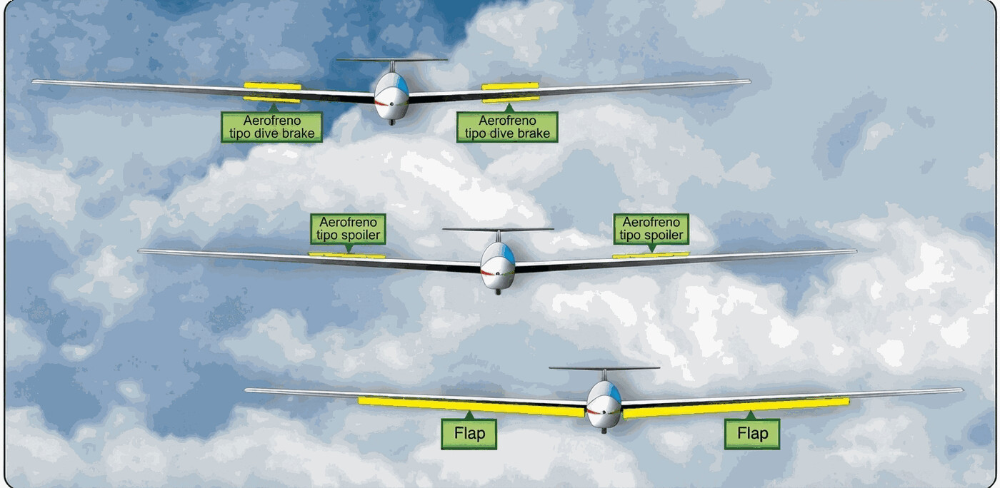

# Mandos de vuelo

> Entre tu mano y el alerón hay varios metros de varillas, rótulas y cables. Conocer ese recorrido es lo que te permite detectar en tierra la holgura, el roce o el mando invertido que en vuelo ya no tendría remedio.
>
>
> En este capítulo aprenderás:
>
>
> * **Los mandos primarios**: alerones, profundidad y dirección, y cómo se transmiten (varillas y cables).
> * **Los aerofrenos**: el mando azul y su efecto sobre la senda de planeo.
> * **Los flaps**: posiciones positivas y negativas en veleros de rendimiento.
> * **El compensador (**trim**)**: de muelles o de pestaña, y por qué es tu mejor aliado.
> * **La comprobación de libertad y sentido de mandos** antes de cada despegue.

Un planeador se pilota con la punta de los dedos. Esa precisión de los mandos es lo que te deja centrar una térmica estrecha o clavar una aproximación. Y entender cómo viaja tu movimiento desde la cabina hasta las superficies de control es lo que te permite cazar cualquier anomalía antes de despegar.

## Los mandos primarios

Controlan el planeador en sus tres ejes:

* **Alerones**: gobiernan el alabeo (eje longitudinal). Se mueven de forma asimétrica (uno sube, otro baja) para inclinar el velero.
* **Elevador o timón de profundidad**: gobierna el cabeceo (eje transversal). Al tirar de la palanca, el elevador sube, la cola baja y el morro se levanta.
* **Timón de dirección**: gobierna la guiñada (eje vertical) con los pedales. Es esencial para coordinar los virajes y compensar la guiñada adversa de los alerones.

La mayoría de los planeadores modernos usan varillas rígidas (*push-rods*) para la profundidad y el alabeo, por su precisión y su falta de holguras, mientras que el timón de dirección suele ir con cables de acero de alta resistencia.

## Aerofrenos (spoilers)

El mando azul de la cabina acciona los aerofrenos. Su función es destruir parte de la sustentación y aumentar la resistencia, lo que te permite variar la pendiente de planeo sin tener que cambiar mucho la velocidad.

::: {.callout-note title="Airmanship"}
Al sacar los aerofrenos, la mayoría de los planeadores bajan un poco el morro o vibran ligeramente. Anticípate y compensa ese cambio de actitud con el elevador para no perder la velocidad de aproximación.
:::

## Los flaps

En los veleros de competición y en los biplazas de rendimiento, los flaps modifican la curvatura del ala:

* **Posiciones positivas**: aumentan la sustentación; van bien para girar en térmicas lentas y para el aterrizaje.
* **Posiciones negativas**: reducen la curvatura y la resistencia; permiten correr entre térmicas con una pérdida de altura mínima.

## El compensador (trim)

El mando verde, o el pulsador eléctrico que libera la carga de la palanca, es tu mejor aliado. El compensador no "vuela" el avión: alivia la presión que tendrías que hacer sobre el elevador para mantener una velocidad dada.

* **Trim de muelles**: el más común; unos resortes "sujetan" la palanca en la posición deseada.
* **Trim de pestaña**: una pequeña superficie en el borde de salida del elevador que se mueve en sentido contrario.

::: {.callout-note title="Airmanship"}
Los mandos de cabina siguen un código de colores casi universal que conviene reconocer al instante: **azul** para los aerofrenos, **verde** para el compensador, **amarillo** para la suelta del cable de remolque y **rojo** para las palancas de emergencia (suelta de cúpula, aperturas). Localízalos en cada planeador antes de volar.
:::

::: {.callout-warning title="Seguridad"}
Antes de cada despegue, comprueba siempre la libertad y el sentido de los mandos. Lleva todas las superficies a sus topes y verifica a la vista que se mueven en la dirección correcta. Un mando invertido tras un mantenimiento es una emergencia crítica, y se manifiesta justo al despegar.
:::

{#fig-08-cap05-sistema-mandos}

**Resumen del capítulo: mandos de vuelo**

* **Mandos primarios**: alerones (alabeo), profundidad (cabeceo) y dirección (guiñada). Varillas rígidas para alabeo y profundidad; cables para la dirección. Revisa holguras, tensión y deshilachados en la inspección.
* **Código de colores**: azul (aerofrenos), verde (compensador), amarillo (suelta de remolque), rojo (emergencia). Casi universal; reconócelo al instante.
* **Aerofrenos**: mando azul. Destruyen sustentación y aumentan resistencia para controlar la senda. Al sacarlos, el morro tiende a bajar: compensa con profundidad.
* **Flaps**: positivos para térmica y aterrizaje; negativos para transiciones rápidas. Solo en veleros de rendimiento.
* **Compensador (trim)**: mando verde. No vuela el avión: alivia la presión de palanca para una velocidad dada. Ajústalo en cada fase del vuelo.
* **Libertad y sentido**: comprobación completa de mandos antes de cada despegue. Un mando invertido tras un mantenimiento es mortal.
