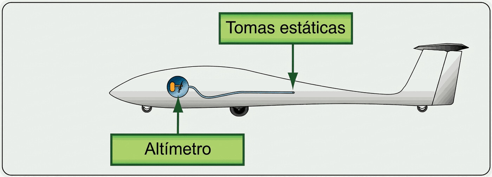

# Instrumentos

> El panel de un planeador es austero: tres instrumentos de presión, una radio y poco más. Por eso mismo, entender qué mide cada uno y cómo falla es imprescindible.
>
>
> En este capítulo aprenderás:
>
>
> * **El sistema pitot-estática**: las tomas de presión que alimentan los instrumentos básicos.
> * **El trío básico**: anemómetro (y sus arcos de colores), altímetro y variómetro.
> * **El equipamiento mínimo exigido**: qué instrumentos obliga a llevar la norma según el tipo de vuelo.
> * **El variómetro de energía total**: por qué ignora los "palancazos" y solo marca el aire que sube.
> * **La aviónica de seguridad**: radio VHF, transpondedor y FLARM.

Los instrumentos son los "sentidos" del piloto. Buena parte del vuelo sin motor se basa en la percepción (el ruido del aire, la posición del morro, la presión en el asiento), pero los instrumentos aportan la precisión que hace falta para exprimir el rendimiento y volar seguro.

## Tomas de presión: pitot y estáticas

Casi todos los instrumentos básicos funcionan midiendo presiones de aire:

* **Toma pitot**: normalmente en el morro o en el borde de ataque de la deriva. Mide la presión total (estática más dinámica) que produce el movimiento.
* **Tomas estáticas**: pequeños orificios en los laterales del fuselaje que miden la presión ambiente del aire, sin influencia de la velocidad.

::: {.callout-warning title="Seguridad"}
Las tomas de presión son un imán para los insectos. Un nido de araña en el pitot hará que tu anemómetro marque cero en pleno despegue. Pon fundas protectoras en tierra y comprueba que las tomas están limpias en la inspección prevuelo. Y no soples nunca directamente en ellas: la sobrepresión revienta las delicadas membranas de los instrumentos.
:::

## El trío básico: anemómetro, altímetro y variómetro

1. **Anemómetro (velocímetro)**: muestra la velocidad indicada (*IAS*). Es el instrumento más importante para la seguridad; si falla, guíate por el ruido del aire y la actitud del morro.
2. **Altímetro**: funciona como un barómetro calibrado en pies o metros. Indica la altura sobre una referencia (QNH o QFE).
3. **Variómetro**: indica la velocidad vertical. En un planeador es vital para saber si estás en aire que sube (térmica) o que baja.

### Los arcos de colores del anemómetro

La esfera del anemómetro lleva marcas de color que resumen las limitaciones de velocidad del planeador:

* **Arco verde**: rango de operación normal, desde 1,1 veces la velocidad de pérdida hasta la **V~RA~**, la velocidad máxima en aire turbulento (CS 22.1545). No la confundas con la velocidad de maniobra (V~A~): esa es un límite estructural que no se marca en la esfera (se estudia en el **Libro 5 — Principios de vuelo**, capítulo 5).
* **Arco amarillo**: rango de precaución, de la V~RA~ a la V~NE~. Solo con aire en calma y movimientos de mando suaves.
* **Línea roja radial**: la V~NE~ (Velocidad Nunca Exceder). Es un límite absoluto, nunca un objetivo.
* **Triángulo amarillo**: en muchos veleros marca la velocidad de aproximación recomendada con masa máxima sin lastre.

Estas marcas se complementan con las velocidades de remolque y torno indicadas en la placa de limitaciones y en el Manual de Vuelo. Y ojo en vuelo de onda a gran altitud: la V~NE~ **indicada** disminuye; el porqué se explica en el **Libro 5, capítulo 5**.

## Instrumentos exigidos por la normativa

No todos los instrumentos del panel son obligatorios. La normativa europea fija un mínimo que depende del tipo de vuelo, y obliga a llevar más cuanto peores son las condiciones de visibilidad.

::: {.callout-important title="Normativa"}
**SAO.IDE.105** exige a todo planeador medios para medir y mostrar la hora (en horas y minutos), la altitud de presión y la velocidad aerodinámica indicada. Los planeadores motorizados llevan además rumbo magnético.

Para volar en condiciones de nebulosidad (nubes) o de noche se añaden tres: la velocidad vertical, la actitud o el viraje y resbale, y el rumbo magnético. El vuelo nocturno exige, además, luces de navegación, anticolisión, de aterrizaje y de cabina.
:::

## Variómetro de energía total (TE)

Si tiras de la palanca, el planeador sube pero pierde velocidad. Un variómetro normal marcaría ascenso, cuando en realidad no has encontrado ninguna térmica: solo has cambiado velocidad por altura. El **variómetro de energía total** (compensado con un Venturi o una antena especial) ignora esos cambios provocados por el piloto y solo marca ascenso cuando es la masa de aire la que de verdad te empuja hacia arriba.

Los variómetros electrónicos modernos añaden señales acústicas (pitidos) que te dejan centrar la térmica sin apartar la vista del cielo, lo que también mejora la vigilancia del tráfico.

## Aviónica: comunicación y seguridad

* **Radio VHF**: fundamental para coordinarte en el aeródromo y con el control de tráfico. Úsala con brevedad para ahorrar batería.
* **Transpondedor**: hace visible al planeador para los radares de los controladores y para los sistemas anticolisión (TCAS) de los aviones comerciales.
* **FLARM**: el sistema estrella del vuelo sin motor. Avisa de otros planeadores cercanos y de posibles rumbos de colisión con señales visuales y sonoras.

Algunos planeadores montan además una brújula magnética y, como "instrumento" más barato y fiable de todos, el hilo de lana pegado a la cúpula, que canta el vuelo cruzado mejor que cualquier aguja. El magnetismo y el uso de la brújula se tratan en el **Libro 9 — Navegación**, capítulo 2; el hilo de lana, en el **Libro 5 — Principios de vuelo**, capítulo 4.

{#fig-08-cap06-panel-pitot}

::: {.postit}
**Resumen del capítulo: instrumentos**

* **Pitot y estática**: los sentidos del avión. El pitot (morro/cola) mide presión total; las estáticas (fuselaje), presión ambiente. Si se bloquean (insectos, agua), te quedas ciego de velocidad y altura.
* **Anemómetro**: conoce tus arcos de color. Verde: normal, hasta la V~RA~ (velocidad máxima en aire turbulento). Amarillo: precaución, de la V~RA~ a la V~NE~ (solo aire calmo). Línea roja: V~NE~, peligro de muerte. Triángulo amarillo: velocidad de aproximación con masa máxima sin lastre.
* **Equipamiento mínimo (SAO.IDE.105)**: hora, altitud de presión y velocidad indicada para todo planeador (más rumbo magnético si es motorizado). Para nubes o noche se añaden velocidad vertical, actitud/viraje-resbale y rumbo magnético.
* **Altímetro**: recuerda calarlo. QNH para altitud sobre el nivel del mar (rutas, espacios aéreos); QFE para altura sobre el campo (circuito).
* **Variómetro (energía total)**: la herramienta clave. Ignora los "palancazos" (que cambian velocidad por altura) y solo te dice si la masa de aire sube o baja.
* **Aviónica**: radio VHF, transpondedor y FLARM. El FLARM es la red de seguridad anticolisión del vuelo sin motor.
:::

