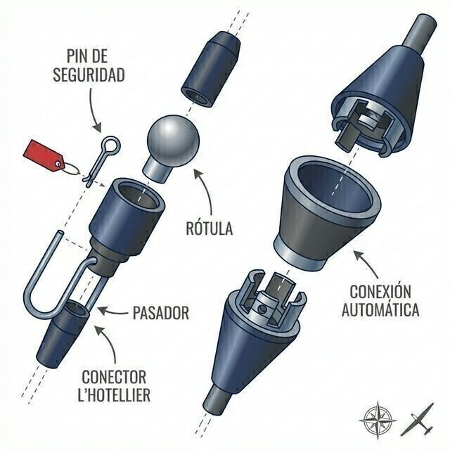

# Montaje de la aeronave, conexión de superficies de control

> Cada vez que montas un planeador estás reconstruyendo una aeronave. Los accidentes por conexiones olvidadas se repiten desde hace décadas, y todos comparten el mismo patrón: prisa, distracción y ninguna verificación final.
>
>
> En este capítulo aprenderás:
>
>
> * **El proceso de montaje**: el orden correcto y los cuidados con tetones y bulones.
> * **Las conexiones de mandos**: automáticas y manuales (L’Hotellier), y por qué las segundas exigen pin de seguridad.
> * **Los pasadores y seguros** de la unión ala-fuselaje.
> * **El Positive Control Check (PCC)**: la verificación con asistente que cierra el montaje.
> * **El cintado**: por qué las cintas de las juntas no son estética.

El montaje o **rigging** es una de las fases más críticas para la seguridad. Un planeador mal ensamblado se comporta de forma imprevisible o, en el peor de los casos, sufre un fallo catastrófico en vuelo. Tus mejores herramientas son la disciplina y seguir al pie de la letra el Manual de Vuelo (AFM).

## El proceso de montaje

Cada modelo tiene sus particularidades, pero el orden general suele ser este:

1. **Fuselaje**: se saca del remolque y se asegura en su cuna o borriqueta, en posición vertical.
2. **Alas**: se insertan los largueros en el fuselaje en el orden exacto especificado por el manual de vuelo (dependiendo del diseño de solapamiento de los largueros, primero la izquierda o la derecha). Antes de introducirlas, limpia y engrasa ligeramente los tetones y bulones de unión.
3. **Estabilizador horizontal**: el plano de profundidad se monta al final, asegurando su fijación mecánica.

## Conexiones de mandos

Según la antigüedad del planeador, las conexiones de alerones, aerofrenos y profundidad pueden ser de dos tipos:

* **Conexiones automáticas**: al encastrar el ala o el estabilizador, los mandos se conectan solos mediante embudos o rótulas integradas. Son las más seguras.
* **Conexiones manuales (L’Hotellier)**: obligan al piloto a conectar a mano una rótula. Son conexiones críticas y han causado numerosos accidentes por olvido.

::: {.callout-warning}
⚠ **SEGURIDAD**

Si tu planeador usa conectores L’Hotellier, el pin de seguridad (imperdible) que bloquea el conector es de obligado cumplimiento en los modelos afectados por la directiva de aeronavegabilidad correspondiente. No te fíes nunca del "clic" del muelle: es el pin el que garantiza que la unión no se suelte por las vibraciones del vuelo.
:::

## Pasadores y seguros

La unión principal entre las alas y el fuselaje se hace con bulones o pasadores (*pins*). Deben entrar con suavidad; no uses fuerza bruta ni martillos, porque dañarías los casquillos. Una vez dentro, tienen que quedar bloqueados por sus propios seguros o por pasadores adicionales.

## El cintado de juntas

Después del montaje, las juntas entre ala y fuselaje, y las del estabilizador, se sellan con cinta adhesiva específica. No es por estética: el cintado elimina fugas de aire que generan resistencia y ruido, y mejora bastante el rendimiento a baja velocidad. Usa cinta en buen estado y vigila que no se despegue por los bordes; una cinta suelta vibrando en vuelo puede hacerte pensar en problemas más serios de los que hay.

## Verificación final: el Positive Control Check (PCC)

Con el avión montado, no vueles nunca sin hacer un chequeo de mandos positivo con un asistente:

1. El piloto se sienta en la cabina y mueve los mandos.
2. El asistente sujeta con firmeza la superficie (el alerón, por ejemplo) e intenta impedir su movimiento.
3. Se trata de comprobar no solo que la superficie se mueve en el sentido correcto, sino que la conexión es firme, sólida y sin holguras.

::: {.callout-tip}
✦ **REGLA DE ORO**

Si durante el montaje alguien te interrumpe para hablar, vuelve a empezar el paso en curso desde el principio. Las distracciones durante el rigging son la causa número uno de conexiones críticas olvidadas.
:::

{#fig-08-cap07-conectores-mandos}

**Resumen del capítulo: montaje y rigging**

* **Verificación de mandos**: tras montar, el test de "mando positivo" (PCC) es obligatorio. Una persona sujeta la superficie (el alerón) y tú intentas mover la palanca. Debe ofrecer resistencia sólida. Si se mueve libre, no está conectado.
* **Bulones principales**: son el seguro de vida de las alas. Deben entrar limpios y quedar asegurados (imperdibles o seguros R).
* **L’Hotellier**: conexión manual crítica. Pin de seguridad siempre; el clic del muelle no basta.
* **Cintado**: tapar las juntas ala-fuselaje no es solo estética; reduce el ruido y mejora bastante el rendimiento a baja velocidad.
* **Carga suelta**: un clásico error mortal es dejar herramientas o pesos sueltos en el fuselaje tras el montaje. Pueden desplazarse en vuelo y bloquear los mandos.
