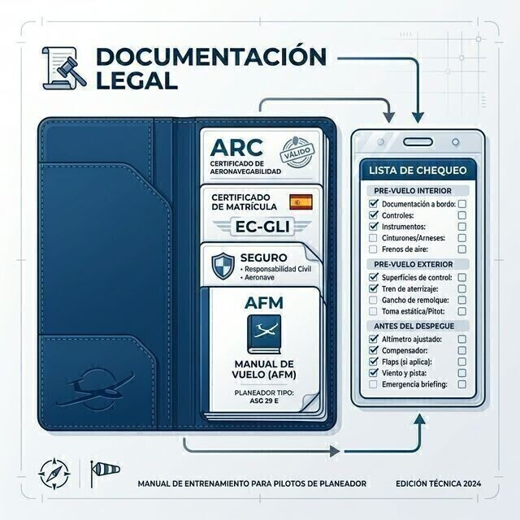

# Manuales y documentos

> Un planeador legalmente impecable importa tanto como uno mecánicamente impecable: sin los papeles en regla, ni el seguro ni el certificado de aeronavegabilidad te cubren.
>
>
> En este capítulo aprenderás:
>
>
> * **El Manual de Vuelo (AFM)**: qué contiene y por qué es el documento maestro.
> * **La documentación a bordo y en el aeródromo** según SAO.GEN.155, y la excepción para vuelos locales.
> * **Las listas de chequeo**: CB-SIFT-CBE y la disciplina de leer, comprobar y confirmar.
> * **El diario de la aeronave**: la historia clínica del planeador.

Volar no es solo pilotar: también es gestionar la parte legal y la información técnica de la aeronave. El piloto que no conoce las limitaciones de su máquina, o que vuela sin los papeles en regla, se expone a riesgos operativos y a sanciones.

## El Manual de Vuelo (AFM / SFM)

El **Manual de Vuelo** (*AFM, Aircraft Flight Manual*, también *SFM, Sailplane Flight Manual*, en los veleros) es el documento maestro. No es un manual de usuario genérico, sino un documento legalmente ligado a la matrícula de tu planeador. En él encontrarás:

* **Limitaciones**: velocidades (V~NE~ (Velocidad Nunca Exceder), V~A~ (Velocidad de Maniobra)), factores de carga, pesos máximos.
* **Procedimientos de emergencia**: qué hacer ante un fuego, una rotura de cable o un fallo de mandos.
* **Rendimiento**: tablas de planeo, distancias de despegue y aterrizaje.
* **Peso y centrado**: límites del centro de gravedad.

## Documentación a bordo y en el aeródromo

La normativa europea de operaciones con veleros distingue entre lo que debe ir en el planeador y lo que puede quedarse en el aeródromo:

**A bordo en cada vuelo (originales o copias):**

* Manual de Vuelo (AFM) o documento equivalente.
* Cartas aeronáuticas actualizadas y adecuadas para la zona del vuelo.
* Información sobre procedimientos y señales visuales de interceptación.
* Detalles del plan de vuelo ATS presentado, si procede.
* Licencia de piloto, certificado médico, documento de identidad con fotografía y datos suficientes del libro de vuelo (los exige la normativa de licencias, SFCL.045).

**En el aeródromo o lugar de operación (disponibles):**

* Certificado de matrícula (CoR).
* Certificado de aeronavegabilidad (CoA) con sus anexos y el certificado de revisión (ARC).
* Certificado de niveles de ruido (si es un motovelero).
* Licencia de estación de radio de la aeronave (si lleva equipo de radio).
* Seguro de responsabilidad civil en vigor.
* Libro de a bordo o registro equivalente.

::: {.callout-important}
⚖ **NORMATIVA**

**SAO.GEN.155** exige llevar a bordo en cada vuelo el AFM, las cartas actualizadas y la información de señales de interceptación; los certificados (matrícula, aeronavegabilidad, ARC, seguro, licencia de radio) pueden quedarse en el aeródromo. Hay una excepción: en los vuelos que se mantengan a la vista del aeródromo, o dentro de la distancia que fije la autoridad competente, toda la documentación (incluido el AFM) puede quedarse en tierra. Lo mismo vale para la licencia y el certificado médico del piloto (SFCL.045).
:::

## Listas de chequeo (checklists)

La memoria humana falla, sobre todo bajo estrés o con distracciones. Usar listas de chequeo de forma sistemática es lo que separa a un piloto serio de un aficionado.

Hay varios tipos de chequeo:

1. **Inspección prevuelo**: recorrido visual, exterior e interior, según el AFM.
2. **Chequeo de cabina**: justo antes de despegar. La mnemotecnia europea estándar es **CB-SIFT-CBE**; en muchos clubes españoles se usa también la tradicional **CRISE**. Ambas se desarrollan en el **Libro 6 — Procedimientos operativos**, capítulo 1.
3. **Chequeo de viento en cola**: antes de la toma (mnemotecnias FUSTALL o WULF, detalladas en el **Libro 6 — Procedimientos operativos**, capítulo 4).

::: {.callout-tip}
✦ **REGLA DE ORO**

No recites la lista de memoria. Lee cada punto, comprueba físicamente el mando o el instrumento y confirma en voz alta su estado. Si te saltas un paso, empieza la lista de nuevo.
:::

## Diario de la aeronave y mantenimiento

Cada hora de vuelo y cada aterrizaje quedan registrados en el **Diario de la Aeronave**. Es lo que permite seguir las inspecciones del programa de mantenimiento, y es la historia clínica del planeador. No despegues si la aeronave tiene una avería abierta que afecte a la seguridad o si ya han vencido las horas o el plazo de la próxima inspección programada.

{#fig-08-cap08-documentos-bordo}

**Resumen del capítulo: documentación del avión**

* **Manual de Vuelo (AFM)**: a bordo en cada vuelo (salvo vuelos a la vista del aeródromo). Contiene los límites (V~NE~, factores de carga), los procedimientos de emergencia y las tablas de carga. Léelo antes de volar un modelo nuevo.
* **Certificados**: el avión necesita certificado de aeronavegabilidad, ARC en vigor, seguro y licencia de estación de radio. Pueden quedarse en el aeródromo (SAO.GEN.155). Sin ARC en vigor, el seguro no cubre nada.
* **Chequeos**: CB-SIFT-CBE antes de despegar, FUSTALL/WULF en viento en cola. Lee, comprueba y confirma; nunca de memoria.
* **Diario técnico**: antes de volar, mira que no haya averías pendientes que te afecten. Al acabar, anota tu vuelo y cualquier incidencia.
