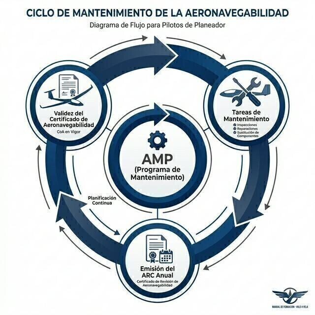

# Aeronavegabilidad y mantenimiento

> La aeronavegabilidad no es un papel que consigues una vez: es un estado que se mantiene vuelo a vuelo, inspección a inspección.
>
>
> En este capítulo aprenderás:
>
>
> * **El CoA y el ARC**: los dos certificados que permiten despegar legalmente, y cómo se renueva o prorroga el ARC.
> * **Part-ML y Part-CAO**: el marco simplificado de mantenimiento de la aviación ligera europea.
> * **El mantenimiento del piloto-propietario**: qué tareas puedes firmar tú mismo y con qué condiciones.
> * **Las AD y los SB**: las órdenes de obligado cumplimiento y las recomendaciones del fabricante.

La **aeronavegabilidad** es la condición legal y técnica que certifica que una aeronave es segura para volar. No es algo estático: mantener un planeador aeronavegable exige vigilancia constante, un programa de mantenimiento riguroso y cumplir al pie de la letra la normativa europea.

## El CoA y el ARC: la "ITV" del cielo

Para que un planeador despegue legalmente necesita dos documentos clave:

1. **Certificado de aeronavegabilidad (CoA)**: es el "DNI" técnico de la aeronave. Describe sus características y certifica que el modelo es apto para el vuelo. Suele ser vitalicio, siempre que el avión se mantenga como debe.
2. **Certificado de revisión de la aeronavegabilidad (ARC)**: es la validación periódica del CoA, con validez de un año. Lo emite una organización autorizada (CAMO o CAO) o personal de certificación independiente tras revisar la aeronave y sus registros.

::: {.callout-important title="Normativa"}
Según **ML.A.901**, el ARC tiene validez anual, pero puede prorrogarse dos veces consecutivas (un año cada vez) sin revisión completa si la aeronave ha permanecido en un **entorno controlado**: gestión continua por una CAMO/CAO y mantenimiento hecho por organizaciones aprobadas. Tras esas dos prórrogas toca revisión de aeronavegabilidad completa.
:::

Este capítulo es el desarrollo técnico completo del CoA y el ARC; su vertiente jurídica —qué documentos son obligatorios a bordo y la responsabilidad legal de volar con ellos en vigor— se estudia en el **Libro 1 — Derecho aéreo**, capítulo 2.

## Normativa EASA: Part-ML y Part-CAO

La aviación ligera se rige por normas simplificadas, que recortan la carga burocrática sin bajar la guardia en seguridad:

* **Part-ML**: la normativa específica para veleros y aviones ligeros. Permite que el Programa de Mantenimiento de la Aeronave (AMP) lo declare el propio propietario, que asume así más responsabilidad sobre su avión.
* **Part-CAO**: regula a las organizaciones autorizadas a hacer el mantenimiento y a gestionar la aeronavegabilidad de forma combinada.

Cuando el AMP se basa en el **Programa Mínimo de Inspección (MIP)** que recoge la propia Part-ML (ML.A.302), este fija un suelo regulatorio: una inspección al menos **anual o cada 100 horas de vuelo, lo que antes se cumpla**. El AMP puede ser más exigente —lo que diga el fabricante—, pero nunca menos que ese mínimo.

## Mantenimiento del piloto-propietario

EASA te deja, como piloto y propietario, hacer ciertas tareas de mantenimiento sencillas sin pasar por un taller certificado: cambiar neumáticos, limpiar filtros, sustituir bujías (en motoveleros) o lubricar, entre otras. Las recoge el Apéndice II de Part-ML, junto con lo que diga el programa de mantenimiento de tu aeronave.

::: {.callout-important title="Normativa"}
Solo puedes firmar tareas de piloto-propietario si eres el propietario (o copropietario) legal de la aeronave y tienes una licencia de piloto válida (ML.A.803). Y todas las tareas deben quedar registradas y firmadas en el Diario de la Aeronave, con tu número de licencia.
:::

## AD y SB: órdenes de obligado cumplimiento

La seguridad aérea es cosa de todos. Cuando se detecta un fallo de diseño o un problema en un modelo concreto, aparecen dos figuras:

* **Directiva de aeronavegabilidad (AD)**: la emite EASA y es obligatoria por ley. Si un planeador tiene una AD pendiente y no se cumple en plazo, queda en tierra automáticamente (*AOG, Aircraft On Ground*).
* **Boletín de servicio (SB)**: lo emite el fabricante. Suelen ser recomendaciones de mejora. No siempre obligan por ley, pero ignorarlos puede afectar a la seguridad y al valor de reventa del avión.

{#fig-08-cap09-ciclo-mantenimiento}

**Resumen del capítulo: mantenimiento y aeronavegabilidad**

* **Inspección diaria (DI)**: es cosa del piloto. Sigue la lista: presión de ruedas, estado del gancho de remolque, bisagras de mandos, limpieza de pitot y estática.
* **CoA y ARC**: el CoA es vitalicio; el ARC dura un año y se prorroga dos veces en entorno controlado (ML.A.901). Sin ARC en vigor, el avión no vuela.
* **Mantenimiento programado**: la frecuencia concreta de inspecciones (por tiempo, ciclos u horas) la fija el AMP, según lo que diga el fabricante. Pero hay un suelo: si el AMP se basa en el Programa Mínimo de Inspección de Part-ML (ML.A.302), nunca puede ser menos restrictivo que **una inspección anual o cada 100 h, lo que antes se cumpla**.
* **Mantenimiento por piloto-propietario**: tareas sencillas del Apéndice II de Part-ML, solo si eres propietario con licencia válida, y siempre registradas y firmadas (ML.A.803).
* **Reporte de defectos**: si rompes algo o ves algo raro, anótalo. El siguiente piloto puede no verlo y matarse (un cable de timón deshilachado, por ejemplo).
