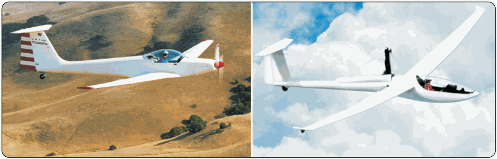

# Estructura, motores y hélices

> El motor le ha dado al vuelo sin motor una red de seguridad contra el aterrizaje fuera de campo, y a cambio le ha sumado nuevos modos de fallo que el piloto tiene que dominar.
>
>
> En este capítulo aprenderás:
>
>
> * **Las configuraciones motorizadas**: sustentador (**turbo**), autolanzable y motovelero de turismo (TMG).
> * **Los tipos de motor**: dos tiempos, cuatro tiempos y eléctricos (FES).
> * **Los sistemas del motor de combustión**: encendido por magnetos, carburación y engelamiento, y combustible.
> * **El mástil retráctil y las hélices** plegables o posicionables, y el paso de pala.
> * **La gestión del motor en vuelo**: secuencia de arranque, alturas de decisión e instrumentación.

El motor ha cambiado el vuelo sin motor: ha roto la dependencia absoluta de los medios de lanzamiento externos y ha aportado una red de seguridad frente a las tomas fuera de campo. A cambio, añade complejidad mecánica y nuevas responsabilidades al piloto.

## Turbo o autolanzable

No todos los motores cumplen la misma función:

* **Sustentador o "turbo"**: un motor pequeño (casi siempre de dos tiempos) sin potencia para despegar. Su misión es sostener el vuelo y devolverte a casa si fallan las térmicas.
* **Autolanzable** (*self-launch*): un motor potente que permite despegar solo desde la pista. Alcanzada la altura deseada, se apaga y se guarda por completo.
* **Motovelero de turismo (TMG)**: aeronaves con motor fijo (no escamoteable), como la Super Dimona, a medio camino entre el avión ligero y el planeador.

## Tipos de motor

1. **Motores de 2 tiempos**: muy habituales en sistemas escamoteables por su ligereza y su potencia. Necesitan mezcla de gasolina y aceite, y son más ruidosos y vibran más que los de 4 tiempos.
2. **Motores eléctricos (FES)**: la gran novedad. Usan una hélice plegable en el morro y baterías de litio. Son fiabilísimos, silenciosos y de arranque instantáneo.
3. **Motores de 4 tiempos**: sobre todo en motoveleros TMG. Más pesados, pero más eficientes y mecánicamente más fiables.

## Sistemas del motor de combustión

Los motoveleros (TMG) y los autolanzables con motor de combustión añaden tres sistemas que el piloto debe entender, porque sus fallos tienen procedimientos propios.

### Encendido: los magnetos

El encendido lo generan los *magnetos*, no la batería. Un magneto es un generador autónomo: mientras el cigüeñal gire, produce por sí mismo la alta tensión que necesitan las bujías, con independencia de la batería y del alternador. Por eso el motor sigue funcionando aunque falle el sistema eléctrico. Los motores de aviación montan encendido *dual* (dos magnetos y dos bujías por cilindro) por seguridad y rendimiento; antes del vuelo se hace la prueba de magnetos, comprobando la pequeña caída de RPM al dejar uno solo en funcionamiento.

::: {.callout-warning title="Seguridad"}
Como el magneto genera corriente por sí mismo, para detenerlo hay que poner a masa (cortocircuitar) su devanado primario. Un magneto con el cable de masa roto puede dejar el motor "vivo" aunque el contacto esté en *OFF*: trata siempre la hélice como si pudiera arrancar.
:::

### Carburación y engelamiento

Muchos motores alimentan los cilindros con un carburador. Al expandirse el aire y vaporizarse el combustible, la mezcla se enfría, y esa caída de temperatura puede congelar la humedad del aire dentro del carburador: es el *engelamiento del carburador*. El riesgo es mayor entre −7 °C y +21 °C con humedad alta, y su primer síntoma es una caída de RPM.

Para deshacerlo se usa la *calefacción del carburador*, que mete aire caliente del colector de escape. Resta potencia, así que se usa con criterio: nunca en el despegue, lo justo en tierra, en crucero solo si hay riesgo de engelamiento, y antes de reducir potencia en la aproximación.

### Combustible

Los motoveleros usan AVGAS (gasolina de aviación, con plomo) o MOGAS (gasolina de automoción), siempre el que indique el AFM. Antes de volar se drena una muestra para descartar agua o impurezas, que pueden parar el motor: el agua, más densa, se deposita en el fondo del *tester*. En cuanto a la cantidad, la norma (SAO.OP.120) exige combustible suficiente para completar el vuelo con seguridad; la práctica prudente es no despegar nunca con menos de 30-45 minutos de reserva.

## La hélice y el mástil (pylon)

En la mayoría de los autolanzables, el motor va montado en un mástil retráctil (*pylon*) detrás del piloto.

* **Hélices retráctiles**: las palas se paran en una posición vertical precisa (con un sensor de posición o un tope mecánico) para poder guardarse dentro del fuselaje.
* **Hélices plegables (FES)**: en el morro, la fuerza centrífuga las abre al girar y la presión del aire las pliega contra el fuselaje cuando el motor se detiene.

Según el paso de pala, la hélice puede ser de *paso fijo* (el ángulo de pala no cambia: sencilla y robusta) o de *paso variable / velocidad constante* (un regulador ajusta el ángulo: paso corto y más RPM para el despegue, paso largo para el crucero eficiente).

## Gestión y operación del motor

Manejar el motor de un planeador exige disciplina. La secuencia de arranque (extracción, apertura de puertas, encendido de la bomba de combustible, arranque) tiene que estar perfectamente memorizada.

::: {.callout-warning title="Seguridad"}
Con el motor extraído, la relación de planeo cae en picado por la resistencia del mástil. Si el motor no arranca tras sacarlo, tienes que estar a altura suficiente para hacer la toma de emergencia con el motor fuera, o para retraerlo a tiempo. Elige siempre el campo antes de intentar el arranque: el motor es el plan B, nunca el plan A.
:::

## Instrumentación y combustible

La unidad de control electrónica (como el ILEC) gestiona las RPM y las temperaturas de cilindro (CHT) y de gases de escape (EGT). El piloto de motovelero debe vigilar de cerca el nivel de combustible y la temperatura, porque un motor de dos tiempos es muy sensible al sobrecalentamiento.

{#fig-08-cap10-motor-retractil}

::: {.postit}
**Resumen del capítulo: motoveleros y sistemas retráctiles**

* **Complejidad**: un motor añade peso, complejidad y modos de fallo. El arranque en vuelo consume altura; por eso la cota mínima para intentarlo son 300 m (ver **Libro 6 — Procedimientos operativos**, capítulo 2).
* **Fallo de arranque**: ten siempre un campo elegido antes de intentar arrancar. Si el motor no sale o no prende, te queda un planeador con un "freno de aire" gigante (el pilón): el planeo se reduce a la mitad.
* **Shock cooling**: no pares el motor de golpe tras una subida a plena potencia. Déjalo enfriar al ralentí, o planeando con el motor fuera unos minutos, para evitar grietas en la culata.
* **Hélice**: asegúrate de que está frenada y vertical antes de retraer. El espejo es tu amigo. Paso fijo o paso variable (velocidad constante), según el modelo.
* **Motor de combustión**: el encendido por magnetos es independiente de la batería (para pararlo, se pone a masa el primario). Vigila el engelamiento del carburador (−7 a +21 °C con humedad; primer síntoma, caída de RPM) y drena el combustible antes de volar.
:::

