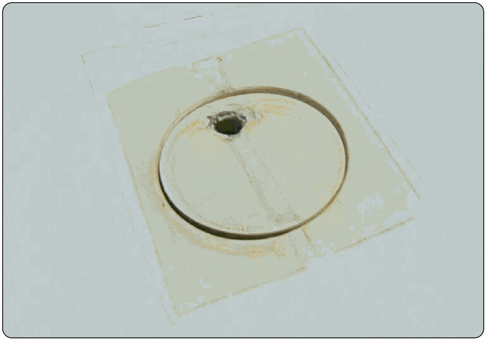

# Sistemas de lastre con agua

> El agua en las alas es el "turbo" de los días de térmicas fuertes: más carga alar, más velocidad de crucero. Pero un sistema de lastre mal gestionado convierte esa ventaja en una emergencia.
>
>
> En este capítulo aprenderás:
>
>
> * **Para qué sirve el lastre**: carga alar y desplazamiento de la polar de velocidades.
> * **Los componentes del sistema**: tanques o bolsas, válvulas de descarga y respiraderos.
> * **El llenado y el vaciado**: simetría, tiempos y comprobaciones.
> * **Los riesgos**: congelación, vaciado asimétrico y aterrizaje con agua.
> * **El lastre de cola**: el contrapeso que restaura el centrado óptimo.

El lastre de agua (**water ballast**) es lo que permite a los planeadores de competición ajustar su peso a las condiciones del día. Con más peso, el velero vuela más rápido perdiendo menos altura, algo decisivo para hacer grandes distancias cuando las térmicas son potentes.

## Para qué sirve: carga alar y velocidad

Añadir agua aumenta la **carga alar**, y eso desplaza la polar de velocidades hacia la derecha: la velocidad de planeo óptima sube y las transiciones entre térmicas son mucho más rápidas. Tiene un precio: el planeador trepa peor en las térmicas flojas y su velocidad de pérdida es mayor. El efecto del lastre sobre la polar se desarrolla en el **Libro 7 — Planificación y rendimiento**, capítulo 2.

## Componentes del sistema

El sistema es sencillo de concepto, pero exige un mantenimiento escrupuloso:

* **Tanques o bolsas**: en el interior de las alas, cerca del larguero. Pueden ser bolsas de goma o compartimentos estancos integrados en la estructura.
* **Válvulas de descarga**: vacían el agua al exterior. Se accionan desde la cabina, normalmente con una palanca pequeña.
* **Respiraderos**: orificios que dejan entrar aire mientras sale el agua. Si uno se bloquea, la succión puede dañar la estructura del ala.

## Llenado y vaciado

El llenado se hace por unos orificios en el extradós del ala. Es clave que los dos planos carguen la misma cantidad de agua, para mantener la simetría lateral.

El vaciado en vuelo suele tardar entre 3 y 8 minutos, según el planeador. Al abrir las válvulas verás dos estelas de agua saliendo de las alas: la confirmación de que el sistema funciona.

::: {.callout-warning}
⚠ **SEGURIDAD**

Vacía el lastre de agua antes de aterrizar; es una limitación operativa del Manual de Vuelo. El planeador no está diseñado para encajar las cargas de impacto de una toma con los tanques llenos. Además, aterrizar con agua alarga mucho la carrera de frenado y aumenta el riesgo de daños estructurales si chocas contra un obstáculo.
:::

## Riesgos y limitaciones

1. **Congelación**: no cargues agua si vas a volar por encima de la cota de congelación (0 °C). Al congelarse, el agua aumenta de volumen y puede reventar los tanques o bloquear las válvulas.
2. **Asimetría**: si una válvula se bloquea y solo se vacía un ala, tendrás un desequilibrio lateral peligroso. Vuela algo más rápido para conservar el control y prepárate para una toma con un ala "pesada".
3. **Humedad**: vacía siempre los tanques después del vuelo y deja que se sequen, para evitar moho y corrosión en las válvulas.

## Lastre de cola

Para compensar el desplazamiento del centro de gravedad que provoca el agua de las alas, algunos planeadores llevan un pequeño depósito en la deriva. Al llenar ese tanque de cola, se recupera el equilibrio óptimo del velero para volar rápido.

{#fig-08-cap11-lastre-agua}

**Resumen del capítulo: lastre de agua**

* **Para qué sirve**: aumentar la carga alar y desplazar la polar a la derecha (correr más con el mismo ángulo de planeo). Solo merece la pena con térmicas fuertes.
* **Riesgo de hielo**: el agua se expande al congelarse. Si subes por encima de la isocero, puede reventar la estructura interna del ala. Vacía antes de subir.
* **Vaciado asimétrico**: si una válvula falla y te quedas con agua en un solo ala, tienes una emergencia grave de control lateral. Aterriza con velocidad extra y cuidado: el avión querrá alabear hacia el ala pesada.
* **Antes de aterrizar**: tira el agua. Aterrizar con lastre castiga el tren y la estructura sin necesidad, y sube la velocidad de toma.
