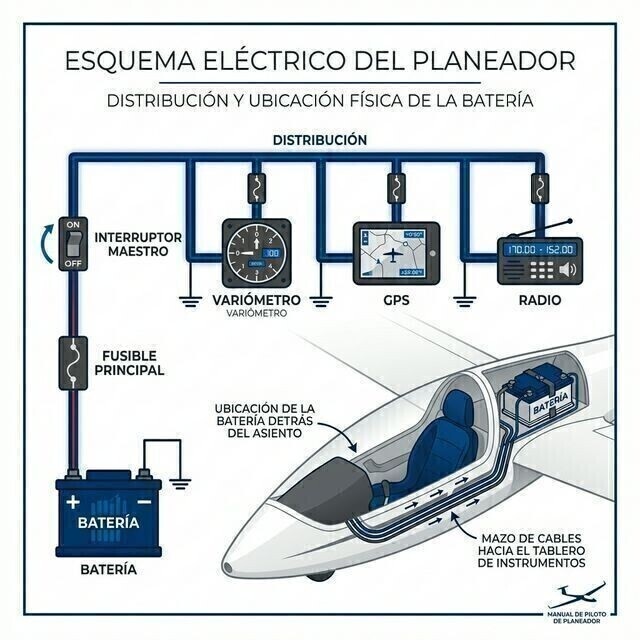

# Baterías

Un planeador vuela sin motor, pero no sin electricidad: la radio, el FLARM, el transpondedor y los variómetros dependen de la batería. Gestionarla bien es gestionar tu seguridad.

En este capítulo aprenderás:

* **Los tipos de batería**: plomo-ácido (gel/AGM) y litio (LiFePO4), con sus ventajas y sus precauciones.
* **La fijación de la batería**: por qué la certificación exige soportes a prueba de impacto.
* **La gestión de la energía en vuelo**: amperios-hora, consumos y el efecto del frío.
* **La protección del sistema**: fusibles y disyuntores.

El planeador vuela sin motor, pero no sin electricidad. La radio, el transpondedor, el FLARM y los variómetros electrónicos necesitan una fuente de energía fiable. En vuelos largos, gestionar la batería es tan importante como gestionar el combustible en un avión a motor.

## Tipos de baterías

En la aviación de recreo predominan dos tecnologías:

* **Plomo-ácido (gel/AGM)**: las más comunes por su bajo coste y su fiabilidad. Van selladas y no necesitan mantenimiento, pero pesan lo suyo (entre 2,5 y 4 kg por unidad).
* **Litio (LiFePO4)**: mucho más ligeras y con una descarga más plana (mantienen el voltaje casi hasta el final). A cambio, piden cargadores específicos y un manejo cuidadoso para evitar incendios por cortocircuito.

## Ubicación y seguridad estructural

La batería suele ir en la sección central del fuselaje, detrás del piloto, o en un compartimento del morro (para ayudar al centrado).

Por su densidad de peso, su fijación es un punto crítico de inspección. Una batería mal sujeta se convierte en un proyectil mortal en un aterrizaje brusco o un accidente.

::: {.callout-important}
⚖ **NORMATIVA**

**CS 22.561(d)** exige que la estructura de soporte retenga cualquier masa que pueda lesionar a un ocupante si se suelta en un aterrizaje de emergencia, soportando las fuerzas de inercia últimas de **CS 22.561(b)(1)**: 15g hacia delante, 9g hacia abajo, 7,5g hacia arriba y 6g lateral. No sujetes nunca la batería con gomas elásticas ni montajes improvisados: usa los soportes o cinchas aprobados por el fabricante y comprueba su firmeza en cada inspección prevuelo.
:::

## Gestión de la energía en vuelo

La capacidad se mide en amperios-hora (Ah). Una batería de 12 Ah puede alimentar, en teoría, un equipo que consuma 1 amperio durante 12 horas.

Pero el rendimiento cae mucho con el frío: a 0 °C te queda en torno al 80 % de la capacidad nominal. Si planeas un vuelo largo en altura, despega con las baterías al 100 %.

Y si vas a volar en nubes (con la habilitación correspondiente), no despegues sin las baterías prácticamente llenas: sin referencias visuales, tus instrumentos son lo único que te mantiene con las alas niveladas, y quedarte sin energía dentro de una nube es una emergencia mayor. La norma no fija un porcentaje concreto; la gestión de la energía disponible es responsabilidad tuya (SAO.OP.145 en los motorizados).

## Protección del sistema: fusibles

Todo el sistema eléctrico tiene que ir protegido para evitar incendios.

* **Fusibles**: se instalan lo más cerca posible del terminal positivo de la batería. Un valor típico en planeadores es de 5 amperios, aunque el correcto es siempre el que indique el esquema eléctrico de tu aeronave.
* **Disyuntores (breakers)**: en planeadores con motor, por el alto consumo del arranque, se usan disyuntores que pueden rearmarse en vuelo.

::: {.callout-tip}
✦ **REGLA DE ORO**

Lleva siempre fusibles de repuesto en el bolsillo de la cabina. Si uno se funde en vuelo, cámbialo una vez. Si vuelve a fundirse, desconecta el equipo afectado: tienes un cortocircuito serio que puede acabar en fuego eléctrico.
:::

{#fig-08-cap12-sistema-electrico}

**Resumen del capítulo: baterías y sistema eléctrico**

* **Tipos**: plomo-ácido/gel (pesadas, robustas, baratas) frente a LiFePO4 (ligeras, voltaje constante, cargador específico).
* **Fusibles**: imprescindibles. Lo más cerca posible del borne de la batería. Un cortocircuito en vuelo sin fusible es fuego en cabina en segundos.
* **Efecto del frío**: las baterías pierden capacidad de golpe con el frío. Una que parece llena en tierra puede morirse rápido en onda a -20 ºC.
* **Vuelo en nubes**: despega con las baterías prácticamente llenas. Sin referencias visuales, los instrumentos son tu vida, y ninguna norma te salvará de una batería vacía dentro de una nube.
* **Fijación**: la batería es un proyectil de varios kilos. Su soporte debe aguantar 15g hacia delante (CS 22.561). Comprueba que su "cinturón de seguridad" está apretado y bloqueado antes de cada vuelo.
