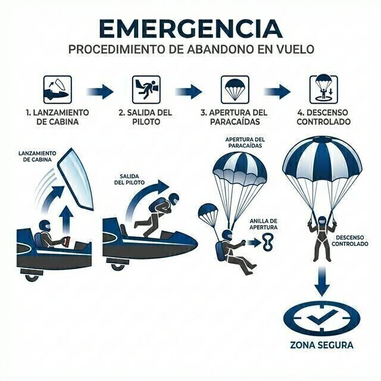

# Paracaídas de emergencia

> El paracaídas de emergencia es el único equipo del planeador que esperas no usar jamás, y justo por eso exige un mantenimiento y un ajuste impecables.
>
>
> En este capítulo aprenderás:
>
>
> * **El paracaídas como sistema**: campana, contenedor, anilla y los enemigos del nylon.
> * **El mantenimiento**: replegado periódico, vida útil y cuidado diario.
> * **La colocación y el ajuste del arnés**: por qué un arnés flojo lesiona.
> * **La secuencia de abandono**, en resumen; su entrenamiento completo está en el **Libro 6 — Procedimientos operativos**, capítulo 8.

El paracaídas de emergencia es el equipo que ningún piloto quiere estrenar, pero que todos tienen que saber manejar a la perfección. En el vuelo sin motor, donde el riesgo de colisión en térmica es real, es tu última línea de defensa.

## El paracaídas: tu seguro de vida

Los paracaídas de planeador son de apertura manual. La campana va guardada en un contenedor que el piloto lleva a la espalda y que, de paso, hace de respaldo del asiento.

No es un objeto pasivo: es un sistema mecánico de precisión con cuidados propios.

* **Humedad**: el sudor o la lluvia apelmazan la tela y retrasan la apertura.
* **Rayos UV**: el sol degrada las fibras de nylon. Ten el paracaídas siempre en su bolsa o dentro de la cabina cerrada.

## Mantenimiento y plegado

El aire atrapado entre los pliegues de la tela se va perdiendo con el tiempo. Por eso el fabricante exige un replegado periódico por personal certificado (normalmente cada 6 o 12 meses, según el modelo). Y los paracaídas tienen además una vida útil límite (suele ser de 15 o 20 años) marcada por el fabricante, pasada la cual se retiran del servicio.

::: {.callout-tip title="Regla de oro"}
Un paracaídas plegado hace una semana se abre mucho antes que uno plegado hace un año. No apures los plazos de revisión: esos segundos de diferencia en la apertura pueden ser vitales a baja altura.
:::

## Colocación y ajuste

El paracaídas tiene que ir ajustado al cuerpo, no al asiento. Las perneras, apretadas (pero que te dejen caminar), y la cinta del pecho, cerrada. Si saltas con un arnés flojo, el tirón de la apertura puede causarte lesiones graves en la columna o los hombros.

## La secuencia de abandono (bailout)

El abandono del planeador (**bail-out**) ante una emergencia que lo deje ingobernable (una colisión, una rotura estructural) exige una secuencia clarísima en tu cabeza:

1. **Lanzar la cabina**: tira del mando rojo de emergencia.
2. **Soltar cinturones**: libera la hebilla central de seguridad.
3. **Saltar**: impúlsate hacia fuera.
4. **Tirar de la anilla**: agárrala con firmeza y tira con energía extendiendo el brazo.

El procedimiento completo (la decisión de abandono, la salida con fuerzas G, el descenso bajo la campana y la toma de tierra, incluidas las caídas en agua y sobre líneas eléctricas) se desarrolla en el **Libro 6 — Procedimientos operativos, capítulo 8**. Aquí nos quedamos con el equipo: si el paracaídas no está bien plegado, bien ajustado y dentro de su vida útil, la mejor técnica de salto no te servirá de nada.

::: {.callout-warning title="Seguridad"}
La altura mínima recomendada para un salto con garantías es de 150 metros sobre el terreno: la campana necesita entre 50 y 90 metros para desplegarse del todo, y el abandono se come los primeros 100. Por debajo de esa cota el margen es crítico. Si la emergencia ocurre alto, no lo dudes: cada segundo de demora es altura perdida.
:::

{#fig-08-cap13-secuencia-salto}

**Resumen del capítulo: paracaídas (sistema)**

* **Mantenimiento**: no es eterno. Pide plegado y aireación periódicos por un **rigger** certificado (cada 6-12 meses según fabricante) y tiene una vida útil límite (15 o 20 años, por ejemplo).
* **Ajuste**: arnés ceñido al cuerpo, perneras apretadas, pecho cerrado. Un arnés flojo convierte el tirón de apertura en lesión.
* **Cuidado diario**: la luz UV, la humedad y la suciedad son sus enemigos. Llévalo siempre en su bolsa y no lo dejes tirado en la pista.
* **Secuencia**: cabina, cinturones, saltar, anilla. Mínimo recomendado: 150 m AGL. El procedimiento completo se entrena con el **Libro 6 — Procedimientos operativos**, capítulo 8.
