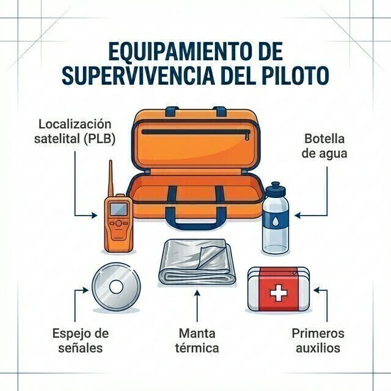

# Equipo de evacuación de emergencia

Si el vuelo termina mal y lejos de casa, tu supervivencia depende de lo que llevabas puesto y de lo que cargaste en el fuselaje antes de despegar.

En este capítulo aprenderás:

* **Las balizas de localización**: ELT fijo y PLB portátil, y por qué deben emitir en 406 MHz.
* **Los sistemas de oxígeno**: flujo continuo y EDS, y cuándo exige la norma usarlos.
* **El kit de supervivencia esencial** para vuelos de montaña o sobre zonas despobladas.

En una situación extrema, el equipo de emergencia y tu capacidad de supervivencia deciden si el rescate sale bien. Ir preparado para lo peor es lo que te permite volar tranquilo.

## Balizas de localización: ELT y PLB

Si tienes un accidente o una toma forzosa en una zona remota, necesitas que los servicios de búsqueda y rescate (SAR) te encuentren rápido.

* ****: va instalada de forma fija en el planeador. Se activa sola por el impacto (G) o a mano.
* ****: baliza portátil que el piloto lleva en el bolsillo o en el paracaídas. Se activa a mano.

::: {.callout-important}
⚖ **NORMATIVA**

Asegúrate de que tu baliza emite en 406 MHz. Las antiguas señales de 121.5 MHz ya no se vigilan por satélite; solo sirven para el rastreo cercano (*homing*) de los equipos de rescate. Y la baliza debe estar registrada oficialmente.
:::

 

## Sistemas de oxígeno e hipoxia

A medida que subes, la presión atmosférica baja y a tus pulmones les llegan menos moléculas de oxígeno. Eso provoca la ****, con síntomas traicioneros: euforia, falta de concentración, visión de túnel. La fisiología completa de la hipoxia, el tiempo de conciencia útil y la regla «oxígeno al 100 % y desciende» se estudian en el **Libro 2 — Factores humanos, capítulo 4**. Aquí nos centramos en el equipo y en la norma.

 

::: {.callout-important}
⚖ **NORMATIVA**

**SAO.OP.150 (uso de oxígeno suplementario)**: «El piloto al mando se asegurará de que todas las personas a bordo utilicen oxígeno suplementario siempre que determine que, a la altitud del vuelo previsto, la falta de oxígeno podría provocar un deterioro de sus facultades o afectarles perjudicialmente.»

El **AMC1 SAO.OP.150** concreta el criterio: cuando el piloto no pueda valorar ese efecto, debe garantizar que todos los ocupantes usan oxígeno durante cualquier período en que la altitud de presión supere los 10.000 ft.
:::

 

Como buena práctica fisiológica, que no como requisito normativo, muchos pilotos usan oxígeno desde altitudes menores (en torno a 5.000 ft) al atardecer, porque la visión es lo primero que se resiente con la falta de oxígeno.

 

## Equipos de oxígeno

1. **Flujo continuo**: el oxígeno sale sin parar de un depósito a través de una cánula o una máscara. Es sencillo, pero poco eficiente: gasta mucho gas.
2. ****: dispositivos que detectan tu inspiración y sueltan un pulso de oxígeno justo cuando lo necesitas. Multiplican por tres o cuatro la duración de la botella.

 

## Kit de supervivencia esencial

No despegues sin un kit básico de supervivencia, sobre todo si vuelas sobre montaña o zonas despobladas. Debería llevar:

* **Agua**: al menos 1 o 2 litros. La deshidratación nubla el juicio.
* **Señalización**: un espejo de señales y un silbato.
* **Protección térmica**: una manta de supervivencia (foil) para no entrar en hipotermia si te toca pasar la noche fuera.
* **Energía**: un teléfono móvil con la batería cargada y, a poder ser, una batería externa (powerbank).

 

{#fig-08-cap14-equipo-supervivencia}

 

**Resumen del capítulo: equipo de emergencia**

* **ELT / PLB**: tu baliza de salvación. Las de 406 MHz con GPS mandan tu posición exacta al satélite en minutos. Las antiguas de 121.5 MHz ya no se vigilan por satélite.
* **Oxígeno**: la regla es SAO.OP.150: el piloto valora el riesgo de hipoxia; si no puede valorarlo, oxígeno siempre por encima de 10.000 ft (AMC1). Los sistemas EDS (a demanda) ahorran mucho oxígeno. La fisiología se estudia en el **Libro 2 — Factores humanos**, capítulo 4.
* **Kit de supervivencia**: agua, abrigo, espejo de señales, móvil cargado. Si aterrizas en una ladera remota, pueden tardar horas o días en sacarte. Vístete para la temperatura de fuera, no para la de cabina.
