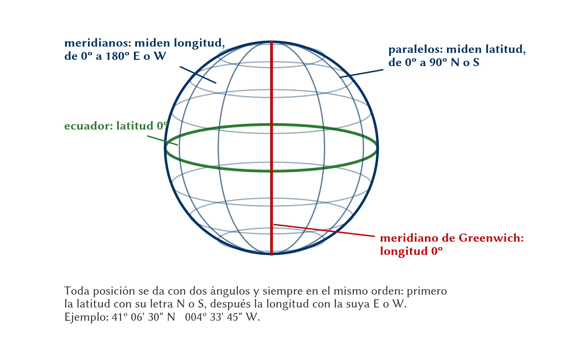
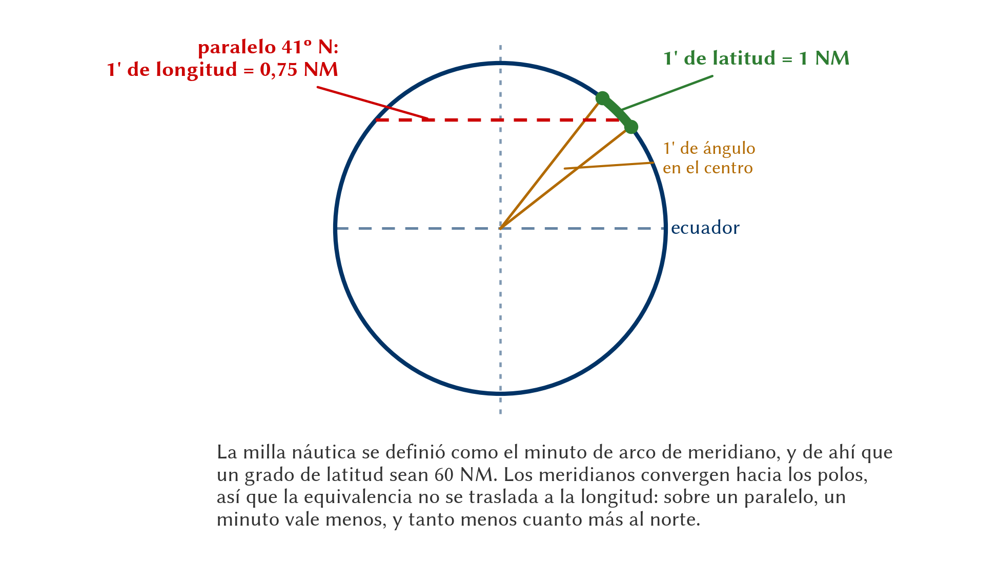

# Fundamentos de navegación

> Navegar es, en esencia, llevar el planeador de un punto a otro con seguridad y sin malgastar energía. Para eso hacen falta dos cosas: entender cómo nos movemos sobre la esfera terrestre y saber medir nuestra posición y el tiempo.
>
>
> En este capítulo aprenderás:
>
>
> * **El sistema de coordenadas**: latitud y longitud, y por qué un minuto de latitud equivale a una milla náutica.
> * **Ortodrómica y loxodrómica**: la ruta más corta frente a la de rumbo constante, y cuál vuelas en realidad.
> * **El tiempo en aviación**: qué es UTC (hora Zulu) y por qué toda la aviación trabaja con él.
> * **Orto, ocaso y vuelo diurno**: dónde está el límite legal de la luz para un planeador.
> * **Las unidades náuticas**: la milla náutica, el nudo y el pie, y cómo convertirlas de cabeza.

## El sistema de coordenadas: latitud y longitud

Para situarnos en cualquier parte del mundo, utilizamos una red imaginaria de líneas que envuelven la Tierra.

* **Latitud (Paralelos)**: Son círculos paralelos al Ecuador que miden la distancia al norte o al sur. El Ecuador es la latitud 0º.
* **Longitud (Meridianos)**: Son semicírculos que van de polo a polo. El Meridiano de Greenwich es la longitud 0º.

Esta red de paralelos y meridianos (@fig-09-cap01-coordenadas) nos permite situar con precisión cualquier punto de la Tierra.

::: {.callout-tip title="Regla de oro"}
Recuerda siempre esta equivalencia fundamental: **1 minuto de latitud equivale a 1 milla náutica**. No es una casualidad: la milla náutica se definió precisamente como la longitud del minuto de arco de meridiano, y hoy vale 1852 m exactos. Esto te permite calcular distancias directamente sobre los meridianos de una carta aeronáutica.
:::

{#fig-09-cap01-coordenadas width="100%"}

### Cómo se escriben y se leen

Las coordenadas se dan siempre **primero la latitud y después la longitud**, cada una con su letra (N/S y E/W). Verás dos formatos, y conviene reconocer los dos:

* **Grados, minutos y segundos**: `41º 06' 30" N   004º 33' 45" W`. Es el formato del AIP y de las cartas.
* **Grados y minutos decimales**: `41º 06,50' N   004º 33,75' W`. Es el que usan casi todos los ordenadores de planeo y los ficheros de puntos de viraje.

Pasar de uno a otro es dividir los segundos entre 60: 30" son 0,50'; 45" son 0,75'. Y para restar dos latitudes recuerda que **un grado tiene 60 minutos**, no 100: la resta se hace como con las horas del reloj.

La equivalencia entre el minuto de latitud y la milla náutica no es un truco de memoria: sale de la propia definición de la unidad (@fig-09-cap01-minuto-de-latitud). Y por eso mismo **no se traslada a la longitud**, cuyos meridianos convergen hacia los polos.

{#fig-09-cap01-minuto-de-latitud width="100%"}

::: {.ejercicio}
**Ejercicio 1.1 — Distancia sobre un meridiano.**

Dos puntos están sobre el **mismo meridiano**: el primero en **41º 30' N** y el segundo en **40º 12' N**. ¿Qué distancia hay entre ellos, en millas náuticas y en kilómetros?

**Solución.** Sobre un mismo meridiano sólo cambia la latitud, así que basta restar. Como el segundo tiene menos minutos que el primero, tomamos prestado un grado (60 minutos):

$$
41^\circ 30' - 40^\circ 12' = 1^\circ 18' = 60 + 18 = 78'
$$

Y como **un minuto de latitud es una milla náutica**, la distancia son **78 NM**. En kilómetros:

$$
78 \times \text{1,852} \approx \mathbf{144 \ km}
$$

Este truco sólo funciona sobre meridianos, midiendo latitud. Un minuto de **longitud** no vale una milla náutica salvo en el ecuador: a 41º de latitud vale unas 0,75 NM, porque los meridianos se juntan hacia los polos.
:::

## Ortodrómica y loxodrómica

Cuando trazas una línea en el mapa, conviene saber qué estás dibujando en realidad sobre una Tierra que es curva.

* **Ortodrómica (Círculo Máximo)**: Es la distancia más corta entre dos puntos. Sin embargo, en un círculo máximo el rumbo cambia constantemente a medida que cruzamos meridianos.
* **Loxodrómica (Línea de Rumbo)**: Es una línea que corta todos los meridianos con el mismo ángulo. Es más cómoda de volar porque mantenemos un rumbo constante, aunque el camino sea ligeramente más largo.

::: {.callout-note title="Airmanship"}
En las distancias que manejamos habitualmente en vuelo a vela (vuelos de 300, 500 o incluso 1000 km), la diferencia entre la ruta ortodrómica y la loxodrómica es insignificante. Siempre volamos rumbos constantes (loxodrómicas) por sencillez.
:::

Pon cifras y se ve mejor. En un tramo este-oeste de **500 km** a la latitud de la meseta española (unos 41º N), la loxodrómica mide **97 metros más** que la ortodrómica. Sobre 500 kilómetros. Es menos de lo que te desvía una térmica mal centrada, y muchísimo menos que el error de medir el rumbo con un transportador de plástico. En un tramo de 300 km la diferencia baja a **21 metros**.

La distinción importa en rutas transoceánicas de miles de kilómetros y en latitudes altas, donde los meridianos convergen deprisa. No en una travesía en planeador.

## El tiempo en aviación: UTC y Zulu

Cruzar husos horarios y arrastrar los cambios de hora estacionales sería un lío al planificar un vuelo. Por eso la aviación trabaja con una sola referencia: el **Tiempo Universal Coordinado (UTC)**.

También lo conocemos como **Hora Zulu (Z)**. Es la hora en el meridiano 0º (Greenwich). Cuando recibes un METAR o un NOTAM, la hora siempre vendrá en formato Zulu.

::: {.callout-important title="Normativa"}
**SAO.IDE.105** exige que todo planeador lleve un medio para medir y mostrar la hora en horas y minutos. Llévalo ajustado a UTC o ten clara la diferencia horaria del día (en España, +1h en invierno y +2h en verano respecto a UTC).
:::

La conversión no tiene misterio, pero se equivoca a diario: la hora local peninsular es **UTC + 1 en invierno y UTC + 2 en verano**, así que para pasar de local a Zulu **se resta**. Un despegue a las 12:30 hora local de julio son las 10:30 Z. En Canarias la diferencia es una hora menos.

::: {.callout-warning title="Seguridad"}
El error clásico no es la suma: es aplicar el signo al revés y creerse que te queda una hora más de luz. Comprueba la conversión con un dato que ya conozcas —la hora del último parte meteorológico, por ejemplo— antes de fiarte de ella para decidir si sales.
:::

## Orto, ocaso y vuelo diurno

Planificar la hora de un vuelo a vela no es solo cuestión de térmicas: la luz del día marca un límite legal y de seguridad que conviene conocer.

* **Orto**: el amanecer, cuando el borde superior del disco solar asoma por el horizonte este.
* **Ocaso**: el atardecer, cuando el borde superior del disco solar desaparece por el horizonte oeste.

No confundas el ocaso con el principio de la noche. Para la aviación, la **noche** es el periodo entre el final del **crepúsculo civil** vespertino y el inicio del matutino, y el crepúsculo civil termina (o empieza) cuando el centro del sol está **6º por debajo del horizonte**. Es decir: tras el ocaso aún queda un rato de luz utilizable antes de que, oficialmente, sea de noche.

::: {.callout-important title="Normativa"}
El vuelo en planeador se realiza en condiciones visuales (VFR) y, con carácter general, **de día**. La operación nocturna en VMC solo está al alcance del titular SPL con privilegios de motovelero de turismo (TMG) y la correspondiente **habilitación de vuelo nocturno**, además del equipamiento de luces exigido. Consulta siempre la hora del ocaso al planificar: en altura tendrás luz un rato más, pero una vez abajo la oscuridad llega rápido. Las horas oficiales de orto y ocaso para cada aeródromo se publican en el AIP-España (GEN 2.7).
:::

## Unidades de medida estándar

En el entorno internacional, y especialmente en España bajo normativa EASA, utilizamos unidades náuticas para la navegación horizontal:

* **Milla Náutica (NM)**: 1 NM = 1852 metros.
* **Nudo (kt)**: Es una unidad de velocidad que equivale a 1 milla náutica por hora.

Aunque es común ver anemómetros en kilómetros por hora (km/h) en muchos planeadores europeos de diseño clásico, la navegación y las cartas aeronáuticas se basan en millas náuticas y nudos. Aprender a pasar de unos a otros mentalmente es una habilidad muy útil en el hangar.

Y no es una manía académica: en un mismo vuelo vas a leer la velocidad en km/h en el anemómetro, la distancia en NM en la carta, la altitud en pies en el altímetro y la altura de la base de nubes en metros en el parte meteorológico. Las equivalencias de la @tbl-09-cap01-equivalencias son las que hay que tener en la cabeza.

| Magnitud | Equivalencia exacta | Atajo mental |
| --- | --- | --- |
| 1 milla náutica (NM) | 1.852 m | «casi dos kilómetros» |
| 1 km | 0,54 NM | «la mitad, y un pelín más» |
| 1 nudo (kt) | 1,852 km/h | igual que la milla, por hora |
| 100 km/h | 54 kt | quítale la mitad |
| 1 grado de latitud | 60 NM = 111 km | un grado, una hora de vuelo lento |
| 1 metro | 3,28 ft | «tres pies y pico» |
| 1.000 ft | 305 m | «mil pies, trescientos metros» |
| 1 milla terrestre (sm) | 1.609 m | la del material norteamericano |
: Equivalencias de uso corriente en navegación {#tbl-09-cap01-equivalencias}

::: {.callout-tip title="Regla de oro"}
Para pasar de km/h a nudos de cabeza: **quita la mitad y súmale un 8 %**. 100 km/h → 50 + 4 = 54 kt. Al revés, de nudos a km/h: **dobla y quita un 8 %**. 50 kt → 100 − 8 = 92 km/h. Con dos cifras significativas basta y sobra para navegar.
:::

::: {.ejercicio}
**Ejercicio 1.2 — Cambiar de unidades sin calculadora.**

Tu anemómetro marca **95 km/h**. El parte da un viento de **25 kt**. El altímetro marca **4.500 ft**. Pasa las tres cifras a las otras unidades.

**Solución.** La velocidad, a nudos: la mitad de 95 es 47,5, y un 8 % de 47,5 son unos 4. Total, **51 kt**. Comprobación exacta: $95 / \text{1,852} = \text{51,3}$ kt.

El viento, a km/h: el doble de 25 es 50, menos un 8 % (4) son **46 km/h**. Exacto: $25 \times \text{1,852} = \text{46,3}$ km/h.

La altitud, a metros:

$$
4.500 \times \text{0,3048} \approx \mathbf{1.372 \ m}
$$

O de cabeza, con la regla de los mil pies: 4.500 ft son cuatro veces y media 305 m, es decir unos 1.370 m. Lo bastante bueno para decidir si cabes por debajo de un techo de nubes anunciado en metros.
:::

::: {.ejercicio}
**Ejercicio 1.3 — La hora del ocaso.**

Es **julio** y planificas un vuelo desde un aeródromo cuyo ocaso publicado en el AIP es a las **20:42 UTC**. Quieres tener el planeador en tierra **30 minutos antes** del ocaso. ¿A qué **hora local** debes haber aterrizado?

**Solución.** En julio, la hora local peninsular es UTC + 2, así que el ocaso local es:

$$
20{:}42 + 2{:}00 = 22{:}42 \ \mathrm{local}
$$

Restando el margen de 30 minutos, debes estar en tierra a las **22:12 hora local** (20:12 Z). Fíjate en que el margen se resta al final, sobre la hora ya convertida: mezclar las dos cosas en un solo paso es justo donde se cuela el error.
:::

::: {.postit}
**Resumen del capítulo: fundamentos de navegación**

* **Coordenadas**: Latitud (Paralelos, N/S) y Longitud (Meridianos, E/W). Recuerda: 1 minuto de Latitud equivale a 1 Milla Náutica, porque la milla náutica se definió como el minuto de arco de meridiano. 1 minuto de Longitud varía con la latitud.
* **Ortodrómica vs Loxodrómica**: La Ortodrómica es la distancia más corta (círculo máximo) pero cambia de rumbo continuamente. La Loxodrómica mantiene el rumbo constante (corta a los meridianos igual) pero es más larga. En distancias de planeador, la diferencia es despreciable.
* **El Tiempo**: En aviación usamos UTC (Universal Time Coordinated) o "Zulu" para evitar confusiones con los husos horarios locales y cambios de hora. En la Península, local = UTC + 1 en invierno y UTC + 2 en verano; para pasar de local a Zulu, **se resta**.
* **Orto y ocaso no son la noche**: el ocaso es el sol en el horizonte; la noche empieza al acabar el crepúsculo civil, con el sol 6º por debajo. Las horas oficiales están en el AIP-España (GEN 2.7).
* **Unidades**: Acostúmbrate a pensar en Millas Náuticas (NM) y Nudos (kts). Son el estándar internacional y facilitan los cálculos mentales (1 grado de latitud = 60 NM). De km/h a nudos, **quita la mitad y suma un 8 %**; al revés, **dobla y quita un 8 %**. 1.000 ft son 305 m.
:::
