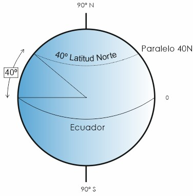

# Fundamentos de navegación

Navegar es, en esencia, llevar el planeador de un punto a otro con seguridad y sin malgastar energía. Para eso hacen falta dos cosas: entender cómo nos movemos sobre la esfera terrestre y saber medir nuestra posición y el tiempo.

En este capítulo aprenderás:

* **El sistema de coordenadas**: latitud y longitud, y por qué un minuto de latitud es siempre una milla náutica.
* **Ortodrómica y loxodrómica**: la ruta más corta frente a la de rumbo constante, y cuál vuelas en realidad.
* **El tiempo en aviación**: qué es UTC (hora Zulu) y por qué toda la aviación trabaja con él.
* **Orto, ocaso y vuelo diurno**: dónde está el límite legal de la luz para un planeador.
* **Las unidades náuticas**: la milla náutica y el nudo, y cómo pensar en ellas de cabeza.

## El sistema de coordenadas: Latitud y Longitud

Para situarnos en cualquier parte del mundo, utilizamos una red imaginaria de líneas que envuelven la Tierra.

* **Latitud (Paralelos)**: Son círculos paralelos al Ecuador que miden la distancia al norte o al sur. El Ecuador es la latitud 0º.
* **Longitud (Meridianos)**: Son semicírculos que van de polo a polo. El Meridiano de Greenwich es la longitud 0º.

Esta red de paralelos y meridianos () nos permite situar con precisión cualquier punto de la Tierra.

::: {.callout-tip}
✦ **REGLA DE ORO**

Recuerda siempre esta equivalencia fundamental: **1 minuto de latitud equivale a 1 milla náutica**. Esto te permite calcular distancias directamente sobre los meridianos de una carta aeronáutica.
:::

{#fig-09-cap01-coordenadas}

## Ortodrómica y Loxodrómica

Cuando trazas una línea en el mapa, conviene saber qué estás dibujando en realidad sobre una Tierra que es curva.

* **Ortodrómica (Círculo Máximo)**: Es la distancia más corta entre dos puntos. Sin embargo, en un círculo máximo el rumbo cambia constantemente a medida que cruzamos meridianos.
* **Loxodrómica (Línea de Rumbo)**: Es una línea que corta todos los meridianos con el mismo ángulo. Es más cómoda de volar porque mantenemos un rumbo constante, aunque el camino sea ligeramente más largo.

::: {.callout-note}
⚓ **AIRMANSHIP**

En las distancias que manejamos habitualmente en vuelo a vela (vuelos de 300, 500 o incluso 1000 km), la diferencia entre la ruta ortodrómica y la loxodrómica es insignificante. Siempre volamos rumbos constantes (loxodrómicas) por sencillez.
:::

## El tiempo en aviación: UTC y Zulu

Cruzar husos horarios y arrastrar los cambios de hora estacionales sería un lío al planificar un vuelo. Por eso la aviación trabaja con una sola referencia: el **Tiempo Universal Coordinado (UTC)**.

También lo conocemos como **Hora Zulu (Z)**. Es la hora en el meridiano 0º (Greenwich). Cuando recibes un METAR o un NOTAM, la hora siempre vendrá en formato Zulu.

::: {.callout-important}
⚖ **NORMATIVA**

**SAO.IDE.105** exige que todo planeador lleve un medio para medir y mostrar la hora en horas y minutos. Llévalo ajustado a UTC o ten clara la diferencia horaria del día (en España, +1h en invierno y +2h en verano respecto a UTC).
:::

## Orto, ocaso y vuelo diurno

Planificar la hora de un vuelo a vela no es solo cuestión de térmicas: la luz del día marca un límite legal y de seguridad que conviene conocer.

* **Orto**: el amanecer, cuando el borde superior del disco solar asoma por el horizonte este.
* **Ocaso**: el atardecer, cuando el borde superior del disco solar desaparece por el horizonte oeste.

No confundas el ocaso con el principio de la noche. Para la aviación, la **noche** es el periodo entre el final del **crepúsculo civil** vespertino y el inicio del matutino, y el crepúsculo civil termina (o empieza) cuando el centro del sol está **6º por debajo del horizonte**. Es decir: tras el ocaso aún queda un rato de luz utilizable antes de que, oficialmente, sea de noche.

::: {.callout-important}
⚖ **NORMATIVA**

El vuelo en planeador se realiza en condiciones visuales (VFR) y, con carácter general, **de día**. La operación nocturna en VMC solo está al alcance del titular SPL con privilegios de motovelero de turismo (TMG) y la correspondiente **habilitación de vuelo nocturno**, además del equipamiento de luces exigido. Consulta siempre la hora del ocaso al planificar: en altura tendrás luz un rato más, pero una vez abajo la oscuridad llega rápido. Las horas oficiales de orto y ocaso para cada aeródromo se publican en el AIP-España (GEN 2.7).
:::

## Unidades de medida estándar

En el entorno internacional, y especialmente en España bajo normativa EASA, utilizamos unidades náuticas para la navegación horizontal:

* **Milla Náutica (NM)**: 1 NM = 1852 metros.
* **Nudo (kt)**: Es una unidad de velocidad que equivale a 1 milla náutica por hora.

Aunque es común ver anemómetros en kilómetros por hora (km/h) en muchos planeadores europeos de diseño clásico, la navegación y las cartas aeronáuticas se basan en millas náuticas y nudos. Aprender a pasar de unos a otros mentalmente es una habilidad muy útil en el hangar.

**Resumen del Capítulo: Fundamentos de Navegación**

* **Coordenadas**: Latitud (Paralelos, N/S) y Longitud (Meridianos, E/W). Recuerda: 1 minuto de Latitud es siempre 1 Milla Náutica. 1 minuto de Longitud varía con la latitud.
* **Ortodrómica vs Loxodrómica**: La Ortodrómica es la distancia más corta (círculo máximo) pero cambia de rumbo continuamente. La Loxodrómica mantiene el rumbo constante (corta a los meridianos igual) pero es más larga. En distancias de planeador, la diferencia es despreciable.
* **El Tiempo**: En aviación usamos UTC (Universal Time Coordinated) o "Zulu" para evitar confusiones con los husos horarios locales y cambios de hora.
* **Unidades**: Acostúmbrate a pensar en Millas Náuticas (NM) y Nudos (kts). Son el estándar internacional y facilitan los cálculos mentales (1 grado de latitud = 60 NM).
