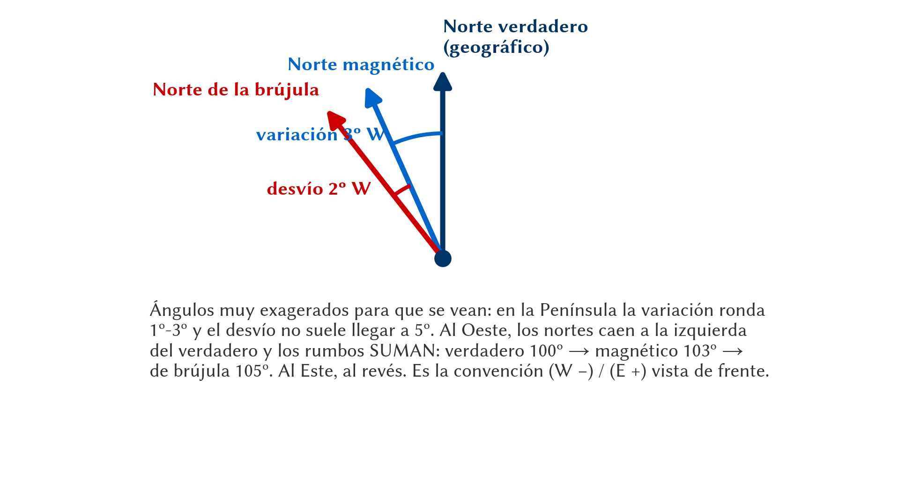
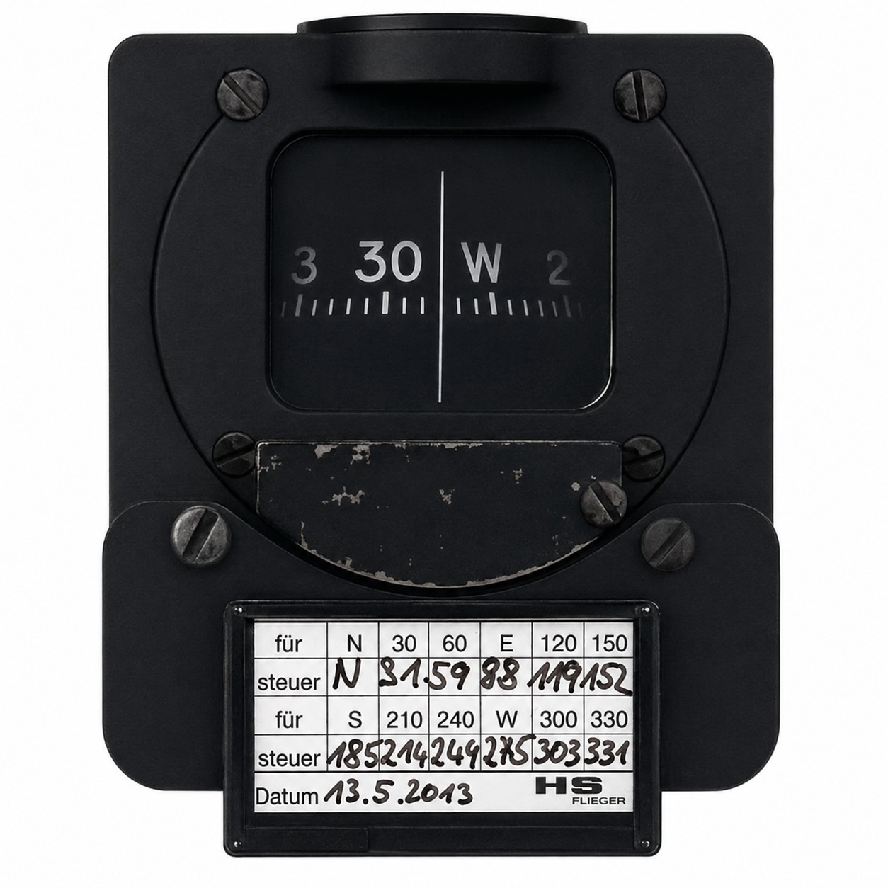

# Magnetismo y brújulas

> La brújula magnética es probablemente el instrumento más sencillo y fiable de la cabina. No gasta batería ni depende del tubo pitot: se limita a alinearse con el campo magnético terrestre. Eso sí, para sacarle partido hay que conocer sus manías.
>
>
> En este capítulo aprenderás:
>
>
> * **El norte verdadero y el magnético**: la variación (declinación) y la regla "Declinación Oeste, rumbo suma".
> * **El desvío y la tablilla**: por qué el propio planeador engaña a la brújula y cómo se compensa.
> * **Los errores de viraje**: por qué la brújula se adelanta o se retrasa al virar hacia el Norte o el Sur.
> * **Los errores de aceleración (ANDS)**: las lecturas falsas al acelerar o frenar en rumbos Este-Oeste.

## Norte verdadero vs. norte magnético

Aunque solemos pensar en "el Norte" como un punto único, en navegación distinguimos dos:

* **Norte Verdadero (Geográfico)**: Es el punto por donde pasa el eje de rotación de la Tierra. Es el norte que verás en los mapas y cartas aeronáuticas.
* **Norte Magnético**: Es el punto hacia el que apuntan las agujas de nuestras brújulas. Curiosamente, este punto no es fijo y se desplaza ligeramente cada año.

La diferencia angular entre ambos se denomina **Variación Magnética** o **Declinación**. En las cartas aeronáuticas, verás unas líneas discontinuas llamadas **isogónicas** que indican el valor de esta variación en cada zona.

Y todavía hay un tercer norte: el que marca **tu** brújula, desviado del magnético por el hierro de la propia aeronave. Los tres, con las dos correcciones que los separan, en la @fig-09-cap02-tres-nortes.

{#fig-09-cap02-tres-nortes width="100%"}

::: {.callout-tip title="Regla de oro"}
Para los cálculos, recuerda esta rima: **"Declinación Oeste, Rumbo Suma"** (si la variación es hacia el oeste, el rumbo magnético será mayor que el verdadero).
:::

La variación no es un dato eterno: el polo magnético se mueve, así que la carta lleva impresa la **fecha y el ritmo anual** de cambio de las isogónicas. En la Península la variación es pequeña —del orden de 1º a 3º W según la zona— y cambia unos pocos minutos de arco al año. Es lo bastante pequeña como para que muchos pilotos la ignoren en vuelos cortos, y lo bastante grande como para que un tramo largo termine varios kilómetros a un lado.

::: {.callout-warning title="Seguridad"}
Ignorar 2º de variación en un tramo de 100 km te deja **3,5 km** fuera de ruta. Da igual si buscas un aeródromo grande; no da igual si lo que buscas es un campo concreto con el que ya contabas, o si te acerca al borde de un espacio aéreo restringido.
:::

## El desvío y la tablilla

El planeador no es un entorno magnéticamente puro. Los tubos de acero del fuselaje, los altavoces de la radio y los instrumentos electrónicos generan sus propios campos magnéticos que "engañan" a la brújula. Este error local se llama **Desvío**.

Para compensarlo, cada aeronave debe tener una **Tablilla de Desvíos** instalada a la vista del piloto (@fig-09-cap02-tablilla-desvios).

{#fig-09-cap02-tablilla-desvios}

La tablilla es específica de **ese** planeador, se levanta en tierra girando la aeronave sobre una rosa de compensación y se rehace cada vez que se instala algo que pueda alterar el campo: una radio, un ordenador, un soporte metálico. Se presenta siempre igual, con dos columnas (@tbl-09-cap02-tablilla-desvios):

| Para volar (magnético) | Pon en la brújula |
| --- | --- |
| N (000º) | 002º |
| 030º | 031º |
| 060º | 059º |
| E (090º) | 088º |
| 120º | 117º |
| 150º | 147º |
| S (180º) | 178º |
| 210º | 209º |
| 240º | 241º |
| W (270º) | 273º |
| 300º | 303º |
| 330º | 332º |
: Tablilla de desvíos: se lee de izquierda a derecha, «para volar 090º magnéticos, mantén 088º en la brújula» {#tbl-09-cap02-tablilla-desvios}

La columna de la izquierda es lo que **quieres**; la de la derecha, lo que **verás**. Y ahí está la trampa de signos: si para volar 090º magnéticos hay que poner 088º en la brújula, el desvío es de **2º E** y **resta**. Lo mismo que la variación: al pasar de magnético a brújula, el Este resta y el Oeste suma.

::: {.callout-note title="Airmanship"}
Los desvíos de una tablilla sana varían **poco y suavemente** de un rumbo al siguiente: aquí van de +3º a −3º describiendo una curva, porque el campo que los produce es el mismo y sólo cambia su orientación respecto a la brújula. Un salto brusco entre dos filas contiguas, o desvíos de más de 10º, no son un dato: son un aviso de que la tablilla está mal copiada, caducada o de que alguien ha metido hierro en la cabina desde que se levantó.
:::

::: {.ejercicio}
**Ejercicio 2.1 — De la carta a la brújula, con tablilla.**

Mides en la carta una trayectoria verdadera de **270º**. La variación de la zona es **2º W** y usas la tablilla de arriba. No hay viento. ¿Qué número mantienes en la brújula?

**Solución.** Primero, de verdadero a magnético. Variación Oeste, rumbo suma:

$$
MH = TH + 2 = 270 + 2 = 272^\circ
$$

Ahora la tablilla. Buscas 272º magnéticos, y la tabla da la fila de 270º → 273º, es decir, un desvío de **3º W** (la brújula marca de más). Con esos mismos 3º sobre 272º:

$$
CH = 272 + 3 = \mathbf{275^\circ}
$$

Dos observaciones prácticas. La tablilla se interpola a ojo entre filas, porque va de treinta en treinta grados y tú vuelas donde te toca. Y la corrección total ha sido de 5º sobre el rumbo de la carta: en un tramo de 60 NM, esos 5º son **5 NM** de desviación, unos nueve kilómetros.
:::

## Errores dinámicos de la brújula

La brújula magnética solo es totalmente fiable cuando volamos en línea recta, nivelados y a velocidad constante. En cualquier otro estado, sufre errores debidos al "dip" magnético (la inclinación de las líneas de fuerza hacia el suelo).

Conviene entender de dónde salen, porque así no hay que memorizar cuatro casos sueltos. El campo magnético terrestre no es horizontal salvo en el ecuador magnético: en nuestras latitudes **se hunde hacia el suelo** unos 60º. La rosa de la brújula, que flota y sólo puede girar en su plano, tiende a inclinarse siguiendo esa componente vertical. Para evitarlo, el fabricante cuelga el peso de la rosa **por debajo** del punto de suspensión. Y ese peso descolgado es justo lo que reacciona a cualquier aceleración, sea la de un viraje o la de cambiar de velocidad. Los dos errores que vienen ahora son la misma cosa vista de dos maneras.

### Errores de viraje

Cuando viramos para interceptar un rumbo Norte o Sur, la brújula se adelanta o se retrasa. El error es máximo al pasar por el N/S y nulo en el E/W.

* **Viraje al Norte**: La brújula se queda atrás (indica menos viraje del real).
* **Viraje al Sur**: La brújula se adelanta (indica más viraje del real).

::: {.callout-note title="Airmanship"}
Usa el mnemotécnico **NO me paso / Si me paso**:
Al virar hacia el **Norte**, detén el viraje antes de que la brújula llegue al 360 (**NO** llegues).
Al virar hacia el **Sur**, deja que la brújula pase del 180 antes de nivelar (**SI** pásate).
:::

¿Cuánto es «antes» y cuánto es «pasarse»? La regla práctica clásica dice que el adelanto o el retraso es **del orden de la latitud del lugar**. Volando en la Península, a unos 40º de latitud, eso significa unos 40 grados: no es un matiz, es casi medio cuadrante. Es una aproximación, y basta: la brújula no es el instrumento con el que se afina un rumbo, es con el que se comprueba.

::: {.ejercicio}
**Ejercicio 2.2 — Nivelar en el rumbo correcto.**

Vuelas rumbo **090º** sobre la meseta castellana (**40º N** aproximadamente) y quieres virar por la izquierda hasta **360º**. (a) ¿En qué lectura de brújula empiezas a nivelar? (b) Y si desde 090º viraras por la derecha hasta **180º**, ¿en qué lectura?

**Solución.** (a) Viras **hacia el Norte**, así que la brújula **se queda atrás**: cuando marque 360 ya te habrás pasado. Hay que nivelar antes, y «antes» es del orden de la latitud, unos 40º. Virando por la izquierda desde 090º, los números **bajan** (090 → 060 → 030 → 360), así que empiezas a nivelar cuando la brújula marque unos:

$$
360 - 40 = \mathbf{320^\circ}
$$

(b) Viras **hacia el Sur**, y ahí la brújula **se adelanta**: marcará 180 antes de que lo estés. Hay que dejarla pasar unos 40º. Virando por la derecha desde 090º los números suben, así que nivelas cuando marque unos:

$$
180 + 40 = \mathbf{220^\circ}
$$

Luego, ya en vuelo recto y nivelado, espera unos segundos a que la rosa se asiente y **ajusta**. Ése es el orden correcto: primero el viraje aproximado, después la lectura buena. Al revés no funciona, porque durante el viraje la brújula no está diciendo la verdad.
:::

### Errores de aceleración (ANDS)

Si aceleramos o frenamos mientras volamos con rumbos Este u Oeste, la inercia del sistema pendular de la brújula provoca lecturas falsas:

* **Acelerar**: La brújula indica un viraje hacia el Norte.
* **Decelerar**: La brújula indica un viraje hacia el Sur.

Recordamos esto con la regla inglesa **ANDS**: **A**ccelerate **N**orth, **D**ecelerate **S**outh. Es decir: al **acelerar**, la brújula tiende al **Norte**; al **decelerar**, tiende al **Sur**.

En un planeador este error aparece más de lo que parece, porque cambiamos de velocidad continuamente: al picar para cruzar una zona de descendencia, al tirar para entrar en térmica, al abrir los aerofrenos. Si en ese momento vuelas hacia el Este o el Oeste, la brújula te contará un viraje que no existe. El error es **cero en rumbos Norte y Sur** y máximo en Este y Oeste, justo al revés que el de viraje.

::: {.callout-tip title="Regla de oro"}
Los dos errores se resumen en una frase: **la brújula sólo dice la verdad cuando no la molestas**. Vuelo recto, alas niveladas, velocidad constante y unos segundos de calma. En cualquier otro momento es un instrumento que está reaccionando a la maniobra, no al norte magnético.
:::

::: {.postit}
**Resumen del capítulo: magnetismo y brújulas**

* **Norte Verdadero vs Magnético**: La brújula apunta al Norte Magnético, que no coincide con el Geográfico (Verdadero). La diferencia es la **Variación (o Declinación)**. Regla: "Declinación Oeste, Rumbo Suma".
* **Desvío**: El propio avión tiene campos magnéticos (tubos de acero, radios) que afectan a la brújula. Este error es el **Desvío** y se corrige con la tablilla de desvíos de la cabina, que se lee «para volar X, pon Y» y es específica de esa aeronave.
* **Errores de la Brújula**: La brújula solo dice la verdad en vuelo recto y nivelado (y no acelerado). Los dos errores dinámicos salen de lo mismo: el peso de la rosa cuelga bajo su suspensión para contrarrestar la inclinación del campo, y ese peso reacciona a cualquier aceleración.
* **Error de Viraje**: Al virar al Norte, la brújula se queda atrás (vas corto: NO te pases); al Sur se adelanta (déjala pasar: SÍ te pasas). La magnitud es del orden de la **latitud del lugar**: unos 40º en España.
* **Error de Aceleración**: Al acelerar en rumbos E/W, marca viraje al Norte; al frenar, al Sur (regla **ANDS**: **Accelerate North, Decelerate South**).
:::
