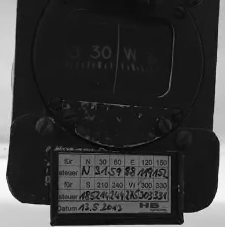

# Magnetismo y brújulas

> La brújula magnética es probablemente el instrumento más sencillo y fiable de la cabina. No gasta batería ni depende del tubo pitot: se limita a alinearse con el campo magnético terrestre. Eso sí, para sacarle partido hay que conocer sus manías.
>
>
> En este capítulo aprenderás:
>
>
> * **El norte verdadero y el magnético**: la variación (declinación) y la regla "Declinación Oeste, rumbo suma".
> * **El desvío y la tablilla**: por qué el propio planeador engaña a la brújula y cómo se compensa.
> * **Los errores de viraje**: por qué la brújula se adelanta o se retrasa al virar hacia el Norte o el Sur.
> * **Los errores de aceleración (ANDS)**: las lecturas falsas al acelerar o frenar en rumbos Este-Oeste.

## Norte Verdadero vs. Norte Magnético

Aunque solemos pensar en "el Norte" como un punto único, en navegación distinguimos dos:

* **Norte Verdadero (Geográfico)**: Es el punto por donde pasa el eje de rotación de la Tierra. Es el norte que verás en los mapas y cartas aeronáuticas.
* **Norte Magnético**: Es el punto hacia el que apuntan las agujas de nuestras brújulas. Curiosamente, este punto no es fijo y se desplaza ligeramente cada año.

La diferencia angular entre ambos se denomina **Variación Magnética** o **Declinación**. En las cartas aeronáuticas, verás unas líneas discontinuas llamadas **isogónicas** que indican el valor de esta variación en cada zona.

::: {.callout-tip}
✦ **REGLA DE ORO**

Para los cálculos, recuerda esta rima: **"Declinación Oeste, Rumbo Suma"** (si la variación es hacia el oeste, el rumbo magnético será mayor que el verdadero).
:::

## El Desvío y la Tablilla

El planeador no es un entorno magnéticamente puro. Los tubos de acero del fuselaje, los altavoces de la radio y los instrumentos electrónicos generan sus propios campos magnéticos que "engañan" a la brújula. Este error local se llama **Desvío**.

Para compensarlo, cada aeronave debe tener una **Tablilla de Desvíos** instalada a la vista del piloto (@fig-09-cap02-tablilla-desvios).

{#fig-09-cap02-tablilla-desvios}

## Errores dinámicos de la brújula

La brújula magnética solo es totalmente fiable cuando volamos en línea recta, nivelados y a velocidad constante. En cualquier otro estado, sufre errores debidos al "dip" magnético (la inclinación de las líneas de fuerza hacia el suelo).

### Errores de Viraje

Cuando viramos para interceptar un rumbo Norte o Sur, la brújula se adelanta o se retrasa. El error es máximo al pasar por el N/S y nulo en el E/W.

* **Viraje al Norte**: La brújula se queda atrás (indica menos viraje del real).
* **Viraje al Sur**: La brújula se adelanta (indica más viraje del real).

::: {.callout-note}
⚓ **AIRMANSHIP**

Usa el mnemotécnico **NO me paso / Si me paso**:
Al virar hacia el **Norte**, detén el viraje antes de que la brújula llegue al 360 (**NO** llegues).
Al virar hacia el **Sur**, deja que la brújula pase del 180 antes de nivelar (**SI** pásate).
:::

### Errores de Aceleración (ANDS)

Si aceleramos o frenamos mientras volamos con rumbos Este u Oeste, la inercia del sistema pendular de la brújula provoca lecturas falsas:

* **Acelerar**: La brújula indica un viraje hacia el Norte.
* **Decelerar**: La brújula indica un viraje hacia el Sur.

Recordamos esto con la regla inglesa **ANDS**: **A**ccelerate **N**orth, **D**ecelerate **S**outh. Es decir: al **acelerar**, la brújula tiende al **Norte**; al **decelerar**, tiende al **Sur**.

**Resumen del Capítulo: Magnetismo y Brújulas**

* **Norte Verdadero vs Magnético**: La brújula apunta al Norte Magnético, que no coincide con el Geográfico (Verdadero). La diferencia es la **Variación (o Declinación)**. Regla: "Declinación Oeste, Rumbo Suma".
* **Desvío**: El propio avión tiene campos magnéticos (tubos de acero, radios) que afectan a la brújula. Este error es el **Desvío** y se corrige con la tablilla de desvíos de la cabina.
* **Errores de la Brújula**: La brújula solo dice la verdad en vuelo recto y nivelado (y no acelerado).
* **Error de Viraje**: Al virar al Norte, la brújula se queda atrás (vas corto: NO te pases); al Sur se adelanta (déjala pasar: SÍ te pasas).
* **Error de Aceleración**: Al acelerar en rumbos E/W, marca viraje al Norte; al frenar, al Sur (regla **ANDS**: **Accelerate North, Decelerate South**).
