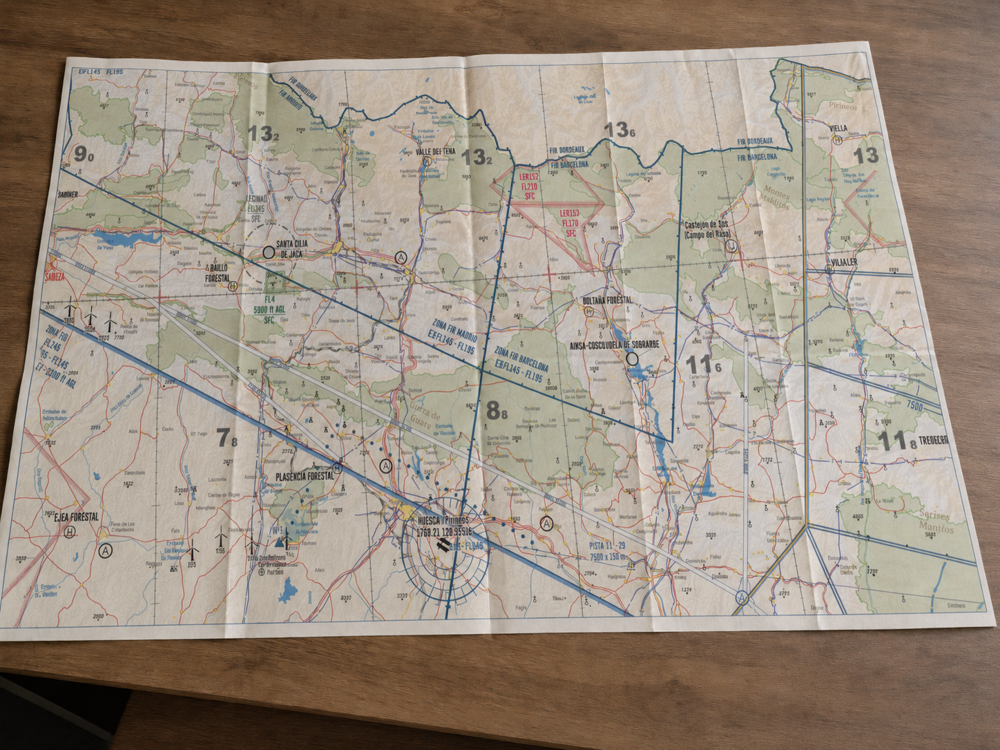

# Cartas aeronáuticas

> Una carta aeronáutica no es un simple mapa; es un instrumento de vuelo que debemos aprender a leer con la misma fluidez que el variómetro. En España, nuestra referencia fundamental es la serie de cartas VFR 1:500.000 publicadas por ENAIRE.
>
>
> En este capítulo aprenderás:
>
>
> * **La proyección Lambert**: por qué la cartografía aeronáutica la eligió y qué ventajas tiene para volar.
> * **La escala 1:500.000**: cómo traducir los centímetros del papel a kilómetros y millas del terreno.
> * **La simbología**: espacios aéreos, zonas P/R/D, obstáculos y la diferencia entre AMSL y AGL.
> * **El relieve y la Altitud Mínima de Área (AMA)**: la red de seguridad que te da la carta sobre el terreno.

## La proyección conforme de Lambert

Representar una superficie esférica sobre un papel plano siempre introduce deformaciones, y cada familia de proyecciones decide qué sacrificar. Las **cilíndricas** (como la Mercator/UTM) mantienen los rumbos como líneas rectas pero deforman mucho las distancias al alejarse del ecuador; las **azimutales** proyectan sobre un plano tangente; y las **cónicas**, sobre un cono. La aviación en latitudes medias eligió la cónica conforme de **Lambert**.

Se la llama "conforme" porque conserva con gran fidelidad los ángulos y las formas del terreno.

Para nosotros, tiene dos ventajas clave:
* **Escala constante**: Podemos usar una regla de navegación en cualquier parte de la carta y la medida será fiable.
* **Líneas rectas**: Una línea recta trazada en esta carta se aproxima mucho a un círculo máximo (ortodrómica), que es la ruta más corta sobre la Tierra.

## Entendiendo la escala

La escala estándar que manejamos es **1:500.000**. Esto significa que cualquier distancia medida sobre el papel es 500.000 veces mayor en la realidad.

Para facilitar el cálculo mental en cabina, recuerda:
* **1 cm en la carta = 5 kilómetros** en el terreno.
* **1 cm en la carta ≈ 2.7 Millas Náuticas (NM)**.

Con una simple regla de navegación medimos sobre la carta y trasladamos la distancia al terreno; la barra de escala de la @fig-09-cap03-carta-enaire permite hacerlo de un vistazo.

De dónde salen esos dos números, para no tener que creérselos: si 1 cm en el papel son 500.000 cm reales, eso son 5.000 m, o sea 5 km. Y esos 5 km en millas náuticas:

$$
\frac{5}{\text{1,852}} \approx \text{2,7} \ \mathrm{NM}
$$

::: {.callout-tip title="Regla de oro"}
La regla graduada es más rápida que la aritmética, pero **la barra de escala impresa en la carta no miente nunca** y no depende de que hayas cogido la regla correcta. Si tienes dos cartas de escalas distintas encima de las rodillas, mide siempre con la barra de la carta que estás usando.
:::

::: {.ejercicio}
**Ejercicio 3.1 — Del papel al reloj.**

Trazas un tramo sobre la carta 1:500.000 y mides **17,4 cm**. (a) ¿Cuántos kilómetros son? (b) ¿Y millas náuticas? (c) Si esperas una velocidad suelo de **75 km/h**, ¿cuánto tardarás?

**Solución.** (a) A 5 km por centímetro:

$$
\text{17,4} \times 5 = \mathbf{87 \ km}
$$

(b) Dividiendo entre 1,852, o directamente a 2,7 NM por centímetro:

$$
\frac{87}{\text{1,852}} \approx 47 \ \mathrm{NM}
\qquad
\text{17,4} \times \text{2,7} \approx 47 \ \mathrm{NM}
$$

(c) Tiempo igual a distancia entre velocidad:

$$
T = \frac{87}{75} \approx \text{1,16} \ \mathrm{h}
$$

La parte decimal por 60: $\text{0,16} \times 60 \approx 10$ min. Es decir, **1 h 10 min**. Y ese número es el que decide si el tramo entra en el día térmico o no.
:::

## Simbología y espacios aéreos

Una carta viene cargada de información, y parte del oficio es saber filtrarla. Lo que más nos interesa a los pilotos de planeador es esto:

* **Espacios Aéreos**: Se representan con bordes de colores (azul, magenta, verde) y códigos que indican su clase (A, C, D…​) y sus límites verticales (ej: `FL100 / 2500ft`).
* **Zonas restringidas**: Identificadas con letras (P - Prohibida, R - Restringida, D - Peligrosa) seguidas de un número (ej: `LER-71`).
* **Obstáculos**: Torres, antenas y aerogeneradores. Verás dos números junto al símbolo de obstáculo: el que no tiene paréntesis es la altitud sobre el nivel del mar (AMSL); el que está entre paréntesis es la altura real sobre el terreno (AGL).

::: {.callout-warning title="Seguridad"}
Presta especial atención a los tendidos de alta tensión y los parques eólicos, especialmente si estás planificando un posible aterrizaje en campo. En la carta se representan con líneas negras finas con marcas transversales o símbolos de aspas.
:::

Puestos a filtrar, la @tbl-09-cap03-lecturas-carta recoge las lecturas que se hacen a diario en travesía:

| Lo que ves en la carta | Cómo se lee | Por qué te importa |
| --- | --- | --- |
| `LER-71` | Zona **R**estringida número 71 (P prohibida, D peligrosa) | Comprueba en el AIP su horario y sus límites antes de entrar; algunas sólo están activas ciertos días |
| `FL100` sobre `2500ft` | Límite superior e inferior del espacio aéreo | El «suelo» te dice si puedes pasar por debajo sin autorización |
| `4100 (1200)` junto a un obstáculo | 4.100 ft de altitud AMSL, 1.200 ft de altura AGL | El altímetro te da AMSL: la cifra sin paréntesis es la comparable |
| 7^4^ en una cuadrícula | Altitud Mínima de Área: 7.400 ft AMSL | Es una **altitud**, no una altura: no la restes del terreno |
| Trazo fino con marcas transversales | Tendido eléctrico | Casi invisible desde el aire; condiciona la elección de campo |
| Aspas agrupadas | Parque eólico | Los aerogeneradores modernos superan los 200 m |
: Lecturas de carta que se hacen en cada vuelo de travesía {#tbl-09-cap03-lecturas-carta}

::: {.callout-note title="Airmanship"}
La carta se prepara **en tierra**, no sobre las rodillas. Traza la ruta, marca las distancias acumuladas cada 10 km, rotula el rumbo magnético de cada tramo junto a la línea y rodea los espacios aéreos que la ruta roza. Lo que no esté dibujado antes de despegar no lo vas a dibujar a 1.500 m con una térmica esperando.
:::

### De dónde sale la carta

El espacio aéreo cambia: se crean zonas, se mueven límites, se renumeran frecuencias. Una carta vieja no avisa de que lo es, y volar con ella es volar con datos que ya no existen.

Las cartas oficiales las publica **ENAIRE** dentro del AIP-España, y se descargan de la sección de cartas Insignia impresas:

[https://aip.enaire.es/AIP/CartasInsigniaImpresas-es.html](https://aip.enaire.es/AIP/CartasInsigniaImpresas-es.html)

Antes de un vuelo de travesía, comprueba que la edición que llevas es la vigente. Y aunque lo sea, los cambios posteriores a su publicación **no aparecen en el papel**: llegan por NOTAM, que se consultan aparte (capítulo 7).

## El relieve y la altitud mínima de área (AMA)

El terreno se representa mediante **tintas hipsométricas** (cambios de color: verde para valles, marrones para montañas) y curvas de nivel.

En cada cuadrícula de la carta (formada por paralelos y meridianos cada 30 minutos), verás un número grande acompañado de uno más pequeño en superíndice (ej: 4^7^, que se lee 4.700 ft). Es la **Altitud Mínima de Área (AMA)** (@fig-09-cap03-carta-enaire).

{#fig-09-cap03-carta-enaire}

::: {.callout-important title="Normativa"}
La AMA garantiza una separación mínima de **1000 pies** (o 2000 pies en zonas de alta montaña) sobre el obstáculo más alto de ese cuadrante. Es tu "red de seguridad" si pierdes la visibilidad o necesitas navegar con seguridad sobre el relieve.
:::

::: {.ejercicio}
**Ejercicio 3.2 — Leer una cuadrícula AMA.**

La cuadrícula por la que vas a pasar lleva un **7** grande con un **4** en superíndice. Tu altímetro, con el QNH del día, marca **2.600 m**. (a) ¿Cuánto margen tienes sobre la AMA? (b) Un compañero dice que como el terreno de ahí abajo está a 1.500 m, le sobran 1.100 m. ¿Dónde está el error?

**Solución.** (a) La AMA es de **7.400 ft**. Pasamos tu altitud a pies:

$$
2.600 \times \text{3,28} \approx 8.530 \ \mathrm{ft}
$$

$$
8.530 - 7.400 = \mathbf{1.130 \ ft} \approx 345 \ \mathrm{m}
$$

Estás por encima de la AMA, con unos 345 m de sobra.

(b) El error es confundir **altitud con altura**. La AMA es una altitud **AMSL**: ya incluye la elevación del terreno más el margen de seguridad. Tu compañero está restando la elevación del terreno a una cifra que ya la lleva dentro, y se está inventando margen que no existe. Con la AMA sólo se compara la lectura del altímetro puesto en QNH, y nada más.
:::

::: {.postit}
**Resumen del capítulo: cartas aeronáuticas**

* **Proyección Lambert**: Es la estándar para cartas VFR (1:500.000). Es "conforme" (mantiene las formas) y una línea recta se aproxima mucho a una ortodrómica (la ruta más corta). La escala es prácticamente constante entre los dos paralelos estándar de la proyección (la zona útil de la carta).
* **Simbología**: Debes leer una carta con fluidez. Conoce los símbolos de obstáculos (la cifra sin paréntesis es la altitud sobre el nivel del mar —AMSL—; la que va entre paréntesis es la altura sobre el terreno —AGL—), los espacios aéreos (clases A a G) y las zonas P/R/D (prohibida, restringida, peligrosa), además de los aeródromos.
* **Escala**: 1:500.000 significa que 1 cm en el papel son 5 km —o 2,7 NM— en la realidad. Mide con la barra de escala impresa en la propia carta.
* **La carta se prepara en tierra**: ruta trazada, distancias acumuladas marcadas, rumbo magnético rotulado en cada tramo y espacios aéreos rodeados.
* **Elevaciones**: Las tintas hipsométricas (colores del terreno) te dan una idea rápida del relieve. La **Altitud Mínima de Área (AMA)** —no "cota máxima"— es el número grande en cada recuadro. Proporciona separación mínima de 1000 ft sobre el obstáculo más alto de esa zona. Es una **altitud AMSL**: se compara directamente con el altímetro en QNH y no se le resta la elevación del terreno.
:::
