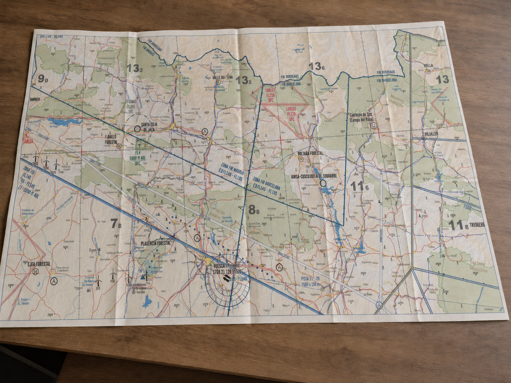

# Cartas aeronáuticas

Una carta aeronáutica no es un simple mapa; es un instrumento de vuelo que debemos aprender a leer con la misma fluidez que el variómetro. En España, nuestra referencia fundamental es la serie de cartas VFR 1:500.000 publicadas por ENAIRE.

En este capítulo aprenderás:

* **La proyección Lambert**: por qué la cartografía aeronáutica la eligió y qué ventajas tiene para volar.
* **La escala 1:500.000**: cómo traducir los centímetros del papel a kilómetros y millas del terreno.
* **La simbología**: espacios aéreos, zonas P/R/D, obstáculos y la diferencia entre AMSL y AGL.
* **El relieve y la Altitud Mínima de Área (AMA)**: la red de seguridad que te da la carta sobre el terreno.

## La Proyección Conforme de Lambert

Representar una superficie esférica sobre un papel plano siempre introduce deformaciones, y cada familia de proyecciones decide qué sacrificar. Las **cilíndricas** (como la Mercator/UTM) mantienen los rumbos como líneas rectas pero deforman mucho las distancias al alejarse del ecuador; las **azimutales** proyectan sobre un plano tangente; y las **cónicas**, sobre un cono. La aviación en latitudes medias eligió la cónica conforme de ****.

 

Se la llama "conforme" porque conserva con gran fidelidad los ángulos y las formas del terreno.

 

Para nosotros, tiene dos ventajas clave:
* **Escala constante**: Podemos usar una regla de navegación en cualquier parte de la carta y la medida será fiable.
* **Líneas rectas**: Una línea recta trazada en esta carta se aproxima mucho a un círculo máximo (ortodrómica), que es la ruta más corta sobre la Tierra.

 

## Entendiendo la Escala

La escala
Escala
 estándar que manejamos es **1:500.000**. Esto significa que cualquier distancia medida sobre el papel es 500.000 veces mayor en la realidad.

 

Para facilitar el cálculo mental en cabina, recuerda:
* **1 cm en la carta = 5 kilómetros** en el terreno.
* **1 cm en la carta ≈ 2.7 Millas Náuticas (NM)**.

 

Con una simple regla de navegación medimos sobre la carta y trasladamos la distancia al terreno; la barra de escala de la  permite hacerlo de un vistazo.

 

## Simbología y Espacios Aéreos

Una carta viene cargada de información, y parte del oficio es saber filtrarla. Lo que más nos interesa a los pilotos de planeador es esto:

 

* **Espacios Aéreos**: Se representan con bordes de colores (azul, magenta, verde) y códigos que indican su clase (A, C, D…​) y sus límites verticales (ej: `FL100 / 2500ft`).
* ****: Identificadas con letras (P - Prohibida, R - Restringida, D - Peligrosa) seguidas de un número (ej: `LER-71`).
* **Obstáculos**: Torres, antenas y aerogeneradores. Verás dos números junto al símbolo de obstáculo: el que no tiene paréntesis es la altitud sobre el nivel del mar (AMSL)
  AMSL (Altitud sobre el nivel del mar / Above Mean Sea Level)
  ; el que está entre paréntesis es la altura real sobre el terreno (AGL)
  AGL (Altura sobre el terreno / Above Ground Level)
  .

 

::: {.callout-warning}
⚠ **SEGURIDAD**

Presta especial atención a los tendidos de alta tensión y los parques eólicos, especialmente si estás planificando un posible aterrizaje en campo. En la carta se representan con líneas negras finas con marcas transversales o símbolos de aspas.
:::

 

## El relieve y la Altitud Mínima de Área (AMA)

El terreno se representa mediante **** (cambios de color: verde para valles, marrones para montañas) y curvas de nivel.

 

En cada cuadrícula de la carta (formada por paralelos y meridianos cada 30 minutos), verás un número grande acompañado de uno más pequeño en superíndice (ej: 4^7^, que se lee 4.700 ft). Es la **** ().

 

{#fig-09-cap03-carta-enaire}

 

::: {.callout-important}
⚖ **NORMATIVA**

La AMA garantiza una separación mínima de **1000 pies** (o 2000 pies en zonas de alta montaña) sobre el obstáculo más alto de ese cuadrante. Es tu "red de seguridad" si pierdes la visibilidad o necesitas navegar con seguridad sobre el relieve.
:::

 

**Resumen del Capítulo: Cartas Aeronáuticas**

* **Proyección Lambert**: Es la estándar para cartas VFR (1:500.000). Es "conforme" (mantiene las formas) y una línea recta es una ortodrómica (ruta más corta). La escala es prácticamente constante entre los dos paralelos estándar de la proyección (la zona útil de la carta).
* **Simbología**: Debes leer una carta con fluidez. Conoce los símbolos de obstáculos (la cifra sin paréntesis es la altitud sobre el nivel del mar —AMSL—; la que va entre paréntesis es la altura sobre el terreno —AGL—), los espacios aéreos (clases A a G) y las zonas P/R/D (prohibida, restringida, peligrosa), además de los aeródromos.
* **Escala**: 1:500.000 significa que 1 cm en el papel son 5 km en la realidad.
* **Elevaciones**: Las tintas hipsométricas (colores del terreno) te dan una idea rápida del relieve. La **Altitud Mínima de Área (AMA)** —no "cota máxima"— es el número grande en cada recuadro. Proporciona separación mínima de 1000 ft sobre el obstáculo más alto de esa zona.
