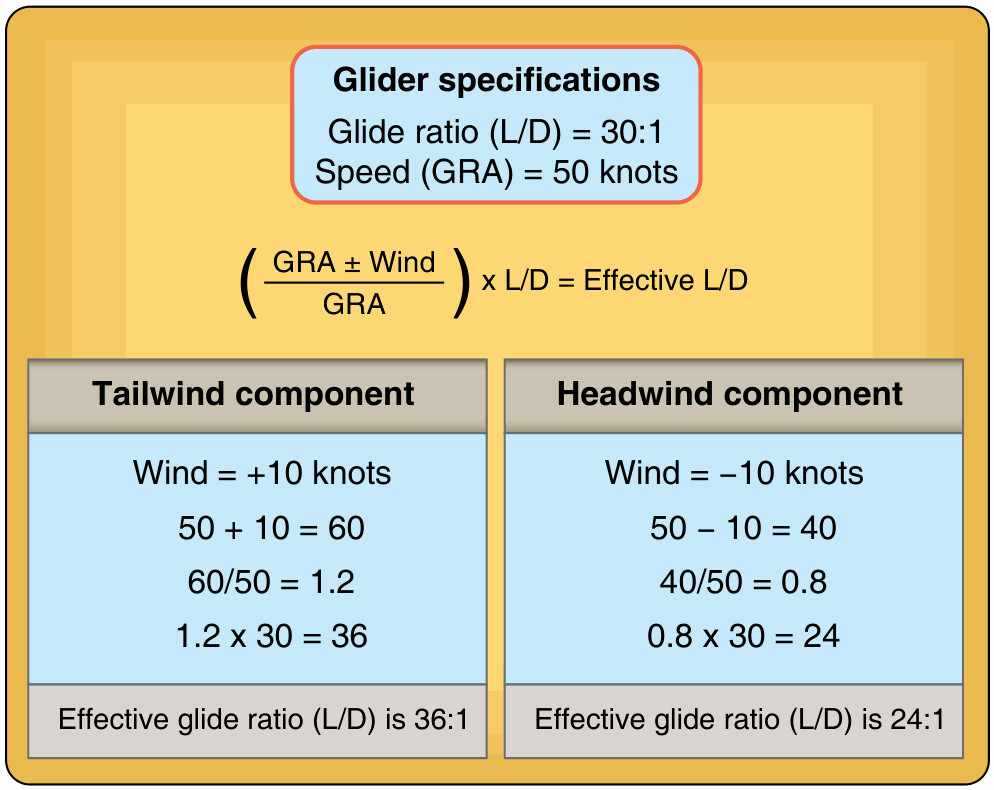

# Navegación por estima (*dead reckoning*)

> Navegar a estima consiste en deducir dónde estás partiendo de un punto conocido y aplicando rumbo, velocidad y tiempo transcurrido. Es lo que te permite alejarte del campo sabiendo siempre dónde estás, aunque el GNSS se apague.
>
>
> En este capítulo aprenderás:
>
>
> * **El triángulo de velocidades**: TAS, viento y GS, y la diferencia entre IAS, TAS y GS.
> * **La deriva y el ángulo de corrección (WCA)**: cómo "meter el morro al viento" para no salirte de ruta.
> * **La cadena de rumbos**: pasar de la trayectoria de la carta al número de la brújula con la convención (W−/E+), con un ejemplo resuelto.
> * **El cálculo de deriva y velocidad suelo**: las fórmulas mentales rápidas, con ejemplos numéricos.
> * **Tiempo, velocidad y distancia**: la aritmética que cierra la estima.
> * **La regla del 1 en 60**: corregir el rumbo sobre la marcha sin transportador.

## El triángulo de velocidades

Todo en navegación por estima se resume en un triángulo vectorial compuesto por tres elementos:

1. **TAS (Velocidad Verdadera)**: Tu velocidad respecto a la masa de aire. Es el vector que marca hacia dónde apunta el planeador.
2. **Viento**: La dirección e intensidad de la masa de aire en la que flotas.
3. **GS (Velocidad Suelo)**: Es la resultante. Tu velocidad real sobre el terreno y la trayectoria que realmente vas a "dibujar" en el mapa.

La suma vectorial de estos tres elementos es la base de todos los cálculos de este capítulo (véase @fig-09-cap04-triangulo-velocidades).

::: {.callout-note title="Airmanship"}
No confundas las tres velocidades que entran en juego: la **IAS** (indicada) es la que marca el anemómetro; la **TAS** (verdadera) es la IAS corregida por densidad —crece aproximadamente un **2 % por cada 300 m** de altitud, unos 6,5-7 % por cada 1.000 m—; y la **GS** (suelo) es la TAS combinada con el viento. En navegación siempre razonamos con **TAS** y **GS**, nunca con la IAS a secas. (El **Libro 7 — Planificación y Rendimiento de Vuelo** usa esta misma regla en su forma «2 % por 300 m».)
:::

{#fig-09-cap04-triangulo-velocidades}

## Deriva y ángulo de corrección (WCA)

Si el viento sopla de costado, nos "arrastrará" fuera de nuestra ruta deseada. Este efecto se llama **Deriva** (**Drift**). Para compensarlo, debemos apuntar el morro del planeador ligeramente hacia el viento. Ese ajuste es el **Ángulo de Corrección de Deriva** (**Wind Correction Angle - WCA**).

::: {.callout-tip title="Regla de oro"}
"Mete el morro al viento". Si el viento viene de la derecha, tu ángulo de corrección debe ser a la derecha (sumar grados a tu trayectoria deseada).
:::

## La cadena de rumbos: de la carta a la brújula

Para saber qué número exacto debemos ver en nuestra brújula para seguir una línea trazada en el mapa, seguimos este proceso lógico:

1. **TC (Trayectoria Verdadera)**: El ángulo medido en la carta con el transportador.
2. **TH (Rumbo Verdadero de Proa)**: Aplicamos el WCA ($TC \pm WCA = TH$).
3. **MH (Rumbo Magnético)**: Aplicamos la Variación magnética ($TH \pm VAR = MH$).
4. **CH (Rumbo de Brújula)**: Aplicamos el Desvío de nuestra aeronave ($MH \pm DEV = CH$).

::: {.callout-note title="Airmanship"}
En el aire, solemos simplificar. Si el viento es suave, el WCA será pequeño. Pero nunca ignores la Variación si estás volando en zonas donde esta es significativa, ya que un error de 5 grados puede sacarte de ruta 8 km tras volar 100 km.
:::

::: {.callout-tip title="Regla de oro"}
El signo es lo que más despista. La regla es sencilla: sobre el rumbo verdadero, una variación o desvío al **Oeste (W) suma** grados, y al **Este (E) resta**. En las fórmulas lo escribimos como **(W −) / (E +)**: el valor Oeste entra con signo negativo dentro del paréntesis y, al restarlo, acaba sumando. La misma idea también se expresa como $MH = TC + VAR_W$ o $MH = TC - VAR_E$; es la misma convención con distinta notación.
:::

### Un ejemplo resuelto de la cadena de rumbos

Trazamos en la carta una trayectoria verdadera **TC = 100º**. No hay viento (WCA = 0), la Variación de la zona es **5º W** y el Desvío de nuestra brújula para ese rumbo es **2º E**. ¿Qué número debemos ver en la brújula?

$$
MH = TC - VAR = 100 - (-5) = 105^\circ
$$

$$
CH = MH - DEV = 105 - (+2) = 103^\circ
$$

Volaremos, por tanto, con la brújula marcando **103º**. Fíjate en cómo la Variación Oeste **aumentó** el rumbo (de 100 a 105) y el Desvío Este lo **redujo** (de 105 a 103): exactamente lo que predice la convención (W −) / (E +).

## Cálculo de la deriva y la velocidad suelo

Cuando preparamos el vuelo en tierra rara vez dibujamos el triángulo con regla: estimamos la deriva con dos fórmulas mentales muy rápidas.

Primero descomponemos el viento respecto a nuestra trayectoria, siendo $\alpha$ el ángulo entre el rumbo y la dirección de donde viene el viento:

$$
V_{cruzado} = V \cdot \sin\alpha \qquad V_{frente} = V \cdot \cos\alpha
$$

La **componente cruzada** es la que nos saca de ruta; la **componente de frente/cola** solo cambia nuestra velocidad suelo. Con la componente cruzada y nuestra TAS, el ángulo de deriva (**Drift Angle**) sale de una variante de la regla 1-en-60:

$$
DA = \frac{V_{cruzado} \cdot 60}{TAS}
$$

Y la velocidad suelo resultante es:

$$
GS = TAS \pm V \cdot \cos\alpha
$$

(signo **−** con viento de cara, **+** con viento de cola).

::: {.callout-tip title="Regla de oro — Ejemplo numérico"}
Volamos a **TAS = 60 kt** con un viento cruzado de **20 kt**. La deriva será $DA = (20 \times 60) / 60 = 20^\circ$. Si ese mismo viento de 20 kt fuera de cara, nuestra velocidad suelo bajaría a **40 kt**; de cola, subiría a **80 kt**. Con TAS baja, ¡el viento manda!
:::

## Tiempo, velocidad y distancia

La aritmética básica de la estima cierra el triángulo: con dos datos obtienes el tercero a partir de $GS = D / T$.

$$
T = \frac{D}{GS} \qquad D = GS \cdot T \qquad GS = \frac{D}{T}
$$

Ejemplo: si planeamos un tramo de **45 NM** y esperamos una velocidad suelo de **90 kt**, tardaremos $T = 45 / 90 = 0{,}5\ \mathrm{h} = 30$ minutos. Convertir las horas decimales a minutos es solo multiplicar la parte decimal por 60 (0,5 h × 60 = 30 min).

::: {.callout-note title="Airmanship"}
Lleva siempre el reloj en marcha desde el último punto conocido. El tiempo transcurrido, multiplicado por tu velocidad suelo estimada, es tu mejor aliado para saber **dónde estarás** —que es de lo que trata realmente la navegación a vela.
:::

## La regla del 1 en 60

La **regla del 1 en 60** es una de esas que parecen magia y caben en la cabeza: si te desvías **1 milla náutica** de tu ruta tras haber volado **60 millas**, tu error de rumbo es justo **1 grado**.

Esta regla te permite corregir rumbos sobre la marcha: si tras 30 millas ves que estás 2 millas a la derecha, sabes que tu error de deriva es de 4 grados (2 millas en 30 es como 4 en 60).

## Ejercicios propuestos

Resuélvelos con lápiz y papel antes de mirar la solución.

**Ejercicio 1 — Cadena de rumbos.**

Quieres volar un rumbo verdadero (TC) de 250°. La carta indica una variación magnética de 3°W y la tablilla de tu brújula da un desvío de 1°E para ese rumbo. No hay viento. ¿Qué rumbo de compás (CH) debes volar?

**Solución.** Sin viento, no hay corrección de deriva, así que TH = TC = 250°. Aplica la variación con la convención (W +) sobre el verdadero para pasar a magnético: MH = 250° + 3° = 253°. Ahora el desvío, que es 1°E, resta: CH = 253° − 1° = **252°**. Regla nemotécnica: «Oeste, el compás marca de más» (hay que sumar al verdadero para obtener lo que volarás).

**Ejercicio 2 — Deriva y rumbo a volar.**

Tu TAS es de 90 km/h y quieres seguir una ruta con rumbo verdadero 000° (al norte). Sopla un viento del oeste (270°) de 18 km/h, es decir, totalmente cruzado. ¿Cuántos grados de corrección de deriva necesitas y hacia dónde?

**Solución.** El viento es 100 % cruzado, así que la componente cruzada es los 18 km/h completos. Con la fórmula mental de deriva, $DA = (V_{cruzado} \times 60)/TAS = (18 \times 60)/90 = 1080/90 = 12^\circ$. El viento viene de la izquierda (del oeste hacia un rumbo norte), así que empujaría hacia la derecha; para compensarlo, mete morro al viento: vuela un rumbo verdadero de **348°** (000° − 12°). Fíjate en la lección del planeador: con TAS baja, un viento moderado produce una deriva grande (aquí, 12° por solo 18 km/h de viento).

::: {.postit}
**Resumen del capítulo: navegación a estima**

* **El Triángulo de Velocidades**: Es la base de todo. Tres vectores: **TAS** (Tu velocidad real aire), **Viento** (Velocidad del aire) y **GS** (Tu velocidad suelo). Si conoces dos, calculas el tercero.
* **Deriva (Drift)**: El ángulo que el viento te desvía de tu rumbo. Debes corregirlo "metiendo morro al viento" (**Ángulo de Corrección de Deriva - WCA**).
* **La Fórmula Mágica**: TC (Rumbo Verdadero) $\pm$ WCA = TH (Rumbo Verdadero de Proa). TH $\pm$ VAR = MH (Rumbo Magnético). MH $\pm$ DEV = CH (Rumbo de Compás). Convención de signos: **(W −) / (E +)**.
* **Deriva y velocidad suelo**: $DA = (V_{cruzado} \times 60)/TAS$ y $GS = TAS \pm V \cdot \cos\alpha$. Con TAS baja, un viento moderado produce mucha deriva.
* **Tiempo/distancia/velocidad**: $T = D/GS$. Pasa horas decimales a minutos multiplicando por 60.
* **Regla del 60**: Si te desvías 1 milla en 60 millas de vuelo, tu error de rumbo es 1 grado. Útil para correcciones mentales rápidas.
:::
