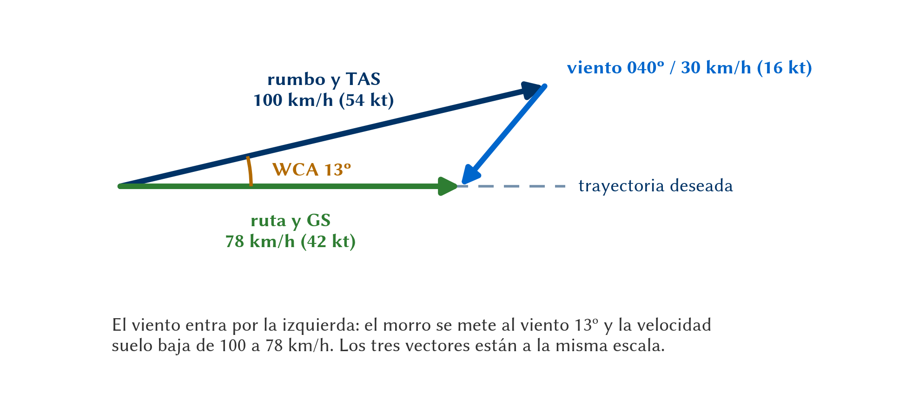
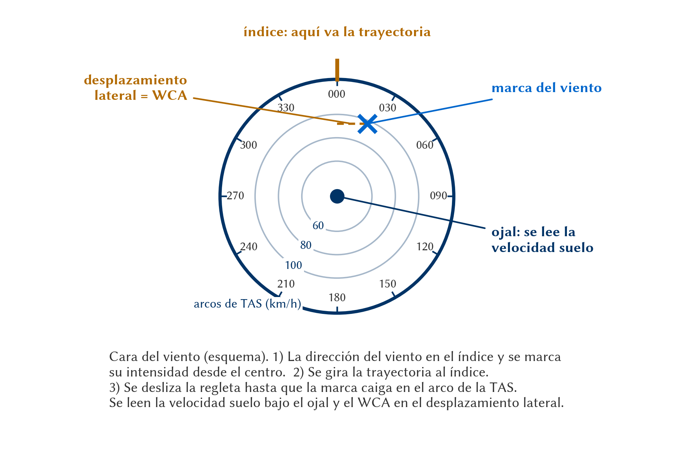
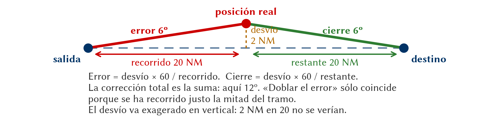

# Navegación por estima (*dead reckoning*)

> Navegar a estima consiste en deducir dónde estás partiendo de un punto conocido y aplicando rumbo, velocidad y tiempo transcurrido. Es lo que te permite alejarte del campo sabiendo siempre dónde estás, aunque el GNSS se apague.
>
>
> En este capítulo aprenderás:
>
>
> * **El triángulo de velocidades**: TAS, viento y GS, y la diferencia entre IAS, TAS y GS.
> * **La deriva y el ángulo de corrección (WCA)**: cómo "meter el morro al viento" para no salirte de ruta.
> * **La cadena de rumbos**: pasar de la trayectoria de la carta al número de la brújula con la convención (W−/E+), con un ejemplo resuelto.
> * **El cálculo de deriva y velocidad suelo**: las fórmulas mentales rápidas, con ejemplos numéricos.
> * **El computador de vuelo**: la regla circular y sus equivalentes electrónicos.
> * **Tiempo, velocidad y distancia**: la aritmética que cierra la estima, incluido el recálculo en vuelo.
> * **La regla del 1 en 60**: corregir el rumbo sobre la marcha sin transportador.

## El triángulo de velocidades

Todo en navegación por estima se resume en un triángulo vectorial compuesto por tres elementos:

1. **TAS (Velocidad Verdadera)**: Tu velocidad respecto a la masa de aire. Es el vector que marca hacia dónde apunta el planeador.
2. **Viento**: La dirección e intensidad de la masa de aire en la que flotas.
3. **GS (Velocidad Suelo)**: Es la resultante. Tu velocidad real sobre el terreno y la trayectoria que realmente vas a "dibujar" en el mapa.

La suma vectorial de estos tres elementos es la base de todos los cálculos de este capítulo (véase @fig-09-cap04-triangulo-velocidades).

Antes de calcular nada, separa dos palabras que se confunden a todas horas. La **trayectoria** (*track*, TC cuando es verdadera) es la línea que quieres dibujar sobre el terreno. El **rumbo** (*heading*, TH) es hacia dónde apunta el morro. Con viento cruzado no coinciden, y medir esa diferencia es todo el trabajo de este capítulo.

::: {.callout-note title="Airmanship"}
No confundas las tres velocidades que entran en juego: la **IAS** (indicada) es la que marca el anemómetro; la **TAS** (verdadera) es la IAS corregida por densidad —crece aproximadamente un **2 % por cada 300 m** de altitud, unos 6,5-7 % por cada 1.000 m—; y la **GS** (suelo) es la TAS combinada con el viento. En navegación siempre razonamos con **TAS** y **GS**, nunca con la IAS a secas. (El **Libro 7 — Planificación y Rendimiento de Vuelo** usa esta misma regla en su forma «2 % por 300 m».)
:::

{#fig-09-cap04-triangulo-velocidades width="100%"}

## Deriva y ángulo de corrección (WCA)

Si el viento sopla de costado, nos "arrastrará" fuera de nuestra ruta deseada. Este efecto se llama **Deriva** (**Drift**). Para compensarlo, debemos apuntar el morro del planeador ligeramente hacia el viento. Ese ajuste es el **Ángulo de Corrección de Deriva** (**Wind Correction Angle - WCA**).

::: {.callout-tip title="Regla de oro"}
"Mete el morro al viento". Si el viento viene de la derecha, tu ángulo de corrección debe ser a la derecha (sumar grados a tu trayectoria deseada).
:::

El viento rara vez sopla justo de costado o justo de cara, así que lo primero es **descomponerlo** en dos partes que hacen cosas distintas:

* La **componente cruzada** (*crosswind*) te saca de la ruta. Es la que produce deriva y la única que obliga a corregir el rumbo.
* La **componente de frente o de cola** (*headwind* / *tailwind*) no te desvía: sólo cambia tu velocidad sobre el suelo, y con ella el tiempo de vuelo.

En un planeador esta distinción pesa mucho más que en un avión. Con una TAS de crucero de 90-110 km/h, un viento de 20 kt no es una molestia: es casi la mitad de tu propia velocidad. Un rumbo mal corregido no te cuesta unos metros. Te cuesta el punto de viraje.

## La cadena de rumbos: de la carta a la brújula

Para saber qué número exacto debemos ver en nuestra brújula para seguir una línea trazada en el mapa, seguimos este proceso lógico:

1. **TC (Trayectoria Verdadera)**: El ángulo medido en la carta con el transportador.
2. **TH (Rumbo Verdadero de Proa)**: Aplicamos el WCA ($TC \pm WCA = TH$).
3. **MH (Rumbo Magnético)**: Aplicamos la Variación magnética ($TH \pm VAR = MH$).
4. **CH (Rumbo de Brújula)**: Aplicamos el Desvío de nuestra aeronave ($MH \pm DEV = CH$).

::: {.callout-note title="Airmanship"}
En el aire, solemos simplificar. Si el viento es suave, el WCA será pequeño. Pero nunca ignores la Variación si estás volando en zonas donde esta es significativa, ya que un error de 5 grados puede sacarte de ruta 8 km tras volar 100 km.
:::

::: {.callout-tip title="Regla de oro"}
El signo es lo que más despista. La regla es sencilla: sobre el rumbo verdadero, una variación o desvío al **Oeste (W) suma** grados, y al **Este (E) resta**. En las fórmulas lo escribimos como **(W −) / (E +)**: el valor Oeste entra con signo negativo dentro del paréntesis y, al restarlo, acaba sumando. La misma idea también se expresa como $MH = TC + VAR_W$ o $MH = TC - VAR_E$; es la misma convención con distinta notación.
:::

::: {.ejercicio}
**Ejercicio 4.1 — De la carta a la brújula.**

Trazamos en la carta una trayectoria verdadera **TC = 100º**. No hay viento (WCA = 0), la Variación de la zona es **5º W** y el Desvío de nuestra brújula para ese rumbo es **2º E**. ¿Qué número debemos ver en la brújula?

**Solución.** Sin viento no hay corrección de deriva, así que $TH = TC = 100^\circ$. Aplicamos la variación y luego el desvío con la convención (W −) / (E +):

$$
MH = TC - VAR = 100 - (-5) = 105^\circ
$$

$$
CH = MH - DEV = 105 - (+2) = 103^\circ
$$

Volaremos, por tanto, con la brújula marcando **103º**. Fíjate en cómo la Variación Oeste **aumentó** el rumbo (de 100 a 105) y el Desvío Este lo **redujo** (de 105 a 103): exactamente lo que predice la convención.
:::

::: {.ejercicio}
**Ejercicio 4.2 — El camino de vuelta.**

Vas volando con la brújula marcando **CH = 270º**. El desvío para ese rumbo es **3º E** y la variación de la zona es **4º W**. No hay viento. ¿Qué trayectoria verdadera estás siguiendo en realidad?

**Solución.** La cadena se recorre al revés, así que **los signos se invierten**: lo que antes sumabas ahora lo restas.

$$
MH = CH + DEV = 270 + (+3) = 273^\circ
$$

$$
TH = MH + VAR = 273 + (-4) = 269^\circ
$$

Y sin viento, $TC = TH = \mathbf{269^\circ}$. Comprobación: si haces el camino de ida desde 269º con esos mismos datos vuelves a 270º, que es el número con el que empezaste. **Hazla siempre**: es la única forma barata de cazar un signo invertido.
:::

## Cálculo de la deriva y la velocidad suelo

Cuando preparamos el vuelo en tierra rara vez dibujamos el triángulo con regla: estimamos la deriva con dos fórmulas mentales muy rápidas.

Primero descomponemos el viento respecto a nuestra trayectoria, siendo $\alpha$ el ángulo entre el rumbo y la dirección de donde viene el viento:

$$
V_{cruzado} = V \cdot \sin\alpha \qquad V_{frente} = V \cdot \cos\alpha
$$

La **componente cruzada** es la que nos saca de ruta; la **componente de frente/cola** solo cambia nuestra velocidad suelo. Con la componente cruzada y nuestra TAS, el ángulo de deriva (**Drift Angle**) sale de una variante de la regla 1-en-60:

$$
DA = \frac{V_{cruzado} \cdot 60}{TAS}
$$

Y la velocidad suelo resultante es:

$$
GS = TAS \pm V \cdot \cos\alpha
$$

(signo **−** con viento de cara, **+** con viento de cola).

Si no tienes calculadora ni ganas de senos y cosenos, sirve la **regla del reloj**: sobre 60 minutos, un ángulo de 15º vale la cuarta parte del viento (0,25), 30º la mitad (0,5), 45º tres cuartos (0,7) y 60º o más, el viento entero. Es una aproximación grosera y basta: el viento previsto tampoco lo conoces con más precisión que eso.

::: {.callout-tip title="Regla de oro — Ejemplo numérico"}
Volamos a **TAS = 60 kt** con un viento cruzado de **20 kt**. La deriva será $DA = (20 \times 60) / 60 = 20^\circ$. Si ese mismo viento de 20 kt fuera de cara, nuestra velocidad suelo bajaría a **40 kt**; de cola, subiría a **80 kt**. Con TAS baja, ¡el viento manda!
:::

::: {.ejercicio}
**Ejercicio 4.3 — Descomponer el viento.**

Quieres seguir una trayectoria verdadera de **060º** con una **TAS de 75 kt**. El viento previsto es de **100º / 15 kt**. ¿Qué rumbo verdadero vuelas y a qué velocidad suelo?

**Solución.** El ángulo entre la trayectoria y la dirección de donde viene el viento es $\alpha = 100 - 60 = 40^\circ$. Descomponemos:

$$
V_{cruzado} = 15 \cdot \sin 40^\circ \approx \text{9,6} \ \mathrm{kt}
\qquad
V_{frente} = 15 \cdot \cos 40^\circ \approx \text{11,5} \ \mathrm{kt}
$$

La deriva sale de la componente cruzada:

$$
DA = \frac{\text{9,6} \times 60}{75} \approx 8^\circ
$$

El viento viene del 100º y volamos al 060º: entra **por la derecha**, así que nos empujaría hacia la izquierda. Metemos morro al viento sumando: $TH = 060 + 8 = \mathbf{068^\circ}$.

Y la componente de frente nos frena:

$$
GS = 75 - \text{11,5} \approx \mathbf{64 \ kt}
$$

Ojo al reparto: de los 15 kt de viento, sólo 9,6 te desvían y 11,5 te frenan. Un viento «de costado» casi nunca lo es del todo.
:::

## El computador de vuelo

Todos los cálculos anteriores se pueden hacer con lápiz, con una calculadora o de cabeza. Pero la herramienta clásica —y la que sigue apareciendo en la formación— es el **computador de vuelo circular**, la regla de cálculo redonda que en inglés llaman *whizz-wheel*. Tiene dos caras y cada una resuelve una familia de problemas distinta.

**La cara de cálculo** es una regla de cálculo circular: dos escalas logarítmicas concéntricas. Alineando una cifra de la escala exterior con otra de la interior resuelves de una vez todas las proporciones del mismo tipo. Sirve para tiempo-velocidad-distancia, para conversiones (NM ↔ km, m ↔ ft, kt ↔ km/h) y para pasar de IAS a TAS con la ventanilla de altitud y temperatura.

**La cara del viento** resuelve el triángulo de velocidades sin trigonometría (@fig-09-cap04-computador-cara-viento). El procedimiento es siempre el mismo:

1. Gira el disco hasta poner **la dirección del viento** en el índice superior.
2. Marca con lápiz un punto a tantas unidades del centro **como intensidad tenga el viento**, en la dirección que corresponde a que el viento sopla *desde* ahí.
3. Gira el disco hasta poner **la trayectoria deseada** en el índice superior.
4. Desliza la regleta hasta que la marca del viento caiga sobre **el arco de tu TAS**.
5. Lee los dos resultados: la **velocidad suelo** bajo el ojal central, y el **ángulo de corrección de deriva** en la separación lateral de la marca respecto al eje.

{#fig-09-cap04-computador-cara-viento width="100%"}

::: {.callout-note title="Airmanship"}
El computador circular no es nostalgia. Funciona sin batería, no se apaga con el sol de frente y obliga a ver el problema como lo que es: un triángulo. Quien sabe usarlo detecta al instante que un resultado del ordenador de a bordo es absurdo, porque lleva el orden de magnitud en la cabeza.
:::

En vuelo ese trabajo lo hacen hoy los **ordenadores de planeo** (LXNAV, Naviter Oudie, XCSoar y compañía), que resuelven el triángulo en continuo con el viento que ellos mismos deducen de la deriva medida en cada círculo. La diferencia práctica está en qué dato te crees: el ordenador te da el viento **real y actual**; tu preparación en tierra, el **previsto**. Cuando discrepan mucho no gana el aparato, gana la pregunta de por qué discrepan.

::: {.ejercicio}
**Ejercicio 4.4 — Conversiones y TAS.**

Tu planeador vuela a **90 km/h de IAS** en el crucero de travesía. (a) ¿Cuántos nudos son? (b) Si vuelas a **1.500 m** de altitud, ¿cuál es tu TAS aproximada, en km/h?

**Solución.** (a) Un nudo es una milla náutica por hora, y una milla náutica son 1.852 m, es decir 1,852 km:

$$
\frac{90}{\text{1,852}} \approx \mathbf{49 \ kt}
$$

(b) La TAS crece un 2 % por cada 300 m. A 1.500 m son cinco tramos de 300 m, o sea un 10 %:

$$
TAS \approx 90 \times \text{1,10} = \mathbf{99 \ km/h}
$$

Nueve km/h de regalo que no aparecen en el anemómetro. Sobre un tramo de una hora son nueve kilómetros: por eso la estima se hace con TAS y no con IAS.
:::

## Tiempo, velocidad y distancia

La aritmética básica de la estima cierra el triángulo: con dos datos obtienes el tercero a partir de $GS = D / T$.

$$
T = \frac{D}{GS} \qquad D = GS \cdot T \qquad GS = \frac{D}{T}
$$

Ejemplo: si planeamos un tramo de **45 NM** y esperamos una velocidad suelo de **90 kt**, tardaremos $T = 45 / 90 = \text{0,5}\ \mathrm{h} = 30$ minutos. Convertir las horas decimales a minutos es solo multiplicar la parte decimal por 60 (0,5 h × 60 = 30 min).

Estos cálculos producen dos horas que conviene no confundir. El **ETE** (*Estimated Time En route*) es el tiempo que tardarás en recorrer el tramo; el **ETA** (*Estimated Time of Arrival*) es la hora del reloj a la que llegarás, es decir, la hora de salida más el ETE. El ETE se calcula una vez en tierra; el **ETA se recalcula en vuelo**, cada vez que fijas la posición, porque la velocidad suelo real casi nunca es la prevista.

::: {.callout-note title="Airmanship"}
Lleva siempre el reloj en marcha desde el último punto conocido. El tiempo transcurrido, multiplicado por tu velocidad suelo estimada, es tu mejor aliado para saber **dónde estarás** —que es de lo que trata realmente la navegación a vela.
:::

## La regla del 1 en 60

La **regla del 1 en 60** es una de esas que parecen magia y caben en la cabeza: si te desvías **1 milla náutica** de tu ruta tras haber volado **60 millas**, tu error de rumbo es justo **1 grado**. En forma general:

$$
Error = \frac{Desvio \times 60}{Distancia\ recorrida}
$$

Esa cifra es el error **cometido**, y corrigiéndola vuelves a volar *paralelo* a la ruta prevista —pero desplazado, sin volver nunca a ella—. Para llegar al destino hace falta una segunda corrección, el **ángulo de cierre**, que se calcula con la misma fórmula sobre la **distancia que queda**:

$$
Cierre = \frac{Desvio \times 60}{Distancia\ restante}
$$

La corrección total es la suma de las dos (@fig-09-cap04-regla-1-en-60). De ahí viene la regla popular de «dobla el error»: **sólo vale si has recorrido justo la mitad del tramo**, porque entonces lo recorrido y lo que queda son iguales. Fuera de ese caso, doblar el error te lleva a otro sitio.

{#fig-09-cap04-regla-1-en-60 width="100%"}

::: {.ejercicio}
**Ejercicio 4.5 — Corregir sobre la marcha.**

Vuelas un tramo de **40 NM**. Tras recorrer **20 NM** identificas un pueblo y compruebas que estás **2 NM a la derecha** de la ruta prevista. (a) ¿Cuál es tu error de rumbo? (b) ¿Cuánto tienes que virar para llegar al destino? (c) ¿Y si el desvío lo hubieras detectado tras las mismas 20 NM pero el tramo fuera de 60 NM?

**Solución.** (a) Error cometido:

$$
Error = \frac{2 \times 60}{20} = 6^\circ
$$

(b) Quedan $40 - 20 = 20$ NM, así que el ángulo de cierre vale $Cierre = (2 \times 60)/20 = 6^\circ$. Total: $6 + 6 = \mathbf{12^\circ}$ **a la izquierda** (estás a la derecha, hay que volver hacia la izquierda). Aquí sí funciona «dobla el error»: has recorrido justo la mitad.

(c) Con un tramo de 60 NM quedan 40 NM, y el cierre es menor:

$$
Cierre = \frac{2 \times 60}{40} = 3^\circ
$$

Total: $6 + 3 = \mathbf{9^\circ}$ a la izquierda. Fíjate en que el error cometido no ha cambiado —depende sólo de lo volado— pero la corrección sí. **Doblar el error habría sobrecorregido en 3º.**
:::

::: {.ejercicio}
**Ejercicio 4.6 — Un tramo completo, de la planificación al ETA.**

En la carta mides un tramo de **42 NM** con trayectoria verdadera **TC = 250º**. Tu TAS de crucero es **70 kt**. El viento previsto es **310º / 20 kt**, la variación de la zona **2º W** y el desvío de tu brújula para ese rumbo **1º E**.

(a) Prepara el tramo: rumbo de brújula, velocidad suelo y ETE. Sales a las **10:15 UTC**: ¿cuál es tu ETA?
(b) A las **10:35** fijas la posición sobre un embalse y compruebas que llevas recorridas **16 NM**. Recalcula el ETA.

**Solución (a).** Ángulo entre trayectoria y viento: $\alpha = 310 - 250 = 60^\circ$.

$$
V_{cruzado} = 20 \cdot \sin 60^\circ \approx \text{17,3} \ \mathrm{kt}
\qquad
V_{frente} = 20 \cdot \cos 60^\circ = 10 \ \mathrm{kt}
$$

$$
DA = \frac{\text{17,3} \times 60}{70} \approx 15^\circ
$$

El viento entra por la derecha (310º sobre una trayectoria de 250º), así que metemos morro a la derecha:

$$
TH = 250 + 15 = 265^\circ
$$

Ahora la cadena de rumbos, con la convención (W −) / (E +):

$$
MH = TH - VAR = 265 - (-2) = 267^\circ
$$

$$
CH = MH - DEV = 267 - (+1) = 266^\circ
$$

La componente de frente nos frena: $GS = 70 - 10 = 60$ kt. Y el tiempo:

$$
ETE = \frac{42}{60} = \text{0,7} \ \mathrm{h} = 42 \ \mathrm{min}
$$

Volarás con la brújula en **266º**, a **60 kt** de velocidad suelo, con un **ETE de 42 min** y un **ETA de 10:57**.

**Solución (b).** Han pasado 20 minutos (un tercio de hora) y llevas 16 NM, así que tu velocidad suelo **real** es:

$$
GS_{real} = \frac{16}{1/3} = 48 \ \mathrm{kt}
$$

Doce nudos menos de los previstos. Quedan $42 - 16 = 26$ NM:

$$
T = \frac{26}{48} \approx \text{0,54} \ \mathrm{h} \approx 33 \ \mathrm{min}
$$

Nuevo **ETA: 11:08**, once minutos más tarde de lo planeado. Ésa es toda la gracia de la estima: la casilla se corrige con lo que ves, no al revés.
:::

::: {.postit}
**Resumen del capítulo: navegación a estima**

* **El Triángulo de Velocidades**: Es la base de todo. Tres vectores: **TAS** (Tu velocidad real aire), **Viento** (Velocidad del aire) y **GS** (Tu velocidad suelo). Si conoces dos, calculas el tercero.
* **Trayectoria no es rumbo**: la trayectoria (TC) es la línea sobre el terreno; el rumbo (TH) es hacia dónde apunta el morro. Con viento cruzado no coinciden.
* **Deriva (Drift)**: El ángulo que el viento te desvía de tu rumbo. Debes corregirlo "metiendo morro al viento" (**Ángulo de Corrección de Deriva - WCA**).
* **La Fórmula Mágica**: TC (Rumbo Verdadero) $\pm$ WCA = TH (Rumbo Verdadero de Proa). TH $\pm$ VAR = MH (Rumbo Magnético). MH $\pm$ DEV = CH (Rumbo de Brújula). Convención de signos: **(W −) / (E +)**. De vuelta, los signos se invierten.
* **Deriva y velocidad suelo**: $DA = (V_{cruzado} \times 60)/TAS$ y $GS = TAS \pm V \cdot \cos\alpha$. Con TAS baja, un viento moderado produce mucha deriva.
* **El computador de vuelo**: cara de cálculo para tiempo/velocidad/distancia y conversiones; cara del viento para el triángulo. Los ordenadores de planeo hacen lo mismo con el viento real medido en vuelo.
* **Tiempo/distancia/velocidad**: $T = D/GS$. Pasa horas decimales a minutos multiplicando por 60. El **ETE** se calcula en tierra; el **ETA se recalcula en vuelo** con la velocidad suelo real.
* **Regla del 60**: $Error = (Desvio \times 60)/Distancia$. Para llegar al destino hay que sumar el ángulo de cierre, calculado sobre la distancia **restante**. «Doblar el error» sólo vale a mitad de tramo.
:::
