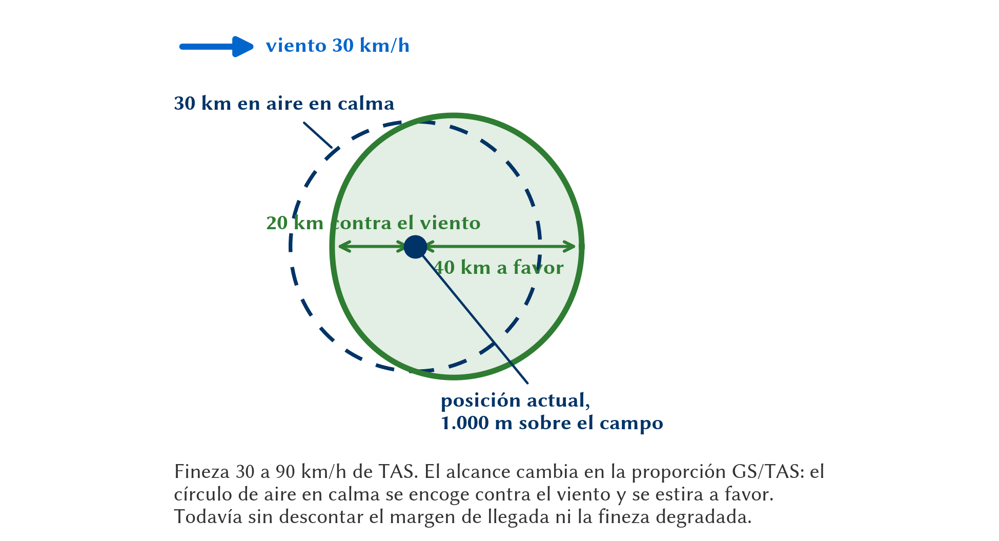
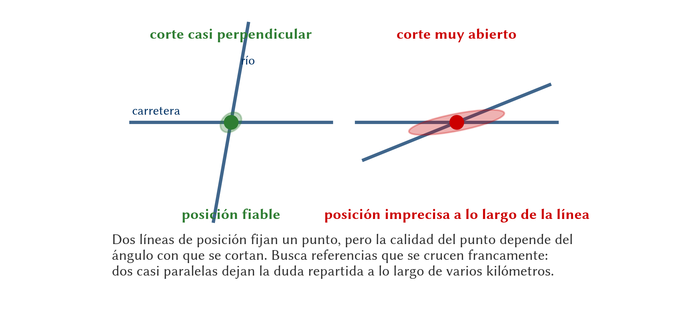
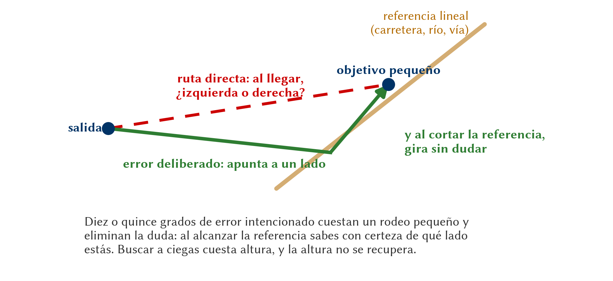

# Navegación en vuelo

> En el aire, la teoría del papel se vuelve oficio: comparar lo que ves por la cúpula con lo que habías planificado. Y en planeador esto exige un punto extra de atención, porque no podemos perdernos mientras además gestionamos la energía y buscamos la siguiente térmica.
>
>
> En este capítulo aprenderás:
>
>
> * **Las tres formas de navegar**: estima, observada y visual, y cómo se combinan en vuelo.
> * **La técnica mapa-terreno**: busca en el mapa lo que ves fuera, nunca al revés.
> * **El cono de alcance**: hasta dónde llegas desde donde estás, y cómo lo cambia el viento.
> * **La triangulación**: cruzar dos líneas de posición para fijar dónde estás con certeza.
> * **El error deliberado**: cómo encontrar un punto pequeño sin adivinar hacia qué lado girar.
> * **La gestión de la incertidumbre de posición (UOP)**: qué hacer cuando dudas de dónde estás.

## Tres formas de navegar

En la práctica combinamos tres técnicas que se complementan:

* **Navegación a la estima** (**dead reckoning**): deducimos la posición a partir del rumbo, la velocidad y el tiempo (el capítulo anterior). Es nuestra base de cálculo, pero los pequeños errores se acumulan.
* **Navegación observada**: fijamos la posición reconociendo el terreno (ríos, carreteras, pueblos) y comparándolo con la carta.
* **Navegación visual**: la combinación de las dos anteriores —calculamos a la estima y **confirmamos** con referencias del terreno— y es la que realmente usamos en vuelo a vela.

Ninguna vale sola. La estima sin comprobar acumula error hasta perderte; la observación sin estima te deja mirando el mapa entero en vez de un círculo de diez kilómetros. Lo que hace un piloto de travesía es alternarlas: calcula dónde debería estar y luego busca allí la confirmación.

## La técnica mapa-terreno

La regla de oro de la navegación visual es: **nunca busques en el terreno lo que ves en el mapa; busca en el mapa lo que ves en el terreno.**

* **Selecciona referencias grandes**: Autopistas, líneas de costa, grandes lagos o ciudades. Los ríos pequeños pueden ser confusos si serpentean mucho o están secos.
* **Orientación del mapa**: Vuela siempre con el mapa orientado en el sentido de tu vuelo ("arriba" es hacia donde vas). De esta forma, si ves una montaña a tu izquierda en el terreno, debe estar a la izquierda en tu mapa.
* **El pulgar sobre el mapa**: deja el dedo en el último punto que confirmaste y muévelo sólo cuando confirmes el siguiente. Cuando levantes la vista después de veinte minutos de térmicas, el dedo te dice de dónde partir.

La cadencia importa tanto como la técnica. En travesía se fija la posición **cada 10 o 15 minutos**, y siempre antes de un punto de viraje o de entrar en un espacio aéreo con condiciones. Más a menudo es perder tiempo de vuelo; más espaciado, y el error de la estima crece hasta que ya no sabes en qué mitad de la hoja mirar.

::: {.callout-tip title="Regla de oro"}
Elige puntos de comprobación que sean **inconfundibles y estén en tu ruta**: un cruce de autovía con río, un embalse de forma reconocible, un pueblo con silo. Un pueblo cualquiera en una meseta con veinte pueblos iguales no es un punto de comprobación: es una trampa.
:::

## El cono de alcance: hasta dónde llegas

Un planeador navega con una restricción que ningún avión tiene: cada kilómetro se paga con altura. Saber **hasta dónde alcanzas desde donde estás** convierte el mapa en algo distinto de lo que ve un piloto de motor. Alrededor de tu posición hay un círculo —el **cono de alcance**, o cono de planeo— y sólo lo que cae dentro es materia de decisión. Si el destino está dentro, sigues; si está fuera, la ruta se replantea: térmica, desvío o campo.

Aquí lo tratamos como lo que es para la navegación, **un radio sobre la carta**. El seguimiento del planeo final, el punto de no retorno y la lectura de la polar pertenecen al rendimiento y se estudian en el **Libro 7 — Planificación y Rendimiento de Vuelo**, capítulo 5.

El alcance en aire en calma es inmediato: la **fineza** (coeficiente de planeo, L/D) dice cuántos metros avanzas por cada metro que desciendes.

$$
D = h \cdot (L/D)
$$

Con 1.000 m de altura sobre el campo y una fineza de 30, alcanzas 30.000 m, o sea 30 km. Ese radio, dibujado alrededor de tu posición, es el **cono de planeo**.

El viento lo deforma, y mucho. La distancia recorrida sobre el suelo cambia en la misma proporción que la velocidad suelo:

$$
D_{real} = h \cdot (L/D) \cdot \frac{GS}{TAS}
$$

Con esos mismos 30 km de alcance teórico, volando a 90 km/h de TAS, un viento de 30 km/h en cara te deja en 20 km, y el mismo viento en cola te lleva a 40 km. El cono deja de ser un círculo y se convierte en un óvalo desplazado a favor del viento (@fig-09-cap05-cono-de-alcance).

{#fig-09-cap05-cono-de-alcance width="100%"}

::: {.callout-warning title="Seguridad"}
La fineza del manual se mide en aire en calma y en vuelo rectilíneo estabilizado. El aire real entre térmicas **desciende**, y ese descenso se suma al tuyo. Planifica siempre con una fineza degradada —muchos pilotos usan la mitad de la nominal— y **llega con altura sobrante**: 300 m sobre el campo es un mínimo razonable para tener tiempo de organizar el circuito.
:::

::: {.ejercicio}
**Ejercicio 5.1 — ¿Llego al campo?**

Vuelas un planeador de fineza **38**. Estás **1.500 m** por encima de la altitud del aeródromo. (a) ¿Cuál es tu alcance en aire en calma? (b) ¿Y con **25 km/h de viento en cara**, volando a **110 km/h** de TAS? (c) ¿Y si además quieres llegar con **300 m** sobre el campo?

**Solución.** (a) En aire en calma:

$$
D = 1.500 \times 38 = 57.000 \ \mathrm{m} = \mathbf{57 \ km}
$$

(b) Tu velocidad suelo es $110 - 25 = 85$ km/h, así que el alcance se reduce en la proporción $85/110$:

$$
D_{real} = 57 \times \frac{85}{110} \approx \mathbf{44 \ km}
$$

(c) El margen de llegada se descuenta **de la altura, antes de multiplicar**. Altura utilizable: $1.500 - 300 = 1.200$ m.

$$
D_{real} = 1.200 \times 38 \times \frac{85}{110} \approx 35.200 \ \mathrm{m} = \mathbf{35 \ km}
$$

De 57 a 35 km sin que haya cambiado nada del planeador. El viento y el margen se han comido el 39 % del alcance.
:::

::: {.ejercicio}
**Ejercicio 5.2 — La fineza que de verdad tienes.**

Mismo planeador de fineza 38 a **110 km/h** de TAS, a **1.500 m** sobre el campo, sin viento. Pero el aire entre térmicas **desciende a 1 m/s**. ¿Cuál es tu alcance real?

**Solución.** Primero, tu velocidad de descenso propia a esa velocidad. La TAS en metros por segundo es $110 / \text{3,6} \approx \text{30,6}$ m/s, y la fineza relaciona avance y descenso:

$$
v_{descenso} = \frac{\text{30,6}}{38} \approx \text{0,8} \ \mathrm{m/s}
$$

El aire que te rodea baja además 1 m/s, y los dos descensos se suman: $\text{0,8} + 1 = \text{1,8}$ m/s. Tu fineza **efectiva** es:

$$
(L/D)_{efectiva} = \frac{\text{30,6}}{\text{1,8}} \approx 17
$$

$$
D = 1.500 \times 17 \approx 25.500 \ \mathrm{m} \approx \mathbf{25 \ km}
$$

Menos de la mitad de los 57 km del ejercicio anterior, y no ha soplado ni una gota de viento. Ésta es la razón por la que se planifica con fineza degradada: un metro por segundo de aire descendente es un día normal, no un día malo.
:::

::: {.ejercicio}
**Ejercicio 5.3 — La decisión.**

Estás a **1.200 m** sobre la altitud del aeródromo de salida, que queda a **32 km**. Tu planeador tiene fineza nominal 35, pero decides planificar con **25** por el aire descendente. Vuelas a **100 km/h** de TAS con **20 km/h de viento en cara** y quieres llegar con **250 m** de margen. ¿Sigues hacia el campo o buscas térmica?

**Solución.** Altura utilizable: $1.200 - 250 = 950$ m. Velocidad suelo: $100 - 20 = 80$ km/h.

$$
D_{real} = 950 \times 25 \times \frac{80}{100} = 19.000 \ \mathrm{m} = 19 \ \mathrm{km}
$$

Alcanzas 19 km y el campo está a 32. **No llegas**: te faltan 13 km. La decisión es buscar térmica ya, mientras aún tienes altura para elegir dónde hacerlo y qué campo alternativo te queda debajo. Si esperas a estar a 600 m, tendrás la mitad de alcance y la mitad de opciones.
:::

::: {.callout-note title="Airmanship"}
Este cálculo es el que hacen en continuo los ordenadores de planeo, y lo hacen mejor: conocen la polar del planeador, el viento medido y la altitud del campo. Lo que no conocen es el aire que vas a encontrar en los próximos veinte kilómetros. La flecha verde de la pantalla es una hipótesis, no una promesa.
:::

El factor $GS/TAS$ es la versión exacta de una regla de cabina que ya conoces del Libro 7: *«con viento de cara, divide el alcance por dos»*. Esa regla es deliberadamente pesimista y sirve para decidir en un segundo. La fórmula sirve para preparar el vuelo con papel delante, y para entender por qué la regla es tan conservadora.

## Triangulación: saber dónde estás con certeza

No confíes en una sola referencia. Para confirmar tu posición, usa la técnica de la triangulación o líneas de posición:

1. Identifica una referencia lineal y bien definida (una carretera nacional, un río o una vía de tren, por ejemplo).
2. Busca una segunda referencia que cruce o esté alineada con un punto notable (ej: "estoy sobre la carretera N-VI, justo cuando el pueblo X queda a mis 3").

El cruce de esas dos líneas de posición fija tu posición con bastante certeza (@fig-09-cap05-triangulacion).

Las dos líneas deben cortarse lo más **perpendicularmente** posible (@fig-09-cap05-triangulacion). Dos referencias casi paralelas se cruzan en un ángulo muy abierto y el punto de corte se vuelve impreciso: un pequeño error en cualquiera de las dos desplaza la posición varios kilómetros a lo largo de la línea.

{#fig-09-cap05-triangulacion width="100%"}

## El error deliberado

Buscar un punto pequeño volando exactamente hacia él tiene un problema: cuando llegas a la zona y no lo ves, no sabes si está a tu izquierda o a tu derecha. Y con la mitad de probabilidades de equivocarte, gastas altura buscando en el lado que no era.

La solución clásica se llama **error deliberado** (*deliberate error* o *dog-leg*): en vez de apuntar al punto, apuntas **claramente a un lado** —diez o quince grados bastan— hacia una referencia lineal que pase por él: una carretera, un río, una vía. Al llegar a esa línea ya no hay duda de hacia dónde girar, porque sabes con certeza de qué lado estás (@fig-09-cap05-error-deliberado). Se vuela un poco más y se llega seguro.

{#fig-09-cap05-error-deliberado width="100%"}

::: {.callout-tip title="Regla de oro"}
El error deliberado cambia **una duda por un rodeo**. Es un buen trato casi siempre, y sobre todo cuando el punto que buscas es un aeródromo pequeño, el terreno es monótono y te queda poca altura para exploraciones.
:::

## Gestión de la incertidumbre (UOP)

Si en algún momento no estás seguro de tu posición exacta (Uncertainty of Position), mantén la calma y sigue este protocolo:

* **No zigzaguees**: Mantén el rumbo que tenías. Si empiezas a dar vueltas a ciegas, te perderás más rápido y gastarás altura preciosa.
* **Confía en tu estima**: Mira el reloj. Si llevas 10 minutos volando a 100 km/h, busca referencias a unos 15-20 km de tu último punto conocido.
* **Busca "Handrails" (pasamanos)**: Vuela hacia la referencia más grande y lineal que veas (una costa, una cordillera principal).

::: {.callout-warning title="Seguridad"}
Si la incertidumbre persiste y tu altura se reduce, deja de intentar navegar y concéntrate en aterrizar. **Navegar es secundario; volar el planeador y asegurar una toma segura es lo primero.**
:::

::: {.callout-note title="Airmanship"}
Si tienes radio y estás en contacto con un servicio ATC, no dudes en preguntar: "Madrid, EC-XYZ, dudo de mi posición, solicito vector o confirmación". No hay vergüenza en pedir ayuda antes de que la situación sea crítica.
:::

## Cambiar de plan: el desvío

Un vuelo de travesía en planeador se replantea constantemente, y eso no es un fracaso: es el oficio. El punto de viraje que era razonable a las dos de la tarde deja de serlo cuando el cielo se cierra por el oeste.

Un desvío se decide con tres datos, y conviene tenerlos siempre a mano:

1. **Dónde estás** y a qué altura sobre el terreno.
2. **Qué alcanzas** con la altura que tienes, ya corregido por viento y por fineza degradada.
3. **Qué hay dentro de ese alcance**: aeródromos, campos aptos, y qué espacio aéreo hay por el camino.

Con eso, el desvío se traza en el mapa, se mide el rumbo y la distancia, y se recalcula el tiempo. Es exactamente el mismo procedimiento del capítulo anterior, hecho con prisa y sobre las rodillas. Por eso se practica en tierra: para que en el aire salga solo.

::: {.callout-warning title="Seguridad"}
Decide el desvío **con altura**, no cuando ya no te quede otra. Una decisión tomada a 1.500 m tiene varias soluciones buenas; la misma decisión a 400 m tiene una sola, y no la eliges tú.
:::

::: {.postit}
**Resumen del capítulo: navegación en vuelo**

* **Referencias Visuales**: Usa objetos grandes, lineales y con contraste (ríos, autopistas, líneas de costa). Oriente la carta siempre en el sentido del vuelo (lo que ves a la derecha en el suelo, a la derecha en el papel). Fija la posición cada 10-15 minutos.
* **Cono de alcance**: $D = h \cdot (L/D)$, corregido por viento con el factor $GS/TAS$. Descuenta primero el margen de llegada de la altura. Planifica con fineza degradada: el aire entre térmicas desciende y se suma a tu descenso.
* **Triangulación**: No te fíes de una sola referencia. Cruza al menos dos "líneas de posición" (ej. el cruce de una carretera y el eje de una montaña) para saber dónde estás con certeza. Cuanto más perpendiculares se corten, mejor.
* **Error deliberado**: para encontrar un punto pequeño, apunta a propósito a un lado hacia una referencia lineal. Al llegar sabes con certeza hacia dónde girar.
* **Incertidumbre de Posición**: Si te pierdes, NO SIGAS VOLANDO A CIEGAS. Mantén el rumbo, busca referencias grandes, confía en tu estima inicial y, si es necesario, vuela hacia un lugar conocido (un río, una costa) o aterriza con seguridad antes de quedarte sin altura.
* **Desvío**: se decide con altura y con tres datos —dónde estás, qué alcanzas y qué hay dentro de ese alcance—. Es la planificación del capítulo 4 hecha sobre las rodillas.
:::
