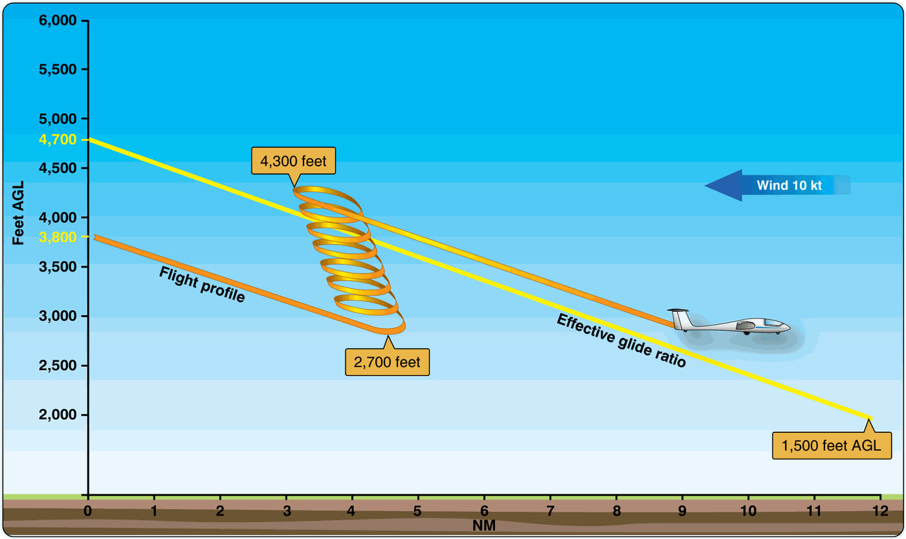

# Navegación en vuelo

En el aire, la teoría del papel se vuelve oficio: comparar lo que ves por la cúpula con lo que habías planificado. Y en planeador esto exige un punto extra de atención, porque no podemos perdernos mientras además gestionamos la energía y buscamos la siguiente térmica.

En este capítulo aprenderás:

* **Las tres formas de navegar**: estima, observada y visual, y cómo se combinan en vuelo.
* **La técnica mapa-terreno**: busca en el mapa lo que ves fuera, nunca al revés.
* **La triangulación**: cruzar dos líneas de posición para fijar dónde estás con certeza.
* **La gestión de la incertidumbre de posición (UOP)**: qué hacer cuando dudas de dónde estás.

## Tres formas de navegar

En la práctica combinamos tres técnicas que se complementan:

* **Navegación a la estima** (**dead reckoning**): deducimos la posición a partir del rumbo, la velocidad y el tiempo (el capítulo anterior). Es nuestra base de cálculo, pero los pequeños errores se acumulan.
* **Navegación observada**: fijamos la posición reconociendo el terreno (ríos, carreteras, pueblos) y comparándolo con la carta.
* **Navegación visual**: la combinación de las dos anteriores —calculamos a la estima y **confirmamos** con referencias del terreno— y es la que realmente usamos en vuelo a vela.

## La técnica Mapa-Terreno

La regla de oro de la navegación visual es: **nunca busques en el terreno lo que ves en el mapa; busca en el mapa lo que ves en el terreno.**

* **Selecciona referencias grandes**: Autopistas, líneas de costa, grandes lagos o ciudades. Los ríos pequeños pueden ser confusos si serpentean mucho o están secos.
* **Orientación del mapa**: Vuela siempre con el mapa orientado en el sentido de tu vuelo ("arriba" es hacia donde vas). De esta forma, si ves una montaña a tu izquierda en el terreno, debe estar a la izquierda en tu mapa.

## Triangulación: Saber dónde estás con certeza

No confíes en una sola referencia. Para confirmar tu posición, usa la técnica de la triangulación o líneas de posición:

1. Identifica una referencia lineal y bien definida (una carretera nacional, un río o una vía de tren, por ejemplo).
2. Busca una segunda referencia que cruce o esté alineada con un punto notable (ej: "estoy sobre la carretera N-VI, justo cuando el pueblo X queda a mis 3").

El cruce de esas dos líneas de posición fija tu posición con bastante certeza ().

{#fig-09-cap05-triangulacion}

## Gestión de la Incertidumbre (UOP)

Si en algún momento no estás seguro de tu posición exacta (Uncertainty of Position), mantén la calma y sigue este protocolo:

* **No zigzaguees**: Mantén el rumbo que tenías. Si empiezas a dar vueltas a ciegas, te perderás más rápido y gastarás altura preciosa.
* **Confía en tu estima**: Mira el reloj. Si llevas 10 minutos volando a 100 km/h, busca referencias a unos 15-20 km de tu último punto conocido.
* **Busca "Handrails" (pasamanos)**: Vuela hacia la referencia más grande y lineal que veas (una costa, una cordillera principal).

::: {.callout-warning}
⚠ **SEGURIDAD**

Si la incertidumbre persiste y tu altura se reduce, deja de intentar navegar y concéntrate en aterrizar. **Navegar es secundario; volar el planeador y asegurar una toma segura es lo primero.**
:::

::: {.callout-note}
⚓ **AIRMANSHIP**

Si tienes radio y estás en contacto con un servicio ATC, no dudes en preguntar: "Madrid, EC-XYZ, dudo de mi posición, solicito vector o confirmación". No hay vergüenza en pedir ayuda antes de que la situación sea crítica.
:::

**Resumen del Capítulo: Navegación en Vuelo**

* **Referencias Visuales**: Usa objetos grandes, lineales y con contraste (ríos, autopistas, líneas de costa). Oriente la carta siempre en el sentido del vuelo (lo que ves a la derecha en el suelo, a la derecha en el papel).
* **Triangulación**: No te fíes de una sola referencia. Cruza al menos dos "líneas de posición" (ej. el cruce de una carretera y el eje de una montaña) para saber dónde estás con certeza.
* **La Regla 1:60**: Si te desvías 1 NM de tu ruta tras haber volado 60 NM, tu error de rumbo es de 1º. Puedes usar esta proporción para corregir el rumbo mentalmente sin transportador.
* **Incertidumbre de Posición**: Si te pierdes, NO SIGAS VOLANDO A CIEGAS. Mantén el rumbo, busca referencias grandes, confía en tu estima inicial y, si es necesario, vuela hacia un lugar conocido (un río, una costa) o aterriza con seguridad antes de quedarte sin altura.
