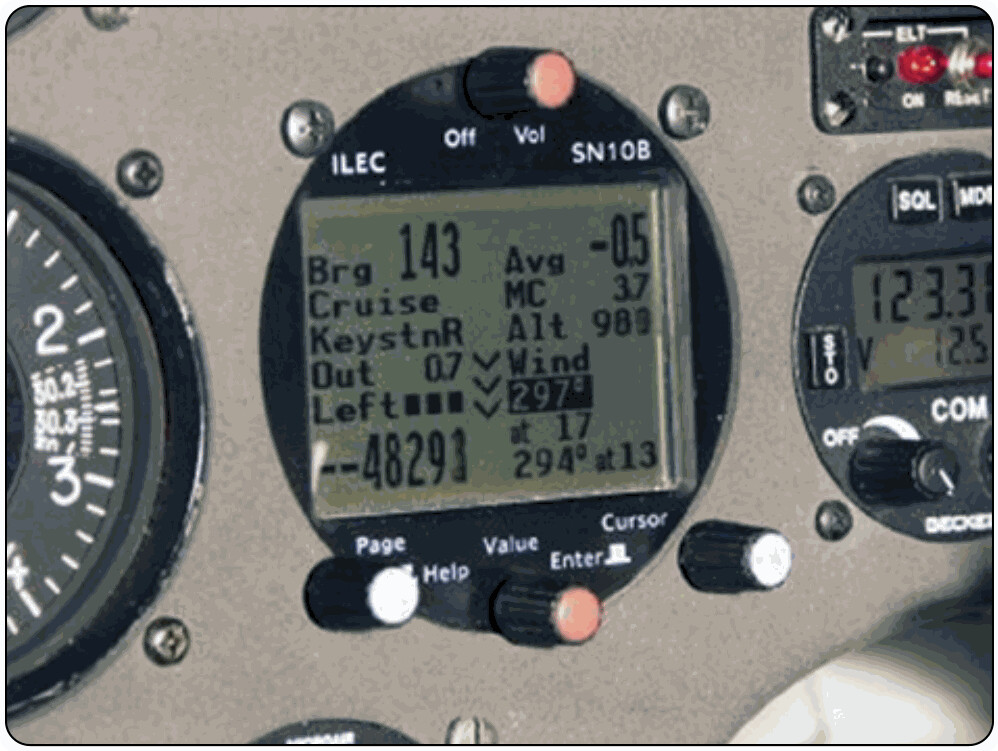

# Uso de GNSS

El Sistema Global de Navegación por Satélite (GNSS) —que agrupa redes como el GPS estadounidense o el europeo Galileo— ha cambiado por completo el vuelo a vela. Nos da posición, altitud y velocidad suelo con una precisión que hace años parecía impensable. Aun así, en el hangar lo resumimos en una frase: el GPS es un criado excelente, pero un amo pésimo.

En este capítulo aprenderás:

* **Cómo funciona el GNSS**: por qué necesitas captar cuatro satélites para una posición en tres dimensiones.
* **El datum WGS-84**: el "idioma" geográfico común entre el receptor y la carta de papel.
* **Los registradores IGC**: la prueba digital del vuelo para validar récords y medallas FAI.
* **Las limitaciones y fuentes de error**: por qué el GPS es una ayuda y nunca un sustituto de la carta.

## ¿Cómo funciona el GNSS?

Para que tu dispositivo te dé una posición tridimensional (latitud, longitud y altitud), necesita "ver" al menos **4 satélites**. Con tres satélites sabría dónde estás sobre el mapa, pero no sabría a qué altura vuelas.

La mayoría de los receptores modernos combinan señales de varias constelaciones para mejorar la precisión:
* **GPS**: El sistema original norteamericano.
* **Galileo**: El sistema europeo, más reciente y con mayor precisión civil.
* **GLONASS**: El sistema ruso.

### El Datum WGS-84

Para que el GPS y la carta de papel se entiendan, deben usar el mismo "idioma" geográfico o **Datum**. El estándar mundial que usamos es el **WGS-84**. Asegúrate siempre de que tu dispositivo está configurado en este sistema; un datum incorrecto podría desplazar tu posición real varios cientos de metros respecto a lo que ves en pantalla.

## Los Registradores IGC (Loggers)

**↗ MÁS ALLÁ DEL EXAMEN.** Los registradores IGC y la validación de récords y medallas FAI no deberían ser materia de examen. Se incluyen como iniciación al vuelo deportivo de distancia; no los estudies con la prioridad del resto del temario.

En el mundo del planeador, el GNSS no solo sirve para navegar. Usamos dispositivos certificados llamados **registradores IGC** (**Loggers**) que graban cada segundo de nuestro vuelo.

Estos archivos digitales (.igc) son la prueba de que has pasado por los puntos de viraje de una tarea y sirven para validar récords y medallas de la FAI. Al aterrizar, puedes volcar el vuelo en programas de análisis para aprender de tus decisiones y ver exactamente dónde encontraste esa térmica tan buena.

Los equipos modernos integran el GNSS con un **mapa móvil** que muestra ruta, espacios aéreos y datos de planeo ().

{#fig-09-cap06-gnss-cabina}

## Limitaciones y Conciencia Situacional

El GPS puede fallar. Y fallará en el momento más inoportuno.

* **Fallo de energía**: La batería de tu PDA o tablet puede agotarse o el cable de carga puede soltarse con las turbulencias.
* **Pérdida de señal**: En valles profundos o debido a interferencias, puedes perder la cobertura de satélites temporalmente.
* **Base de datos desactualizada**: Si no actualizas los espacios aéreos de tu dispositivo, podrías entrar en una zona prohibida sin saberlo.

Además, la propia señal tiene fuentes de error que degradan la precisión aunque el equipo funcione: el **retardo ionosférico y troposférico** (la señal se frena al atravesar la atmósfera), el **multitrayecto** (rebotes de la señal en el terreno o en estructuras), las pequeñas **derivas de los relojes** y la **geometría de los satélites** (si están mal repartidos en el cielo, la **dilución de la precisión** o DOP empeora). En condiciones normales la precisión ronda unos pocos metros, más que suficiente para volar, pero conviene saber que no es infalible.

::: {.callout-note}
⚓ **AIRMANSHIP / BUENAS PRÁCTICAS**

El GNSS no te exime de saber navegar visualmente: el vuelo VFR se apoya en referencias del terreno, con o sin pantalla. Y tenlo presente en el examen de pericia de la SPL: el examinador puede apagarte el dispositivo para comprobar que sabes volver al aeródromo con el mapa y la brújula.
:::

::: {.callout-tip}
✦ **REGLA DE ORO**

Lleva siempre una **fuente de respaldo** (backup). Si confías en una tablet, ten tu teléfono con una app de navegación cargada y, por supuesto, la carta de papel doblada y lista en el bolsillo lateral de la cabina.
:::

**Resumen del Capítulo: Uso del GNSS (GPS)**

* **Ayuda, no sustituto**: El GPS es una herramienta fabulosa para la conciencia situacional, pero nunca debe sustituir a la navegación visual y a la carta. Las baterías fallan, las señales se pierden y los dispositivos se cuelgan.
* **Fuentes de Error**: El GPS puede fallar por falta de satélites (necesitas 4 para posición 3D), interferencias o errores en la base de datos. Verifica siempre que el destino y las coordenadas son correctos.
* **Backup**: Lleva siempre una carta de papel y una brújula. Si el GPS muere en medio de un vuelo de distancia, debes ser capaz de volver a casa "a la vieja usanza".
* **Configuración**: Asegúrate de que tu datum (usualmente WGS84) y las unidades (NM, kts, m) coinciden con tu planificación y con lo que esperas ver en los instrumentos.
