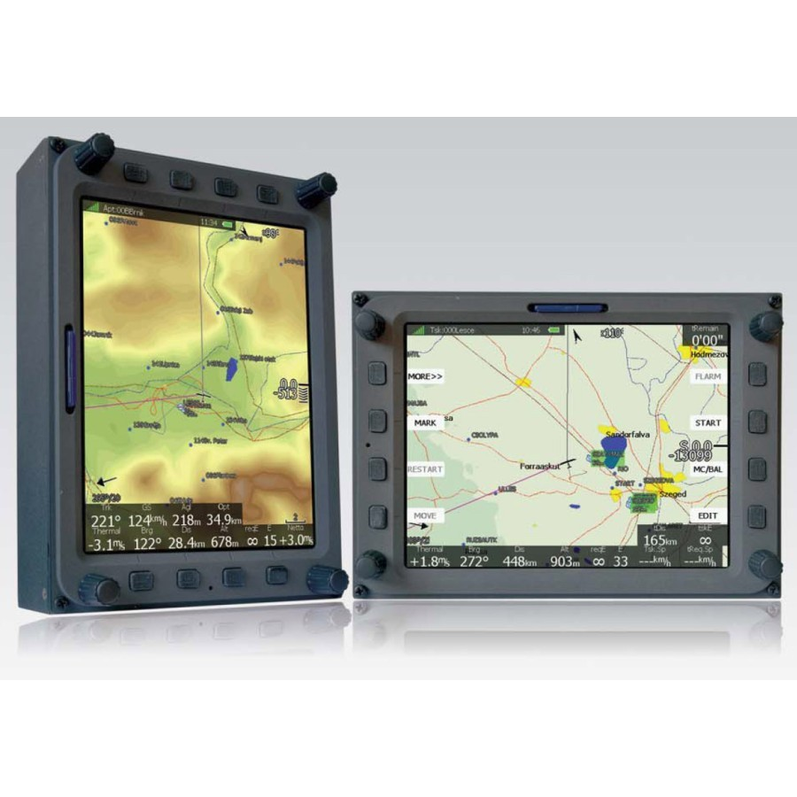
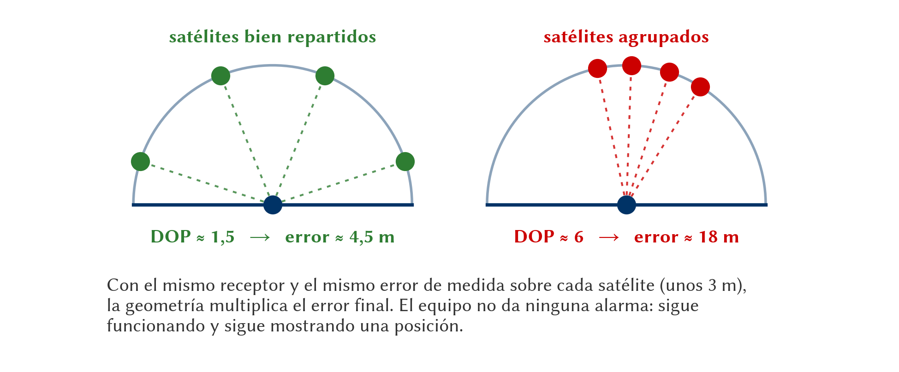

# Uso de GNSS

> El Sistema Global de Navegación por Satélite (GNSS) —que agrupa redes como el GPS estadounidense o el europeo Galileo— ha cambiado por completo el vuelo a vela. Nos da posición, altitud y velocidad suelo con una precisión que hace años parecía impensable. Aun así, en el hangar lo resumimos en una frase: el GPS es un criado excelente, pero un amo pésimo.
>
>
> En este capítulo aprenderás:
>
>
> * **Cómo funciona el GNSS**: por qué necesitas captar cuatro satélites para una posición en tres dimensiones.
> * **El datum WGS-84**: el "idioma" geográfico común entre el receptor y la carta de papel, y por qué su altitud no es la del altímetro.
> * **Los registradores IGC**: la prueba digital del vuelo para validar récords y medallas FAI.
> * **Las limitaciones y fuentes de error**: por qué el GPS es una ayuda y nunca un sustituto de la carta.

## ¿Cómo funciona el GNSS?

Para que tu dispositivo te dé una posición tridimensional (latitud, longitud y altitud), necesita "ver" al menos **4 satélites**. Con tres satélites sabría dónde estás sobre el mapa, pero no sabría a qué altura vuelas.

La mayoría de los receptores modernos combinan señales de varias constelaciones para mejorar la precisión:
* **GPS**: El sistema original norteamericano.
* **Galileo**: El sistema europeo, más reciente y con mayor precisión civil.
* **GLONASS**: El sistema ruso.

El principio es una medida de **distancias por tiempo de vuelo de la señal**. Cada satélite emite un mensaje diciendo quién es y en qué instante exacto lo manda; el receptor compara con su propio reloj y deduce la distancia. Con tres distancias tendría la posición, pero su reloj es barato y no está sincronizado con los relojes atómicos de los satélites: el cuarto satélite es el que resuelve esa incógnita de más. Por eso son cuatro y no tres.

### El datum WGS-84

Para que el GPS y la carta de papel se entiendan, deben usar el mismo "idioma" geográfico o **Datum**. El estándar mundial que usamos es el **WGS-84**. Asegúrate siempre de que tu dispositivo está configurado en este sistema; un datum incorrecto podría desplazar tu posición real varios cientos de metros respecto a lo que ves en pantalla.

### La altitud del GNSS no es la del altímetro

Ésta es la confusión que más cara sale. El GNSS da una altitud **geométrica**, medida sobre el elipsoide de referencia del WGS-84, que es un modelo matemático de la forma de la Tierra. El altímetro da una altitud **barométrica**, deducida de la presión y ajustada con el QNH del día. Son dos magnitudes distintas y no tienen por qué coincidir: la diferencia entre el elipsoide y el nivel medio del mar ronda los **50 metros** en la Península, y a eso se suma el error propio de la medida vertical del GNSS, que es aproximadamente **vez y media** el error horizontal.

::: {.callout-warning title="Seguridad"}
Los límites verticales del espacio aéreo, las altitudes de la carta y la AMA están definidos en **altitud barométrica**. Para decidir si estás por debajo del techo de una TMA se mira el **altímetro**, nunca la cifra del GNSS. Que las dos pantallas estén a un palmo la una de la otra no las hace comparables.
:::

::: {.mas-alla}
## Los registradores IGC (loggers)

[**↗ MÁS ALLÁ DEL EXAMEN.**]{.mas-alla-tag} Los registradores IGC y la validación de récords y medallas FAI no deberían ser materia de examen. Se incluyen como iniciación al vuelo deportivo de distancia; no los estudies con la prioridad del resto del temario.

En el mundo del planeador, el GNSS no solo sirve para navegar. Usamos dispositivos certificados llamados **registradores IGC** (**Loggers**) que graban cada segundo de nuestro vuelo.

Estos archivos digitales (.igc) son la prueba de que has pasado por los puntos de viraje de una tarea y sirven para validar récords y medallas de la FAI. Al aterrizar, puedes volcar el vuelo en programas de análisis para aprender de tus decisiones y ver exactamente dónde encontraste esa térmica tan buena.

Los equipos modernos integran el GNSS con un **mapa móvil** que muestra ruta, espacios aéreos y datos de planeo (@fig-09-cap06-gnss-cabina).

{#fig-09-cap06-gnss-cabina}
:::

## Limitaciones y conciencia situacional

El GPS puede fallar. Y fallará en el momento más inoportuno.

* **Fallo de energía**: La batería de tu PDA o tablet puede agotarse o el cable de carga puede soltarse con las turbulencias.
* **Pérdida de señal**: En valles profundos o debido a interferencias, puedes perder la cobertura de satélites temporalmente.
* **Base de datos desactualizada**: Si no actualizas los espacios aéreos de tu dispositivo, podrías entrar en una zona prohibida sin saberlo.

Además, la propia señal tiene fuentes de error que degradan la precisión aunque el equipo funcione: el **retardo ionosférico y troposférico** (la señal se frena al atravesar la atmósfera), el **multitrayecto** (rebotes de la señal en el terreno o en estructuras), las pequeñas **derivas de los relojes** y la **geometría de los satélites** (si están mal repartidos en el cielo, la **dilución de la precisión** o DOP empeora). En condiciones normales la precisión ronda unos pocos metros, más que suficiente para volar, pero conviene saber que no es infalible.

La DOP merece un párrafo propio porque es la única de esas fuentes que cambia de minuto a minuto y que el receptor te enseña. Es un **multiplicador**: el error final es el error de medida de cada satélite multiplicado por la DOP. Cuatro satélites muy separados por todo el cielo dan una DOP cercana a 1 y el error se queda como está; cuatro satélites agrupados en un mismo rincón —lo que pasa en un valle profundo o pegado a una ladera— pueden dar una DOP de 6 o más y multiplicar el error por seis sin que nada parezca ir mal en la pantalla (@fig-09-cap06-dilucion-precision).

{#fig-09-cap06-dilucion-precision width="100%"}

::: {.ejercicio}
**Ejercicio 6.1 — Cuánto vale la geometría.**

El error de medida de tu receptor sobre cada satélite es de unos **3 m**. (a) ¿Qué precisión de posición esperas con una DOP de **1,5**? (b) ¿Y volando por un valle encajonado, con una DOP de **6**? (c) ¿Qué error vertical aproximado tendrías en ese segundo caso?

**Solución.** (a) La DOP multiplica el error de medida:

$$
3 \times \text{1,5} = \mathbf{\text{4,5} \ m}
$$

(b) Con la misma medida y peor geometría:

$$
3 \times 6 = \mathbf{18 \ m}
$$

(c) El error vertical es del orden de vez y media el horizontal:

$$
18 \times \text{1,5} = \mathbf{27 \ m}
$$

Ni 4,5 ni 18 metros te van a perder en un vuelo VFR: para navegar, ambos valen. La lección no es la cifra, es que **el equipo puede estar funcionando perfectamente y darte una posición cuatro veces peor** sin decírtelo con ninguna alarma. Si el receptor muestra la DOP o el número de satélites, mírala cuando vueles pegado a una ladera.
:::

::: {.ejercicio}
**Ejercicio 6.2 — El viento, deducido de la pantalla.**

Vuelas con la brújula estabilizada en un **rumbo verdadero de 090º** y una **TAS de 100 km/h**. El GNSS indica una **trayectoria de 097º** y una **velocidad suelo de 85 km/h**. ¿De dónde sopla el viento y con qué intensidad, aproximadamente?

**Solución.** La trayectoria cae **7º a la derecha** del rumbo, así que el viento te desplaza hacia la derecha: **viene de la izquierda**. Con la fórmula de deriva del capítulo 4, despejando la componente cruzada:

$$
V_{cruzado} = \frac{DA \times TAS}{60} = \frac{7 \times 100}{60} \approx \text{11,7} \ \mathrm{km/h}
$$

La componente de frente es lo que te falta de velocidad suelo:

$$
V_{frente} = TAS \cdot \cos 7^\circ - GS \approx \text{99,3} - 85 \approx \text{14,3} \ \mathrm{km/h}
$$

Con las dos componentes, el viento completo sale por Pitágoras:

$$
V = \sqrt{\text{11,7}^2 + \text{14,3}^2} \approx 18 \ \mathrm{km/h}
$$

Y su dirección, respecto al morro: $\arctan(\text{11,7} / \text{14,3}) \approx 39^\circ$ hacia la izquierda de 090º, es decir, viento de unos **050º / 18 km/h**.

Esto es exactamente lo que hace el ordenador de a bordo cada vez que te muestra la flecha del viento, sólo que promediando muchas medidas. Saber hacerlo a mano sirve para dos cosas: entender de dónde sale ese dato, y poder estimarlo cuando lo único que tienes es un GPS de mano que da trayectoria y velocidad suelo.
:::

::: {.callout-note title="Airmanship"}
El GNSS no te exime de saber navegar visualmente: el vuelo VFR se apoya en referencias del terreno, con o sin pantalla. Y tenlo presente en el examen de pericia de la SPL: el examinador puede apagarte el dispositivo para comprobar que sabes volver al aeródromo con el mapa y la brújula.
:::

::: {.callout-tip title="Regla de oro"}
Lleva siempre una **fuente de respaldo** (backup). Si confías en una tablet, ten tu teléfono con una app de navegación cargada y, por supuesto, la carta de papel doblada y lista en el bolsillo lateral de la cabina.
:::

::: {.postit}
**Resumen del capítulo: uso del GNSS (GPS)**

* **Ayuda, no sustituto**: El GPS es una herramienta fabulosa para la conciencia situacional, pero nunca debe sustituir a la navegación visual y a la carta. Las baterías fallan, las señales se pierden y los dispositivos se cuelgan.
* **Fuentes de Error**: El GPS puede fallar por falta de satélites (necesitas 4 para posición 3D), interferencias o errores en la base de datos. Verifica siempre que el destino y las coordenadas son correctos.
* **La DOP multiplica**: el error final es el de medida por la dilución de la precisión. Con los satélites agrupados —valles, laderas— el error crece varias veces sin ninguna alarma.
* **Altitud GNSS ≠ altitud del altímetro**: la del GNSS es geométrica sobre el elipsoide; la del altímetro, barométrica. Los límites de espacio aéreo y la AMA se comprueban **con el altímetro**.
* **Backup**: Lleva siempre una carta de papel y una brújula. Si el GPS muere en medio de un vuelo de distancia, debes ser capaz de volver a casa "a la vieja usanza".
* **Configuración**: Asegúrate de que tu datum (usualmente WGS84) y las unidades (NM, kts, m) coinciden con tu planificación y con lo que esperas ver en los instrumentos.
:::
