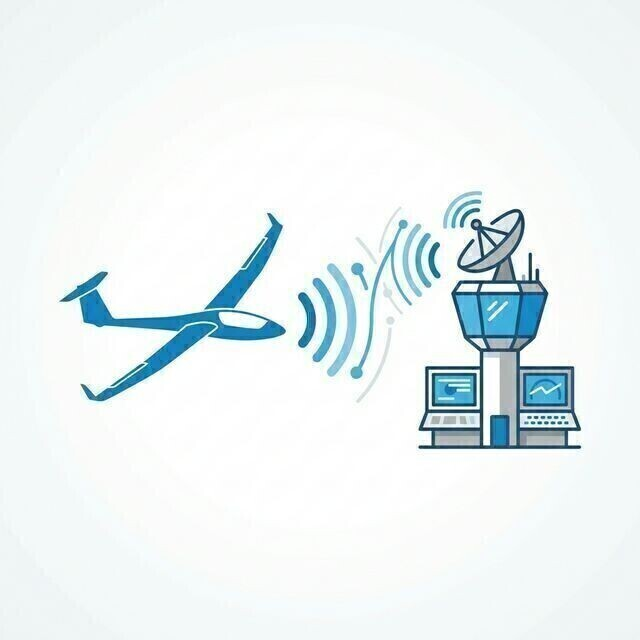

# Uso de ATS

> El vuelo a vela sabe a libertad, pero el cielo lo compartimos con mucho más tráfico. Los Servicios de Tránsito Aéreo (ATS) están ahí para que esa convivencia sea segura y ordenada.
>
>
> En este capítulo aprenderás:
>
>
> * **ATC frente a FIS**: quién da órdenes obligatorias y quién facilita información.
> * **El transpondedor**: los códigos squawk y cuándo es obligatorio llevarlo encendido.
> * **El plan de vuelo (FPL)**: cuándo es obligatorio, su ciclo de vida y por qué hay que cerrarlo al aterrizar.
> * **Los espacios aéreos especiales**: qué te exigen y qué servicios recibes en cada clase.

## ATC vs. FIS: ¿quién es quién?

Conviene tener clara la diferencia entre "el control" y "la información":

* **ATC (Control de Tráfico Aéreo)**: Su función es separar tráficos mediante instrucciones obligatorias. Interactuarás con ellos en aeródromos controlados y espacios aéreos de clase C y D (@fig-09-cap07-control-aereo).
* **FIS (Servicio de Información de Vuelo)**: No dan órdenes, sino información útil (meteorología, tráficos conocidos, estado de aeródromos). En España, gran parte de nuestros vuelos de distancia se realizan bajo la vigilancia de un centro FIS.

::: {.callout-note title="Airmanship"}
Llamar a los servicios FIS (como Madrid o Barcelona Información) es una excelente práctica. Además de darte tranquilidad, si tienes que realizar un aterrizaje en campo, ellos sabrán tu última posición conocida y podrán coordinar ayuda si fuera necesario.
:::

## El transpondedor: hazte visible

El transpondedor es el equipo que permite a los radares del ATC "verte" e identificar tu altitud.

* **Squawk 7000**: Es el código estándar para vuelos VFR en España.
* **7700**: Emergencia general.
* **7600**: Fallo de radio.
* **7500**: Interferencia ilícita (secuestro).

::: {.callout-warning title="Seguridad"}
Si tu transpondedor está instalado y operativo, la práctica correcta es **mantenerlo encendido y en modo "ALT"** (transmisión de altitud) para que el radar te vea. Su uso es **obligatorio en las zonas de uso de transpondedor (TMZ) y allí donde lo exijan la clase de espacio aéreo o el AIP-España (ENR 1.6)** —las clases A y C lo requieren, y la D generalmente; véase la tabla del **Libro 1 — Derecho Aéreo y Procedimientos de Control de Tránsito Aéreo (ATC)**, capítulo 7—, y muy recomendable en cualquier espacio con tráfico. Solo en planeadores con batería muy limitada cabe valorar apagarlo fuera de esos espacios, y siempre como decisión deliberada: **nunca en una TMZ, en espacio controlado ni en zonas de tráfico intenso**.
:::

## El plan de vuelo (FPL)

El Plan de Vuelo (FPL) es tu contrato de seguridad con el sistema. En él indicas quién eres, qué planeador vuelas, tu ruta y cuánta autonomía tienes.

::: {.callout-important title="Normativa"}
Según el reglamento **SERA** (SERA.4001 b)), es obligatorio presentar un FPL si vas a cruzar fronteras, si se te presta servicio de control de tránsito aéreo (clases B, C y D) o si despegas o aterrizas en un aeródromo controlado. Ojo con la clase E: es espacio controlado, pero al VFR no se le presta servicio de control, así que no necesita plan de vuelo, ni radio, ni autorización. Y lo más importante de todo: si presentaste plan, **DEBES notificar tu llegada** para cerrarlo. Si no lo haces, se activarán los servicios de búsqueda y rescate (SAR) innecesariamente.
:::

El plan no es un papel que se entrega y se olvida. Tiene un ciclo de vida con cuatro mensajes asociados que comunicas a la misma dependencia donde lo presentaste: **DEP** (salida), **DLA** (demora), **CHG** (cambio) y **CNL** (cancelación). Y, según el AIP (ENR 1.10), un FPL VFR debe presentarse con cierta antelación a la EOBT (hora estimada fuera de calzos): típicamente al menos **60 minutos antes** si solicitas servicio de control, o antes de la salida si solo pides información de vuelo y alerta.

{#fig-09-cap07-control-aereo}

## Operando en espacios especiales

No todas las zonas del cielo son iguales:

* **Clase G (Espacio fuera de control)**: Puedes volar libremente bajo reglas VFR sin radio obligatoria (aunque muy recomendada). Recibes servicio de información de vuelo (FIS).
* **Clase E**: Controlado, pero el VFR **no** necesita autorización ni radio obligatoria; recibes información de tráfico en la medida de lo posible.
* **Clases C y D (Espacio Controlado)**: **OBLIGATORIO** contacto radio y autorización previa del ATC para entrar. En clase C, además, el control separa tu VFR del tráfico IFR; en clase D nadie te separa: solo recibes información de tráfico, y ver y evitar sigue siendo cosa tuya.
* **Zonas Prohibidas/Restringidas (P/R)**: Evítalas a menos que tengas una autorización específica. Un "salto" de un segundo en una zona Prohibida puede acarrear sanciones graves.

::: {.callout-important title="Normativa"}
Resumen de servicios al VFR según **SERA.8001**: en **C y D** hay autorización ATC y radio obligatoria; en **E** ni autorización ni radio (solo información de tráfico si la hay); en **F y G** solo servicio de información de vuelo. Saber qué te van a dar —y qué te van a exigir— en cada clase es parte de la planificación.
:::

::: {.postit}
**Resumen del capítulo: uso de los ATS**

* **Dependencias**: El ATC (Control) gestiona aeródromos y espacios controlados. El FIS (Información) te ayuda en ruta con meteo y tráfico. Mantén contacto con FIS cuando sea posible; es una capa extra de seguridad.
* **Transpondedor**: Es tu visibilidad para el radar. En VFR pon 7000. Si tienes una emergencia: 7700. Si pierdes la radio: 7600. Si está operativo, llévalo encendido y en ALT (obligatorio en TMZ y donde lo exija la clase de espacio aéreo — AIP ENR 1.6); vigila el consumo de batería.
* **Plan de Vuelo**: Fundamental para que te busquen si no llegas. Se activa al despegar y **ES OBLIGATORIO notificar tu llegada** a la dependencia ATS del aeródromo de destino tan pronto como sea posible (SERA).
* **Espacios Aéreos**: Conoce dónde estás. En Clase C o D necesitas autorización radio. En Clase G eres libre, pero el FIS sigue estando ahí para ayudarte.
:::
