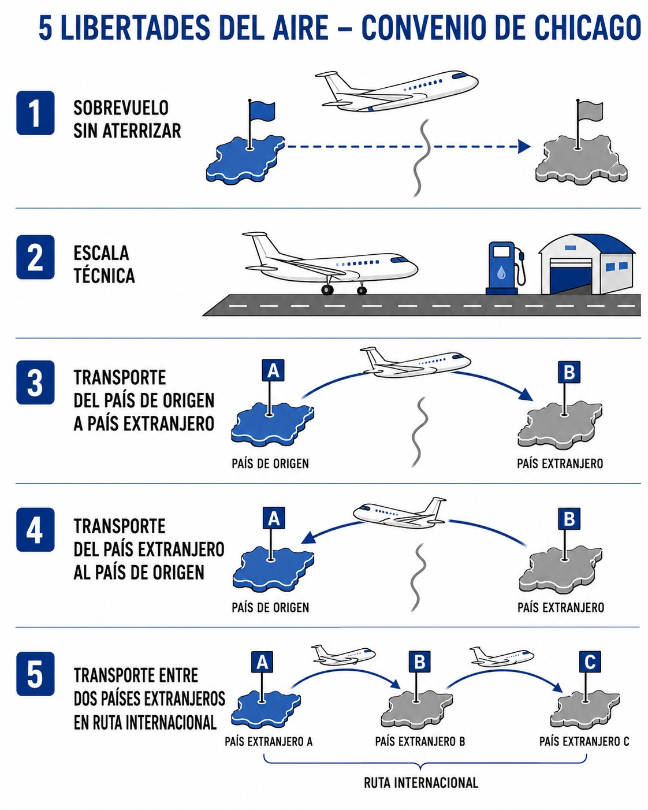
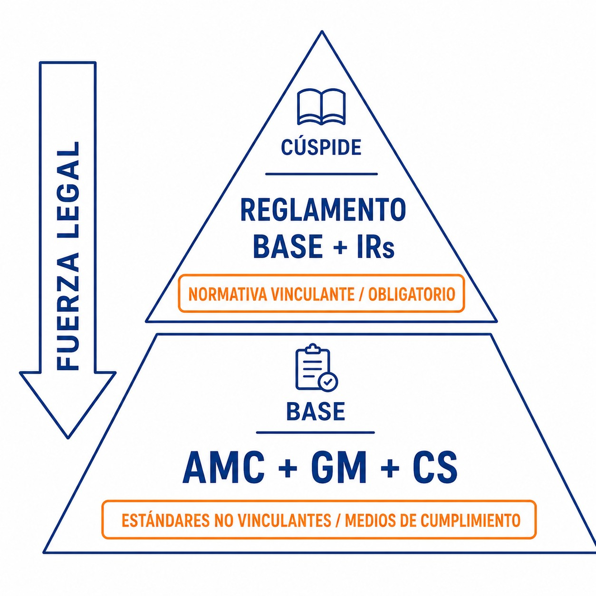

# International law: conventions, agreements and organisations

> Understanding the legal framework is not bureaucracy: it is the foundation of your safety and of your freedom to fly beyond our borders.
>
>
> In this chapter you will learn:
>
>
> * Where the rules come from: the Chicago Convention and ICAO.
> * What role EASA plays and how common European law affects us.
> * What is mandatory (binding rules) and what is recommended (non-binding standards).
> * The three regulations that will stay with you throughout your flying life: Part-SFCL, Part-SAO and SERA.

## Where the rules come from: the Chicago Convention and ICAO

The birth certificate of modern air law is the **1944 Chicago Convention**. There, nations agreed to unify aviation rules worldwide, and that agreement is the source of the principles that let us fly safely and in good order from one country to another today.

The convention created **ICAO** (International Civil Aviation Organization), a specialised agency of the United Nations. Its job is to develop the principles and techniques of international air navigation, to foster air transport between countries and to promote **safety** around the world.

ICAO sets the minimum standards that its 193 member States must meet. It is not, however, a “world police”: each country is sovereign to adopt these standards into its own legislation, although the Convention obliges it to notify the differences when it does not comply with a standard.

To make international air transport possible, the Chicago Convention laid the foundations of the **freedoms of the air** (see @fig-01-cap01-chicago-freedoms): agreements that give the aircraft of one State permission to enter or overfly the airspace of another. The Chicago conference defined the first five in agreements annexed to the Convention (overflight, technical stops and the basic commercial rights), but air law has kept evolving and nine are recognised today.

{#fig-01-cap01-chicago-freedoms}

## The authority in Europe: EASA and the common system

In Europe we have gone a step beyond simple cooperation. The member States of the European Union have transferred powers to a common authority: **EASA** (European Union Aviation Safety Agency).

In practice, this means that almost everything that affects you as a pilot (licences, operations, airworthiness) is decided at European level and is **directly applicable** in Spain, without the Spanish government having to transpose it into national law.

So what role does AESA play? **AESA** (Agencia Estatal de Seguridad Aérea, the Spanish Aviation Safety Agency) is the Spanish public body, attached to the Ministry of Transport and Sustainable Mobility, that acts as your direct competent authority: it issues your licence, inspects your club and oversees compliance on Spanish territory. But it does so by applying and interpreting the common European rules.

## Regulatory structure: binding rules and non-binding standards

EASA regulations are organised in layers with different legal force (@fig-01-cap01-hard-soft-law). It pays to be clear from the start about what is mandatory by law and what is a standard recommendation.

### Binding rules (hard law): what is law

These are the mandatory rules. No one is exempt from them unless the authority grants an exemption in writing. They have two levels:

* **Basic Regulation**: the “constitution” of aviation safety in Europe, currently Regulation (EU) 2018/1139. It sets out the essential principles and the high-level objectives.
* **Implementing Rules** (IRs): the detailed laws that develop the basic regulation. For example, Regulation (EU) 2018/1976 (amended by 2020/358) specifically governs sailplane licences.

::: {.callout-important title="Regulation"}
Regulation (EU) 2018/1139 (the Basic Regulation) lays down common rules in the field of civil aviation and establishes the European Union Aviation Safety Agency (EASA). It is the highest-ranking rule in the European system.
:::

### Non-binding standards (soft law): how to comply with the law

These are documents that help you comply with the law without being law themselves. Do not be fooled by the “non-binding” label: in aviation they are followed almost to the letter.

* **AMC** (**Acceptable Means of Compliance**): methods and procedures that EASA publishes as a safe way of complying with the binding rules. If you follow the AMC, you automatically comply with the rule. If you prefer to do it another way, you will have to show, with a fair amount of paperwork, that your method is just as safe.
* **GM** (**Guidance Material**): explanations, interpretations and examples to help you understand the requirements. It does not oblige; it helps.
* **CS** (**Certification Specifications**): technical standards for certifying aircraft and products. The one that concerns us is CS-22, the one for sailplanes.

{#fig-01-cap01-hard-soft-law}

::: {.callout-tip title="Golden rule"}
* **Binding rules (Regulations)** = **WHAT** you must comply with (mandatory).
* **Non-binding standards (AMC/GM)** = **HOW** to comply in the standard way (recommended).
:::

## The 3 reference rules for the glider pilot

Out of the whole regulatory alphabet soup, you will end up knowing three regulations by heart. They are your everyday frame of reference.

### 1. Part-SFCL (licensing)

**Sailplane Flight Crew Licensing** governs everything to do with your licence: the requirements for obtaining the SPL (**Sailplane Pilot Licence**), the recent experience you need to keep it, the ratings and privileges (TMG, aerobatics, towing…) and the privileges of instructors and examiners. It comes from Implementing Regulation (EU) 2018/1976 and its amendments, such as 2020/358.

### 2. Part-SAO (operations)

**Sailplane Air Operations** governs how the glider is operated safely: the responsibilities of the pilot-in-command, the documents you must carry on board, emergency procedures, the carriage of passengers and the use of aerodromes. It comes from the same regulation as Part-SFCL.

::: {.callout-note title="Airmanship"}
Under SAO.GEN.130 (Part-SAO), the pilot-in-command is responsible for the safety of the aircraft and of all persons on board during operations. This responsibility cannot be delegated: you are the final authority in your cockpit.
:::

### 3. SERA (Rules of the Air)

**Standardised European Rules of the Air** is the highway code of the sky: right of way, cruising levels, visibility and distance-from-cloud minima (VMC), signals and lights. As an EU implementing regulation, it applies **directly** in Spain, with no need for a national rule to transpose it; Real Decreto 552/2014 (Royal Decree 552/2014) **supplements and develops** it in the aspects SERA leaves to each State.

::: {.callout-warning title="Safety"}
SERA.3210 sets out the right-of-way rules to avoid collisions. A glider always has priority over powered aircraft (aeroplanes, helicopters), but must give way to balloons. Know these rules by heart.
:::

::: {.postit}
**Chapter summary: regulatory framework**

The “law of the air” that lets you fly is organised like this:

* **ICAO and the Chicago Convention (1944)**: the founding treaty. It sets the minimum worldwide standards.
* **EASA**: our common European authority. It drafts rules that every EU country applies equally; AESA applies them in Spain.
* **Binding rules** (Regulations): law, 100 % mandatory. This is where Part-SFCL, Part-SAO and SERA sit.
* **Non-binding standards** (AMC/GM): not strictly law, but the standard, safe way of doing things. Follow them and you will have no problems.
* Your core rules: **Part-SFCL** (your licence), **SERA** (how to fly) and **Part-SAO** (how to operate your glider).
:::
