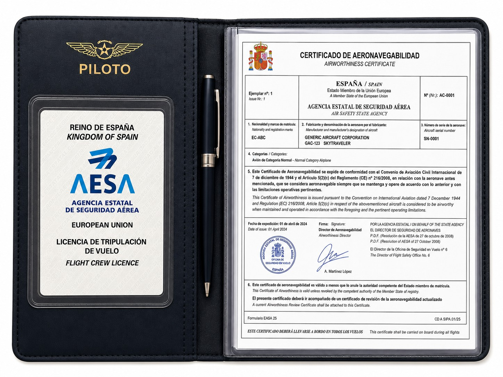
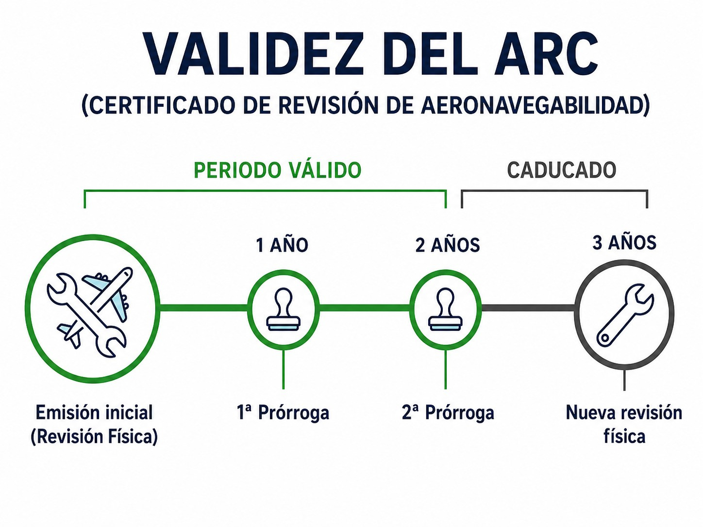

# Airworthiness of aircraft

> A healthy glider is a safe glider. Learn to check your aircraft's “technical health” before every flight.
>
>
> In this chapter you will learn:
>
>
> * The difference between the **Certificate of Airworthiness** (CofA) and the **Airworthiness Review Certificate** (ARC), and what the law requires before you can fly.
> * The legal side of the light aviation maintenance framework (Part-ML). The technical detail is in Book 8 — Aircraft General Knowledge, Airframe and Systems and Emergency Equipment.
> * What falls to you: the pre-flight inspection, checking the documents and reporting defects.

## The concept of airworthiness

Put simply, airworthiness is your aircraft's technical health. A glider is airworthy when it conforms to the design approved by the authority (its papers are in order) and is in a condition for safe operation, with no dangerous defects.

As the pilot, you are the last link in the safety chain. A well-designed aircraft that is badly maintained is no longer safe.

## Certificate of Airworthiness (CofA)

The **Certificate of Airworthiness** (CofA) is issued by the authority of the State of registry (AESA in Spain). It certifies that the aircraft conforms to the approved design and is in a condition for safe operation.

The CofA of EASA aircraft is valid **indefinitely**: it does not expire, provided the aircraft is kept airworthy in accordance with its maintenance programme and nobody revokes it (@fig-01-cap02-cofa-example). But it is only valid together with a valid ARC. Without an ARC, the CofA is worthless.

{#fig-01-cap02-cofa-example}

## The annual “MOT”: the Airworthiness Review Certificate (ARC)

The **ARC** (**Airworthiness Review Certificate**) confirms that someone reviewed the aircraft's documentation and physical condition at a given date and found everything in order.

It is valid for **one year**, so it has to be renewed or extended every year. In a controlled environment (managed by a CAMO or, in light aviation, by a CAO), the ARC can be extended twice in a row without a full physical review: 1 year + 1 year + 1 year. In the third year comes a thorough review, with no excuses (@fig-01-cap02-arc-process). The technical regime behind the ARC (the maintenance programme, the minimum inspection programme and airworthiness directives) is in **Book 8 — Aircraft General Knowledge, Airframe and Systems and Emergency Equipment**, chapter 9. Here we only need its legal consequence: without a valid ARC you cannot fly.

::: {.callout-warning title="Safety"}
Never fly with an expired ARC. It is illegal and, more importantly, it means nobody has officially certified in the last year that the aircraft is safe to fly. Your insurer will also very probably refuse cover if anything happens, because most policies make it conditional on the aircraft being airworthy.
:::

{#fig-01-cap02-arc-process}

## Glider maintenance: Part-ML

On the legal side, you only need to remember the framework. Gliders are maintained under **Part-ML** (Annex Vb to Regulation (EU) No 1321/2014), a simplified set of rules for light aviation. It rests on an **Aircraft Maintenance Programme (AMP)** and, for certain simple tasks, lets the **pilot-owner** sign off the maintenance personally. The detail (how the AMP works, the minimum inspection programme, which tasks the pilot-owner may sign off and under what conditions, airworthiness directives (AD) and service bulletins (SB)) belongs to its own subject and is covered in **Book 8 — Aircraft General Knowledge, Airframe and Systems and Emergency Equipment**, chapter 9.

## Pilot responsibilities

You are not a mechanic, but the final decision to accept the aircraft for the flight is yours. So are these three tasks.

### 1. Pre-flight inspection

Before every flight you must carry out an external and internal inspection, following the checklist in the **Aircraft Flight Manual (AFM)**. The law requires it, but above all it is common sense.

### 2. Checking the documentation

Before take-off, check that the mandatory documents are on board and valid.
Under the sailplane operations rules (Part-SAO), they include:

* **Aircraft documents**: CofA, ARC, Certificate of Registration, insurance, radio station licence.
* **Operational documents**: flight manual (AFM), checklists.
* **Pilot documents**: your licence (SPL) and your medical certificate.

### 3. Reporting defects

If you find anything wrong during the pre-flight check or in flight, write it in the **technical log**. The next pilot will thank you for it.

::: {.callout-note title="Airmanship"}
A chip in the gelcoat? It may not be just cosmetic: if it changes the profile, it changes how the glider flies. When in doubt, ask. Better a curious pilot than a pilot in trouble.
:::

::: {.postit}
**Chapter summary: airworthiness**

Airworthiness is your aircraft's health. To fly legally and safely:

* **CofA**: certifies that the aircraft conforms to the approved design and is in a condition for safe operation. It is issued by the State of registry (AESA in Spain) and does not expire if the aircraft is properly maintained.
* **ARC**: the annual “MOT”. It confirms that the aircraft has been reviewed and is fit to fly. Check its expiry date before you fly.
* **Part-ML**: the maintenance framework for gliders. It lets the pilot-owner certify simple tasks. Its technical side (AMP, minimum inspection programme, AD/SB) is in **Book 8 — Aircraft General Knowledge, Airframe and Systems and Emergency Equipment**, chapter 9.
* **Your part**: carry out the pre-flight inspection, check that the documentation (CofA, ARC, insurance…) is on board and valid, and record any defect in the technical log.
:::
