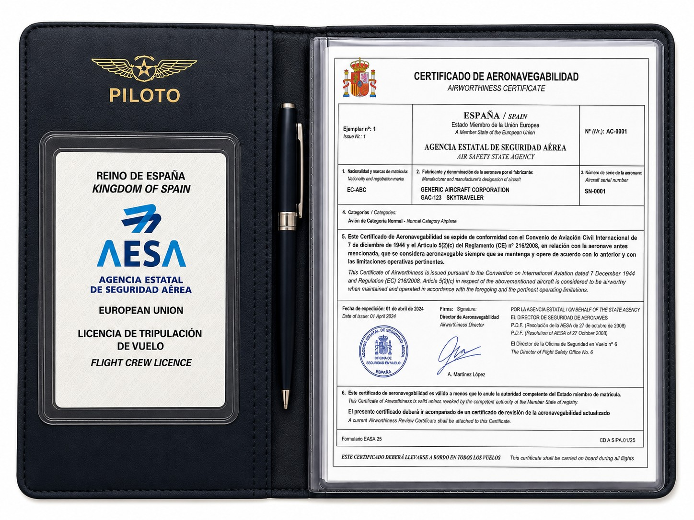
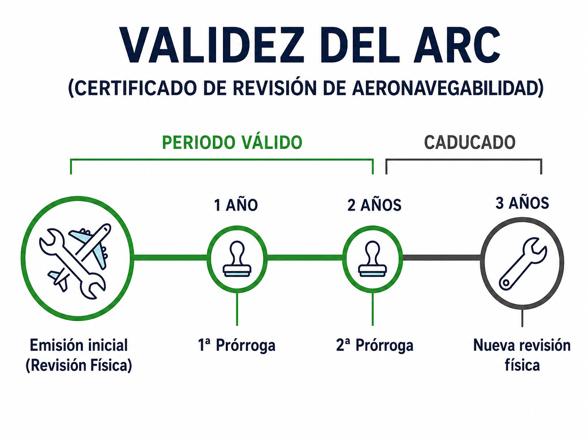

# Airworthiness of aircraft

> A healthy glider is a safe glider. Learn to check your aircraft's “technical health” before every flight.
>
>
> In this chapter you will learn:
>
>
> * The difference between the **Certificate of Airworthiness** (CofA) and the **Airworthiness Review Certificate** (ARC), and what the law requires before you can fly.
> * The legal side of the light aviation maintenance framework (Part-ML). The technical detail is in Book 8 — Aircraft General Knowledge, Airframe, Systems and Emergency Equipment.
> * What falls to you: the pre-flight inspection, checking the documents and reporting defects.

## The concept of airworthiness

Put simply, airworthiness is your aircraft's technical health. A glider is airworthy when it conforms to the design approved by the authority (its papers are in order) and is in a condition for safe operation, with no dangerous defects.

As the pilot, you are the last link in the safety chain. A well-designed aircraft that is badly maintained is no longer safe.

## Certificate of Airworthiness (CofA)

The **Certificate of Airworthiness** (CofA) is issued by the authority of the State of registry (AESA in Spain). It certifies that the aircraft conforms to the approved design and is in a condition for safe operation.

The CofA of EASA aircraft is valid **indefinitely**: it does not expire, provided the aircraft continues to comply with its type design and continuing airworthiness requirements, remains on the same register, its type certificate has not been invalidated and nobody has revoked or surrendered the CofA (21.A.181, @fig-01-cap02-cofa-example). But it is only valid together with a valid ARC. Without an ARC, the CofA is worthless.

{#fig-01-cap02-cofa-example .corregir}

## The annual “MOT”: the Airworthiness Review Certificate (ARC)

The **ARC** (**Airworthiness Review Certificate**) confirms that someone reviewed the aircraft's documentation and physical condition at a given date and found everything in order.

It is valid for **one year**, so it has to be renewed or extended every year. It can be extended twice in a row without a new full review (1 year + 1 year + 1 year), but only if the same organisation (a CAMO or, in light aviation, a CAO) has managed the sailplane's continuing airworthiness without interruption since the ARC was issued (ML.A.902). When the third year is up comes a thorough review, with no excuses (@fig-01-cap02-arc-process). The technical regime behind the ARC (the maintenance programme, the minimum inspection programme and airworthiness directives) is in **Book 8 — Aircraft General Knowledge, Airframe, Systems and Emergency Equipment**, chapter 9. Here we only need its legal consequence: without a valid ARC you cannot fly.

::: {.callout-warning title="Safety"}
Never fly with an expired ARC. It is illegal and, more importantly, it means nobody has officially certified in the last year that the aircraft is safe to fly. Your insurer may also refuse to cover you, or seek to recover from you what it has paid out, if anything happens: many policies make cover conditional on the aircraft being airworthy. Read yours.
:::

{#fig-01-cap02-arc-process .corregir}

## Glider maintenance: Part-ML

On the legal side, you only need to remember the framework. Gliders are maintained under **Part-ML** (Annex Vb to Regulation (EU) No 1321/2014), a simplified set of rules for light aviation. It rests on an **Aircraft Maintenance Programme (AMP)** and, for certain simple tasks, lets the **pilot-owner** sign off the maintenance personally. The detail (how the AMP works, the minimum inspection programme, which tasks the pilot-owner may sign off and under what conditions, airworthiness directives (AD) and service bulletins (SB)) belongs to its own subject and is covered in **Book 8 — Aircraft General Knowledge, Airframe, Systems and Emergency Equipment**, chapter 9.

## Pilot responsibilities

You are not a mechanic, but the final decision to accept the aircraft for the flight is yours. So are these three tasks.

### 1. Pre-flight inspection

Before every flight you must carry out an external and internal inspection, following the checklist in the **Aircraft Flight Manual (AFM)**. The law requires it, but above all it is common sense.

### 2. Checking the documentation

Before take-off, check that the mandatory documents are valid. Not all of them have to be on board:

* **On board** (Part-SAO, SAO.GEN.155(a)): the flight manual (AFM) or equivalent document, aeronautical charts for the area, details of the flight plan if you have filed one, and the interception information.
* **On board or available at the aerodrome** (SAO.GEN.155(c)): Certificate of Registration, CofA, ARC, aircraft radio licence if you carry radio equipment, insurance certificate and journey log.
* **Pilot documents** (Part-SFCL, SFCL.045): your licence (SPL), your medical certificate, a personal identification document with your photo and sufficient logbook data. On flights that stay within sight of the aerodrome they may be left there.

### 3. Reporting defects

If you find anything wrong during the pre-flight check or in flight, write it in the **journey log** or in the aircraft's technical records. The next pilot will thank you for it. And if the defect could seriously hazard flight safety, the sailplane does not fly until it has been rectified (ML.A.403): it is not a decision you can put off on your own.

::: {.callout-note title="Airmanship"}
A chip in the gelcoat? It may not be just cosmetic: if it changes the profile, it changes how the glider flies. When in doubt, ask. Better a curious pilot than a pilot in trouble.
:::

::: {.postit}
**Chapter summary: airworthiness**

Airworthiness is your aircraft's health. To fly legally and safely:

* **CofA**: certifies that the aircraft conforms to the approved design and is in a condition for safe operation. It is issued by the State of registry (AESA in Spain) and does not expire if the aircraft is properly maintained.
* **ARC**: the annual “MOT”. It confirms that the aircraft has been reviewed and is fit to fly. Check its expiry date before you fly.
* **Part-ML**: the maintenance framework for gliders. It lets the pilot-owner certify simple tasks. Its technical side (AMP, minimum inspection programme, AD/SB) is in **Book 8 — Aircraft General Knowledge, Airframe, Systems and Emergency Equipment**, chapter 9.
* **Your part**: carry out the pre-flight inspection, check that the documentation (CofA, ARC, insurance…) is valid and available, on board or at the aerodrome, and record any defect in the journey log.
:::
