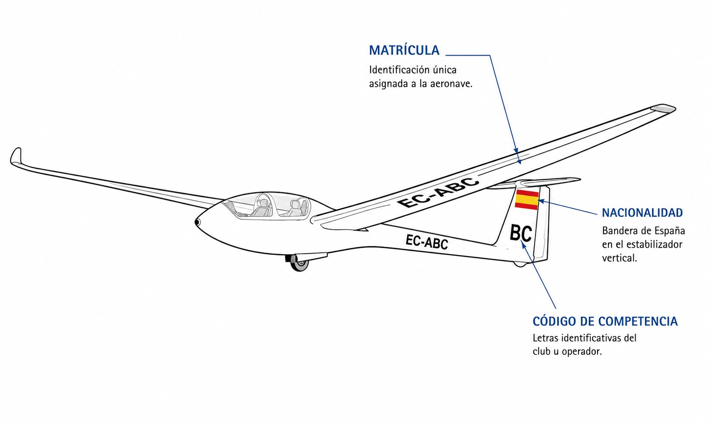
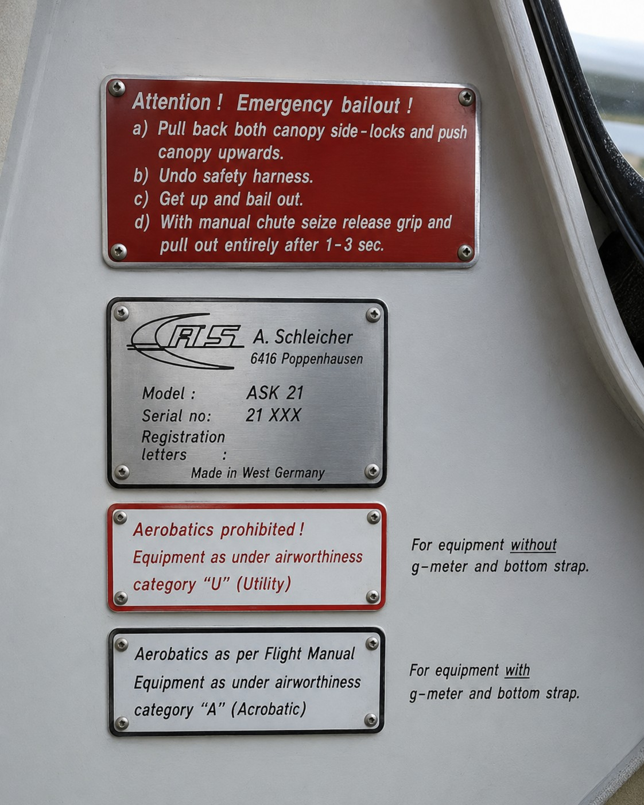

# Aircraft nationality and registration marks

> Your glider has a unique legal identity; identifying it correctly is the first step in any operation.
>
>
> In this chapter you will learn:
>
>
> * How to read and interpret registration marks (EC-ABC).
> * What the fireproof identification plate is for and where to find it.
> * Why your glider carries the Spanish flag.

## Your glider's identity card: nationality and registration

Every civil aircraft must be registered in a country and carry its identity marks clearly visible. It is like a car's number plate, but with international standing.

In Spain, the nationality mark is `EC`, followed by a hyphen and three letters: for example, `EC-ABC`. These marks are assigned by the State (AESA) and are unique to each aircraft.

::: {.callout-important title="Regulation"}
Article 20 of the Chicago Convention lays down that every aircraft engaged in international air navigation must bear its appropriate nationality and registration marks. In Spain, registrations begin with **EC-**.
:::

## Location and size of the marks

It is not enough to paint the letters wherever they fit: their position and size are regulated so that they can be read from the ground or from other aircraft.

Under Spanish rules (and ICAO Annex 7), on heavier-than-air aircraft (aeroplanes and gliders):

1. **On the wings**: on the lower surface of the left wing, or across both wings, at least **50 centimetres** high.
2. **On the tail or fuselage**: on both sides of the fuselage (between the wings and the tail) or on the vertical tail surfaces, at least **30 centimetres** high.

If the glider is very slender and marks of this size do not fit, the authority may accept smaller dimensions, as long as they remain legible (@fig-01-cap03-matricula-ubicacion).

{#fig-01-cap03-matricula-ubicacion}

## The identification plate (fireproof plate)

As well as the paint, your glider needs an “indestructible” identity: an **identification plate** made of **fireproof material** (stainless steel, titanium…) fixed to the structure, usually near the cockpit entrance, where it can be read.

It is engraved with the nationality and registration marks and with the manufacturer, model and serial number (@fig-01-cap03-placa-ignifuga). Its purpose is grim but important: if there is an accident with fire, the plate must survive so that the aircraft can be identified.

::: {.callout-warning title="Safety"}
Never paint over the identification plate or cover it. Its role is vital in an accident investigation. If you restore the glider, make sure the plate is still there and legible.
:::

{#fig-01-cap03-placa-ignifuga}

## The Spanish flag

Alongside the letters, the **Spanish flag** is mandatory, usually on the fin or the fuselage, above the registration and parallel to the line of flight. It is the symbol of the aircraft's nationality and of the sovereignty of the State that registers it.

::: {.callout-tip title="Golden rule"}
**EC** = mnemonic ***E**spaña **C**ivil* (Spanish for “civil Spain”). The official ICAO mark for Spain is “EC”.
:::

::: {.postit}
**Chapter summary: marks and registration**

Your glider has a unique legal identity that must be visible and durable:

* **Nationality and registration**: in Spain, **EC-** followed by three letters (e.g. EC-ABC).
* **Painted marks**: on the fuselage or tail (and under the wings in some cases), plus the Spanish flag.
* **Identification plate**: made of fireproof material, engraved with the registration, fixed to the structure near the entrance.
:::
