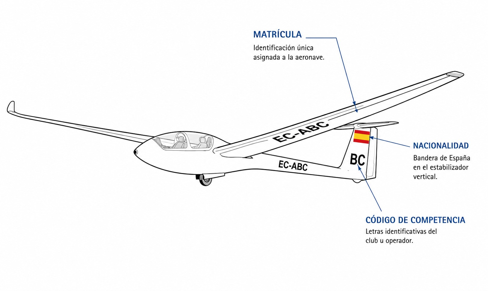
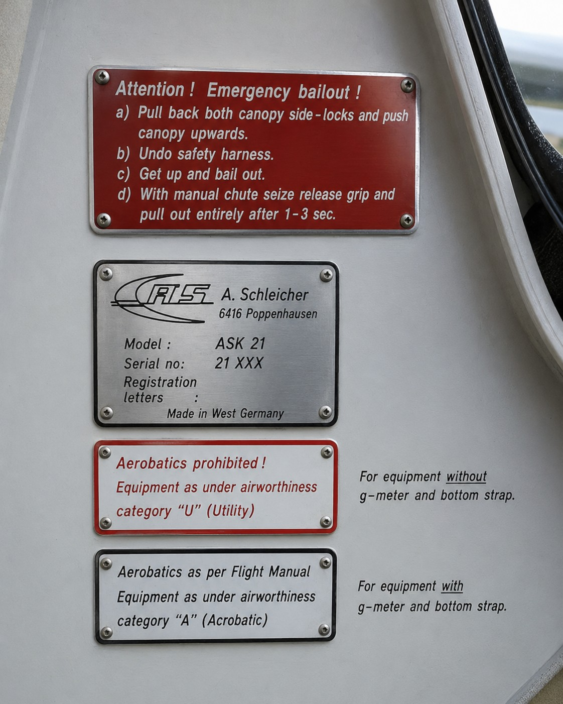

# Aircraft nationality and registration marks

> Your glider has a unique legal identity. Identifying it correctly comes first in any operation.
>
>
> In this chapter you will learn:
>
>
> * How to read and interpret registration marks (EC-ABC).
> * What the fireproof identification plate is for and where to find it.
> * Why your glider carries the Spanish flag.

## Your glider's identity card: nationality and registration

Every civil aircraft must be registered in a country and display its identity marks clearly. Think of a car's number plate, but valid worldwide.

In Spain, the nationality mark is `EC`, followed by a hyphen and the registration mark: for now three letters, for example `EC-ABC`. Real Decreto 1029/2025 (Royal Decree 1029/2025) already provides for four letters, which will be assigned once the three-letter series run out. The marks are assigned by the Registro de Matrícula de Aeronaves Civiles (Spanish Civil Aircraft Register), which AESA runs, and no two aircraft share them.

::: {.callout-important title="Regulation"}
Article 20 of the Chicago Convention lays down that every aircraft engaged in international air navigation must bear its appropriate nationality and registration marks. In Spain, registrations begin with **EC-**.
:::

## Location and size of the marks

You cannot paint the letters wherever they happen to fit. Their position and size are regulated so that they can be read from the ground or from other aircraft.

Under Spanish rules (Orden FOM/1687/2015, a ministerial order that follows ICAO Annex 7), heavier-than-air aircraft (aeroplanes and gliders) carry them:

1. **On the wings**: on the lower surface of the left wing, or across both wings, at least **50 centimetres** high.
2. **On the tail or fuselage**: on both sides of the fuselage (between the wings and the tail) or on the vertical tail surfaces, at least **30 centimetres** high.

If the glider is too slender for marks of this size, the authority may accept smaller ones, as long as they remain legible (@fig-01-cap03-matricula-ubicacion).

{#fig-01-cap03-matricula-ubicacion}

## The identification plate (fireproof plate)

Paint is not enough. Your glider also needs an “indestructible” identity. There are actually two plates, which are sometimes combined into one:

* The **registration identification plate**, made of metal or another **non-combustible** material, bearing at least the nationality and registration marks, fixed in a visible place near the main entrance (Orden FOM/1687/2015, art. 5).
* The **manufacturer's plate**, which is **fireproof** and bears the manufacturer's name, the model designation and the serial number (Regulation (EU) No 748/2012, 21.A.801).

The one in the figure is a manufacturer's plate with a space for the registration (@fig-01-cap03-placa-ignifuga). Its purpose is grim but important: after an accident with fire, the plate must survive so that the aircraft can be identified.

::: {.callout-warning title="Safety"}
Never paint over the identification plate or cover it up. Accident investigators depend on it. If you restore the glider, make sure the plate is still there and legible.
:::

{#fig-01-cap03-placa-ignifuga}

## The Spanish flag

Alongside the letters, you must display the colours of **Spain**, in one of two ways: a **stripe** in the colours of the flag, on the fuselage or across the fin, above the marks and parallel to them and to the line of flight; or the **flag itself**, which may go on any external surface, on both sides. Either way, it must be at least as high as the registration marks (Orden FOM/1687/2015, Annex II D). It stands for the aircraft's nationality and for the sovereignty of the State that registers it.

::: {.callout-tip title="Golden rule"}
**EC** = mnemonic ***E**spaña **C**ivil* (Spanish for “civil Spain”). The official ICAO mark for Spain is “EC”.
:::

::: {.postit}
**Chapter summary: marks and registration**

Your glider has a unique legal identity that must be visible and durable:

* **Nationality and registration**: in Spain, **EC-** followed by three letters (e.g. EC-ABC); four once the three-letter series run out (RD 1029/2025).
* **Painted marks**: once on the lower surface of the wing and, in addition, on both sides of the fuselage or on the tail; plus the Spanish stripe or flag.
* **Identification plate**: made of fireproof material, engraved with the registration, fixed to the structure near the entrance.
:::
